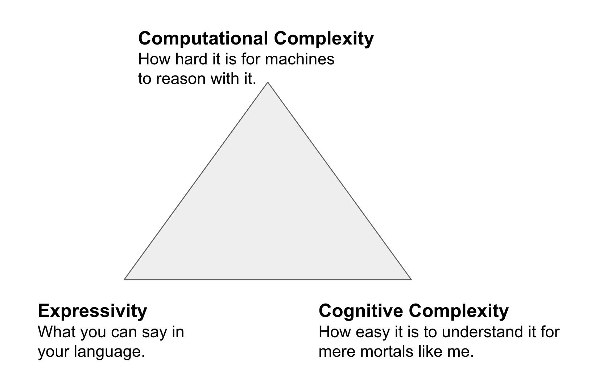

# Why do we need reasoning?

A quick personal perspective up-front. When I was finishing my undergrad, I barely had heard the term Semantic Web. What I had heard vaguely intrigued me, so I decided that for my final project, I would try to combine something Semantic Web related with my other major, Law and build a tool that could automatically infer the applicability of a law (written in OWL) given a legal case. Super naively, I just went went ahead, read a few papers about legal ontologies, build a simple one, loaded it into my application and somehow got it to work, with reasoning and all, without even having heard of Description Logic.

In my PhD, I worked on actual reasoning algorithms, which meant, no more avoiding logic. But - I did not get it. Up until this point in my life, I could just study harder and harder, and in the end I was confident with what I learned, but First Order Logic, in particular model theory and proofs, caused me anxiety until the date of my viva. In the end, a very basic understanding of model theory and Tableau did help me with charactering the algorithms I was working with (I was studying the effect of modularity, cutting out logically connected subsets of an ontology, on reasoning performance) but I can confidently say today: I never really, like deeply, understood logical proofs. I still cant read them - and I have a PhD in Reasoning (albeit from an empirical angle).

If you followed the Open HPI courses on logic, and you are anything like me, your head will hurt and you will want to hide under your blankets. Most students feel like that. For a complete education in Semantic Web technologies, going through this part once is essential: it tells you something about how difficult some stuff is under the hood, and how much work has been done to make something like OWL work for knowledge representation. You should have gained some appreciation of the domain, which is no less complex than Machine Learning or Stochastic Processes. But, in my experience, some of the most effective ontology engineers barely understand reasoning - definitely have no idea how it works - and still do amazing work. In that spirit, I would like to invite you at this stage to put logic and reasoning behind you (unless it made you curious of course) - you won't need to know much of that for being an effective Semantic Engineer. In the following, I will summarise some of the key take-aways that I find useful to keep in mind.

- _Semantics define how to interpret an ontology_. For example, in OWL, the statement `Human SubClassOf: Mammal` means that all instances of the `Human` class, like me, are also instances of the `Mammal` class. Or, in other words, from the statements:

```
Human SubClassOf: Mammal
Nico type: Human
```

Semantics allow as to deduce that `Nico:Mammal`. What are semantics _practically_? Show me your semantics? Look at something like the [OWL semantics](https://www.w3.org/TR/owl2-direct-semantics/). In there, you will find language statements (syntax) like `X SubClassOf: Y` and a bunch of formulae from model theory that describe how to interpret it - no easy read, and not really important for you now.

- _OWL has a number of profiles_, basically sub-languages where you can say less things. Why would we want to restrict our "expressivity"? Because their is a trade-off. An important slide I remember from when I learned about ontology languages was the triangle of complexity (here only paraphrased from memory):



1. When expressivity goes up, cognitive complexity and computational complexity go up.
2. When we want to decrease cognitive complexity (make it easier to build ontologies), expressivity goes down.
3. When we want reasoners to be faster at making inferences (computational complexity), we need to decrease expressivity.
   So we need to find a way to balance.

- What are the most important practical applications of reasoning? There are many, and there will be many opinions, but in the OBO world, by far (95%) of all uses of reasoners pertain to the following:
  1.  Classification. Most, if not all, of our ontologies are conceptually hierarchies of classes we use reasoners to automatically infer hierarchies. Look for example at the [Xenopus Phenotype Ontology](https://github.com/obophenotype/xenopus-phenotype-ontology) - the class hierarchy is entirely build with a reasoner - no Human intervention!
  2.  Debugging. There are two major threats to ontologies. In the worst case, they can be `inconsistent` - which means, totally broken. A slightly less bad, but still undesirable situation is that some of the classes in your ontologies break (in parlance, become unsatisfiable). This happens when you say some contradictory things about them. Reasoners help you find these unsatisfiable classes, and there is a special reasoning algorithm that can generate an explanation for you - to help fixing your problem.
- So in general, what _is_ reasoning? There are probably a dozen or more official characterisations in the scientific literature, but from the perspective of biomedical ontologies, the question can be roughly split like this:

1. _How can we capture what we know?_ This is the (research-) area of knowledge representation, logical formalisms, such as First Order Logic, Description Logic, etc. It is concerned with how we write down what we now:

```
All cars have four wheels
If you are a human, you are also a mammal
If you are a bird, you can fly (unless you are a penguin)
```

2. _How can we uncover implicit knowledge efficiently?_ This is the area of reasoning, and while being closely related to the formalisms above, it makes sense to think of them in a distinct manner, as the problems are very different in practice. It can typically be grouped into the following two categories:
   1. _deductive reasoning_ infers by

Lets think about a naive approach: using a fact-, or data-, base.
