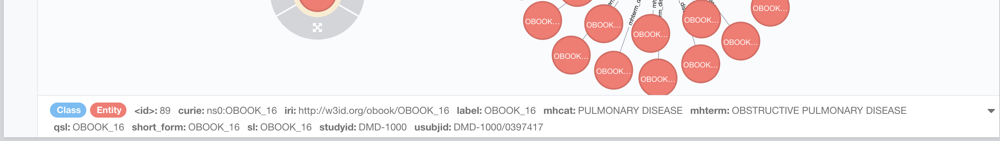

# Knowledge graphs exercise: The two camps

Today, we will explore the two main ways knowledge graphs are deployed in our domain:

- RDF Triplestore, here represented by the amazing [rdf4j](https://rdf4j.org/), which is basically a framework for triplestores - so many triple stores can be accessed through rdf4j.
- Labelled Property Graphs (LPGs), here represented by the great [neo4j](https://neo4j.com/).

Projects like [Virtual Fly Brain](https://v2.virtualflybrain.org/) use both for different purposes, see later in the discussion of this exercise.

During our work on phenotype and disease ontologies, we have created a version of the [Human Phenotype Ontology Annotations](https://hpo.jax.org/app/download/annotation) (HPOA) which we then mapped to Mondo.

## Preparation

First, we build the relevant docker containers and prepare our setup.

To that end, in your terminal (assuming you are in the project directory), run:

```
make prepare
```

To prepare our data for the following exercise, we run:

```
make data
```
We have provided a lot of comments in the `Makefile` if you want to follow along. This 
`Makefile` pulls together a large number of tricks you learned earlier in the course, so
it is worth it! In essence, we:
- download HP & Mondo and extract modules
- transform all our data into OWL (CPath and HPOA)


Now, we are ready to _deploy our containers using docker-compose_:

```
docker-compose up -d
```

`docker-compose up` starts all the containers configured in your [docker-compose config](docker-compose.yml), in particular an instance of neo4j and one of the rdf4j, a popular framework for accessing triple stores. `-d` starts docker-compose in detached mode, so that you can use the terminal again after the containers have started up.

### RDF4J Setup
After a few seconds of waiting, you should be able to visit your RDF4J Workbench in your Browser:
http://localhost:8080/rdf4j-workbench

Now we need to create a new repository to work with:
1. Click on `New repository` in the menu on the left
2. As `Type`, select `Memory Store + RDFS`
3. As `ID`, type `obook`
4. You dont need a title, so click next
5. In the following you can keep the default selection and simply click `create`

Now, lets load the data. We have prepared data loading as part of the `Makefile`, so lets go back to our terminal and run:

```
make load
```

After the process is complete, you can go back to your [obook repository](http://localhost:8080/rdf4j-workbench/repositories/obook), and you should be able to see that you have loaded a bit more than 80,0000 statements into the triple store. You can click on `Contexts` in the left menu, to see the different datasets you loaded, and click on one of them to see what they contain.

### Neo4J: Loading and Exploration 
Next, we want to do is open neo4j in your browser: http://localhost:7473/browser/

You are asked to log in; please use the following details:

```
Host: bolt://localhost:7686
Username: neo4j
Password: neo
```

You can change these parameters by editing the [docker-compose config](docker-compose.yml), if you want.

Now, we will load our first dataset by executing the following query in the query editor on the right in your neo4j browser:

```
CALL ebi.spot.neo4j2owl.owl2Import('file://cpath_template.owl','file://obook-neo4j-config.yaml')
```

After you have run this, you will get a confirmation that some data was loaded, and you should also see some `labels` on the left, like `Class` and `Entity`. You can explore the data a bit by yourself if you like, by clicking on these labels.

Lets look at our `mhterm_disease` annotations. These are the links from our original CPATH dataset to the mapped Mondo IDs we created last time. Execute the following query: 

```
MATCH p=()-[r:mhterm_disease]->() RETURN p
```
You will see a bunch of nodes (circles) connected by edges with labels (the lines). If you have a small screen, you may want to switch full screen (the two arrows pointing away from each other) and zoom out (bottom right) to get the whole picture.

If you click on one of the nodes, you can see a grey circular menu appearing around the node; we will use this later - for now, just shift your attention to the metadata in the lower menu. As you can see, the CPATH metadata appears here mostly as so called node properties (similar to RDF annotation assertions to literal values). For example, you will see (at least if you click the little black arrow on the far right), that you OBOOK data item has a `studyid` like `DMD-1000` or a `usubjid` like `DMD-1000/0737794` (see screenshot below).



So far we dont see anything impressive. Three central circles connected with a bunch of edges. Now lets start adding our first ontology: Mondo.

```
CALL ebi.spot.neo4j2owl.owl2Import('file://mondo.owl','file://obook-neo4j-config.yaml')
```

Once Mondo is loaded, you should play a bit with the new representation to get yourself to be more familiar:

1. Click on `chronic obstructive pulmonary disease` (yes, you noticed correctly that the nodes representing diseases are now labelled because of the ontology). In the grey circle around the node, click the symbol for "Expand" (an X with arrows on the corners). 
2. Search for the diseases that emerged as a result, and click on `tracheal disease`, and expand that too. You will notice that now, two of your previously disconnected sections of CPath data are now connected with edges. And not only that, you even see more information emerging, such as associated anatomical locations (for example on the `tracheal disease` class).

Lets get a bit into the weeds of cypher and look for all CPATH datapoints that pertain to thoracic diseases:

```
MATCH (c:CPATH)-[r:mhterm_disease]->(d) 
WHERE (d)-[:SUBCLASSOF*]->( {iri:"http://purl.obolibrary.org/obo/MONDO_0000651"})
RETURN c,d LIMIT 25
```

Now, we want to actually starting looking at phenotypes. Lets load some HPOA annotations:

```
CALL ebi.spot.neo4j2owl.owl2Import('file://hpoa_temlate.owl','file://obook-neo4j-config.yaml')
```

And check them out:

```
MATCH p=()-[r:phenotype_of]->() RETURN p LIMIT 25
```

As you can see, we have now added the phenotype to disease associations right into the knowledge graph.

Our last step is to actually add some more ontological richness by loading HPO:

```
CALL ebi.spot.neo4j2owl.owl2Import('file://hp.owl','file://obook-neo4j-config.yaml')
```

And now we can look for CPath data records that are associated with diseases that themselves are associated with `abnormal heart morphology` phenotype.

```
MATCH (c:CPATH)-[r:mhterm_disease]->(d {iri:"http://purl.obolibrary.org/obo/MONDO_0010679"})<-[:phenotype_of]-(p:Class)
WHERE (p:Class)-[:SUBCLASSOF*]->(:Class {iri:"http://purl.obolibrary.org/obo/HP_0001627"})
RETURN c,p,d LIMIT 20
```

To make our database a bit more readable, we can chose to add Neo4J Labels like this:

```
MATCH (p:Class)-[r:SUBCLASSOF*]->(a:Class {iri:"http://purl.obolibrary.org/obo/HP_0000118"}) 
set p :Phenotype
RETURN p
```

and:

```
MATCH (p:Class)-[r:SUBCLASSOF*]->(a:Class {iri:"http://purl.obolibrary.org/obo/MONDO_0000001"}) 
set p :Disease
RETURN p
```

These two queries basically looked for the top level classes of Mondo on HPO and then added a
label to all those. You will also see these new labels showing up on the right in the `Node labels` section.

Now we can, for example, look for all relationships in our database between diseases and phenotypes:

```
MATCH l=(p:Phenotype)-[r]-(d:Disease) RETURN l LIMIT 25
```

### RDF4J exploration

In contrast to the Neo4J example we described above, all data has already been loaded. Let's to some 
light querying to start with:

```
PREFIX owl: <http://www.w3.org/2002/07/owl#>
PREFIX MONDO: <http://purl.obolibrary.org/obo/MONDO_>
select distinct ?term where {{ ?term rdfs:subClassOf+ MONDO:0005275}}
```

This will get you all the MONDO disease ids that are children of "lung disease" (MONDO:0005275). Next, lets look at all the CPath data items that are associated with a "thoracic disease" (MONDO:0000651)

```
PREFIX owl: <http://www.w3.org/2002/07/owl#>
PREFIX rdf: <http://www.w3.org/1999/02/22-rdf-syntax-ns#>
PREFIX rdfs: <http://www.w3.org/2000/01/rdf-schema#>
PREFIX MONDO: <http://purl.obolibrary.org/obo/MONDO_>

SELECT ?cls ?disease WHERE {
  {
	?cls a owl:Class .
  	?cls rdfs:subClassOf [ rdf:type owl:Restriction ;
		owl:onProperty <http://w3id.org/obook/mhterm_disease> ;
		owl:someValuesFrom ?disease ] .
    ?disease rdfs:subClassOf+ MONDO:0000651 .
    FILTER( !isBlank(?cls))
  }
}
ORDER BY ?cls
```

Lastly, like in the neo4j example, lets get all data items that are associated with "thoracic disease" that also exhibit a `abnormal heart morphology` phenotype.

## Discussion

As you can see, both approaches to knowledge graphs are somewhat different, but also similar in many ways. Lets look at the main differences from a OBO Semantic Engineer perspective:

| Feature | Neo4J | RDF4J |
| ------  | ----- | ----- |
| Reasoning | You can do property paths, but not reasoning per se. However, a lot of what we consider useful reasoning can be done as a preprocessing step! | There are various entailment regimes that can be selected (we selected RDFS). Some Triple stores go beyond that and allow OWL RL or even OWL DL entailment regime! |
| Querying | Cypher is a graph pattern matching language, and somewhat nicer than SPARQL (easier to learn for sure). The engine is supposedly much more optimised to graph queries and can hand huge amounts of data. | SPARQL is arguably a bit cumbersome, but there is a moment in most Semantic Engineering careers that will say: "We could have done all that with SPARQL". |
| Loading data | Easy loading of all kinds of data, including RDF with [neosemantics](https://neo4j.com/labs/neosemantics/), CSV and JSON. Some very optimised forms of loading that are blazing fast (the tutorial used a custom module that is for educational purposes only, super slow). | Easy loading of data using the REST interface, but also using a bespoke admin console. Loading speed is ok, but not always in the Gigabyte range and beyond. |
| Graph analytics | Blazing fast graph analytics using the Graph Data Science Toolkit | Not so much. |
| UI | Shiny bubble and lines UI to explore your graph. Everyone loves it in the beginning, but the more your project progresses, the less relevant it will be. | Query Interface. A bit poor otherwise. But you can click on entities at least! |
| License | Commercial, but some open options | Open! Eclipse Distribution License. |

Thanks to [neosemantics](https://neo4j.com/labs/neosemantics/), you don't really need to chose anymore; there is no reason not to have both running in your environment, they use the same data and can both be fired up simply using docker.

As a rule of thumb, neo4j allows for faster graph queries (give me everything connected to X) and analysis (what is the shortest path between two things.). Triple stores are not so much for that (even though you could do it). A triple store however is a great way to integrate data - load a bunch of ontologies together, reconcile them etc, as you do not need to think about IRIs and how to match them like you do in neo4j, which does not have the notion of a globally unique identifier.
