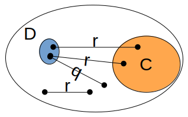
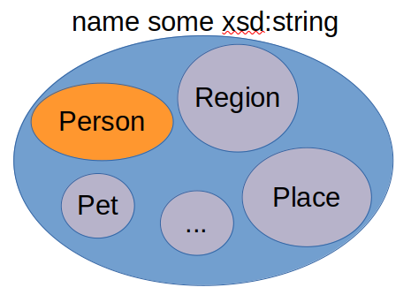

# Existential restrictions
## Prerequesites
* [`SubClassOf` vs `EquivalentTo`](subClassOf-vs-equivalentTo.md)

## Qualified existential restrictions

### Semantics
Given 

    ObjectProperty: r
    Class: D
        EquivalentTo: r some C
    Class: C

the semantics of 
`r some C` is the set of individuals such that for each
individual `x` there is at least 1 individual `y` of type `C` that is linked to
`x` via the object property `r`.

Based on this semantics, a possible world adhering to our initial equivalence axiom may be:

In this Venn diagram we assume individuals are black dots. 
Thus, our world consists of 7 individuals,
with only 2 classes, namely `C` and `D`, as well 2 object properties, namely `r` and `q`. 
In this world, `D` and thus the class `r some C`, consist of only 2 individuals. `D` and
`r some C` consist of only 2 individuals because these are the only individuals linked 
via object property `r` to at least 1 individual respectively in `C`.
 
### Examples
In the following we define a pet owner as someone that owns at least 1 pet.

    ObjectProperty: owns
    Class: PetOwner
        EquivalentTo: owns some Pet
    Class: Pet

If we want to introduce the class `DogOwner`, assuming we can only use the class `Pet`
and the object property `owns` (assuming we have not defined `PetOwner`), we could say 
that a dog owner is a subset of pet owners:

    ObjectProperty: owns
    Class: DogOwner
        SubClassOf: owns some Pet
    Class: Pet

In this case we use `SubClassOf` instead of `EquivalentTo` because not every pet owner
necessarily owns a dog. This is equivalent to stating:

    ObjectProperty: owns
    Class: PetOwner
        EquivalentTo: owns some Pet
    Class: Pet
    Class: DogOwner 
        SubClassOf: PetOwner

## Variations on existential restrictions
### Unqualified existential restrictions
In the previous section we modeled a `PetOwner` as `owns some Pet`. In the expression 
`owns some Pet` `Pet` is referred to as the **filler** of `owns` and more specifically 
we say `Pet` is the **`owns`-filler**. 

The `PetOwner EquivalentTo: owns some Pet` state that pet owners are those individuals 
that own a pet and ignore all other `owns`-fillers that are not pets. How can we define
arbitrary ownership? 

    ObjectProperty: owns
    Class: Owner
        EquivalentTo: owns some owl:Thing

### Value restrictions
We can base restrictions on having a relation to a specific named individual,
i.e.: 

    Individual: UK
    ObjectProperty: citizenOf
    Class: UKCitizen
        EquivalentTo: citizenOf hasValue UK

### Existential restrictions on data properties
This far we have only considered existential restrictions based on object properties, but
it is possible to define existential restrictions based on data properties. As an example,
we all expect that persons have at least 1 name. This could be expressed as follows:

    DataProperty: name
    Class: Person
        SubClassOf: name some xsd:string

## When to use SubClassOf vs EquivalentTo with existential restrictions
In our example of `Person SubClassOf: name some xsd:string`, why did we use `SubClassOf`
rather than `EquivalentTo`? That is, why did we not use
`Person EquivalentTo: name some xsd:string`? With using the `EquivalentTo` axiom, any 
individual that has a name, will be inferred to be an instance of `Person`. However, 
there are many things in the world that have names that are not persons. Some examples are pets,
places, regions, etc:

Compare this with, for example, `DogOwner`:

    ObjectProperty: owns
    Class: Dog
    Class: DogOwner
        EquivalentTo: owns some Dog