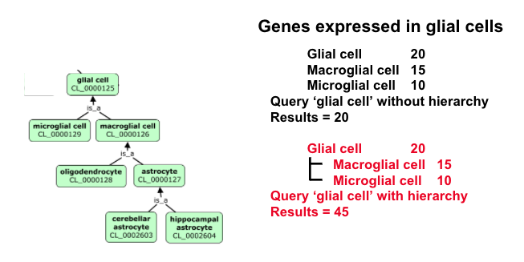
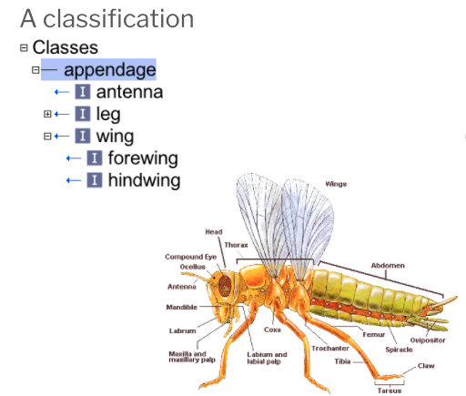
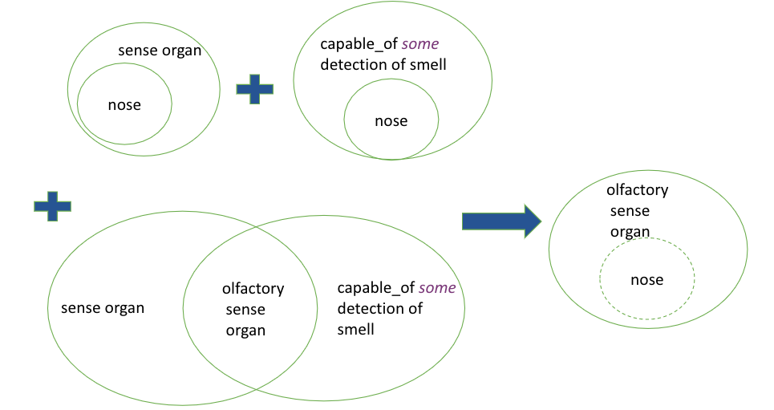

# Introduction to ontologies

Based on [CL editors training](https://docs.google.com/presentation/d/11WeCHCeGYSPEO7hUYFTdPivptxX4ajj5pVHDm24j4JA) by David Osumi-Sutherland

## Why do we need ontologies?

We face an ever-increasing deluge of biological data analysis. Ensuring that this data and analysis are Findable, Accessible, Interoperable, and Re-usable ([FAIR](https://www.nature.com/articles/sdata201618)) is a major challenge. Findability, Interoperabiltiy, and Resuability can all be enhanced by standardising metadata. Well-standardised metadata can make it easy to _find_ data and analyses despite variations in terminology (['Clara cell' vs 'nonciliated bronchiolar secretory cell'](https://pubmed.ncbi.nlm.nih.gov/7047186) vs ['club cell'](https://www.ebi.ac.uk/ols/ontologies/cl/terms?iri=http%3A%2F%2Fpurl.obolibrary.org%2Fobo%2FCL_0000158)) and precision ('bronchial epithelial cell' vs 'club cell'). Understanding which entities are referred to in metadata and how they relate to the annotated material can help users work out if the data or analysis they have found is of interest to them and can aid in its re-use and interoperability with other data and analyses. For example, does an annotation of sample data with a term for breast cancer refer to the health status of the patient from which the sample was derived or that the sample itself comes from a breast cancer tumor?

### We can't find what we're looking for

Given variation in terminology and precision, annotation with free text alone is not sufficient for findability. One very lightweight solution to this problem is to rely on user-generated keyword systems, combined with some method of allowing users to choose from previously used keywords. This can produce some degree of annotation alignment but also results in fragmented annotation and varying levels of precision with no clear way to relate annotations.

For example, trying to refer to feces, in NCBI BioSample:

| Query            | Records |
| ---------------- | ------- |
| Feces            | 22,592  |
| Faeces           | 1,750   |
| Ordure           | 2       |
| Dung             | 19      |
| Manure           | 154     |
| Excreta          | 153     |
| Stool            | 22,756  |
| Stool NOT faeces | 21,798  |
| Stool NOT feces  | 18,314  |

### We don't know what we're talking about

Terminology alone can be ambiguous. The same term may be used for completely unrelated or vaguely analogous structures. An insect femur and an mammalian femur are neither evolutionarily related nor structurally similar. Biologists often like to use abbreviations to annotate data, but these can be extremely ambiguous. [_Drosophila_ biologists use DA1](https://www.ebi.ac.uk/ols/search?q=DA1&groupField=iri&start=0&ontology=fbbt) to refer to structures in the tracheal system, musculature and nervous system. Outside of _Drosophila_ biology it is used to refer to many other things including a [rare disease](https://www.ebi.ac.uk/ols/ontologies/ordo/terms?iri=http%3A%2F%2Fwww.orpha.net%2FORDO%2FOrphanet_1146), and a [a neuron type](https://www.ebi.ac.uk/ols/ontologies/wbbt/terms?iri=http%3A%2F%2Fpurl.obolibrary.org%2Fobo%2FWBbt_0004871) in _C.elegans_.

Some extreme examples of this ambiguity come from terminological drift in fields with a long history. For example
in the male genitalia of a gasteruptiid wasp, these 5 different structures here have each been labeled "paramere" by different people, each studying different hymenopteran lineages. How do we know what "paramere" means when it is referred to?


This striking example shows that even precise context is not always sufficient for disambiguation.

## Controlled vocabulary (CV)

Rather than rely on users to generate lists of re-usable keywords, we can instead pre-specify a set of terms to use in annotation. This is usually refered to a controlled vocabulary or CV.

### Key features

- Terms are usually _not_ defined
- Relationships between the terms are usually _not_ defined
- Simplest form is a list

### Example using wines

- Pinot noir
- Red
- Chardonnay
- Chianti
- Bordeaux
- Riesling

## Hierarchical controlled vocabulary

### Definition

Any controlled vocabulary that is arranged in a hierarchy.

### Key features

- Terms are arranged in a hierarchy, typically from general (top) to specific (bottom) with each term having only one parent.
- Terms are usually _not_ defined.
- Relationships between the terms are usually _not_ named or defined

### Example using wines (Taxonomy of wine)

- Red
    - Merlot
    - Zinfandel
    - Cabernet
    - Pinot Noir
- White
    - Chardonnay
    - Pinot Gris
    - Riesling

Taxonomy describes a hierarchical CV in which hierarchy equals classification. E.g., 'Merlot' is classified as a 'Red' (wine). Not all hierchical CVs are classifications. For example, anatomical atlases often have hierarchical CVs representing "parthood". The femur is a part of the leg, but it is not 'a leg'.

### Support for grouping and varying levels of precision

The use of a hierachical CV in which general terms group more specific terms allows for varying precision (glial cell vs some specific subtype) and simple grouping of annotated content.

For example:



## From hierarchical CVs to ontologies

Hierarchical CVs tend to increase in complexity in particular ways:

### Synonyms

To support findability, terms in hierarchical CVs often need to be associated with synonyms, or cross-referenced to closely related terms inside the CV.

### Polyhierarchy

CV content is often driven by requests from annotators and so expansion is not driven by any unified vision of scheme. This often leads to pressure for hierarchies to support terms having multiple parents, either reflecting multiple relationship types, or multiple types of classification. For example, an anatomical CV could reasonably put 'retinal bipolar cell' under 'retina' based on location and, at the same time, under 'bipolar neuron' and 'glutamatergic neuron' based on cell type classification.

### Named relationships

Developers of hierarchical CVs often come to realise that multiple relationship types are represented in the hierarchy and that it can be useful to name these relationship for better distinction. For example, a heart glial cell is a 'type of' glial cell, but is 'part of' the heart.


## What is an ontology?

### Definition

Definitions of ontologies can be controversial. Rather than attempting a comprehensive definition, this tutorial will emphasise ontologies as:

- Classifications
- Queryable stores of knowledge

### Key features of well-structured ontologies:

- Terms are arranged in a classification hierarchy

- Terms are defined

- Terms are richly annotated:

    - Textual definitions
    - References
    - Synonyms
    - Links
    - Cross-references

- Relationships between terms are defined, allowing logical inference and sophisticated queries as well as graph representations.

- Expressed in a knowledge representation language such as RDFS, OBO, or OWL

### Examples

- Gene Ontology, Uberon, Cell Ontology, EFO, SNOMED

## Non-logical parts of ontologies

Terminology can be ambiguous, so text definitions, references, synonyms and images are key to helping users understand the intended meaning of a term.


## Identifiers

### Using identifiers devoid of intrinsic meaning

Identifiers that do not hold any inherent meaning are important to ontologies. If you ever need to change the names of your terms, you're going to need identifiers that stay the same when the term name changes.

For example:

A microglial cell is also known as: hortega cell, microglia, microgliocyte and brain resident macrophage.
In the cell ontology, it is however referred to by a unique identifier: `CL:0000129`
These identifiers are short ways of referring to IRIs (e.g., CL:000129 = http://purl.obolibrary.org/obo/CL_0000129)
This IRI is a unique, resolvable identifier on the web.
A group of ontologies - loosely co-ordinated through the OBO Foundry, have standardised their IRIs (e.g. http://purl.obolibrary.org/obo/CL_0000129 - A term in the cell ontology; http://purl.oblibrary.org/obo/cl.owl - The cell ontology)

#### IRIs? URIs? URLs?

- URI: Unique Resource Identifier - a string of characters, following a standard specification, that unambiguously identifies a particular (web) resource.
- IRI: Internationalised Resource Identifier - a URI that can use characters in multiple languages.
- URL: Uniform Resource Locator - a web-resolvable URI.

## Building scalable ontologies

### Format

OBO ontologies are mostly written in OWL2 or OBO syntax. The latter is a legacy format that maps completely to OWL.

For a more in-depth explanation of formats (OWL, OBO, RDF etc.) refer to explainer on [OWL format variants](../explanation/owl-format-variants.md).
In the examples below we will use OWL Manchester syntax, which allows us to express formal logic in English-like sentences.

### An ontology as a classification

Ontology terms refer to classes of things in the world. For example, the class of all wings.

Below you will see a classification of parts of the insect and how it is represented in a simple ontology.



We use a SubClassOf (or is_a in obo format) to represent that one class fully subsumes another.
For example:
OWL: hindwing SubClassOf wing
OBO: hindwing is_a wing

In English we might say: "a hindwing is a type of wing" or more specifically, "all instances of hindwing are instances of wing." 'Instance' here refers to a single wing of an individual fly.


In the previous section, we talked about different types of relationships. In OWL we can define specific relations (known as object properties). One of the commonest is 'part of' which you can see used below.


English: all (insect) legs are part of a thoracic segment
OWL: 'leg' SubClassOf part_of some thoracic segment
OBO: 'leg'; relationship: part_of thoracic segment

It might seem odd at first that OWL uses subClassOf here too. The key to understanding this is the concept of an anonymous class - in OWL, we can refer to classes without giving them names. In this case, the anonymous class is the class of all things that are 'part of' (some) 'thoracic segment' (in insects). A vast array of different anatomical structures are subclasses of this anonymous class, some of which, such as wings, legs, and spiracles, are visible in the diagram.

Note the existential quantifier `some` in OWL format -- it is interpreted as "there exists", "there is at least one", or "some".


The quantifier is important to the direction of relations.

subClassOf:
`'wing' SubClassOf part_of some 'thoracic segment'` is correct
`'thoracic segment' SubClassOf has_part some 'wing'` is incorrect as it implies all thoracic segment have wings as a part.

Similarly:
`'claw' SubClassOf connected_to some 'tarsal segment'` is correct
`'tarsal segment' SubClassOf connected_to some 'claw'` is incorrect as it implies all tarsal segments are connected to claws (for example, some tarsal segments are connected to other tarsal segments)


These relationships store knowledge in a queryable format. For more information about querying, please refer to guide on [DL queries](../tutorial/basic-dl-query.md) and [SPARQL queries](../tutorial/sparql.md).

### Scaling Ontologies

There are many ways to classify things. For example, a neuron can be classified by structure, electrophysiology, neurotransmitter, lineage, etc. Manually maintaining these multiple inheritances (that occur through multiple classifications) does not scale.


Problems with maintaining multiple inheritance classifications by hand

- Doesn’t scale

    - When adding a new class, how are human editors to know

        - all of the relevant classifications to add?

        - how to rearrange the existing class hierarchy?

- It is bad for consistency

    - Reasons for existing classifications often opaque

    - Hard to check for consistency with distant superclasses

- Doesn’t allow for querying

    - A formalized ontology can be queried for classes with arbitrary sets of properties. A manual classification can not.

#### Automated Classifications

The knowledge an ontology contains can be used to automate classification. For example:

English: Any sensory organ that functions in the detection of smell is an olfactory sensory organ
OWL:

```
'olfactory sensory organ'
 EquivalentTo ‘sensory organ’
that
capable_of some ‘detection of smell’
```

If we then have an entity `nose` that is subClassOf `sensory organ` and `capable_of some detection of smell`, it will be automatically classified as an olfactory sensory organ.



## Acknowledgements

- David Osumi-Sutherland (original creator of slides)
- Nicole Vasilevsky (Critical Path Institute), Alex Diehl (Buffalo), Nico Matentzoglu, Matt Brush, Matt Yoder, Carlo Toriniai, Simon Jupp
- Chris Mungall (LNBL), Melissa Haendal (University of Colorado Anschutz Medical Campus), Jim Balhoff (RENCI), James Overton - slides, ideas & discussions
- Terry Meehan - who edited CL more than anyone
- Helen Parkinson (EBI)
- Michael Ashburner
