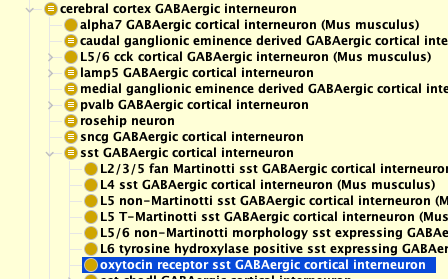
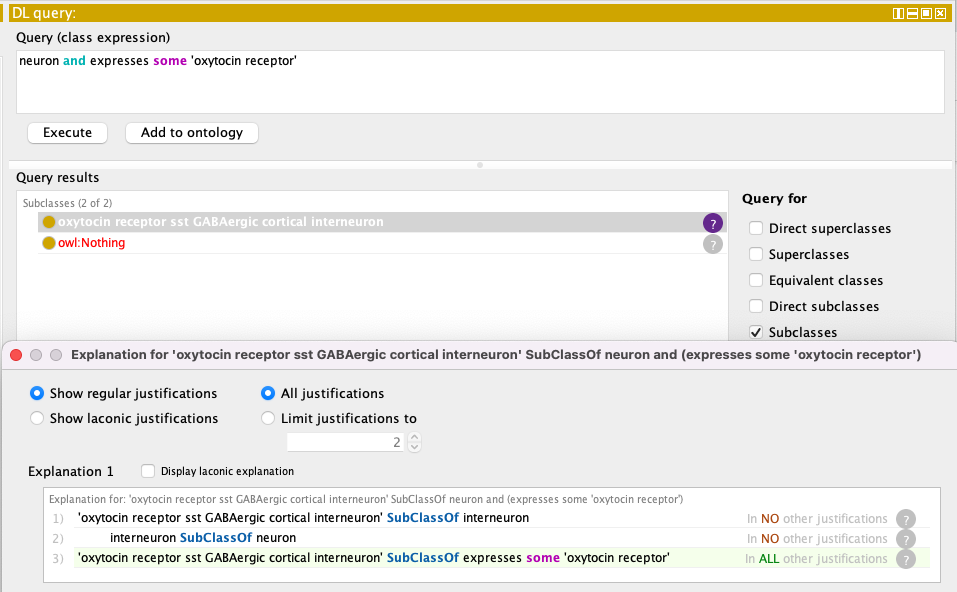
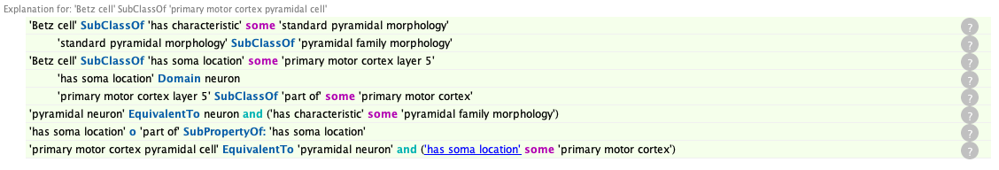

# Logical axiomatization of classes & use of reasoning

This explainer requires understanding of ontology classifications. Please see "an ontology as a classification" section of the [introduction to ontologies documentation](../explanation/intro-to-ontologies.md) if you are unfamiliar with these concepts.

## What are logical axioms

Logical axioms are relational information about classes that are primarily aimed at machines. This is opposed to annotations like textual definitions which are primarily aimed at humans. These logical axioms allow reasoners to assist in and verify classification, lessening the development burden and enabling expressive queries.

## What should you axiomatize?

Ideally, everything in the definition should be axiomatized when possible. For example, if we consider the cell type `oxytocin receptor sst GABAergic cortical interneuron`, which has the textual definition:

"An interneuron located in the cerebral cortex that expresses the oxytocin receptor. These interneurons also express somatostatin."

The logical axioms should then follow accordingly:

SubClassOf:

- interneuron
- 'has soma location' some 'cerebral cortex'
- expresses some 'oxytocin receptor'
- expresses some somatostatin
- 'capable of' some 'gamma-aminobutyric acid secretion, neurotransmission'

These logical axioms allow a reasoner to automatically classify the term. For example, through the logical axioms, we can infer that `oxytocin receptor sst GABAergic cortical interneuron` is a `cerebral cortex GABAergic interneuron`.



Axiomatizing definitions well will also allow for accurate querying. For example, if I wanted to find a neuron that expresses oxytocin receptor, having the SubClassOf axioms of `interneuron` and `expresses some 'oxytocin receptor'` will allow me to do so on DL query (see [tutorial on DL query](../tutorial/basic-dl-query.md) for more information about DL queries).



## What should you NOT axiomatize?

Everything in the logical axioms **must be true**, (do not axiomatize things that are true to only part of the entity)
For example, the cell type `chandelier pvalb GABAergic cortical interneuron` is found in upper L2/3 and deep L5 of the cerebral cortex.
We do not make logical axioms for `has soma location` some layer 2/3 and layer 5.
Axioms with both layers would mean that a cell of that type **must** be in both layer 2/3 and layer 5, which is an impossibility (a cell cannot be in two seperate locations at once!). Instead we axiomatize a more general location: 'has soma location' some 'cerebral cortex'

## Equivalent class logical definitions

An equivalent class axiom is an axiom that defines the class; it is a necessary and sufficient logical axiom that defines the cell type. It means that if a class B fulfils all the criteria/restrictions in the equivalent axiom of class A, class B is by definition a subclass of class A.
Equivalent classes allow the reasoner to automatically classify entities.

For example:

- `chandelier cell` has the equivalent class axiom `interneuron and ('has characteristic' some 'chandelier cell morphology')`
- `chandelier pvalb GABAergic cortical interneuron` has the subclass axioms `'has characteristic' some 'chandelier cell morphology'` and `interneuron`
- `chandelier pvalb GABAergic cortical interneuron` is therefore a subclass of `chandelier cell`

Equivalent class axioms classification can be very powerful as it takes into consideration complex layers of axioms.

For example:

- `primary motor cortex pyramidal cell` has the equivalent class axiom `'pyramidal neuron' and ('has soma location' some 'primary motor cortex')`.
- `Betz cell` has the axioms `'has characteristic' some 'standard pyramidal morphology'` and `'has soma location' some 'primary motor cortex layer 5'`
- `Betz cell` are inferred to be `primary motor cortex pyramidal cell` through the following chain (you can see this in Protégé by pressing the ? button on inferred class):



The ability of the reasoner to infer complex classes helps identify classifications that might have been missed if done manually. However, when creating an equivalent class axiom, you must be sure that it is not overly constrictive (in which case, classes that should be classified under it gets missed) nor too loose (in which case, classes will get wrongly classified under it).

Example of both overly constrictive and overly loose equivalent class axiom:

`neuron equivalent to cell and (part_of some 'central nervous system')`

- This is overly constrictive as there are neurons outside the central nervous system (e.g. peripheral neurons).
- This is also too loose as there are cells in the central nervous system that are not neurons (e.g. glial cells).

In such cases, sometimes not having an equivalent class axioms is better (like in the case of neuron), and asserting is the best way to classify a child.

## Style guide

Each ontology has certain styles and conventions in how they axiomatize. This style guide is specific to OBO ontologies. We will also give reasons as to why we choose to axiomatize in the way we do. However, be aware of your local ontology's practices.

### Respect the ontology style

It is important to note that ontologies have specific axiomatization styles and may apply to, for example, selecting a preferred relation. This usually reflects their use cases. For example, the Cell Ontology has a [guide for what relations to use](https://obophenotype.github.io/cell-ontology/relations_guide/). An example of an agreement in the community is that while anatomical locations of cells are recorded using `part of`, neurons should be recorded with `has soma location`. This is to accommodate for the fact that many neurons have long reaching axons that cover multiple anatomical locations making them difficult to axiomatize using `part of`.

For example, `Betz cell`, a well known cell type which defines layer V of the primary motor cortex, synapses lower motor neurons or spinal interneurons (cell types that reside outside the brain). Having the axiom `'Betz cell' part_of 'cortical layer V'` is wrong. In this case `has soma location` is used. Because of cases like these that are common in neurons, all neurons in CL should use `has soma location`.

### Avoid redundant axioms

Do not add axioms that are not required. If a parent class already has the axiom, it should not be added to the child class too.
For example:

- `retinal bipolar neuron` is a child of `bipolar neuron`
- `bipolar neuron` has the axiom `'has characteristic' some 'cortical bipolar morphology'`
- Therefore we do not add `'has characteristic' some 'cortical bipolar morphology'` to `retinal bipolar neuron`

Axioms add lines to the ontology, resulting in larger ontologies that are harder to use. They also add redundancy, making the ontology hard to maintain as a single change in classification might require multiple edits.

### Let the reasoner do the work

Asserted is_a parents do not need to be retained as entries in the 'SubClass of' section of the Description window in Protégé if the logical definition for a term results in their inference.

For example, `cerebral cortex GABAergic interneuron` has the following logical axioms:

```
Equivalent_To
  'GABAergic interneuron' and
  ('has soma location' some 'cerebral cortex')
```

We do not need to assert that it is a `cerebral cortex neuron`, `CNS interneuron`, or `neuron of the forebrain` as the reasoner automatically does that.

We avoid having asserted subclass axioms as these are redundant lines in the ontology which can result in a larger ontology, making them harder to use.

Good practice to let the reasoner do the work:

```
1) If you create a logical definition for your term, you should delete all redundant, asserted is_a parent relations by clicking on the X to the right of the term.
2) If an existing term contains a logical definition and still shows an asserted is_a parent in the 'SubClass of' section, you may delete that asserted parent. Just make sure to run the Reasoner to check that the asserted parent is now replaced with the correct reasoned parent(s).
3) Once you synchronize the Reasoner, you will see the reasoned classification of your new term, including the inferred is_a parent(s).
4) If the inferred classification does not contain the correct parentage, or doesn't make sense, then you will need to modify the logical definition.
```
