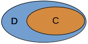
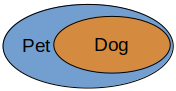
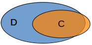
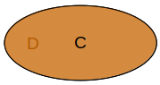
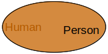
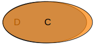
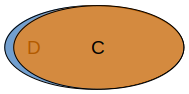

# `SubClassOf` vs `EquivalentTo`
## Prerequisites 
This lesson assumes you have basic knowledge wrt ontologies and OWL as explained in:

* [Introduction to ontologies](intro-to-ontologies.md)
* [Logical building blocks of OWL](owl-building-blocks.md)

## `SubClassOf`

In this section we explain the semantics of `SubClassOf`, give an example of using `SubClassOf` and provide guidance for when not to use `SubClassOf`.

### Semantics
If we have 

    Class: C
      SubClassOf: D
    Class: D

the semantics of it is given by the following Venn diagram:

Thus, the semantics is given by the subset relationship, stating the `C` is a subset of `D`. This means every individual 
of `C` is necessarily an individual of `D`, but not every individual of `D` is necessarily an individual of `C`. 

### A concrete example
    Class: Dog
      SubClassOf: Pet
    Class: Pet
which as a Venn diagram will look as follows:

### Guidance
There are at least 2 scenarios which at first glance may seem like `C SubClassOf D` holds, but it does not hold, or 
using `C EquivalentTo D` may be a better option.

1. This is typically where `C` has many individuals that are in `D`, but there is at least 1 individual of `C` that is 
not in `D`. The following Venn diagram is an example. Thus, to check whether you may be dealing with this scenario, you 
can ask the following question: Is there any individual in `C` that is not in `D`? If 'yes', you are dealing with this 
scanario and you should **not** be using `C SubClassOf D`. 
 

2. When you have determined that (1) does not hold, you may deal with the scenario where not only is every individual of
`C` in `D`, but also every individual in `D` is in `C`. This means `C` and `D` are equivalent. In the case you rather want 
to make use of `EquivalentTo`.

## `EquivalentTo`
## Semantics
If we have

    Class: C
        EquivalentTo: D
    Class: D

this means the sets `C` and `D` fit perfectly on each other, as shown in the next Venn diagram:

Note that `C EquivalentTo D` is shorthand for 

    Class: C
        SubClassOf: D
    Class: D
        SubClassOf: C

though, in general it is better to use `EquivalentTo` rather than the 2 `SubClassOf` axioms when `C` and `D` are equivalent.

### A concrete example
We all probably think of humans and persons as the exact same set of individuals.

    Class: Person
        EquivalentTo: Human
    Class: Human

and as a Venn diagram:

### Guidance
When do you not want to use `EquivalentTo`? 

1. When there is an individual of `C` that is not in `D`.
 

2. When there is an individual of `D` that is not in `C`.

