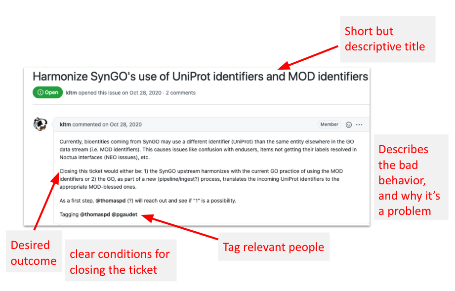
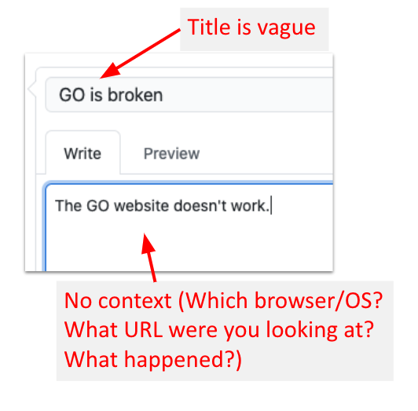

# Writing Good Issues

Based on [Intro to GitHub (GO-Centric)](https://docs.google.com/presentation/d/1xiALnyqKJ_cAF0hmR99v1FdQ-CC7WW33/edit#slide=id.gb6531145d5_0_249) with credit to Nomi Harris and Chris Mungall

Writing a good ticket (or issue) is crucial to good management of a repo. In this explainer, we will discuss some good practices in writing a ticket and show examples of what not to do.

## Best Practices

- Search existing issues before creating a new one -- maybe someone else already reported your problem
- Give your issue a short but descriptive and actionable title
- Describe the problem and the context and include a repeatable example.
- Clearly state what needs to be done to close the ticket
  - Tickets should ideally be actionable units that can be closed via a PR
- Flag relevant people with @ (e.g., @nlharris)
- Mention related issues with # (e.g., #123)
  - use a complete URL to link to tickets in other repos
- Make issue titles actionable
  - eg "Ontology download page on GO website" is non-actionable, whereas "Fix URLs on ontology download page on GO website" is actionable and hence better a title

## Example of a good ticket

## Example of a bad ticket

