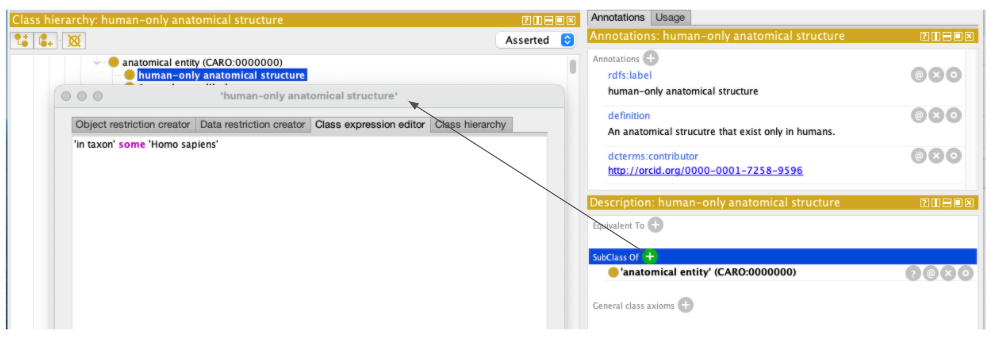
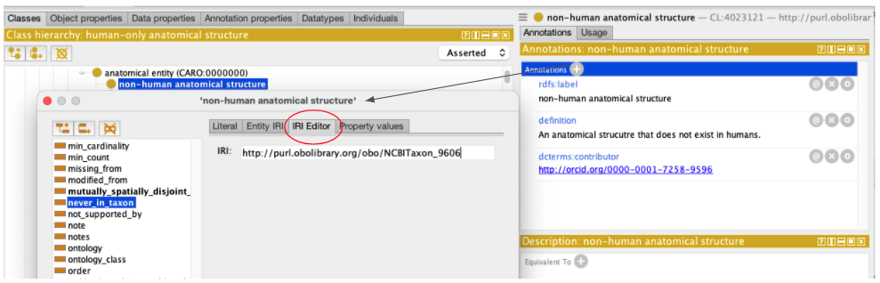

# Adding taxon restrictions

See [Daily Workflow](daily-curator-workflow.md) for creating branches and basic Protégé instructions. 

1. ```in taxon``` relations are added as ```Subclasses```. 
   1.	Navigate to the term for which you want to add the only in taxon restriction.
   2.	In the Description window click on the ```+```.
   3.	In the pop-up window type a new relationship (e.g. ```'in taxon' some Viridiplantae```).
   4.	The taxa available are imported ontology terms and can be browsed just like any other ontology term.



2. ```never in taxon``` or ```present in taxon``` relations added as ```Annotations```. 
   1. Navigate to the taxon term you want to add a restriction on.  
   2. Copy the IRI (you can use command U to display this on a Mac)
   3.	Navigate to the term for which you want to add the never in taxon restriction.
   4.	In the class annotations window, click on the ```+```. 
   5.	In the left-hand panel, select ```never_in_taxon``` or ```present_in_taxon``` as appropriate.
   6.	In the right-hand panel, in the IRI editor panel, paste in the IRI.
   7.	Click OK to save your changes.
   8. (Note - you can achieve the same thing using the Entity IRI tab + navigating to the correct taxon but this is slow and not very practical)


   
See [Daily Workflow](daily-curator-workflow.md) section for commit, push and merge instructions. 

