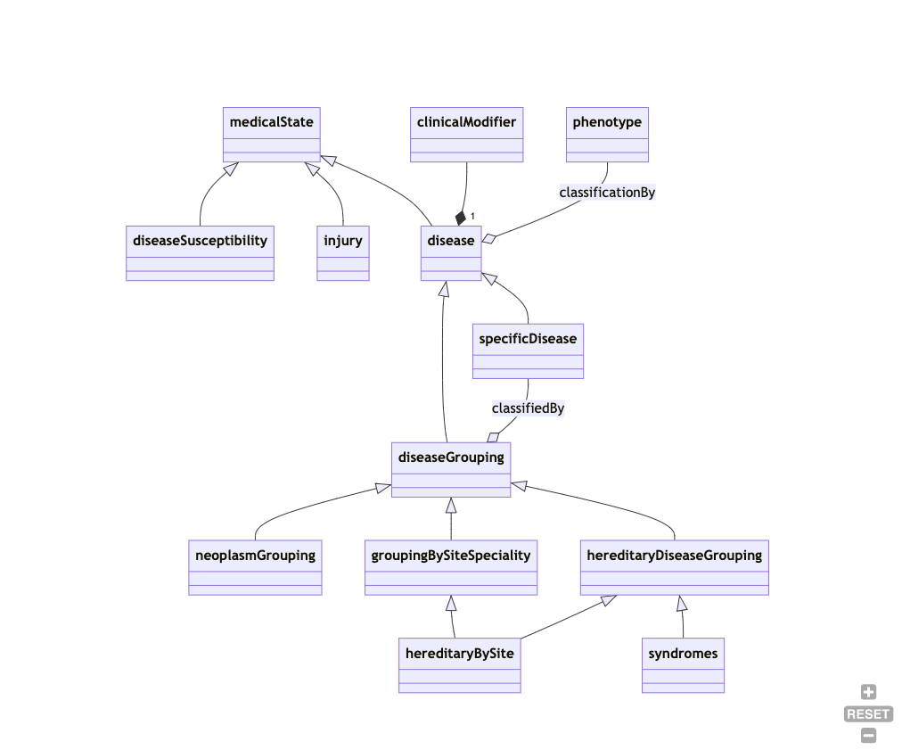
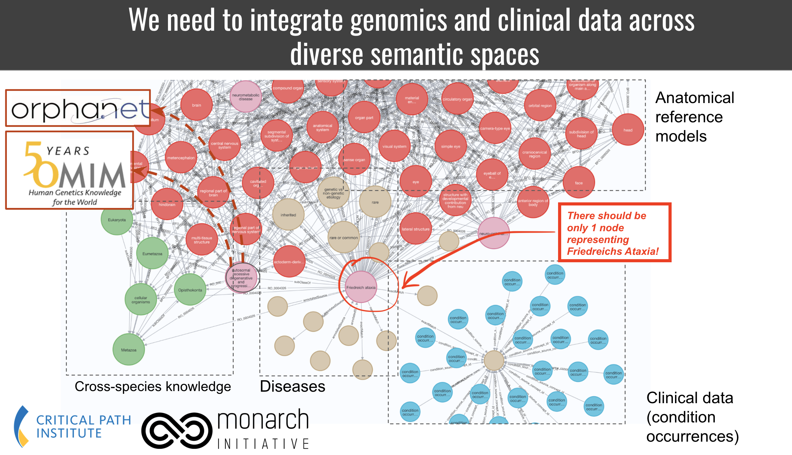
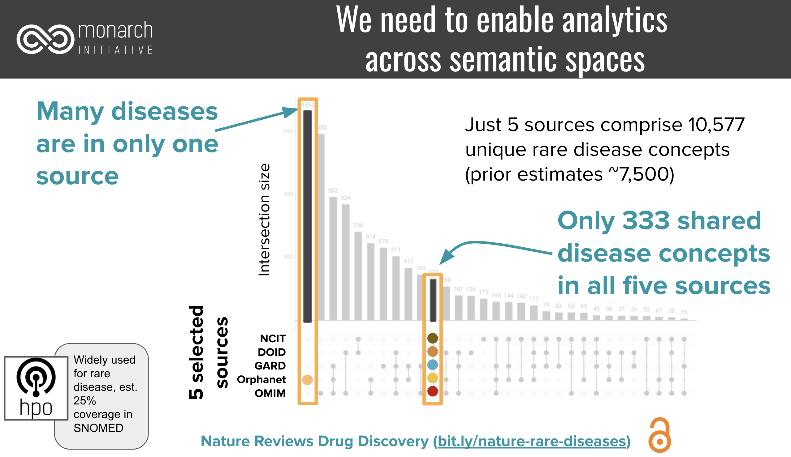
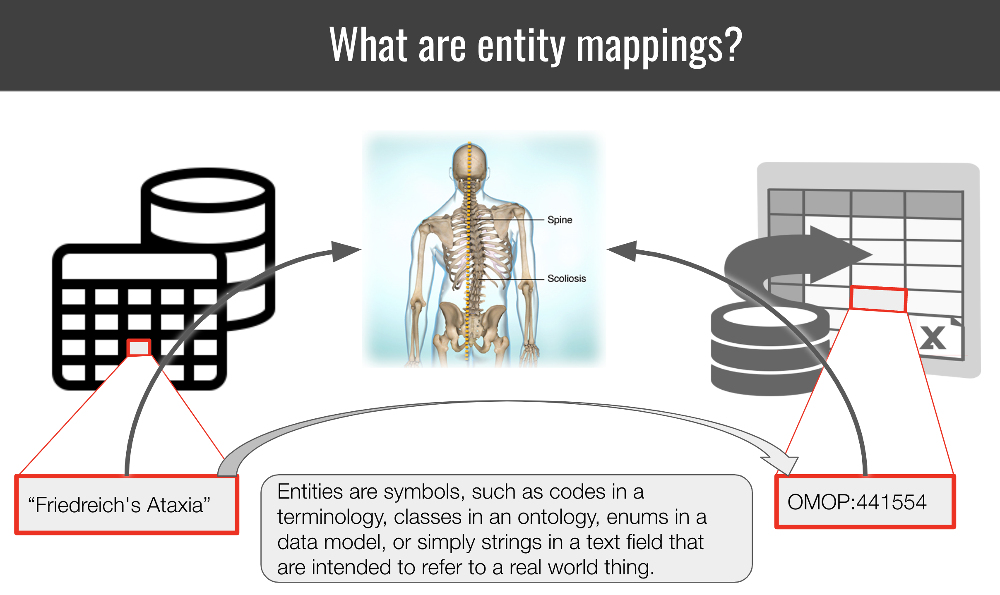
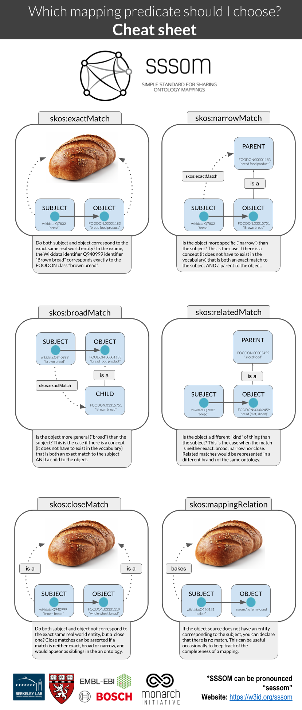

## Are these two entities the same? A guide.

**Disclaimer**: Some of the text in this guide has been generated or refined with the help of ChatGPT (GPT 4).

**Summary**:
Entity mapping is the process of identifying correspondences between entities across semantic spaces. A “semantic space” in this context can be anything from an ontology, terminology, database or controlled vocabulary to enumerations in a data model. Entities are strings that identify/represent a real-world concept or instance in that space. Many such entities refer to the exact same, or similar, real world concept or instance [1](https://zenodo.org/record/8202395),[2](https://academic.oup.com/database/article/doi/10.1093/database/baac035/6591806). To integrate data from disparate semantic spaces, we need to develop maps that connect entities. The [Simple Standard for Sharing Ontological Mappings (SSSOM)](https://academic.oup.com/database/article/doi/10.1093/database/baac035/6591806) has been developed to support that process.

Most semantic spaces (such as scientific databases or clinical terminologies) do not commit to any formal semantics (such as, say, an OWL Ontology). This makes the curation of mappings a shaky, ambiguous afair. Concepts with the same labels can refer two different real world concepts. Concepts with entirely different labels and taxonomic context can refer to the same real world concept. Here, we explore conceptually how to think of same-ness, leading to a practical protocol for mapping authors and reviewers.

### Preliminary reading

- A [basic tutorial](https://mapping-commons.github.io/sssom/tutorial/) for the creation of SSSOM mapping files.
- A [guide for how to think of mapping predicates](https://mapping-commons.github.io/sssom/mapping-predicates/) (exactMatch, broadMatch).

## A practical step-by-step protocol for determining a mapping

The following steps are designed to give you a basic framework for designing your own, use-case specific, mapping protocol. The basic steps are:

1. [Understand the underlying conceptual models of the semantic spaces](#conceptual-model)
2. [Document the use case for the mapping](#use-case)
3. [Document the basic curation rules for the mapping](#curationrule)
4. [Gathering evidence for the mapping](#evidence)

### Understand the underlying conceptual models of the semantic spaces

Before we can even start with the mapping process, we need to establish what the source is all about, and what the conceptual model underpins it. This may or may not be easy - but this step should not be ommitted.

#### Checklist for determining the conceptual model of a semantic space

1. What is the **domain** of the semantic space? (e.g. Clinical, Medical Research, Environment)
1. What is the **organising semantic framework**? Is it an OWL ontology (set semantics)? A SKOS taxonomy (broader/narrow categories)? A database without a specific semantic framework underpinning it?
1. What are the **primary organising relationships** (POR)? Primary organising relationships connect terms within the semantic spaces, like diseases to diseases, chemicals to chemicals etc, usually into some form of a graph. For an ontology, this could be for example rdfs:subClassOf, or BFO:0000050 (part of), like in the case of Uberon. For a taxonomy, the primary organising relationship could be skos:broader / skos:narrower. For a database, there could be no PORs at all, or relationships like "isomer of", "functional group of" etc, which are usually columns in a database table. In some cases, the PORs _serve a function more than they reflect a representation of knowledge_. For example, hierarchical relationships in ICD10 have to be mono-hierarchical (single parents) to serve billing and statistical purposes, which means that a lot of biological ambiguities will not be reflected at all (missing bioligically meaningful hierarchical relationships).
1. What are the **primary categories** represented by the semantic space, e.g. one or more of diseases, phenotypes, genes, chemical entities, biological processes?
1. What is the **conceptual model** underpinning the primary categories? This is the hardest part, because we very rarely have a document or schema (ontology!) that explicitly defines the conceptual model. For example, one ontology could implement a **biomedical conceptual model** of disease, which views diseases as primarily resulting from biological factors. It posits that diseases are caused by specific, identifiable agents like viruses, bacteria, genetic mutations, or physiological imbalances. Or an ontology could implement a **biopsychosocial model** of disease which views disease as a result of a complex interplay between biological, psychological, and social factors. Chemical entities can be defined and organised using a **Structural Hierarchical Model** (hierarchically organised from  atomic to molecular to macromolecular levels), or a **Behavioral/Functional Model:** (hierarchically organised based on their behavior or function).

#### Example for determining the conceptual model of a semantic space

In our example, we are mapping [ICD10CM](https://icd.codes/icd10cm) to [Mondo](https://www.ebi.ac.uk/ols4/ontologies/mondo).

1. **domain**:
    - **MONDO**: MONDO is an ontology focused on modelling diseases, with a special focus on rare diseases.
    - **ICD10CM**: ICD-10-CM is a comprehensive system that goes beyond just coding diseases. In addition to diseases, ICD-10-CM includes codes for a variety of other features, such as Symptoms, Signs, and Abnormal Clinical and Laboratory Findings, Injuries and External Causes and Factors Influencing Health Status and Contact with Health Services.
1. **organising semantic framework**:
    - **MONDO**: MONDO is an OWL ontology.
    - **ICD10CM**: ICD10 can safely be classified as a taxonomy, but does not commit to a specfic standard. The "primary structure" of ICD-10-CM, which refers to its hierarchical organization of codes from broad categories to specific diseases or conditions, can largely be expressed as a SKOS vocabulary. The basic hierarchical relationships (broader/narrower) align well with SKOS's skos:broader and skos:narrower properties. Likewise, preferred labels for terms can be represented using skos:prefLabel, while alternative labels or synonyms can be captured using skos:altLabel. However, while the main hierarchical structure of ICD-10-CM can be represented in SKOS, there are nuances and additional information in ICD-10-CM that might be challenging to represent losslessly in a simple SKOS model such as Inclusion and Exclusion Notes and Complex (non-hierarchical) Relationships.
1. **primary organising relationships**:
    - **MONDO**: rdfs:subClassOf
    - **ICD10CM**: can be expressed as skos:narrower, skos:broader, see considerations above ("organising semantic framework").
1. **primary categories**:
    - **MONDO**: diseases, disease characteristics, injuries, susceptibilities
    - **ICD10CM**: diseases, signs and symptoms, injuries, pregancy related codes, and more (we only really care about diseases here)
1. **conceptual model**: A disease model captures the essential, defining features of diseases, including etiology and phenotypic presentation. As these are rarely explicitly defined, the disease model underlying a resource must often be determined through elucidation, term analysis and literature review.
    - **MONDO**: A disease is a disposition to undergo pathological processes that exists in an organism because of one or more disorders in that organism.
    - **ICD10CM**: The International Classification of Diseases (ICD) serves as a foundational tool for health statistics, clinical care, and research, but it doesn't provide a singular, concise definition of "disease" in its introduction or general guidelines. Instead, the ICD system broadly encompasses a range of health-related conditions, and its structure reflects various ways in which the human body and mind can deviate from a perceived norm or experience dysfunction.

A small part of a disease model could look like this:

While this is vastly incomplete, you can gain certain important pieces of information: 

1. susceptibilities, injuries and diseases are mutually disjoint (different branches). So a disease model that subsumes an "injury" or a "susceptibility to disease" under the concept of "disease" would, technically speaking, be incompatible with that disease model.
1. A "disease grouping" is considered a "disease" - many (if not most) conceptual models clearly separate the two.
1. "hereditary diseases by site" are classified both under "grouping by site" and "hereditary disease". This means the conceptual model is polyhierarchical. Many disease models do not permit polyhierarchies in their "primary organising relationships".

### Document the use case of the mapping

Before proceeding, you should document how you want to use the mapping. The mapping use case will determine certain factors like:

- which mapping predicates to consider,
- whether or not to "conflate",
- how far "uphill" or "broad" to map and
- which level of evidence you consider acceptable.

Note that one goal of SSSOM is to increase our ability for "cross-purpose reuse" of mappings, which means that no matter what the use case, the mappings should never be "wrong" - but "conflation", which we will hear more about in a bit, is a natural part of mapping which will always cause mappings to be to some degree imprecise (imperfect).

#### Example use case

In our example, we are mapping [ICD10CM](https://icd.codes/icd10cm) to [Mondo](https://www.ebi.ac.uk/ols4/ontologies/mondo) for the purpose of data integration, in particular knowledge graph merging.

One of the features of this use case is that we wish the target KG to have a specific feature: for every disease in the data, we want one, and only one, node in the graph. Therefore, carefully curated exact matches are our primary focus. All nodes should be represented by MONDO ids. On the flipside, some diseases in ICD 10 are too granular so we wish to map them to the next best disease in Mondo as a broad match. We have no analytic use for narrow and close matches because we cannot clearly deal with them in the knowledge graph, so we do not curate them.

Closely related to this knowledge graph integration use case is the need for counting. In order to be able to count precisely across resources, we need precise mappings to not overcount. For example, given a set of resources that represent more than 10,000 rare diseases, only 333 were represented by all:

### Document the basic curation rules for the mapping

Once you have determined the conceptual models of the subject and object source (or a good approximation of it), you will have to lay some ground (curation) rules of the mappings. These ground rules are going to be dictated by your target use case.

#### Checklist for defining the basic curation rules for the mapping

1. Document the **primary categories** you seek to map to each other.
1. If the **primary categories** are different across subject and object source, e.g. you want to map genes in one resources to protein-products of genes in another, you document a **conflation decision**. "Conflation" is the conscious act of pretending two things are the same even if they commit to a different **conceptual model** (see checklist above)
1. If the **primary categories** are the same across subject and object source, determine if the conceptual model is the same. If it is, fine, if not, document, again, if you wish to "conflate" these for the sake of this mapping (document in this sense means: write it down and add it to the mapping set description or documentation later). For example, if you map (1) analogous entities across different species (e.g. human diseases to animal diseases), or (2) chemical entities from a structural hierarchical model to ones defined in terms of function, or (3) diseases from a phenomenologically driven perspective to ones that are defined from a etiological perspective, you write it down. (Note that for cross-species mappings, you do not necessarily have to conflate, as we [developed a specialised cross-species mapping vocabulary](https://mapping-commons.github.io/semantic-mapping-vocabulary/)).
1. Determine the **mapping predicates**. If you decided to conflate, pick the set of [standard mapping predicates](https://mapping-commons.github.io/sssom/mapping-predicates/) you wish to curate. Usually, this should be mapping relations from the SKOS vocabulary. If you decided not to conflate, pick the appropriate mapping relationship from another vocabulary, such as [SEMAPV](https://mapping-commons.github.io/semantic-mapping-vocabulary/), or even [the Relation Ontology](https://oborel.github.io/).
1. Document the **minimal levels of evidence** required for each mapping. This step is discussed in detail, separately, in the next section.

#### Example for documenting the basic curation rules for the mapping

1. **Which primary categories?** In this case we only want to map diseases in ICD10CM to diseases in Mondo, and ignore everything else. However, we recognise that occassionally, a term classified in ICD10CM as a "sign or symptom" may appear in Mondo as a disease, so we keep our minds open about that possibility.
1. **Conflation accross different categories?** We are open to the possibility (based on our experience with disease mappings) that some conditions are represented in ICD 10 as signs or symptoms, while Mondo represents them as diseases. This is a murky area of disease data integration, so we choose to conflate diseases (disorders), sign and symptoms (clinical findings). SNOMED views, for example, disorders as subclasses for findings that are _always abnormal_. To support our **use case** (integrating all disease knowledge in a knowledge graph), we decide it is better to conflate the two. Not conflating would mean missing out on a potentially huge number of interesting associations in the data.
1. **Conflation within the same primary category**. ICD 10 does not explicitly commit to a specific definition or model of disease, and even through literature review it is hard to pin down what they mean by a disease (e.g. phenomenological vs etiological viewpoints). We accept that ambiguity and explicitly acknowledge that we conflate the disease models of ICD10 and Mondo for the sake of this mapping (same arguments as above).
1. **Mapping predicates**. Due to our conflation decisions we determine that the SKOS vocabulary is appropriate to represent our mapping predicates. (Note: if we had decided not to conflated, it would not have automatically meant that we could not map at all: we would, however, have to resort to much less useful mapping relations like skos:relatedMatch and skos:closeMatch, which are considerably harder, but not impossible, to use by data scientists. These mapping predicates are entirely unsuited for our use case, as the primary goal is "providing one node in the graph per medical condition")
1. **Minimal levels of evidence?** We decide that for our purposes, noise is acceptable and we trust the same label = same disease assumption (while this, as we will see later is not always quite right). If the the label is not the same, we also trust a combination of a synonym exact match combined with a threshold on lexical similarity of 90% (levenshtein). If neither can be achieved, we require either a combination of proxy mapping with a non-domain-expert review (biocurator) or a full expert review (see next section).

##### Conflation on primary category, phenotypic abnormality vs clinical finding

SNOMED cleanly [separates between "clinical findings" and "disorder"](https://confluence.ihtsdotools.org/display/DOCEG/Clinical+Finding+and+Disorder). While the SNOMED defines findings as "normal or abnormal observations, judgments, or assessments of patients", and disorders as "always and necessarily an abnormal clinical state".
Strictly speaking, the presence of a finding term like SCTID:300444006 (Large kidney (finding)) does not imply any kind of level of abnormality, while all the corresponding term in HPO, HP:0000105 (Enlarged kidney) does. Now this is clearly a consequence of the weird way "abnormal" is defined in the world. Sometimes it is intended to mean "outside the normal range", and sometimes it is taken to mean "deviating from the mean". These are clearly different. None-the-less, the fact SNOMED does not imply "abnormality" means that we are conflating when we map the two.

##### The difficulty of deciding what level of confidence is "enough"

MONDO:0000022 (Nocturnal Enuresis) is currently defined as "urination during sleep", and classified under psychiatric disorders.

ICD10CM:N39.44 (Nocturnal enuresis) is classified as an urological disease (organic, rather than psychiatric, disorder), where a urinary incontinence not due to a substance or known physiological condition is explicitly _excluded_.

Regardless of whether we believe that Mondo is misclassifying the disease (it should also be a urinary disease), either we are interpreting here the exact same disease/syndrome differently between Mondo and ICD10 (assigning different etiologies), or two etiologically different diseases have been assigned the exact same name.

Again, we have a few options here. (1) we decide we dont care about the difference. A rough mapping seems to be good enough, and most our applications (data aggregation, analysis) wont care if both concepts are merged into the same. If this is _generally_ the case for diseases with the exact same or very similary names, we just decide that the confidence given to us by "same name" is 99 or even 100%. (2) we decide they are different. In this case, we _must_ have every single mapping reviewed by a clinical specialist, unless we have access to all properties of the conceptual model (full etiology, phenotypic profile, etc).

### Gathering evidence for a mapping

Only after you understood the conceptual model underlying the subject and object sources you seek to map, and defining the basic curation rules for the mapping, are you ready to gather evidence for and against the mapping. **The goal of evidence gathering is to _increase confidence_ in a mapping.** A single piece of evidence is [called a justification](https://mapping-commons.github.io/sssom/mapping-justifications/). The confidence gained by multiple justifications can add up or be mutually exclusive. For example: a lexical match and match on a shared mapping are cumulative pieces of evidence. The confidence provided by multiple manual curators does not add up (usually the maximum or mean confidence is used). Every mapping project defines its own confidence levels.

**Remember:** You can _never_ determine the correctness of a mapping. This is a direct consequence of our inability to assign a semantic space with an explicit, fully defined semantic model. You can only gather evidence for or against a mapping under the premises defined by your curation rules, and then, depending on your particular use case, decide which level of evidence is sufficient. "Correctness" in this context means "under the curation rules defined for the mapping (previous section), the subject and object of the mappings relate to the same "conceptual entity" (disease, chemical entity) in the way specified by the mapping predicate" (e.g. we can use skos:exactMatch if both subject and entity correspond exactly to the same concept of "atom" under the curation rules we defined).

#### Checklist: Levels of Evidence

This checklist assumes a specific mapping candidate `{s,p,o,c}`, with `s` the subject, `p` the mapping predicate, `o` the object and `c` the confidence, initially 0, as a starting point. The goal of the checklist is to increase the confidence of the mapping to an acceptable degree. The required level of confidence should be set by the mapping authors.

Instead of giving some arbitrary numbers for confidence, we just distinguish between LOW, MODERATE and HIGH confidence. _Average confidence gained_ is a rough metric, that means: "based on our experience, this justification leads to a HIGH, MODERATE, or LOW increase in confidence. A HIGH level of confidence could be, depending on the context, something between 0.8 and 1.0.

0. We start with a confidence of 0.
1. Sameness of primary label
    - Rationale: the primary label of an entity is largely unique. If `s` and `o` belong to the same **primary category** (e.g. gene, disease, chemical entity), the risk of Homonomy is low.
    - Level of confidence gained on average: HIGH
    - Preprocessing: Preprocessing may or may not affect the level of confidence.
    - Cost: VERY LOW (fast, standard algorithms)
    - Is the acquired confidence sufficient at this stage? If `yes`, move to the next mapping canidate. If `no`, move on.
1. Sameness of synonym
    - Rationale: synonyms are less trustworthy than primary labels for driving mapping decision, but if the precision (exact, broad, narrow) is known, are still valuable indicators.
    - Level of confidence gained on average: MEDIUM to HIGH (this depends on wether the source carefully distinguishes exact from non-exact synonyms)
    - Preprocessing: Preprocessing may or may not affect the level of confidence.
    - Cost: VERY LOW (fast, standard algorithms)
    - Is the acquired confidence sufficient at this stage? If `yes`, move to the next mapping canidate. If `no`, move on.
1. Proxy mapping (`s` and `o` share a mapping to the same third entity `x`)
    - Rationale: if the subject and object sources have already been mapped by a trustworthy mapping provider to the same third resource, we can usually avoid redoing the mapping.
    - Level of confidence gained on average: MEDIUM to HIGH (this depends on how much trust the mapping author has in the sources of the mappings)
    - Cost: VERY LOW (fast, standard algorithms)
    - Is the acquired confidence sufficient at this stage? If `yes`, move to the next mapping canidate. If `no`, move on.
1. Similarity of primary label: using a number of measures determine if the two primary labels are lexically similar, for example by having a low edit distance, or one label is contained in the other (broad/narrow match).
    - Level of confidence gained on average: LOW (depends on the degree of similarity)
    - Preprocessing: Preprocessing may or may not affect the level of confidence.
    - Cost: VERY LOW (fast, standard algorithms)
    - Is the acquired confidence sufficient at this stage? If `yes`, move to the next mapping canidate. If `no`, move on.
1. Similarity of synonym
    - Level of confidence gained on average: LOW (this depends on wether the source carefully distinguishes exact from non-exact synonyms, and on the degree of the similarity)
    - Preprocessing: Preprocessing may or may not affect the level of confidence.
    - Cost: VERY LOW (fast, standard algorithms)
    - Is the acquired confidence sufficient at this stage? If `yes`, move to the next mapping canidate. If `no`, move on.
1. Hierarchical comparison of the **primary organising relationship** structure:
    - Method:
        - Are `s` and `o` the same **kind*** of entity? (High level branch analysis)
        - Do `s` and `o` have the same/similar set of ancestors? (requires all ancestors to be mapped)
        - Do `s` and `o` have the same/similar set of decendants? (requires all descendants to be mapped)
        - Advanced: `s` and `o` are linked to similar feature sets (phenotypes, average weight, number of carbon atoms, etc). Shared references to the same scientific publications could count here as well.
    - Level of confidence gained on average: MEDIUM
    - Note: the **primary organising relationship** structures of two semantic spaces rarely exactly correspond to each other - a failing hierarchical comparison is not a strong evidence against a mapping.
    - Cost: MEDIUM to HIGH (this check can be automated to some degree, but due to the cost of needing ancestors mapped already, is probably executed better by a human)
    - Is the acquired confidence sufficient at this stage? If `yes`, move to the next mapping canidate. If `no`, move on.
1. Domain expert review of definitions (comparing only the textual definitions provided by both sources and determining whether they refer to the same concept under the mapping curation rules defined). Note that this is only possible if both resources in question provide "formal definitions" - definitions that fully define the concept, rather than merely "describe" it.
    - Level of confidence gained on overage: MEDIUM to HIGH (this depends on the domain expertise _and_ the semantic engineering expertise of the mapping author)
    - Preprocessing: Avoid (could affect interpretation).
    - Cost: HIGH (Expert curation is the highest level of cost and should only be used if no other justification or combination of justifications can be employed to attain the target level of confidence).
    - Is the acquired confidence sufficient at this stage? If `yes`, move to the next mapping canidate. If `no`, move on.
1. Full domain expert review (expert aggregates evidence from within the resource (hierarchial structures, logical axioms, definitions, etc) and outside to determine if the subject and the object entity refer to the same concept). This may involve reviewing papers, links to websites, databases with additional information about the entities, and other sources.
    - Level of confidence gained on overage: MEDIUM to HIGH (this depends on the domain expertise _and_ the semantic engineering expertise of the mapping author)
    - Preprocessing: Avoid (could affect interpretation).
    - Cost: VERY HIGH (Expert curation is the highest level of cost and should only be used if no other justification or combination of justifications can be employed to attain the target level of confidence).

#### Examples for levels of evidence

- To determine if two rare genetic diseases as defined by OMIM and Orphanet are same is difficult because we often do not have exactly the same name documented. To avoid the costly review of a rare disease expert (in the absence of proxy mappings), we can leverage disease to gene assocations to determine very similar diseases according to their genotypic profile.
  We can furthermore bolster our evidence by comparing the phenotypic profiles. Techniques for doing so range from simple Jaccard (overlap of the associated phenotypic profile of both diseases) to complex methods such as [phenodigm](https://www.ncbi.nlm.nih.gov/pmc/articles/PMC3649640/) that take the ontology semantics into account, or even modern LLM embeddings.

### Summary

You can never determine if two entities are truly the same. You can only collect evidence for and against a mapping under a specific set of curation rules. To do so, you first determine the conceptual model of the semantic spaces defining the entities you seek to map. Then you define, depending on your use case, your specific curation rules. These rules determine which mapping predicates you use to curate, and which level of evidence you require for asserting a specific entity mapping. While mappings are, therefore, inherently connected to a use case, the goal of SSSOM and other mapping standardisation efforts is to make mappings usable across use cases.

### Out of context: a reminder of how mapping predicates work

