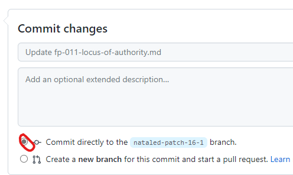

# How to change files in an existing pull request

## Using GitHub

Warning: You should only use this method if the files you are editing are reasonably small (less than 1 MB).

This method only works if the file you want to edit has already been editing as part of the pull request.

- Go to the pull request on GitHub, and click on the "Files Changed" tab up top
- Find the file you want to edit in the pull request.
- On the right, click on on the three `...`, and then "Edit file".

If this option is greyed out, it means that - you don't have edit rights on the repository - the edit was made from a different fork, and the person that created the pull request did not activate the "Allow maintainers to make edits" option when submitting the PR - the pull request has already been merged

- Do the edits, and then commit changes, usually to the same branch
  
