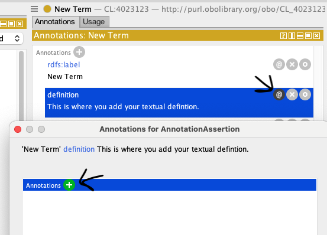

# Creating a New Ontology Term in Protege

1. To create a new term, the 'Asserted view' must be active (not the 'Inferred view').

2. In the Class hierarchy window, click on the 'Add subclass' button at the upper left of the window.


3. A pop-up window will appear asking you to enter the Name of the new term. When you enter the term name, you will see your ID automatically populate the IRI box. Once you have entered the term, click 'OK' to save the new term. You will see it appear in the class hierarchy.


4. In the annotation window add:
   1. Definition
      1. Click on the `+` next to Annotations
      2. Select defintion (if there are multiple, you should use IAO:0000115)
      3. Add the textual definition in the pop-up box.
      4. Click OK.


     2. Add Definition References
        1. Click on the circle with the ‘@’ in it next to definition and in the resulting pop-up click on the ```+``` to add a new ref, making sure they are properly formatted with a database abbreviation followed by a colon, followed by the text string or ID. Examples: ```PMID:27450630```.
        2. Click OK.
        3. Add each definition reference separately by clicking on the ```+``` sign.

 3. Add synonyms and dbxrefs following the same procedure if they are required for the term.

5. Add appropriate logical axioms in the Description by clicking the `+` sign in the appropriate section (usually SubClass Of) and typing it in, using `Tab` to autocomplete terms.


```
Converting to Equivalent To axioms:
If you want to convert your SubClassOf axioms to EquivalentTo axioms, you can select the appropriate rows and right click, selecting "Convert selected rows to defined class"
```

7. In some cases, logical axioms reuiqre external ontologies (eg in the above example, the newly added CL term has_soma_location in the cerebellar cortex which is an uberon term), it might be necessary to import the term in. For instructions on how to do this, please see the import managment section of your local ontology documentation (an example of that in CL can be found here: https://obophenotype.github.io/cell-ontology/odk-workflows/UpdateImports/)

8. When you have finished adding the term, run the reasoner to ensure that nothing is problematic with the axioms you have added (if there is an issue, you will see it being asserted under owl:Nothing)

9. Save the file on protege and review the changes you have made in your Github Desktop (or use `git diff` in your terminal if you do not use Github Desktop)

10. See [Daily Workflow](daily-curator-workflow.md) section for commit, push and merge instructions.
