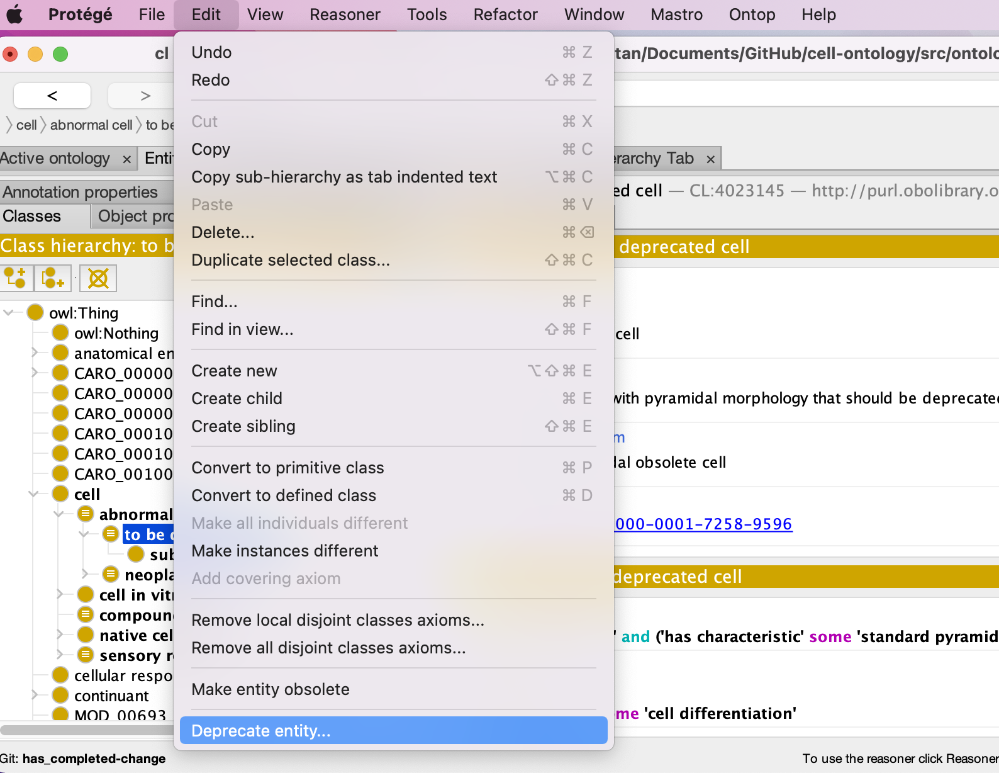
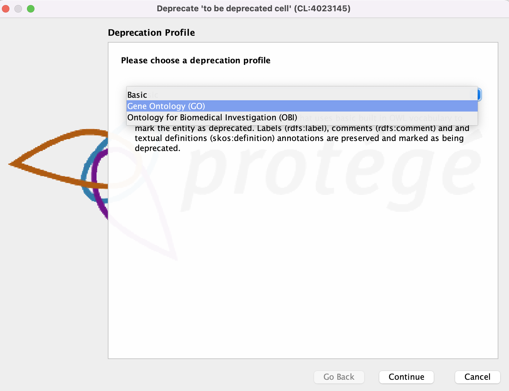
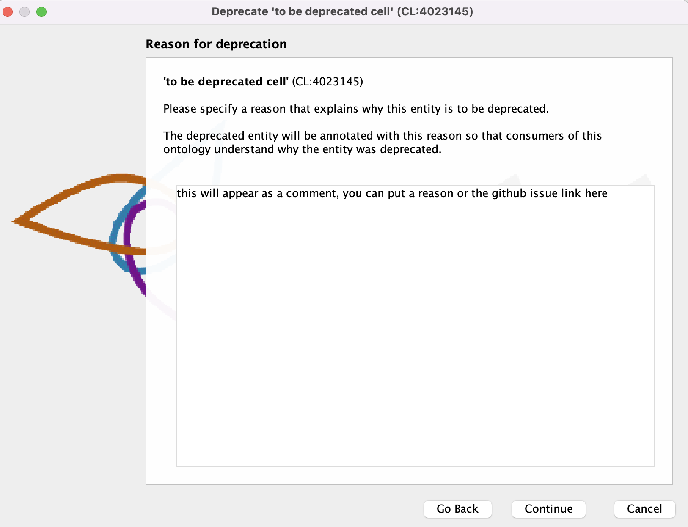
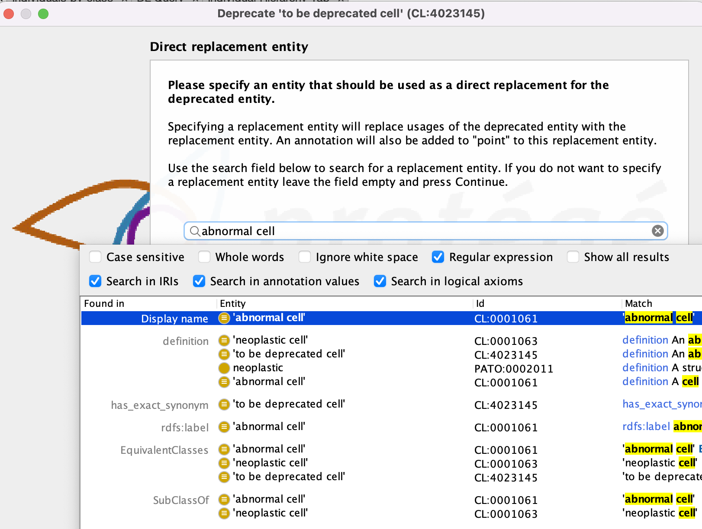

# Obsoleting an Existing Ontology Term

See [Daily Workflow](daily-curator-workflow.md) for creating branches and basic Protégé instructions.

Warning: Every ontology has their procedures on how they obsolete terms (eg notice periods, notification emails, to_be_obsolete tags, etc.), this how-to guide only serves as a guide on how obsolete a term directly on protege. 

### PRE OBSOLETION PROCESS (or basic obsoletion etiquette)
1. Check if the term (or any of its children) is being used for annotation: 
    - Go to your ontology browser of choice, search for the term, either by label or ID
    - See which other ontologies use the to be obsolete term
    - Notify affected groups (usually by adding an issue in their tracker)

2. Check if the term is used elsewhere in the ontology
    - In Protégé, navigate to the term to be obsolete and go to the 'Usage' tab to see if that ID is used elsewhere.
    - If the term is a parent to other terms or is used in logical definitions, make sure that another term replaces the obsolete term


### OBSOLETION PROCESS (Manual)

Warning: some ontologies give advance notice on terms that will be obsoleted through the annotation 'scheduled for obsoletion on or after' instead of directly obsoleting the term. Please check with the conventions of your ontology before obsoleting a term. 

1. Navigate to the term to be obsoleted.


2. Select Edit > Deprecate entity...



3. A deprecation wizard will pop up, in here, select GO style, and select continue (note this is specifc to GO style ontologies, if you are working with an OBI style ontology, there is an option for that too, if not use basic. For this how to, we will follow GO style)



4. Next, enter your reason for deprecation. For this, we advice for you to enter the github issue. (eg https://github.com/obophenotype/cell-ontology/issues/####) This will appear as a rdfs:comment



5. Next enter a replacement entity if there is one. This will automatically replace axioms in the ontology with the term, and add an 'item replaced by' axiom on the obsolete term.



6. Your obsolete term should now be stripped of its logical axioms and should look similar to the figure below. 


7. Add any additional annotations needed - this is specific to ontologies and you should consult the conventions of the ontology you are working on. 

Examples of additional annotations to add: 
- IAO:0000233 term tracker item - link to GitHub issue  
- has_obsolence_reason   
- add ‘OBSOLETE.’ to the term definition: In the 'Description' window, click on the ```o``` on the right-hand side of the definition entry. In the resulting window, in the Literal tab, at the beginning of the definition, type: ```OBSOLETE.```  
- if the obsoleted term was not replaced by another term in the ontology, but there are existing terms that might be appropriate for annotation, add those term IDs in the 'consider' tag: In the 'Annotations' window, select ```+``` to add an annotation. In the resulting menu, select ```consider``` and enter the ID of the replacement term.  

## Obsolete a class (using Protege 'Make entity obsolete' function)

1. Navigate to the term to be obsoleted.
1. In the Protege edit menu-> Make entity obsolete
1. Prepend the definition with OBSOLETE. For example, OBSOLETE. Chronic form of myeloproliferative neoplasm. 
1. Add a statement about why the term was made obsolete: In the 'Annotations' window, select ```+``` to add an annotation. In the resulting menu, select ```rdfs:comment``` and select Type:  ```Xsd:string```.
Consult the wiki documentation for suggestions on standard comments:
      
     - [http://wiki.geneontology.org/index.php/Curator_Guide:_Obsoletion](http://wiki.geneontology.org/index.php/Curator_Guide:_Obsoletion)
      
     - [http://wiki.geneontology.org/index.php/Obsoleting_GO_Terms](http://wiki.geneontology.org/index.php/Obsoleting_GO_Terms)
      
     - [http://wiki.geneontology.org/index.php/Editor_Guide](http://wiki.geneontology.org/index.php/Editor_Guide)
 
1. If the obsoleted term was replaced by another term in the ontology: In the 'Annotations' window, select ```+``` to add an annotation. In the resulting menu, select ```term replaced by``` and enter the ID of the replacement term.  
 
1. If the obsoleted term was not replaced by another term in the ontology, but there are existing terms that might be appropriate for annotation, add those term IDs in the 'consider' tag: In the 'Annotations' window, select ```+``` to add an annotation. In the resulting menu, select ```consider``` and enter the ID of the replacement term. 

1. Add any additional annotations needed - this is specific to ontologies and you should consult the conventions of the ontology you are working on. 

Examples of additional annotations to add: 
- IAO:0000233 term tracker item - link to GitHub issue
- has_obsolence_reason 

See [Daily Workflow](daily-curator-workflow.md) section for commit, push and merge instructions. 
