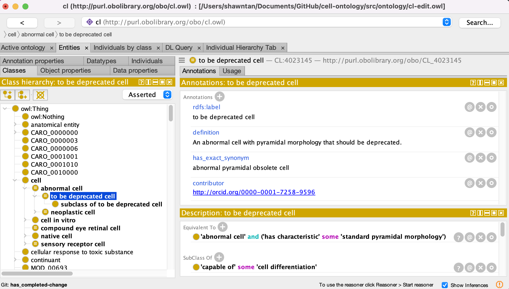

# Obsoleting an Existing Ontology Term

See [Daily Workflow](daily-curator-workflow.md) for creating branches and basic Protégé instructions.

Warning: Every ontology has their procedures on how they obsolete terms (eg notice periods, notification emails, to_be_obsolete tags, etc.), this how-to guide only serves as a guide on how obsolete a term directly on protege.

For instructions on how to **merge** terms (i.e., replace a term with another term in the ontology), see [instructions here](merge-terms.md).

### PRE OBSOLETION PROCESS (or basic obsoletion etiquette)

1. Check if the term (or any of its children) is being used for annotation:

   - Go to your ontology browser of choice, search for the term, either by label or ID
   - See which other ontologies use the to be obsolete term
   - Notify affected groups (usually by adding an issue in their tracker)

2. Check if the term is used elsewhere in the ontology
   - In Protégé, navigate to the term to be obsolete and go to the 'Usage' tab to see if that ID is used elsewhere.
   - If the term is a parent to other terms or is used in logical definitions, make sure that another term replaces the obsolete term

### OBSOLETION PROCESS (Manual)

Warning: some ontologies give advance notice on terms that will be obsoleted through the annotation 'scheduled for obsoletion on or after' instead of directly obsoleting the term. Please check with the conventions of your ontology before obsoleting a term.

1. Navigate to the term to be obsoleted.

2. Select Edit > Deprecate entity...

3. A deprecation wizard will pop up, in here, select GO style, and select continue (note this is specifc to GO style ontologies, if you are working with an OBI style ontology, there is an option for that too, if not use basic. For this how to, we will follow GO style)

4. Next, enter your reason for deprecation. For this, we advice for you to enter the github issue. (eg https://github.com/obophenotype/cell-ontology/issues/####) This will appear as a rdfs:comment

5. Next enter a replacement entity if there is one. This will automatically replace axioms in the ontology with the term, and add an 'item replaced by' axiom on the obsolete term.

6. Your obsolete term should now be stripped of its logical axioms and should look similar to the figure below.

7. Add any additional annotations needed - this is specific to ontologies and you should consult the conventions of the ontology you are working on.

Examples of additional annotations to add:

- [IAO:0000233](http://purl.obolibrary.org/obo/IAO_0000231) "term tracker item" (type xsd:anyURI) - link to GitHub issue

- [IAO:0000231](http://purl.obolibrary.org/obo/IAO_0000231) "has_obsolence_reason" (type: [IAO:0000225](http://purl.obolibrary.org/obo/IAO_0000225) "obsolescence reason specification") - its value should be an IRI taken from the table below

- add ‘OBSOLETE.’ to the term definition: In the 'Description' window, click on the `o` on the right-hand side of the definition entry. In the resulting window, in the Literal tab, at the beginning of the definition, type: `OBSOLETE.`

- if the obsoleted term was not replaced by another term in the ontology, but there are existing terms that might be appropriate for annotation, add those term IDs in the 'consider' tag: In the 'Annotations' window, select `+` to add an annotation. In the resulting menu, select `consider` and enter the ID of the replacement term.
  > **NOTE:** Here you have to add the ID of the entity as an `xsd:string`, e.g. GO:0005819, not the term label.

|IRI            |CURIE      |Label                  |Definition|Editor note    |
|---------------|-----------|-----------------------|----------|-------------- |
|obo:IAO_0000103|IAO:0000103|failed exploratory term|The term was used in an attempt to structure part of the ontology but in retrospect failed to do a good job|Terms created as placeholders with the expectation of being permanent should instead be deprecated using the "placeholder removed" (obo:IAO_0000226) justification.|
|obo:IAO_0000226|IAO:0000226|placeholder removed    |The term was created to temporarily stand in for a semantic purpose, but is no longer needed, typically due to another permanent term being defined.|This reason is appropriate for a temporary term even if no permanent term is defined; for example if the need for the term no longer exists. If a permanent (replacement) term is defined, the deprecated term should reference the replacement with IAO:0100001. If no replacement is defined, it may be appropriate to reference alternative terms with oboInOwl:consider.|
|obo:IAO_0000227|IAO:0000227|terms merged |The term has been combined with one or more other terms to create a more encompassing (merged) term.|The deprecated term should reference the merged term with obo:IAO_0100001. The replacement term should reference the original terms as sources using obo:RO_0001000 (derives_from). An editor note should explain what were the merged terms and the reason for the merge.|
|obo:IAO_0000228|IAO:0000228|term imported|The term has been replaced by a term imported from another ontology.|This is to be used when the original term has been replaced by a term imported from an other ontology. The deprecated term should reference the imported term with obo:IAO_0100001.|
|obo:IAO_0000229|IAO:0000229|term split   |The term has been split into two or more new terms.|This is to be used when a term has been split in two or more new terms. An editor note should indicate the reason for the split. The deprecated term should reference the replacement terms with obo:IAO_0100001.|
|obo:OMO_0001000|OMO:0001000|out of scope |The term was added to the ontology on the assumption it was in scope, but it turned out later that it was not.|This obsolesence reason should be used conservatively. Typical valid examples in disease ontologies are: unnecessary class grouping; mistaked creation of a disease associated to a phenotype.|

## Obsolete a class (using Protege 'Make entity obsolete' function)

1.  Navigate to the term to be obsoleted.
1.  In the Protege edit menu-> Make entity obsolete
1.  Prepend the definition with OBSOLETE. For example, OBSOLETE. Chronic form of myeloproliferative neoplasm.
1.  Add a statement about why the term was made obsolete: In the 'Annotations' window, select `+` to add an annotation. In the resulting menu, select `rdfs:comment` and select Type: `Xsd:string`.
    Consult the wiki documentation for suggestions on standard comments:

         - [http://wiki.geneontology.org/index.php/Curator_Guide:_Obsoletion](http://wiki.geneontology.org/index.php/Curator_Guide:_Obsoletion)

         - [http://wiki.geneontology.org/index.php/Obsoleting_GO_Terms](http://wiki.geneontology.org/index.php/Obsoleting_GO_Terms)

         - [http://wiki.geneontology.org/index.php/Editor_Guide](http://wiki.geneontology.org/index.php/Editor_Guide)

1.  If the obsoleted term was replaced by another term in the ontology: In the 'Annotations' window, select `+` to add an annotation. In the resulting menu, select `term replaced by` and enter the ID of the replacement term.

1.  If the obsoleted term was not replaced by another term in the ontology, but there are existing terms that might be appropriate for annotation, add those term IDs in the 'consider' tag: In the 'Annotations' window, select `+` to add an annotation. In the resulting menu, select `consider` and enter the ID of the replacement term.

    > **NOTE:** Here you have to add the ID of the entity as an `xsd:string`, e.g. GO:0005819, not the term label.

1.  Add any additional annotations needed - this is specific to ontologies and you should consult the conventions of the ontology you are working on.

Examples of additional annotations to add:

- IAO:0000233 term tracker item (type xsd:anyURI) - link to GitHub issue
- has_obsolence_reason

See [Daily Workflow](daily-curator-workflow.md) section for commit, push and merge instructions.
