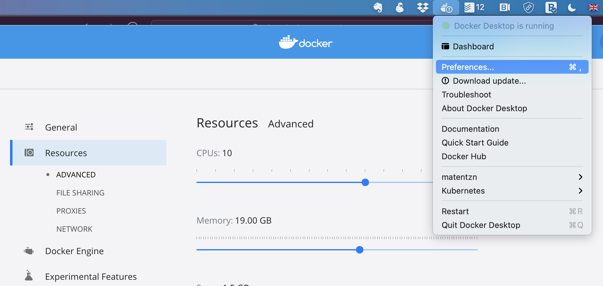

# Getting set up with Docker and the Ontology Development Kit

## Installing Docker

[Docker](https://www.docker.com/) is the primary supported tool to use the ODK
images (other containerization platforms are also supported, such as
[Singularity](https://docs.sylabs.io/guides/latest/user-guide/#) and – on
macOS only – [Apple Container](https://github.com/apple/container), but they
will not be covered here). Therefore, installing Docker is a pre-requisite
before any work can be done with the ODK.

### On GNU/Linux

Docker should be available in the package repositories of most GNU/Linux
distributions, though the name under which it is available may vary from one
distribution to another. On Debian for example, it is known as `docker.io`; on
Fedora, it is known as `moby-engine`.

You will need to ensure that the docker daemon is running whenever you wish to
use the ODK. Most likely, the package of your distribution will have taken
care of adding the daemon to the list of services that are automatically
started at boot time; if not, check the documentation of your distribution to
know how to do that.

As a last resort, should Docker _not_ be available for your distribution, it
can be built from the source code provided by the [Moby
project](https://github.com/moby/moby), though doing so is way out of scope
for this document.

### On macOS

Install [Docker Desktop](https://www.docker.com/products/docker-desktop/).
Make sure to start the application whenever you need to use the ODK. You do
_not_ need to have a Docker account and to sign in when starting the
application, though you can do so if you want.

### On Windows

- Follow the instructions
  [here](https://hub.docker.com/editions/community/docker-ce-desktop-windows).
  Note that you should have Windows 10 Professional installed for this to
  work.  We are not sure Docker Desktop works at all with Windows 10 Home, but
  we have not tried in a while. If you know what you are doing, you could try
  to configure Docker toolbox, but we have had many issues with it, and do not
  recommend it unless absolutely necessary.
    - If you are unable to install Docker Desktop on your Windows PC (e.g. no
      admin rights or prohibited by the IT department of your institution) but
      you have the ability to use the Windows
      [Hyper-V-Manager](https://adamtheautomator.com/hyper-v-windows-10/)
      (possible [w/o admin rights](https://www.ibm.com/docs/en/capm?topic=cmhvm-adding-non-administrator-user-in-hyper-v-administrator-users-group))
      or another virtualization tool, such as
      [VirtualBox](https://www.virtualbox.org/), you could set up a Linux
      virtual machine (VM) to use ODK. We recommend using
      [Lubuntu](https://lubuntu.me/), as it won't need much computing
      resources. Although you cannot install Docker Desktop in such a VM, you
      can [install the Docker Engine](https://docs.docker.com/engine/install/ubuntu/#install-using-the-repository),
      which suffices to proceed with the next step.
    - A much more convenient way to use a virtual Linux environment (with
      admin rights) is via the Windows Linux Subsystem (WSL) in Windows 10 and
      above.
      [Installing it](https://learn.microsoft.com/en-us/windows/wsl/install) and the
      [Docker Engine](https://docs.docker.com/engine/install/ubuntu/#nstall-using-the-repository)
      will allow you to use ODK in a Linux shell environment, while working
      with Protégé, GitHub Desktop and other possibly helpful apps like
      PyCharm, in your regular Windows GUI environment.

### Checking Docker installation

Try running the following command in a terminal:

```console
$ docker images
```

If you get an error about a “command not found” or similar, then Docker has
_not_ been installed properly.

If you get an error about being “unable to connect to the Docker daemon”, then
Docker has been installed but in all likelihood the Docker daemon is not
running: on macOS and Windows, make sure to launch the Docker Desktop
application and try again; on GNU/Linux, check the documentation of your
distribution to know how to start the daemon.

If you get a line that looks like this (exact column headers may vary
depending on the version of Docker you have installed):

```
IMAGE   ID             DISK USAGE   CONTENT SIZE   EXTRA
```

then Docker is up and running and you are ready to proceed to the next step.

## Downloading the ODK image(s)

Run the following command:

```console
$ docker pull obolibrary/odkfull
```

This will download the _ODKFull_ ODK image – this may take a while, depending
on your Internet connection, but this only needs to be done once until a new
version of the ODK is released.

If you are not planning to use any custom workflow in your ODK-managed
repositories, you may download the _ODKLite_ image instead, which is
(slightly) smaller as it contains a smaller set of tools than _ODKFull_:

```console
$ docker pull obolibrary/odklite
```

<a id="odkrunner"></a>
## Installing the ODK Runner

Executing anything in a Docker container can quickly be cumbersome, because
the `docker run` command requires quite a few parameters that must be set
correctly. To make things easier, the recommended way to use the ODK image is
to use a small helper tool called the [ODK Runner](https://github.com/INCATools/odkrunner).

### On GNU/Linux

Download the binary [here](https://github.com/INCATools/odkrunner/releases/latest/download/odkrun-linux),
rename it to `odkrun` into a directory that is in your system’s `PATH`, and
make sure it is executable. For example:

```console
$ curl -L -O https://github.com/INCATools/odkrunner/releases/latest/download/odkrun-linux
$ sudo mv odkrun-linux /usr/local/bin/odkrun
$ sudo chmod 0755 /usr/local/bin/odkrun
```

(If you have a per-user directory that is listed in your `PATH`, such as
`$HOME/.local/bin`, you may install the command there instead.)

### On macOS

Use the same method as for GNU/Linux above, just make sure to download the
macOS binary (note that the same binary will work on both Intel and Apple
Silicon machines):

```console
$ curl -L -O https://github.com/INCATools/odkrunner/releases/latest/download/odkrun-macos
$ sudo mv odkrun-macos /usr/local/bin/odkrun
$ sudo chmod 0755 /usr/local/bin/odkrun
```

### On Windows

Download the binary [here](https://github.com/INCATools/odkrunner/releases/latest/download/odkrun.exe)
and put it into a directory that is in your system’s `PATH`.

Unfortunately, as far as the author of those lines knows, Windows does _not_
have a pre-made directory already in the `PATH`, intended for custom
executable programs (akin to GNU/Linux and macOS’ `/usr/local/bin` directory),
so you are going to have to make one (we do _not_ recommend putting the ODK
Runner binary directly under `C:\Windows\System32`, though that is a
possibility).

Create a `AppData\Local\bin` directory in your home’s directory and download the
runner into that directory:

```console
mkdir "%USERPROFILE%\AppData\Local\bin"
curl -L -o "%USERPROFILE%\AppData\Local\bin\odkrun.exe" https://github.com/INCATools/odkrunner/releases/latest/download/odkrun.exe
```

Now you need to add `%USERPROFILE%\AppData\Local\bin` to your user account’s
`PATH`. See [this discussion on StackOverflow](https://stackoverflow.com/questions/44272416/add-a-folder-to-the-path-environment-variable-in-windows-10-with-screenshots), for an
illustrated procedure to do that.

### Checking that the ODK Runner is properly installed

After following the procedure above that is appropriate for your operating
systems, you should be able to call the `odkrun` command from any terminal
regardless of what your current directory.

Check that by running:

```console
odkrun --version
```

You should get a message like this (version number may vary):

```
odkrun 0.5.0
Copyright (c) 2026 Damien Goutte-Gattat

This program is released under the 3-clause BSD license.
See the COPYING file for more details.
```

If you don’t, go back to the procedure above. Maybe check that your `PATH`
variable does include the directory where you put the `odkrun` file (`echo
$PATH` on GNU/Linux and macOS; `echo %PATH% on Windows).

<a id="odkrunner-alternatives"></a>
### Alternatives to the ODK Runner

If for some reason the ODK Runner cannot be used, wrapper scripts around the
`docker run` command are also available:

- for GNU/Linux and macOS: [odk.sh](../resources/odk.sh);
- for Windows: [odk.bat](../resources/odk.bat)

Download the script for your system and place it in the directory where you
intend to work with the ODK. Invoke the script with `sh odk.sh` (GNU/Linux,
macOS) or `odk.bat` (Windows).

For the specific purpose of seeding a new ODK-managed repository, dedicated
wrapper scripts are also available:

- for GNU/Linux and macOS: [seed-via-docker.sh](https://github.com/INCATools/ontology-development-kit/releases/latest/download/seed-via-docker.sh)
- for Windows: [seed-via-docker.bat](https://github.com/INCATools/ontology-development-kit/releases/latest/download/seed-via-docker.bat)

## Memory settings

One of the most frequent problems with running the ODK for the first time is
failure because of lack of memory.

There are two different settings involved:

- How much memory is your Docker installation allowed to use. This is a hard
  upper bound limit – no process running within a Docker will be able to use
  more than the maximal amount of memory that Docker is configured with.
- How much memory are Java applications (especially ROBOT) within the
  container allowed to use.

The first setting is configured in Docker’s preferences. With Docker Desktop
(macOS, Windows), this is done in the _Preferences_ dialog, tab _Resources_,
subtab _Advanced_) (see picture below).



On GNU/Linux, on a typical Docker installation the docker daemon is _not_
constrained and can use as much memory as is available on the machine. If you
do run into memory issues, check the documentation provided with your
distribution about possible distribution-specific constraints.

When using the ODK Runner, the second setting is automatically set to up to
90% of the memory allocated to Docker, and so users should not normally have
to worry about it.

When using a wrapper script such as those mentioned above, you may need to
edit the wrapper script to set the required maximal amount of memory in the
`ROBOT_JAVA_ARGS` and `JAVA_OPTS` options (one of the reasons why using such
wrappers is discouraged in favour of using the ODK Runner).

### More intelligent pipeline design

If your problem is that you do not have enough memory on your machine, the
only solution is to try to engineer the pipelines a bit more intelligently,
but even that has limits: large ontologies require a lot of memory to process
when using ROBOT. For example, handling ncbitaxon as an import in any
meaningful way easily consumes up to 12GB alone. Here are some tricks you may
want to contemplate to reduce memory:

- `robot query` uses an entirely different framework for representing the
  ontology, which means that whenever you use ROBOT query, for at least a
  short moment, you will have the entire ontology in memory _twice_. Sometimes
  you can optimse memory by seperating `query` and other `robot` commands into
  seperate commands (i.e. not chained in the same `robot` command).
- The `robot reason` command consumes _a lot_ of memory. `reduce` and
  `materialise` potentially even more. Use these only ever in the last
  possible moment in a pipeline.
