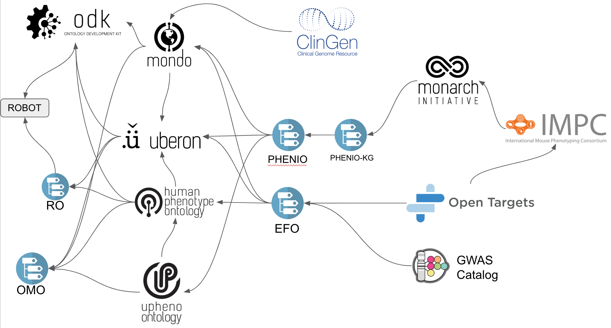
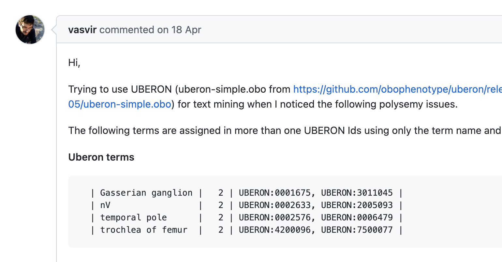
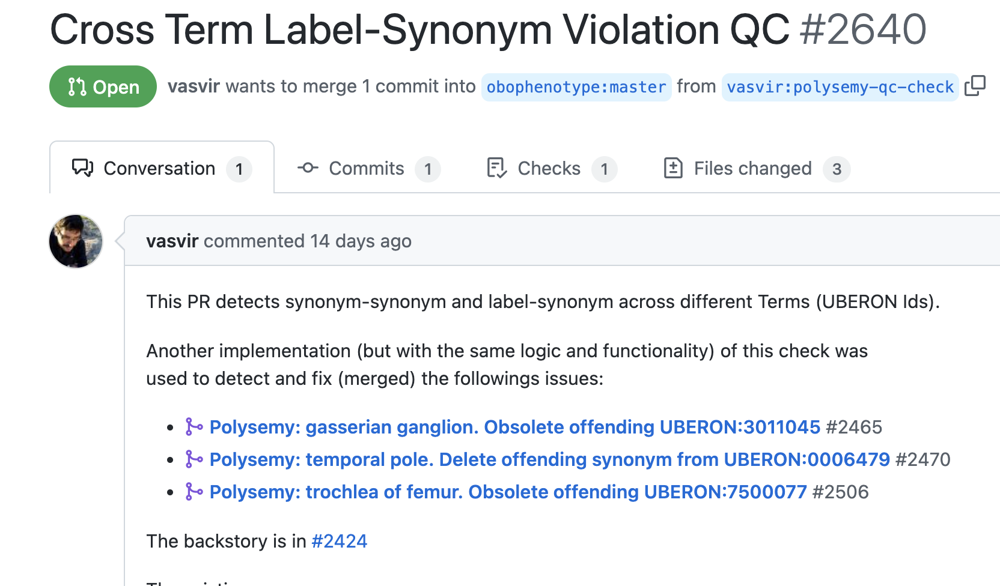

# How to be an Open Science Engineer - maximising impact for a better world

*Contributors*:

- [Nicole Vasilevsky](https://orcid.org/0000-0001-5208-3432)
- [Nicolas Matentzoglu](https://orcid.org/0000-0002-7356-1779)
- [Bradley Varner](https://github.com/bvarner-ebi)

*Status*: This is a working document! Feel free to add more content!

> The Open Science Engineer contributes to the collection and standardisation of publicly available scientific knowledge through curation, community-building and data, ontology and software engineering.

Open Science and all its sub-divisions, including Open Data and Open Ontologies, are central to tackling global challenges from rare disease to climate change. Open licenses are only part of the answer - the really tough part is the standardisation of data (including the unification of ontologies, the FAIRification of data and adoption of common semantic data models) and the organisation of a global, fully decentralised community of Open Science engineers. Here, we will discuss some basic principles on how we can maximise our impact as members of a global community combating the issues of our time:

1. Principle of **Collaboration**: How do we create a welcoming and inclusive environment for implementing social workflows and deepen our ties across project boundaries?
1. Principle of **Upstream Fixing**: How can we maximise benefits to the global community by pushing fixes as far upstream as possible?
1. Principle of **No-ownership**: How do we develop a sense of co-, or -no, ownership for community driven ontologies and ontology tools?

We discuss how to best utilise social workflows to achieve positive impact. We will try to convince you that building a close collaborative international community by spending time on submitting and answering issues on GitHub, helping on Stack Overflow and other online platforms, or just reaching out and donating small amounts of time to other open science efforts can make a huge difference.

## Table of contents

- [TLDR - Summary](#tldr)
- [Principle of Collaboration](#collaboration)
- [Principle of Upstream fixing](#upstream)
- [Principle of No-ownership](#noownership)

## Principle of Collaboration

The heart and soul of a successful Open Science culture is collaboration. The relative isolation into which many projects are forced due to limitations imposed by certain kinds of funding makes it even more important to develop effective social, collaborative workflows. This involve effective online communication, vocal appreciation (likes, upvotes, comments), documentation and open-ness.

### Question answering and documentation

1. When you find an answer on [Stack Overflow](https://stackoverflow.com/questions/22338900/prot%c3%a9g%c3%a9-how-can-i-rename-an-object-property), GitHub issues (or even [Hacker News](https://news.ycombinator.com/)) that helps you, **upvote it**. It cannot be stressed enough how important this is to let good answers float up to the top (become more visible), and recognise the time and energy people spend formulating answers. If you do not have a Stack Overflow account, [make one now](https://stackoverflow.com/users/login?ssrc=head&returnurl=https%3a%2f%2fstackoverflow.com%2f).
1. If you cannot find an answer to a question on GitHub or Stack Overflow, and you figure out a solution consider **asking the question and answering it yourself!** Consider this: if you provide an answer that will result in only 6 open science people spending one hour less solving a problem (a conservative estimate), you saved the taxpayer 6 hours of salary (not to speak of improving the quality of the solutions)!
1. Answer questions on GitHub issues even when on trackers not in your purview. People often falsely assume that they should not try to answer queries in an open source project that they are not directly involved with. This is wrong! Open source developers highly (!) appreciate it when you chip in on answering queries, from dealing with errors and exceptions to "How do I?" kind of queries. **Get involved on other peoples issue trackers**!
1. Before asking questions on slack or issue trackers, **always do a basic search first**. Consider (1) the project's documentation, (2) open _and closed_ issues on the issue tracker of the project your query is related to. If you do not find the information you need try and craft questions that are concise yet give sufficient context. To enable future users to find these answers, consider using the issue tracker instead of slack! Also it is important to remember that the people that answer your questions have to spend time they could have spend on other Open Science work!
1. Make yourself responsible for **continuously improving open science documentation**. If a question was answered on slack or in an issue, consider a 10 minute detour to update the documentation of the project to reflect the solution if you think it could be helpful. This is the only way to scale Open Science projects: *as the user base increases, providing support on a 1:1 basis will soon be infeasible*.
1. Good documentation is as important as good quality code, and everyone can help out, even if it is "only" about formatting, typos and adding additional links!

#### Social Conduct and review

1. **Be overly generous with likes**. Being a Open Science Engineer can be quite a lonely affair: hundreds of unanswered issues and questions, pull requests that remain un-reviewed for months, projects for which you never really get credit (want to be a QC engineer, anyone?). Even if you do not have time to respond to all issues you scroll through in a day, *add a like if you find an answer useful*. This goes for slack comments, Tweets and *random Pull Requests you have nothing to do with* as well. And, perhaps most importantly **star all GitHub repos** that are useful to you (you could, for example, scroll through [https://github.com/topics/obofoundry](https://github.com/topics/obofoundry) and star all ontologies and ontology projects useful in your work)! This is a *huge deal* as it significantly **motivates other OSEs** and therefore provides fuel to the Open Science movement.
1. **Reduce work for others as much as possible by communicating clearly.**
    - Take the time to write clear responses with just the right amount of detail. The goal of your communication is to get the point across as swiftly as possible, and misunderstandings are a huge time killer.
    - Again: Sloppy, quick responses can cause more work than *not responding at all*!
    - Use bullet lists to structure your response, and checklists for action items.
    - Hide unnecessary details with `
` tag: `

[click arrow to expand]
`. See [example here](https://github.com/OBOFoundry/OBOFoundry.github.io/pull/1978#issuecomment-1183176682)
    - Be generous linking external issues to provide context. Example:
    
1. **Be positive and generous with gratitude and attribution**
    - If a member of the community opens an issue, *always thank them* for the issue right away. We need to encourage people to open issues.
    - Don't let issues linger without any response. It is better to respond with a thank you and some instructions for the issuer on what to do to fix the issue themselves than to let it linger. We need our stakeholders to be more involved - first time issuers are especially vulnerable and may not bother to come back if they are ignored.
    - When giving feedback, be positive, friendly and constructive.
    - **Show appreciation**: thank users for issues and thank a PR reviewer for their review. Always.
    - **Attribute, attribute, attribute**. If someone helped you sort something out emphasise this publicly!

#### Openness

1. **Promote truly open communication:**
    - Contribute your thoughts openly so other people can benefit from it.
    - Don't put issues on Slack where the public can't see it. Consider moving interesting discussions on Slack into a more public space, like GitHub discussions.
    - Create public tickets which can be searched and referred to later.

## Principle of Upstream Fixing

Maximising impact of your changes is by **far the best way you can benefit society** as an Open Science Engineer. Open Science projects are a web of mutually dependent efforts, for example:

* Ontologies re-use terms and axioms from other ontologies  
* Software packages provide functionality that help building Knowledge Graphs, ensuring the quality of ontology releases and extract new insights from existing knowledge and scientific facts.  
* Projects use ontologies for indexing data and making them discoverable.  

The **key to maximising your impact is to push any fixes as far upstream as possible**. Consider the following projects and the way they depend on each other (note that this is a gross simplification for illustration; in reality the number of dependencies is much higher):

Let's think of the following (entirely fabricated) scenario based on the image above.

1. [Open Targets](https://platform.opentargets.org) provides [evidence for a gene association with some disease](https://platform.opentargets.org/evidence/ENSG00000011143/Orphanet_93334).
1. This association is only supported by the [IMPC](https://www.mousephenotype.org/) data source which associates mouse and human phenotypes using the [phenodigm algorithm](https://www.mousephenotype.org/help/data-analysis/disease-associations/) which is based on semantic similarity.
1. The semantic similarity scores are computed using cross-species axioms provided by the [Monarch Initiative](https://monarchinitiative.org/), especially [uPheno](https://ols.monarchinitiative.org/ontologies/upheno2).
1. The cross-species logical axioms provided by Monarch depend on a range of lexical and logical approaches. This means the structure of uPheno is directly influenced by the naming and synonyms provided by species specific phenotype ontologies (SSPOs), such as the [Human Phenotype Ontology (HPO)](https://hpo.jax.org).

It is, therefore, possible that:

1. A faulty synonym is accidentally added to the HPO...
1. ...which causes a faulty logical axiom candidate in uPheno (again missed by QC measures)...
1. ...which causes a faulty similarity value in Monarch...
1. ...which causes a wrong disease-gene association in IMPC...
1. ...which ultimately leads to a faulty piece of evidence in Open Targets.

Imagine a user of Open Targets that sees this evidence, and reports it to Open Targets as a bug. Open Targets could take the easy way out: remove the erroneous record from the database permanently. This means that the IMPC (itself with hundreds of dependent users and tools), Monarch (again with many dependents), uPheno and HPO (with probably thousands of dependents) would still carry forward that (tiny) mistake. 
This is the basic idea of maximising impact through *Upstream Fixing*: **The higher up-stream (up the dependency graph) an error is fixed, the more cumulative benefit there is to a huge ecosystem of tools and services**.

An even better fix would be to have each fix to the ontology result in a new, shared quality control test. For example, some errors (duplicate labels, missing definition, etc) can be caught by automated testing. Here is a cool story.

### Case Study: External contribution and upstream fixing

- Over time, we have developed QC checks that ensure that the same exact synonym cannot be shared between two classes. However the checks where not perfect..
- `@vasvir` (GitHub name), a member of the global community reached out to us on Uberon: https://github.com/obophenotype/uberon/issues/2424.
    
[https://github.com/obophenotype/uberon/pull/2640](https://github.com/obophenotype/uberon/pull/2640)
- Instead of fixing the discovered issue by ourselves, we invited @vasvir to fix the issues himself. We gave him some instructions on how to proceed, leading not only to [eight new pull requests](https://github.com/obophenotype/uberon/pulls?q=is%3Apr+author%3Avasvir+), but also an entirely new [Quality Control check](https://github.com/obophenotype/uberon/pull/2640) that augments the existing checks with case-insensitivity (`Gasserian ganglion` and `gasserian ganglion` where previously considered distinct). Note: before the PRs, @vasvir did not _speak any SPARQL_.
    
- Members of our team helped @vasvir to see his first pull requests through by instructing them how to use the technology (robot, ODK, docker, SPARQL), and follow our pull request conventions.

**Instead of simply deleting the synonyms for his NLP projects, `@vasvir` instead decided to report the issues straight to the source.** This way, hundreds, if not thousands of projects will directly or indirectly benefit from him!

### Other examples of upstream fixing

**Example 1**: While curating Mondo, Nicole identified issues relevant to Orphanet and created this [issue](https://github.com/Orphanet/ORDO/issues/31).

**Example 2**: There is overlap between Mondo and Human Phenotype Ontology and the Mondo and HPO curators tag each other on relevant tickets.

**Example 3**: In Mondo, if new classifications are made, Mondo curators report this back to the source ontology to see if they would like to follow our classification.

### Conclusions: Upstream Fixing

Have you ever wondered how much impact changing a synonym from `exact` to `related` could have? Or the addition of a precise mapping? The fixing of a typo in a label? It can be huge. And this does not only relate to ontologies, this goes for tool development as well. We tend to *work around bugs* when we are building software. Instead, or at least in addition to, we should always report the bug at the source to make sure it gets fixed eventually.

## Principle of No-ownership

Many of the resources we develop are financed by grants. Grants are financed in the end by the taxpayer. While it is occasionally appropriate to protect open work with creative licenses, it rarely makes sense to restrict access to Open Ontologies work - neither to commercial nor research exploitation (we may want to insist on appropriate attribution to satisfy our grant developers).

On the other side there is always the risk of well-funded commercial endeavours simply "absorbing" our work - and then tying stakeholders into their closed, commercial ecosystem. However, this is not our concern. We cannot really call it stealing if it is not really ours to begin with! Instead of trying to prevent unwanted commercialisation and closing, it is better to work with corporations in pre-competitive schemes such as [Pistoia Alliance](https://www.pistoiaalliance.org/) or [Allotrope Foundation](https://www.allotrope.org/) and lobby for more openness. (Also, grant authorities should probably not allow linking scientific data to less than totally open controlled vocabularies.)

Here, we invite you to embrace the idea that ontologies and many of the tools we develop are actually *community-driven*, with no particular "owners" and "decision makers". While we are not yet there (we don't have sufficiently mature governance workflows for full fledged onto-communism), and most ontologies are still "owned" by an organisation that provides a major source of funding, we invite you to think of this as a preliminary state. It is better to embrace the idea of "No-ownership" and figure out social workflows and governance processes that can handle the problems of decision making.

### Take responsibility for your community (ontologies)

1. Ensure that you *see your issues and pull requests through to the end*. No one will do this for you. Remember - contributors to open source projects, especially ontologies, have their own agendas, and do not automatically care about other peoples work.
1. Feel empowered to **nudge reviewers** or experts to help. Get that issue answered and PR merged whatever it takes!

    *Example*: After waiting for the PR to be reviewed, Meghan kindly asked Nicole if she should find a different reviewer.
    
1. Find **review buddies**. For every ontology you seek to contribute to **pair up with someone** who will review your pull requests and you will review their pull requests. Sometimes, it is very difficult to get _anyone_ to review your pull request. Reach out to people directly, and form an alliance for review. It is fun, and you learn new things (and get to know new people!).
1. Be **proactive**  

    - Problem of decentralization and lack of hierarchial organisation needs *proactive and brave* decision makers.  
    - No one will do your work for you. See your pull requests and issues through all the way to the release!  
    - Learn the tools necessary to make basic fixes - just try it/do it.  
    - Always have your index finger on the *Edit* button when reading documentation. There is always something to fix, including typos and content.  
    

### Reduce your fear of "breaking the ontology".

1. Most of our ontologies have many checks in place, and GitHub has version control. Nothing has ever been broken to the point where it can't be fixed. (Remember to work on a branch!)  
    Example: The QC checks on [this PR](https://github.com/monarch-initiative/mondo/pull/5266) failed 6 times before it passed.
    
1. Perfect is the enemy of good enough.  
1. **It's okay if your PR is rejected**. Mentally, prepare yourself for having the PR rejected. This is fine - the community always looks to the best possible way to change the ontology. The next PR will be accepted!  
1. If you make a mistake, and it is pointed out during pull request review, *consider adding an appropriate QC check* to prevent the issue from happening again. And who knows - maybe you have an opportunity to fix past mistakes!  

### TLDR - Summary

- [Principle of Collaboration](#collaboration)
    - Upvote answers, on [Stack Overflow](https://stackoverflow.com/), GitHub and any other open communication platform.
    - Get involved on other peoples issue trackers.
    - Always do a basic search before asking.
    - Continuously improve Open Science documentation.
    - Be overly generous with likes.
    - Always strive to reduce work for other members of the community.
    - Be positive and generous with gratitude and attribution.
    - Promote open communication (less slack, more GitHub).
- [Principle of Upstream fixing](#upstream)
    - The key to maximising your impact is to push any fixes as far upstream as possible.
    - When you experience a problem, always report it to the immediate source. If you can report it as high upstream as possible.
    - In a perfect world, provide a fix in the form of a pull request.
- [Principle of No-ownership](#noownership)
    - See your issues and pull requests through to the end (dont drop the ball, no one will do your work for you)
    - Feel empowered to nudge reviewers until they tell you not to.
    - Find review buddies (this is really helpful to organise community work).
    - Be proactive... and brave.
    - Reduce your fear of breaking the ontology.
    - Reduce your fear of getting a pull request rejected.
    - Reduce other peoples fear of breaking the ontology by adding additional QC checks.

