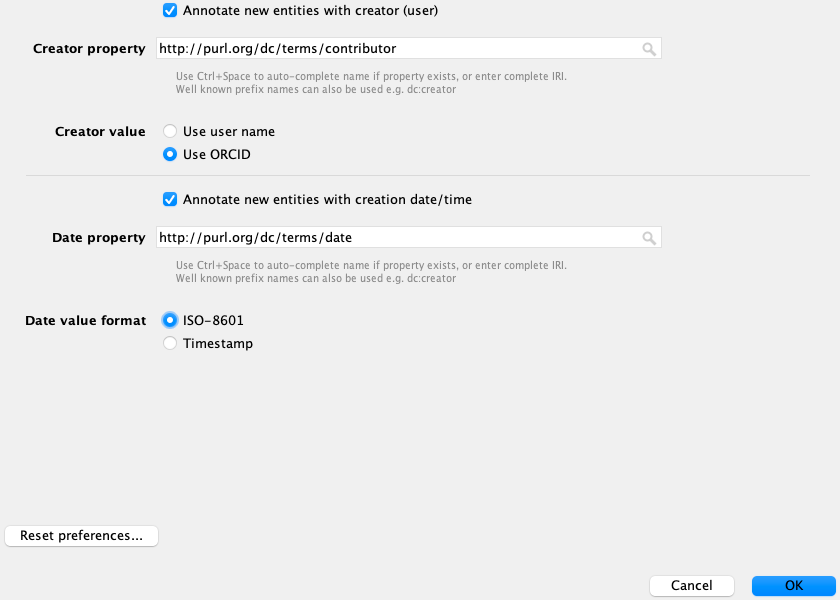

# Contributing to OBO ontologies

## Prerequisites
Participants will need to have access to the following resources and tools prior to the training:  
- **GitHub account** - register for a free GitHub account [here](https://github.com/join?ref_cta=Sign+up&ref_loc=header+logged+out&ref_page=%2F&source=header-home)  
- **Protege** - Install Protege 5.5, download it [here](https://protege.stanford.edu/)  
- **[Install ELK 0.5](../howto/installing-elk-in-protege.md)**   
- **Install GitHub Desktop** Please make sure you have some kind of git client installed on your machine. If you are new to Git, please install [GitHub Desktop](https://desktop.github.com/)  

## Preparation
- Review tutorial on [Ontology Term Use](ontology-term-use.md)

## What is delivered as part of the course

**Description:** How to contribute terms to existing ontologies.

### Learning objectives
- How to use GitHub
  - [GitHub workflows](#gh-workflows)
  - [Branch vs Fork](#branch)
  - [How to create GitHub Issues](#issues)
- [Understand basic Open Source etiquette](#etiquette)
- [Reading READMEs](readme)
- [Understand basics of ontology development workflows](#workflow)
  - [Browsing and Searching in Protege](#browsing)
  - [Add new terms to an ontology](#add)
      - [Initial Protege setup](#setup)
      - [Protege editing](#editing)
      - [The Class description view](#class-description)
- [Use GitHub: make pull requests](#pr)
- [Understand ontology design patterns](#pattern)
- [Use templates: ROBOT, DOSDP](template) (_under development_)
- [Basics of OWL](owl)
  - [Logic and debugging](#logic)

## Tutorials
- N/A

## Additional materials and resources

## Contributors
- [Nicole Vasilevsky](https://orcid.org/0000-0001-5208-3432)
- [Rebecca Jackson](https://orcid.org/0000-0003-4871-5569)
- [Melissa Haendel](https://orcid.org/0000-0001-9114-8737)
- [Chris Mungall](https://orcid.org/0000-0002-6601-2165)
- [David Osumi-Sutherland](https://orcid.org/0000-0002-7073-9172)
- Matt Yoder
- [Carlo Torniai](https://orcid.org/0000-0002-3734-1859)
- [Simon Jupp](https://orcid.org/0000-0002-0643-3144)

## Use GitHub

 
### GitHub workflows

GitHub - distributed version control (Git) + social media for geeks who like to build code/documented collaboratively.

A Git repo consists of a set of branches each with a complete history of all changes ever made to the files and directories. This is true for a local copy you check out to your computer from GitHub or for a copy (fork) you make on GitHub.

A Git repo typically has a master or main branch that is not directly editing.  Changes are made by creating a branch from Master (complete copy of the Master + its history).  

 
### Branch vs Fork

You can copy (fork) any GitHub repo to some other location on GitHub without having to ask permission from the owners.  If you modify some files in that repo, e.g. to fix a bug in some code, or a typo in a document, you can then suggest to the owners (via a Pull Request) that they adopt (merge) you your changes back into their repo.

If you have permission from the owners, you can instead make a new branch. For this training, we gave you access to the repository. See the [Appendix](../howto/github-create-fork.md) for instructions on how to make a fork.

 
### Create GitHub Issues

1. Go to GitHub tracker for the ontology where you'd like to create an issue
1. Select New issue
1. Pick appropriate template (if applicable)
1. Fill in the information that is requested on the template below each header
1. For a new term request, please include:
	1. The parent ID and label
	2. A definition in the proper format
	3. Sources/cross references for synonyms
	4. Your ORCID
	5. Add any additional comments at the end
1. If you are requesting changes to an existing term, include as much information as possible, including the term ID and label.
1. If you use a template, an ontology curator may automatically be assigned.

**Tip**: you can easily obtain term metadata like OBO ID, IRI, or the term label by clicking the three lines above the Annotations box (next to the term name) in Protege, see screenshot below. You can also copy the IRI in markdown, which is really convenient for pasting into GitHub.

#### Video Explanation

See this example video on creating a new term request to the Mondo Disease Ontology:

<iframe width="560" height="315" src="https://www.youtube.com/embed/0dAlVTYGRf0" title="YouTube video player" frameborder="0" allow="accelerometer; autoplay; clipboard-write; encrypted-media; gyroscope; picture-in-picture" allowfullscreen></iframe>

 
## Basic Open Source etiquette

- Keep in mind that open source ontology repositories on GitHub are public and open to all. 
- Be respectful in your requests and comments.
- Do not include any private information.
- GitHub sends notifications to your email, and you can respond via your email client. Keep in mind, the responses are posted publicly. Be sure to delete your email signature that includes any personal information, like your email address or phone number.
- Many ontologies have limited resources and personnel for development and maintenance. Please be patient with your requests.
- If your ticket/request has been unanswered for a long period of time, feel free to kindly check in by commenting on the ticket. 
- Including a deadline or priority on the ticket can help the ontology curators with triaging tickets. 

 
## Reading READMEs

A README is a text file that introduces and explains a project. It is intended for _everyone_, not just the software or ontology developers. Ideally, the README file will include detailed information about the ontology, how to get started with using any of the files, license information and other details. The README is usually on the front page of the GitHub repository.

 
## Basics of ontology development workflows

### Ontology development workflows

The steps below describe how to make changes to an ontology.

1. Go to the GitHub repository for your ontology, and clone the repository. The example below describes how to clone the Mondo Disease Ontology repo, but this can be applied to any ontology that is stored in GitHub.

#### Clone the Mondo repo

1.  Open the [Mondo GitHub repository](https://github.com/monarch-initiative/mondo)
2.  Click Code

 

3. Click 'Open with GitHub Desktop'

4. You will be given an option as to where to save the repository. I have a folder called 'git' where I save all of my local repos.
5. This will open GitHub Desktop and the repo should start downloading. This could take some time depending on how big the file is and how much memory your computer has.

#### Create a branch using GitHub Desktop
3. Click the little arrow in Current Branch
4. Click New Branch
5. Give your branch a name: training-initials (ie `training-NV`)

#### Open the Ontology edit file in Protege

1. Open Protege
2. Go to: File -> Open
3. Navigate to [ontology-name]/src/ontology/[ontology-name]-edit.obo and open this file in Protege. For example: mondo/src/ontology/mondo-edit.obo 
4. _Note: all ontologies that use the [Ontology Development Kit (ODK)](https://github.com/INCATools/ontology-development-kit) will have the 'edit' files stored in the same folder path: src/ontology/[ontology-name]-edit.owl (or [ontology-name]-edit.obo)_

 
### Browsing and Searching in Protege

The instructions below are using the Mondo Disease Ontology as an example, but this can be applied to any ontology.

#### Open the Mondo in Protégé

_Note: Windows users should open Protege using run.bat_

1.  Navigate to where you downloaded the repository and open the mondo-edit.obo file (src/ontology/mondo-edit.obo)
2.  When you open Protege, you will be on the Active Ontology tab
3.  Note the Ontology IRI field. The IRI is used to identify the ontology on the Web.

#### The Protégé UI

The Protégé interface follows a basic paradigm of Tabs and Panels. By default, Protégé launches with the main tabs seen below. The layout of tabs and panels is configurable by the user. The Tab list will have slight differences from version to version, and depending on your configuration. It will also reflect your customizations.

To customize your view, go to the Window tab on the toolbar and select Views. Here you can customize which panels you see in each tab. In the tabs view, you can select which tabs you will see. You will commonly want to see the Entities tab, which has the Classes tab and the Object Properties tab.

Note: if you open a new ontology while viewing your current ontology, Protégé will ask you if you'd like to open it in a new window.  **_For most normal usage you should answer no._** This will open in a new window.

The panel in the center is the ontology annotations panel. This panel contains basic metadata about the ontology, such as the authors, a short description and license information.

#### Running the reasoner

Before browsing  or searching an ontology, it is useful to run an OWL reasoner first.  This ensures that you can view the full, intended classification and allows you to run queries.  Navigate to the query menu, and run the ELK reasoner:

For more details on why it is important to have the reasoner on when using the editors version of an ontology, see the [Reasoning reference guide](../reference/reasoning/). But for now, you don't need a deeper understanding, just be sure that you always have the reasoner on.

#### Entities tab

You will see various tabs along the top of the screen. Each tab provides a different perspective on the ontology. 
For the purposes of this tutorial, we care mostly about the Entities tab, the DL query tab and the search tool.  OWL Entities include Classes (which we are focussed on editing in this tutorial), relations (OWL Object Properties) and Annotation Properties (terms like, 'definition' and 'label' which we use to annotate OWL entities.
Select the Entities tab and then the Classes sub-tab.  Now choose the inferred view (as shown below).

The Entities tab is split into two halves. The left-hand side provides a suite of panels for selecting various entities in your ontology. When a particular entity is selected the panels on the right-hand side display information about that entity. The entities panel is context specific, so if you have a class selected (like Thing) then the panels on the right are aimed at editing classes. The panels on the right are customizable. Based on prior use you may see new panes or alternate arrangements.
You should see the class OWL:Thing.  You could start browsing from here, but the upper level view of the ontology is too abstract for our purposes. To find something more interesting to look at we need to search or query.

#### Searching in Protege

You can search for any entity using the search bar on the right:

The search window will open on top of your Protege pane, we recommend resizing it and moving it to the side of the main window so you can view together.  

Here's an example search for 'COVID-19':

It shows results found in display names, definitions, synonyms and more.  The default results list is truncated.  To see full results check the 'Show all results option'. You may need to resize the box to show all results.
Double clicking on a result, displays details about it in the entities tab, e.g. 

In the Entities, tab, you can browse related types, opening/closing branches and clicking on terms to see details on the right. In the default layout, annotations on a term are displayed in the top panel and logical assertions in the 'Description' panel at the bottom.

Try to find these specific classes:
- 'congenital heart disease'
- 'Kindler syndrome'
- 'kidney failure'

Note - a cool feature in the search tool in Protege is you can search on partial string matching. For example, if you want to search for ‘down syndrome’, you could search on a partial string: ‘do synd’. 

- Try searching for ‘br car and see what kind of results are returned.
- **Question:** The search will also search on synonyms. Try searching for ‘shingles’ and see what results are returned. Were you able to find the term?

**Note** - if the search is slow, you can uncheck the box ‘Search in annotation values. Try this and search for a term and note if the search is faster. Then search for ‘shingles’ again and note what results you get.

 
## Use GitHub: make pull requests

### Committing, pushing and making pull requests

1.  Changes made to the ontology can be viewed in GitHub Desktop.

2.  Before committing, check the diff. Examples of a diff are pasted below. Large diffs are a sign that something went wrong. In this case, do not commit the changes and ask the ontology editors for help instead.

Example 1:

1.  Commit: Add a meaningful message in the Commit field in the lower left, for example: add new class MONDO:0001012 episodic angioedema with eosinophilia

NOTE: You can use the word 'fixes' or 'closes' in the description of the commit message, followed by the corresponding ticket number (in the format #1234) - these are magic words in GitHub; when used in combination with the ticket number, it will automatically close the ticket. Learn more on this GitHub Help Documentation page about [Closing issues via commit messages](https://help.github.com/en/articles/closing-issues-using-keywords).

1.  Note: 'Fixes' and "Closes' are case-insensitive.

2.  If you don't want to close the ticket, just refer to the ticket # without the word 'Fixes' or use 'Adresses'. The commit will be associated with the correct ticket but the ticket will remain open. NOTE: It is also possible to type a longer message than allowed when using the '-m' argument; to do this, skip the -m, and a vi window (on mac) will open in which an unlimited description may be typed.

1.  Click Commit to [branch]. This will save the changes to the cl-edit.owl file. 

2.  Push: To incorporate the changes into the remote repository, click Publish branch.

 
## Add New Terms to an Ontology:

The instructions below are using the Mondo Disease Ontology as an example, but this can be applied to any ontology. 

 
### Setup

#### Setting Preferences for New entities

Ontology terms have separate names and IDs. The names are annotation values (labels) and the IDs are represented using IRIs. The OBO foundry has a policy on IRI (or ID) generation (<http://www.obofoundry.org/principles/fp-003-uris.html>). You can set an ID strategy using the "New Entities" tab under the Protégé Preferences -- on the top toolbar, click the "Protégé dropdown, then click Preferences.

Set your new entity preferences precisely as in the following screenshot of the New Entities tab.  

**Note** -  you have been assigned an ID range in the Mondo [idranges file](https://github.com/monarch-initiative/mondo/blob/master/src/ontology/mondo-idranges.owl)  - you should be able to find your own range assigned there.

***DIY (only if you know what you are doing!)***

To add your own ID ranges:

Go into src/ontology 

create a branch

Find and edit mondo-idranges.owl by adding the following: 

	Datatype: idrange:10 #update this to next following integer from previous
	
	    Annotations: 
	        allocatedto: "Your Name" #change to your name
	    
	    EquivalentTo: 
        xsd:integer[>= 0806000 , <= 0806999]. #add a range of 999 above the previous integer

Be sure to change "Your Name" to your actual name! And note that this value should almost always be an individual, and not an organization or group.

create a pull request and add matentzn or nicolevasilevsky as a reviewer

proceed to settting up as below:

Specified IRI: http://purl.obolibrary.org/obo/

Note - if you edit more than one ontology in Protege, you will need to update your Preferences for each ontology before you edit.

#### Setting Preferences for User details

User name: click Use supplied user name and enter your username in the field below

Click Use Git user name when available

In the ORCID field, add your ORCID ID (in the format 0000-0000-0000-0000)

#### Setting Preferences for New entities metadata

The current recommendation of the OBO Foundry Technical Working Group is that an editor who creates a new term SHOULD add a `http://purl.org/dc/terms/contributor` annotation, set to the ORCID or GitHub username of the editor, and a `http://purl.org/dc/terms/date` annotation, set to the current date.

You can have Protégé automatically add those annotations by setting your preferences to match the screenshot below, in the New entities metadata tab (under preferences).

If you do not have an ORCID, register for for free here: <https://orcid.org/> 

 
### Protege editing

#### Creating a new class

Before you start:

-   make sure you are working on a branch - see quick guide [here](https://docs.google.com/presentation/d/1M8NZQOIQVswng-so6ROxVeMJfDnzth7BYNj_5MXxEik/edit#slide=id.g9db6baf776_1_0).

-   make sure you have the editor's file open in Protege as detailed [here](https://mondo.readthedocs.io/en/latest/editors-guide/searching-mondo/).

New classes are created in the Class hierarchy panel on the left.

There are three buttons at the top of the class hierarchy view. These allow you to add a subclass (L-shaped icon), add a sibling class (c-shaped icon), or delete a selected class (x'd circle).

Practice adding a new term:

We will work on these two tickets:
1.  <https://github.com/monarch-initiative/mondo/issues/616>
2.  <https://github.com/monarch-initiative/mondo/issues/2541> 

#### https://github.com/monarch-initiative/mondo/issues/616

-   Search for the parent term 'hypereosinophilic syndrome' (see [search guide](https://mondo.readthedocs.io/en/latest/editors-guide/searching-mondo/) if you are unsure how to do this).

-   When you are clicked on the term in the Class hierarchy pane, click the add subclass button to add a child class to 'hypereosinophilic syndrome'

A dialog will popup. Name this new subclass: migratory muscle precursor. Click "OK" to add the class.

#### Adding annotations 

Using Protégé you can add annotations such as labels, definitions, synonyms, database cross references (dbxrefs) to any OWL entity. The panel on the right, named Annotations, is where these annotations are added. CL includes a pre-declared set of annotation properties. The most commonly used annotations are below. 

-   rdfs:label
-   definition
-   has_exact_synonym
-   has_broad_synonym
-   has_narrow_synonym
-   has_related synonym
-   database_cross_reference
-   rdfs:comment

Note, most of these are bold in the annotation property list:

Use this panel to add a definition to the class you created. Select the + button to add an annotation to the selected entity. Click on the annotation 'definition' on the left and copy and paste in the definition to the white editing box on the right. Click OK.

Definition: _A disorder characterized by episodes of swelling under the skin (angioedema) and an elevated number of the white blood cells known as eosinophils (eosinophilia). During these episodes, symptoms of hives (urticaria), fever, swelling, weight gain and eosinophilia may occur. Symptoms usually appear every 3-4 weeks and resolve on their own within several days. Other cells may be elevated during the episodes, such as neutrophils and lymphocytes. Although the syndrome is often considered a subtype of the idiopathic hypereosinophilic syndromes, it does not typically have organ involvement or lead to other health concerns._

Definitions in Mondo should have a 'database cross reference' (dbxref), which is a reference to the definition source, such as a paper from the primary literature or another database. For references to papers, we cross reference the PubMed Identifier in the format, PMID:XXXXXXXX. (Note, no space)

To add a dbxref to the definition:

-   Click the @ symbol next to the definition
-   Click the + button next in the pop-up window
-   Scroll up on the left hand side until you find 'database_cross_reference', and click it
-   Add the PMID in the editing box (PMID:25527564). _Note: the PMID should not have any spaces)
-   Click OK
-   Add the additional dbxref: GARD:0013029
-   The dbxrefs should appear as below.

#### Add Synonyms and Database cross reference

1.  Add synonyms 
1.  Click the add annotations button
1.  Add the following synonyms as 'has_exact_synonym': 
    -  EAE
    -  Gleich's syndrome
    -  Gleich syndrome
1.  All synonyms in Mondo should have a dbxref on the synonym
1.  Click the @ symbol next to the synonym
1.  Click the + button
1.  Add the dbxref to each synonym: GARD:0013029
1.  Add database cross reference
1.  Click the add annotations button
1.  Add the following database_cross_reference':
    -  GARD:0013029
1.  Click the @ symbol next to the synonym
1.  Click the + button
    -  Add source: MONDO:equivalentTo

 
### The Class description view

We have seen how to add sub/superclasses and annotate the class hierarchy. Another way to do the same thing is via the Class description view. When an OWL class is selected in the entities view, the right-hand side of the tab shows the class description panel. If we select the 'vertebral column disease' class, we see in the class description view that this class is a "SubClass Of" (= has a SuperClass) the 'musculoskeletal system disease' class. Using the (+) button beside "SubClass Of" we could add another superclass to the 'skeletal system disease' class.

Note the Anonymous Ancestors. This is a difficult concept we will return to later, and the contents of this portion may seem confusing at first (some of these may be clearer after you complete the "Basics of OWL" section below). These are OWL expressions that are inherited from the parents. If you hover over the Subclass Of (Anonymous Ancestor) you can see the parent that the class inherited the expression from. For many ontologies, you will see some quite abstract expressions in here inherited from upper ontologies, but these can generally be ignored for most purposes.

#### Revising a superclass:

1.  If you want to revise the superclass, click the 'o' symbol next to the superclass and replace the text. Try to revise 'musculoskeletal system disease' to  'disease by anatomical system'.

2.  If you want to delete a superclass, click the 'x' button next to the superclass. Delete the 'disease by anatomical system' superclass.

Close this window without saving.

Save your work.

### Make a Pull Request

1.  Click: Create Pull Request in GitHub Desktop

2.  This will automatically open GitHub Desktop 

3.  Click the green button 'Create pull request'

4.  You may now add comments to your pull request. 

5.  The CL editors team will review your PR and either ask for changes or merge it.

6.  The changes will be available in the next release.

 
## Ontology design patterns

Dead Simple Ontology Design Patterns (DOSDPs) are specifications, written in yaml format, that specify how ontology terms should be created (see [article here](https://jbiomedsem.biomedcentral.com/articles/10.1186/s13326-017-0126-0)). They can be used to:

- generate documentation
- generate new terms
- retrofit existing ontology terms 

DOSDPs have some key features:

- **Description**: that describes the purpose of the patterns
- **Examples**: Provides examples of terms that use the Patterns
- **Declared classes**: these are the classes that are used in the pattern. Any subclass of the declared class can be used in this pattern.
- **Declared relationships**: the relationships used in the logical axioms
- **vars**: the variable classes that are used in the pattern. Any subclass of the 'var' can be used in this pattern.
- **Pattern for class name, annotations, text definition and equivalentTo (logical definition)**: Ontology classes are used as 'fillers' to create new classes that conform to the specific patterns.

Examples of design patterns are available here:

- [uPheno pattern library](https://github.com/obophenotype/upheno/tree/master/src/patterns/dosdp-dev)
- [Mondo Disease Ontology pattern library](https://github.com/monarch-initiative/mondo/tree/master/src/patterns/dosdp-patterns)

 
## Use templates: ROBOT, DOSDP
_under development_

 
## Basics of OWL

- Clone the [Ontologies 101](https://github.com/OHSUBD2K/BDK14-Ontologies-101) repository, then open the folder `BDK14_exercises` from your file system
  - Open `basic-subclass/chromosome-parts.owl` in Protégé, then do the following exercises:
    - [Basic Subclass Hierarchy](https://ontology101tutorial.readthedocs.io/en/latest/EXERCISE_BasicSubclassHierarchy.html) (review) - make sure to look at the "detailed instructions" for adding annotations here, as it will go over adding annotations on annotation assertions
    - [Disjointness](https://ontology101tutorial.readthedocs.io/en/latest/Disjointness.html)
    - [Object Properties](https://ontology101tutorial.readthedocs.io/en/latest/ObjectProperties.html) - note that you will rarely, if ever, be making object properties, as most of the properties you'll ever need are defined in the [Relation Ontology](http://www.obofoundry.org/ontology/ro.html)
    - [OWL Class Restrictions](https://ontology101tutorial.readthedocs.io/en/latest/OWL_ClassRestrictions.html)
  - Open `basic-restriction/er-sec-complex.owl` in Protégé, then do the following exercise:
    - [Basic Restrictions](https://ontology101tutorial.readthedocs.io/en/latest/EXERCISE_BasicRestrictions.html)
  - Open `basic-dl-query/cc.owl` in Protégé, then do the following exercises:
    - [DL Query Tab](https://ontology101tutorial.readthedocs.io/en/latest/DL_QueryTab.html) - note that `owl:Nothing` is defined as the very bottom node of an ontology, therefore the DL query results will show `owl:Nothing` as a subclass. This is expected and does not mean there is a problem with your ontology! It's only bad when something is a subclass of `owl:Nothing` and therefore *unsatisfiable* (more on that below).
    - [Basic DL Queries](https://ontology101tutorial.readthedocs.io/en/latest/EXERCISE_BasicDL_Queries.html)
  - Open `basic-classification/ubiq-ligase-complex.owl` in Protégé, then do the following exercises:
    - [Basic Classification](https://ontology101tutorial.readthedocs.io/en/latest/EXERCISE_BasicClassification.html)
- Read [(I can't get no) satisfiability](http://ontogenesis.knowledgeblog.org/1329/) (~10 minutes)
  - **Optional**: Open a new ontology in Protégé. Try creating an *inconsistent* ontology using the classes and instances in the first Pets example (hint: you'll also need to create the "eats" object property)... what happens when you run the reasoner? 
  
   
## Logic and debugging

Below are exercises to demonstrate how to:

- Add equivalent axioms (logical definitions) to ontology terms
- Run the reasoner and view the inferred hierarchy
- Debugging and viewing explanations

#### Practice adding logic and debugging

These instructions will use the [Mondo disease ontology](https://github.com/monarch-initiative/mondo) as an example.

### Practice 1

#### Add New Terms with an Equivalance Axiom to Mondo: 

##### Creating a new class

New classes are created in the Class hierarchy panel on the left.

There are three buttons at the top of the class hierarchy view. These allow you to add a subclass (L-shaped icon), add a sibling class (c-shaped icon), or delete a selected class (x'd circle).

#### Practice adding a new term:

##### Add the new term 'mycotoxin allergy'

1. Navigate to the Mondo repo in GitHub Desktop, create a branch, and open mondo-edit.obo in Protege.
1. Search for the parent term 'allergic disease' (see [search guide](https://mondo.readthedocs.io/en/latest/editors-guide/searching-mondo/) if you are unsure how to do this).
1. When you are clicked on the term in the Class hierarchy pane, click the add subclass button to add a child class to 'allergic disease'
1. A dialog will popup. Name this new subclass: mycotoxin allergy. Click "OK" to add the class.

##### Add annotations and a logical axiom 

Equivalence axioms in Mondo are added according to Dead Simple Ontology Design Patterns (DOSDPs). You can view all of the design patterns in Mondo by going to [code/src/patterns/dosdp-patterns/](https://github.com/monarch-initiative/mondo/tree/master/src/patterns/dosdp-patterns)

For this class, we want to follow the design pattern for [allergy](https://github.com/monarch-initiative/mondo/blob/master/src/patterns/dosdp-patterns/allergy.yaml).

1. Review this pattern before proceeding.
1. Based on the pattern specifications, add a text definition to this term.
1. Add the database cross reference to this term: MONDO:patterns/allergy
1. Add a synonym that is consistent with this pattern.

1. Add the equivalence axiom according to the pattern specifications.

1. Run the reasoner
1. View the inferred hierarchy. You should see a child of owl:Nothing (and you should see this in the Description pane as well.)

1. Click on the ? button next to the owl:Nothing in the Description view
2. The explanation tells you the reason why this is unsatisfiable

3. Mycotoxin is a child of a 'specifically dependent continuant' and and 'independent continuant' is disjoint with 'specifically dependent continuant'.
4. This logical axiom uses the relation 'realized in response to stimulus'
5. Click on this relation in Protege (you can click on the relation name in the equivalence axiom, or you can click on the Object properties tab and search for this relation.
6. There are domain and range restrictions on this property, where the range has to be a material enity. Chebi mycotoxin is actually a role, so it is not a material entity. 

7. Go back to the Classes or Entities pane and remove the equivalence axiom and run the reasoner again. You should now see no unsatisfiable classes.

### Practice 2

#### Practice adding a new term:

##### Add the new term 'acquired alacrima'

1. Add 'acquired candidiasis as a subclass of MONDO_0002026 candidiasis.

##### Add annotations and a logical axiom 

As noted above, equivalence axioms in Mondo are added according to Dead Simple Ontology Design Patterns (DOSDPs). You can view all of the design patterns in Mondo by going to [code/src/patterns/dosdp-patterns/](https://github.com/monarch-initiative/mondo/tree/master/src/patterns/dosdp-patterns)

For this class, we want to follow the design pattern for [acquired](https://github.com/monarch-initiative/mondo/blob/master/src/patterns/dosdp-patterns/acquired.yaml).

1. Review this pattern before proceeding.
1. Based on the pattern specifications, add a text definition to this term.
1. Add the database cross reference to the definition: MONDO:patterns/allergy
1. Add the equivalence axiom according to the pattern specifications.
1. Run the reasoner
1. View the inferred hierarchy. 

## Further reading

- [Debugging ontologies using OWL reasoning](https://douroucouli.wordpress.com/2018/08/03/debugging-ontologies-using-owl-reasoning-part-1-basics-and-disjoint-classes-axioms/)
- [Chris Mungall on how to write great textual definitions](https://douroucouli.wordpress.com/2019/07/08/ontotip-write-simple-concise-clear-operational-textual-definitions/)
