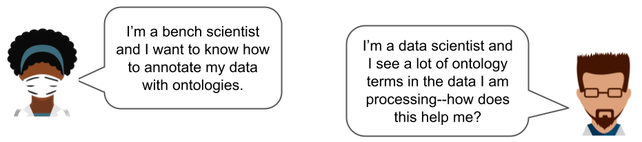
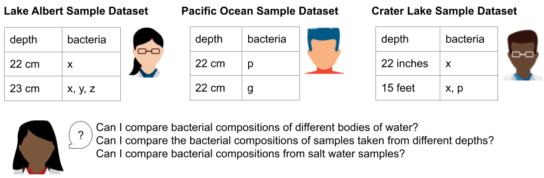
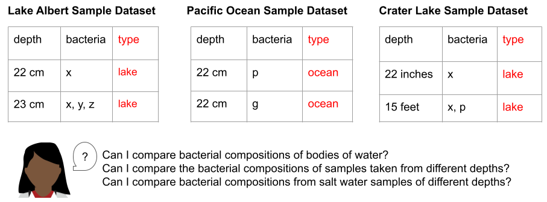
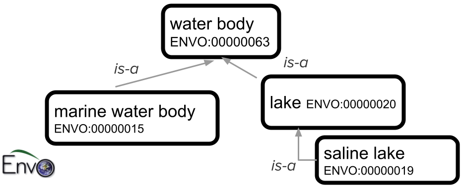
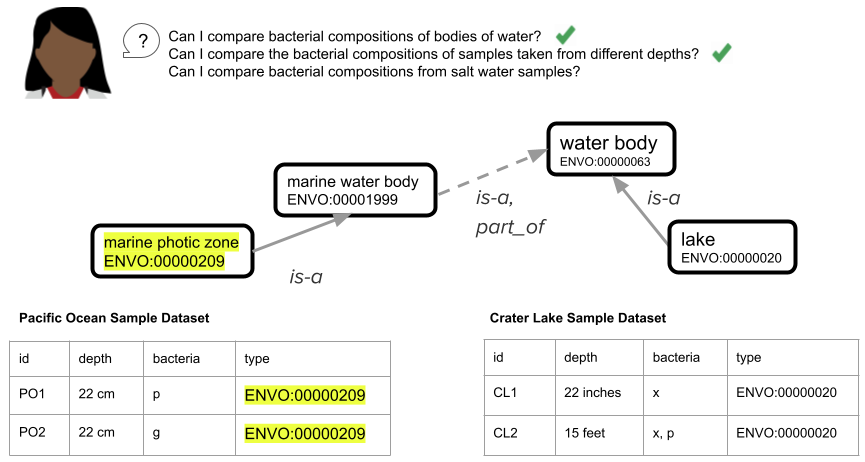
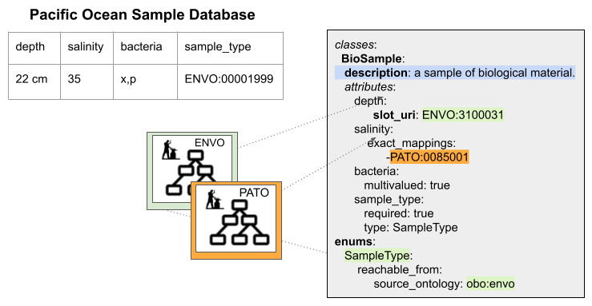

# Using Ontologies in Practice - LinkML can help!

## What *are* ontologies, anyway?

Most researchers have heard of ontologies, but that may be where their familiarity ends. What exactly are ontologies, and how are they used in practice? What do you gain by using ontologies? Do you have to be an ontologist to use ontologies?? Read on to find out!

Researchers often ask these sorts of questions:

An ontology is a sophisticated, organized hierarchical controlled vocabulary that categorizes and defines relationships between concepts.
Ontologies are used to organize and share data in many fields of science and beyond; they are a valuable tool for making datasets generated in the field or at the bench usable and reproducible by others..
Ontologies provide the following key features:

* establishes a shared vocabulary with precisely defined terms and concepts. 
* categorizes concepts in a hierarchical manner, making it easier to navigate and find relevant information.
* promotes data from a collection of isolated values to a component of a broader network of related concepts,
* bringing together results from different sources and different fields, enabling more sophisticated queries and analyses.

## How are ontologies used to model data?

Scientific data usually has a data model (schema) -- a blueprint that describes how the data is organized and the relationships between the different elements within a database.
Data models can also describe how and when an ontology should be used in defining a row or data element. 

Let’s look at an example of three different datasets from three different researchers all concerned with the microbial makeup of water samples in Oregon
to illustrate how to use ontologies in data models (schemas) and make it possible to meaningfully combine data from different sources. 

For our example, let’s say that Researcher A is taking samples from Lake Albert, Researcher B is taking samples from the Pacific Ocean, and Researcher C is taking samples from Crater Lake.
Each researcher wants to record the depth where their sample was collected, and the types of bacteria they find in each sample.
Researcher D is a data scientist who wants to use each of the three resulting datasets to answer some specific questions about bacterial compositions of water samples in Oregon.

Researchers A, B, and C collect their data using spreadsheets. They make up labels for each column in their spreadsheets, record their data, and summarize their findings in a lab notebook. 

To combine these three datasets and make use of their content together, Researcher D needs to identify and compare corresponding rows (this is sometimes called _normalizing_ the data).
The first thing Researcher D has to do is to convert information from the titles of the spreadsheets into data about each sample (in this case,
whether the source of the sample is a lake or an ocean, because we know that lakes and oceans have very different bacterial compositions). 

### Ontologies provide standardized ways to describe data

As she looks at the titles of the spreadsheets, Researcher D notes that while Lake Albert and Crater Lake are both lakes, they have very different salinity levels.
Lake Albert is a saltwater lake, while Crater Lake is a freshwater lake.
Knowing that she wants to group the data resulting from these three studies first by salinity and then by depth,
Researcher D realizes that she might need even more attributes, beyond salinity, to describe the site these samples were taken from.
Luckily, her colleague introduces her to the Environment Ontology (ENVO).
ENVO offers a range of terms that scientists can use to describe environmental elements, such as ecosystems, habitats, and geographical features.
By selecting the most specific ENVO term that describes the “type” column in each row of her three datasets, Researcher D gives herself the ability to filter her data for samples from similar environments.
Importantly, by using the relationships in the ontology, Researcher D can change the filters for samples to group similar samples together in a variety of ways
(e.g. all the water samples, only the freshwater samples, only the lake samples, etc.).
This standardization makes it possible to combine the different datasets generated by Researchers A, B and C, which opens the door to using more powerful search and analysis approaches.

The figure below shows a portion of the ENVO ontology that describes types of bodies of water.
The top-level term, “water body”, has child classes “marine water body” (the Pacific Ocean, for example, would fall into that class) and “lake”.
One type of lake is “saline lake” (there are also other types of lakes, including “freshwater lake”, that are not shown in this small subset of ENVO).

### Ontologies harmonize datasets

Combining datasets from different sources is a lot more complicated if they don’t represent information in the same way.
After annotating all the data she has with ENVO terms, Researcher D notices that in the different spreadsheets, ‘depth’ is described three different ways.
Each dataset (spreadsheet) represents an implicit model of the attributes of the environment where the sample was collected.
By implicit model, we mean that by manually examining the spreadsheet, looking at its name, its column values and understanding where this data came from,
we can make some educated assumptions about how to map the data to another, unrelated dataset.
However, such assumptions can be flawed and are usually made by a person using the data outside the group that generated it.
This process is also time consuming and often error prone.
The larger the unconstrained dataset, the more likely it will be that a particular row or value of a cell will not match the assumptions the downstream data consumer has made about the implicit model.
Moreover, when the dataset is used as input to an analysis tool, there’s no human to guide the data interpretation. 

In order to make their data interpretable and usable by other researchers, software tools, and even their future selves, data creators (researchers) should be explicit about the data they generate.
They should write definitions of column headers.
They should include relevant information about the data that applies to every row (or object) in the dataset
(in our example, they should include metadata about the sample locations in the dataset itself so Researcher D doesn’t have to make assumptions about the lakes).
They should specify when they expect cells in their dataset to be empty or possibly empty. They should specify when a cell can have more than one value, and if the multiple-valued cells are delimited by a specific character.
They should define data types for each column (should the values be strings, integers, should they all have units, what are those units, etc.). 

In our example, because there is no structured way to enter or interpret the data in each column (and no documentation to help Researcher D understand each column and what data to expect in that column),
there is no easy way for Researcher D to combine the data without going through each row manually to standardize it.
This manual standardization step isn’t a big deal when you only have three tiny spreadsheets as in our example, but imagine having to do that with dozens of spreadsheets,
each with hundreds or even thousands of lines--that would be no fun at all!

Furthermore, because there isn’t an explicit definition of each column in a spreadsheet (e.g. we expect integer values in centimeters in the depth column, we expect ENVO terms in the type column),
different datasets could become uncombinable even within the same group or lab.
For example, in the figure above, the “depth” box shows different ways that sample depth might be recorded (cm, inches, feet), without the use of a schema to standardize and validate the entries.

While ontologies provide the knowledge of the domain of interest,
data models or schemas provide the blueprint for a domain or experiment or collection of individuals that share common characteristics or attributes that are programmatically validatable.
We use ontologies in a data model to categorize different dimensions of our individual in a consistent way.
We use data models to communicate our programmatic understanding of our data attributes and relationships  between different types of data. 

In a single data model representing a complex dataset, more than one ontology can be used to limit the values of a column in the dataset.
For instance, the biological concept of "Expression" can be divided into various ontological domains and controlled vocabularies within a data model (or dataset).:

* An ontology of stages (when expressed) 
* An ontology of anatomical entities (where expressed): e.g. Uber Anatomy Ontology (Uberon)
* An ontology of methods or assays (how we assessed expression), e.g. Materials and Methods Ontology (MMO)
* A controlled vocabulary of transcripts or genes (which gene or transcript was expressing), e.g. NCBIGene/Ensembl Gene Identifiers. 

## LinkML is a shared framework for data modeling

LinkML (which stands for “Linked data Modeling Language”) is an open, extensible modeling framework
that allows computers and people to fully describe their data and work cooperatively to model, validate, and distribute data that is reusable and interoperable.
As a flexible yet expressive standard for describing data models ranging from value sets and flat, checklist-style standards to complex normalized data structures that use polymorphism and inheritance,
LinkML enables even non-developers to create data models,
helping to bridge the gap between people of diverse expertise and enabling a shared language with which to express the critically important blueprint of an organization’s data collection. 

LinkML uses ontologies in defining a schema as well as in constraining and validating data. LinkML is best illustrated through examples.
Our data model for the Pacific Ocean Sample Dataset has implicit assumptions:
for example, what values are allowed in the depth column (should they all be centimeter measurements? Should each cell include the units?
Can the bacteria column include more than one thing? Is the comma a delimiter between different bacteria identifiers, or do some bacteria have commas in their name?, etc.)
Below, we show how this spreadsheet data model would look if we used LinkML, with its explicit syntax, to describe it:

### LinkML lets you describe classes, instances and attributes

Each row of our spreadsheets has elements (columns) that describe the defining characteristics of each sample (in our case, its depth, salinity, bacterial composition, and sample type).
In LinkML schemas, sets of elements are grouped together to make “classes.”
In the figure above, for example, “Biosample” is a LinkML _class_ that we’ve created to hold all the shared elements that make up each sample row in our spreadsheet.
Conversely, each row of our spreadsheet is an _instance_ of a Biosample _class_ in our schema. 

In LinkML we can add a description to every class and to every element in the class with the “description” keyword.
We can specify if an element can hold a range of values (string, integer, etc.) and whether we can expect one or many values in each “row” (or instance) of this class. 

If we want to constrain the acceptable values of a column--for example, restrict the “sample_type” column to terms from ENVO--we can do that using a LinkML “dynamic enumeration”
(specified above with the “enums” keyword).
A dynamic enumeration is a set of values that specifies the acceptable inputs for this column.
The “reachable from” keyword in our enumeration definition tells software applications to expand the content of this enumeration to all the possible terms in ENVO.
This means that we can write software that returns a validation error if a value in this column is not from ENVO. 

Additionally, LinkML can describe attributes using ontologies directly.
For example, if we wanted to reuse the term “depth” from ENVO in our model directly,
we could specify that in our LinkML model using the `slot_uri` component (“ENVO:3100031” in our example above represents a sample depth).
Using this component, we are telling a computer or another researcher exactly what the definition of depth is in our dataset, and we are reusing that concept from an external source (in this case ENVO).
This means less work for us as we are collecting the data, and less work for our collaborators to understand our data later. 

### LinkML helps you make implicit assumptions explicit

In our data model or schema, we should take care to make implicit assumptions that we’ve made in organizing our dataset explicit using a language that is computable.
We should reuse the work of ontologies to define classes if we want to use a specific concept in our schema but also add attributes/metadata to this concept.
We should map our definition of a concept to the same concept in an external model (in this case it could be an ontology, in other cases it could be another LinkML Class).
If we need to constrain a particular column/slot/value to use a specific ontology (e.g. the ENVO use case above), then we can use dynamic enumerations. 

## Schemas and ontologies: better together

Utilizing ontologies involves structuring knowledge into defined terms and concepts, enabling efficient communication.
Ontologies offer key functionalities: establishing shared vocabulary, hierarchical categorization, and enabling advanced data connections.
Data models, or schemas, further complement ontologies by providing a standardized framework for labeling individual data points.
This collaborative relationship between ontologies and data models transforms complex information into a well-organized and accessible resource across scientific domains.

# Further Reading

To understand the LinkML syntax and semantics in more depth, please check out the LinkML tutorial, and in particular, the guide for using ontologies in your LinkML schema, which includes many more examples:

* The LinkML tutorial: [https://linkml.io/linkml/intro/tutorial.html](https://linkml.io/linkml/intro/tutorial.html)
* Ontologies and LinkML in depth: [https://linkml.io/linkml/faq/general.html#ontologies-as-values](https://linkml.io/linkml/faq/general.html#ontologies-as-values)

For more information on how other researchers have used ontologies, please see the main ontology-user pathway in the OBOOK (Open Biological and Biomedical Ontologies Organized Knowledge):

* [https://oboacademy.github.io/obook/pathways/ontology-user/](https://oboacademy.github.io/obook/pathways/ontology-user/)
