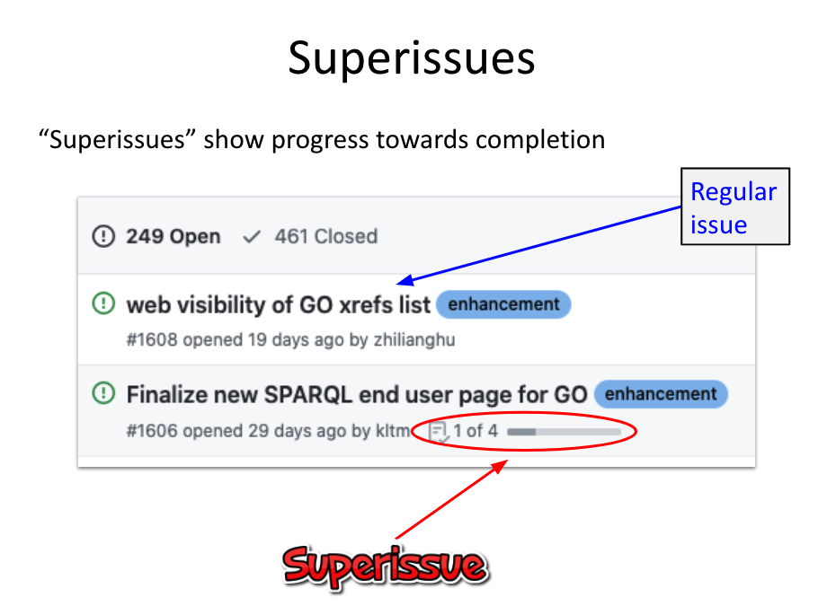
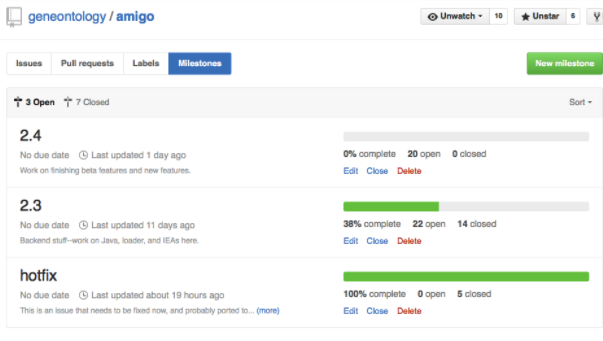
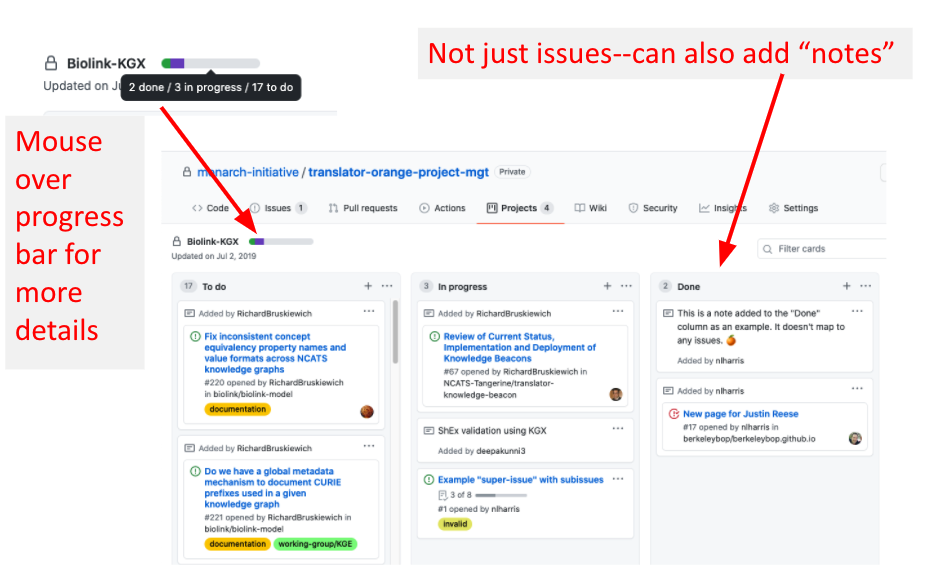

# Tools for Managing Issues

Based on [Intro to GitHub (GO-Centric)](https://docs.google.com/presentation/d/1xiALnyqKJ_cAF0hmR99v1FdQ-CC7WW33/edit#slide=id.gb6531145d5_0_249) with credit to Nomi Harris and Chris Mungall

## Labels

Labels are a useful tool to help group and organize issues, allowing people to filter issues by grouping.
Note: Only project contributors can add/change labels

### Best Practices for Labels

- Make use of use GitHub's default labels: bug, question, enhancement, good first issue, etc.
- Define new labels as needed for project management
- Lightly coordinate labels across repos in an organization
- Labels are not ontologies; don’t overload them. A small simple set consistently applied is better than overly specific inconsistently applied labels

## Superissues
Superissues are issues that have checklists (added using -[] on items). These are useful as they show progress towards completion. These can be used for issues that require multiple steps to solve.

## Milestones
Milestones are used for issues with a specific date/deadline. Milestones contain issues and issues can be filtered by milestones. They are also useful for visualizing how many issues in it is completed.

## Project Boards
Project boards are a useful tool to organise, as the name implies, projects. They can span multiple repos (though the repos need to be in the same organisation). Notes can also be added. 

