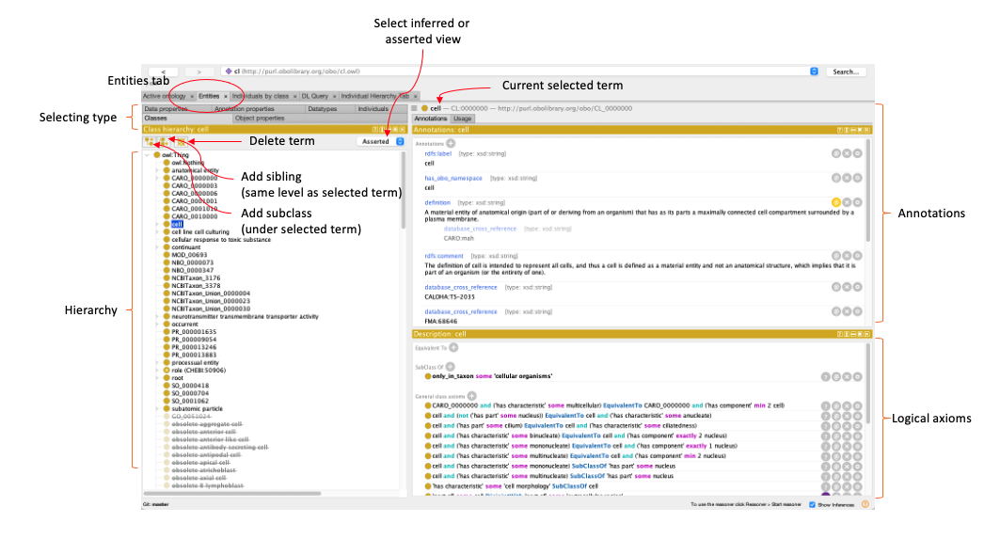

# Reference document for protege interface

For this reference, we will use the cell ontology to highlight the key information on the user interface in Protege

## General interface buttons

'+' button (not shown above) = add
'?' button = explain axiom
'@' button = annotate
'x' button = remove
'o' button = edit

## Active Ontology tab

### Overview

When you open the ontology on protege, you should land on the Active ontology tab, alternatively, it is available on the top as one of your tabs.

### Ontology Level Annotations

Annotations on the active ontology tab are ontology level annotations and contain metadata about the ontology.
This includes:

1. title (name of the ontology)
1. description
1. license
1. contributors (ideally this should be in ORCID but many ontologies use names instead)
1. references (under rdfs:comment)
1. preferred_root (this allows certain browsers to know which root to display the ontology from)

## Entities tab

Entities are where your "entries" in the ontology live and where you can add terms etc.

