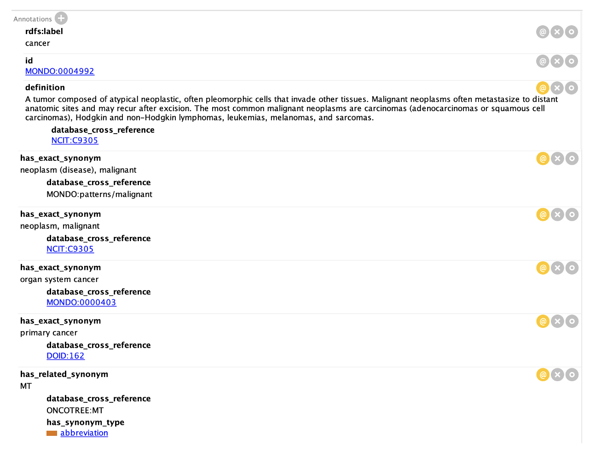

## Synonym Properties OBO

### Related materials

- [Lesson on synonyms](../lesson/synonyms.md)
- [Synonym validation](../reference/synonym-validation.md)
- [Overview of synonym types](../reference/synonyms-types.md)

### Overview

A synonym indicates an alternative name for a term. 
Terms can have multiple synonyms of of different types and using different properties.
For example, the Mondo term MONDO:0005992 cancer, has many exact synonyms and a related synonym:

### List of widely used synonym properties

| Label | ID | Definition | Comment |
|-----------------------|----------------------------|-----------------------------------------------------------------------------------------------------------------------------------------------------------------------------------------------------------------------------------------------------------|-------------------------|
| has exact synonym     | oboInOwl:hasExactSynomym   | The definition of the synonym is exactly the same as primary term definition. This is used when the same class can have more than one name.                                                                                                               |                         |
| has related synonym   | oboInOwl:hasRelatedSynomym | An alternative label for a class or property that has been used synonymously with the primary term name, but the usage is not strictly correct.                                                                                                           |                         |
| has broad synonym     | oboInOwl:hasBroadSynomym   | An alternative label for a class or property which has a more general meaning than the preferred name/primary label.                                                                                                                                      |                         |
| has narrow synonym    | oboInOwl:hasNarrowSynomym  | An alternative label for a class or property which has a more specific meaning than the preferred name/primary label.                                                                                                                                     |                         |
| has alternative label | IAO:0000118                | A label for a class or property that can be used to refer to the class or property instead of the preferred rdfs:label. Alternative labels should be used to indicate community- or context-specific labels, abbreviations, shorthand forms and the like. |                         |
| alternative label     | skos:altLabel              | An alternative lexical label for a resource.                                                                                                                                                                                                              | Not recommended by OBO. |
| hidden label          | skos:hiddenLabel           | A lexical label for a resource that should be hidden when generating visual displays of the resource, but should still be accessible to free text search operations.                                                                                      | Not recommended by OBO. |
| alternate name        | schema:alternateName       | An alias for the item.                                                                                                                                                                                                                                    | Not recommended by OBO. |

### Additional information about synonym properties

#### `oboInOwl:hasExactSynomym`

The definition of the synonym is exactly the same as primary term definition. This is used when the same class can have more than one name.

For example, hereditary Wilms' tumor has the exact synonoym familial Wilms' tumor.

Additionally, translations into other languages are listed as exact synonyms. For example, the Plant Ontology list both Spanish and Japanese translations as exact synonyms; e.g. anther wall has exact synonym ‘pared de la antera’ (Spanish) and ‘葯壁 ‘(Japanese).

#### `oboInOwl:hasNarrowSynomym`

The definition of the synonym is the same as the primary definition, but has additional qualifiers.

For example, pod is a narrow synonym of fruit.

**Note** - when adding a narrow synonym, please first consider whether a new subclass should be added instead of a narrow synonym. If there is any uncertainty, start a discussion on the GitHub issue tracker.

#### `oboInOwl:hasBroadSynomym`

The primary definition accurately describes the synonym, but the definition of the synonym may encompass other structures as well. In some cases where a broad synonym is given, it will be a broad synonym for more than one ontology term.

For example, Cyst of eyelid has the broad synonym Lesion of the eyelid.

**Note** - when adding a broad synonym, please first consider whether a new superclass should be added instead of a broad synonym. If there is any uncertainty, start a discussion on the GitHub issue tracker.

#### `oboInOwl:hasRelatedSynomym`

This scope is applied when a word of phrase has been used synonymously with the primary term name in the literature, but the usage is not strictly correct. That is, the synonym in fact has a slightly different meaning than the primary term name. Since users may not be aware that the synonym was being used incorrectly when searching for a term, related synonyms are included.

For example, Autistic behavior has the related synonym Autism spectrum disorder.

<a id="provenance"></id>

### Provenance on synonyms

Ontologies developed using the [GO-family ontology development pattern](../pathways/ontology-curator-go-style.md) use the oboInOwl:hasDbXref property to represent "provenance" in general.
This could be anything:

1. An ORCiD, meaning "this person asserted/verified this synonym"
2. An ontology term, meaning "the synonym was source from this ontology concept"
3. A Pubmed ID, to indicate the publication that used the synonym. References to PubMed IDs should be in the format PMID:XXXXXXX (no space). See example below.

Some other ontologies have started using dc:contributor and rdfs:seeAlso for more fine-grained provenance, but this pattern is not widely adopted.

!!! info

    We warmly recommend to use to be generous with provenance when curating synonyms.
    At the very least, we recommend to capture the ORCiD of the curator that captured the synonym, or the Research Organization Registry (ROR) identifier of the organisation that promotes the term.
    Ideally, however, you furthermore capture the source of the synonym, which could be a PubMed ID (PMID), a term from an ontology or a Digital Object Identifier (DOI).
