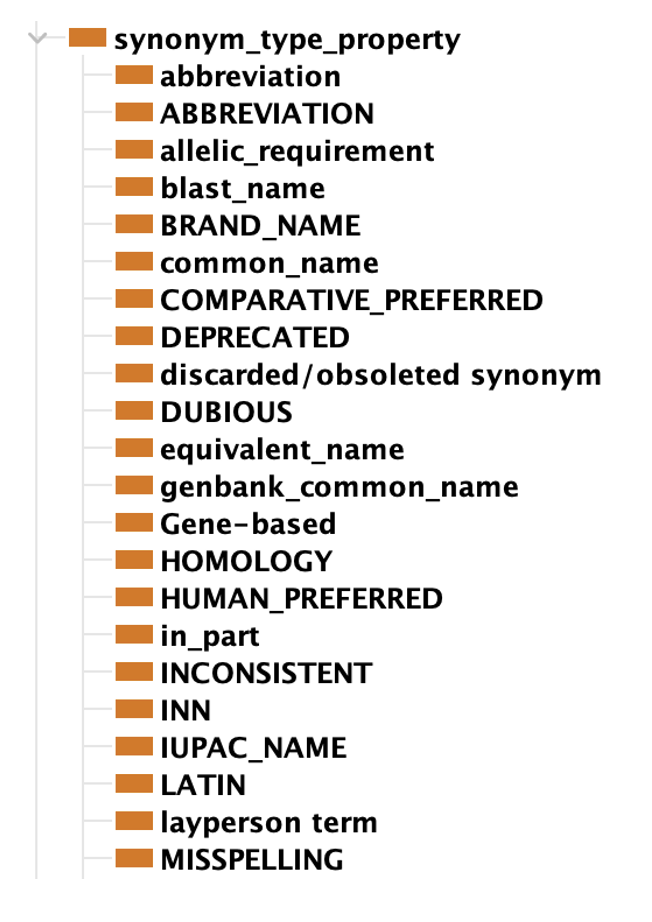
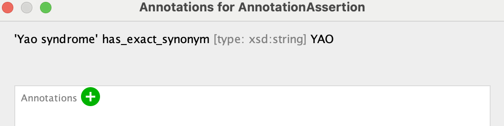

## Synonym Types

### Related materials

- [Overview of synonym properties](../reference/synonyms-properties.md)
- [Lesson on synonyms](../lesson/synonyms.md)
- [Synonym validation](../reference/synonym-validation.md)

### Overview

In contrast to [synonym properties](../reference/synonyms-properties.md), which encode the semantic precision of a specific synonym such as "exact" or "broad, _synonym types_ encode the purpose of the synonym. In the following, we will describe some basic synonym types and give examples of their usage.

!!! info "Definition synonym type"

    A synonym type represents the function of a specific synonym, such as "acronym", "layperson", or "language translation".

!!! warning

    While _synonym properties_ MUST be included in OMO to recognise a valid synonym, _synonym types_ are often defined by the ontologies themselves.
    This can be pretty confusing for tool developers. For example, at the time of this writing, [a number of OBO ontologies](https://github.com/OBOFoundry/OBOFoundry.github.io/issues/2450) define their own properties for "layperson" or "plural form".

### Typical synonym types

Synonyms can also be classified by types. The default is no type. The synonym types vary in each ontology, but some commonly used synonym types include:

- [abbreviation](http://purl.obolibrary.org/obo/OMO_0003000) - to indicate the synonym is an abbreviation. **Note** the scope for an acronym should be determined on a case-by-case basis. Not all acronyms are necessarily exact.
- [ambiguous](http://purl.obolibrary.org/obo/OMO_0003001) - to indicate the synonym is open to more than one interpretation; may have a double meaning
- [dubious synonym](http://purl.obolibrary.org/obo/OMO_0003002) - to indicate the synonym may be suspect
- [layperson term](http://purl.obolibrary.org/obo/OMO_0003003) - to indicate the synonym is common language (used by the Human Phenotype Ontology)
- [plural form](http://purl.obolibrary.org/obo/OMO_0003004) - indicating the form of the term that means more than one
- [UK spelling](http://purl.obolibrary.org/obo/OMO_0003005) - the english language spelling that is used in the United Kingdom (UK) but not in the United States (US)
- Other possible synonym types which are under discussion are synonyms that are [considered harmful](https://github.com/monarch-initiative/mondo/issues/7148).
- A very different class of synonym types are "language translations". Most people would not consider translations as synonyms at all, and it makes sense to separate the two because the way they are represented in the ontology are very different from "normal" synonyms. For details see below.

Additional standardized synonym types can be found in the [OBO Metadata Ontology](https://obofoundry.org/ontology/omo)
as sub-properties of `oboInOwl:SynonymType`.

### Common Synonym Types

Synonyms can also be classified by types. The default is no type. The synonym types vary in each ontology, but some commonly used synonym types include:

### Representation

Synonym type | Description | Example
-- | -- | -- 
[abbreviation](http://purl.obolibrary.org/obo/OMO_0003000) | A shortened form of a word or phrase. **Warning** Many abbreviations you will find in the wild are actually acronyms.  | etc for et cetera |
[acronym](http://purl.obolibrary.org/obo/OMO_0003012) | A synonym type for describing abbreviations that are a part of the full name's words, such as initialisms or alphabetisms. **Note** the scope for an acronym should be determined on a case-by-case basis. Not all acronyms are necessarily exact. | MONDO:0000190 ventricular fibrillation synonym: VF |
[dubious synonym](http://purl.obolibrary.org/obo/OMO_0003002) | A synonym type to indicate the synonym may be suspect or used wrongly in practice. | MONDO:0024309 neuropathy, hereditary sensory and autonomic, type 2A, synonym: Morvan disease |
[layperson term](http://purl.obolibrary.org/obo/OMO_0003003) | to indicate the synonym is a common language (used by the Human Phenotype Ontology) | HP:0001028 Hemangioma, synonym: Strawberry mark |
[plural form](http://purl.obolibrary.org/obo/OMO_0003004) | indicating the form of the term that means more than one | HP:0010819 Atonic seizure, synonym: Atonic seizures|
[UK spelling](http://purl.obolibrary.org/obo/OMO_0003005) | the english language spelling that is used in the United Kingdom (UK) but not in the United States (US) | MONDO:0005059 leukemia, synonym: leukaemia (disease) |
[ambiguous](http://purl.obolibrary.org/obo/OMO_0003001) | to indicate the synonym is open to more than one interpretation; may have a double meaning | MONDO:0019781 astrocytoma (excluding glioblastoma) synonym: "astrocytoma" (see associated [GitHub ticket](https://github.com/NCI-Thesaurus/thesaurus-obo-edition/issues/23) |

Additional standardized synonym types can be found in the [OBO Metadata Ontology](https://obofoundry.org/ontology/omo)
as sub-properties of [oboInOwl:SynonymType](https://www.ebi.ac.uk/ols4/ontologies/omo/properties/http%253A%252F%252Fwww.geneontology.org%252Fformats%252FoboInOwl%2523SynonymTypeProperty).

### Additional (interesting) Synonym Type Examples from Mondo

Synonym type | Description | Example
-- | -- | -- 
'A synonym that is historic and discouraged' (DEPRECATED) | Mondo marks synonyms with DEPRECATED that are historic and no longer appropriate to use, e.g. all occurrences of “mental retardation” should be “intellectual disability”. They try to avoid including things in this list: https://en.wikipedia.org/wiki/List_of_medical_eponyms_with_Nazi_associations but if it’s established (e.g. Wegener granulomatosis), it may be included as a synonym and mark DEPRECATED | MONDO:0007113 Angelman syndrome, synonym: happy puppet syndrome
'Synonym to be removed from public release but maintained in edit version as record of external usage' (EXCLUDE) | Some synonyms are annotated with EXCLUDE, e.g. “NOS” (not otherwise specified) synonyms. It is useful to have these in the edit version, but these are filtered on release. | MONDO:0007667 subependymoma, synonym: subependymal astrocytoma NOS
ClinGen label (CLINGEN_LABEL) | Added to gene-based names/synonyms (or other labels) that were requested by an external user, ClinGen, and other terms that are the preferred terms for ClinGen.| MONDO:0010015 anterior segment dysgenesis 7, synonym: PXDN-related ocular dysgenesis

#### Example synonym types in Protege from HPO are shown below


#### Example synonym types in Protege from Mondo are shown below


??? Representation in OWL

    ```xml
    <owl:Axiom>
        <owl:annotatedSource rdf:resource="http://purl.obolibrary.org/obo/MONDO_0016971"/>
        <owl:annotatedProperty rdf:resource="http://www.geneontology.org/formats/oboInOwl#hasExactSynonym"/>
        <owl:annotatedTarget rdf:datatype="http://www.w3.org/2001/XMLSchema#string">limb-girdle muscular dystrophy</owl:annotatedTarget>
        <oboInOwl:hasSynonymType rdf:resource="http://purl.obolibrary.org/obo/mondo#CLINGEN_LABEL"/>
    </owl:Axiom>
    <owl:Axiom>
        <owl:annotatedSource rdf:resource="http://purl.obolibrary.org/obo/MONDO_0016989"/>
        <owl:annotatedProperty rdf:resource="http://www.geneontology.org/formats/oboInOwl#hasExactSynonym"/>
        <owl:annotatedTarget rdf:datatype="http://www.w3.org/2001/XMLSchema#string">FHI</owl:annotatedTarget>
        <oboInOwl:hasDbXref rdf:datatype="http://www.w3.org/2001/XMLSchema#string">Orphanet:263479</oboInOwl:hasDbXref>
        <oboInOwl:hasSynonymType rdf:resource="http://purl.obolibrary.org/obo/OMO_0003012"/>
    </owl:Axiom>
    ```

In the above OWL example, you can see how an acronym and a custom synonym type called "CLINGEN_LABEL" would look like in OWL Format. Note that the acronym property was changed here for illustration purposes, as Mondo has not yet caught up with implementing all the new standard OMO synonym type properties.

??? Representation in OBO format

    ```
    [Term]
    id: MONDO:0016971
    name: limb-girdle muscular dystrophy
    synonym: "LGMD" EXACT OMO:0003012 [Orphanet:263]
    synonym: "limb-girdle muscular dystrophy" EXACT CLINGEN_LABEL []
    ```

In the above OBO example, you can see how an acronym and a custom synonym type called "CLINGEN_LABEL" would look like in OBO Format.


## How to add Synonym Types in Protege v5.6.1

1. Click on the annotation button next to the synonym


3. Click the annotation button in the box


4. Select **Entity IRI** and start searching for the synonym type in the search box, then select the annotation you wish to add. Click OK on each box.


5. You will see your annotation on your synonym.
![](../images/tutorials/synonyms/synonymannotation.png


