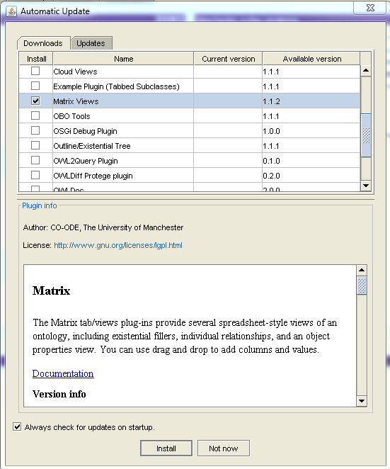

---
author:
- |
  \
  Robert Stevens and Sean Bechhofer and Uli Sattler\
  \
  School of Computer Science\
  University of Manchester\
  Oxford Road\
  Manchester\
  United Kingdom\
  M13 9PL\
---

Preamble {#preamble .unnumbered}
========

Licencing {#licencing .unnumbered}
---------

The 'Family History Exercises in OWL' by Robert Stevens, Sean Bechhofer
and Uli Sattler is licensed under a Creative Commons
Attribution-ShareAlike 3.0 Unported License.

Reporting Errors {#reporting-errors .unnumbered}
----------------

This set of exercises will almost certainly contain errors, defects and
infelicities. Please do report them to
[sean.bechhofer\@manchester.ac.uk](sean.bechhofer@manchester.ac.uk).
Supplying some actual context in the form of words will help in fixing
any of these issues.

Acknowledgements {#acknowledgements .unnumbered}
----------------

As well as the author list, many people have contributed to this work.
Any contribution, such as reporting bugs etc., is rewarded by an
acknowledgement of contribution (in alphabetical order) when the authors
get around to adding them.

-   Patrick Koopman;

-   Matthew Horridge.

-   Nicolas Matentzoglu.

-   Margaret Stevens.

Conventions used in these exercises {#conventions-used-in-these-exercises .unnumbered}
-----------------------------------

-   All OWL is written in Manchester Syntax;

-   When we use FHKB entities within text, we use a sans serif typeface;

-   We use CamelCase for classes and property names;

-   Class names start with upper case;

-   Individual names start with a lower case letter and internal
    underscores to break words;

-   Property names usually start with 'is' or 'has' and are CamelCase
    with a lower case initial letter.

-   When there is some scary OWL or the reasoner may find the FHKB hard
    work, you will see a 'here be dragons' image.[^1]

Introduction
============

These exercises in the Web Ontology Language (OWL) take participants
through OWL from its basics to some rather advanced features of the
OWL DL profile of OWL. The exercises use family history as a topic and
much of the tutorial is based on the 'Manchester Family History Advanced
OWL Tutorial' found at
<http://owl.cs.manchester.ac.uk/publications/talks-and-tutorials/fhkbtutorial/>.
Here, instead of an 'advanced tutorial', the exercises go from the start
to quite a lot of what anyone using OWL to model needs to know about the
language and the use of an automated reasoner; the exercises do not
really explore much in the way of modelling issues.

These exercises don't give any instruction in Protégé; for that use the
Pizza tutorial at
<http://owl.cs.manchester.ac.uk/tutorials/protegeowltutorial/>. These
exercises don't give any explanation behind the phenomena revealed
during the exercises; these are explained by the human beings delivering
the exercises. More explanation can be found in the Pizza tutorial and
the written, original, long version of the Family History OWL tutorial
is in Blackboard.

In these exercises we take an "objects (individuals) first" approach.
Most tutorials concentrate on classes then individuals (if at all). By
doing it this way our aim is to emphasise that OWL is all about
modelling individuals--even if most axioms are restrictions upon classes
that say 'each and every individual in this class holds at least one of
these properties to an individual of the filler class'. Similarly,
object properties are relationships between two individuals, we just
usually model at the class level and these sort of distinctions can
sometimes get lost. So, these exercises start with asserting lots of
properties between named individuals and only later do we start talking
about classes of these individuals. It may be, and probably will be,
that most modelling is with classes and properties, but this way really
emphasises what the language is actually doing.

Subsequent material in the course unit will focus largely on classes and
modelling with classes.

Once you have completed these exercises in the lab, you are recommended
to work your way through the Protege Pizza tutorial and the Family
History OWL Tutorial. These will help you gain experience of the
mechanics of using Protégé and provide a further introduction to OWL 2.

-   <http://owl.cs.manchester.ac.uk/tutorials/protg-owl-tutorial/>

-   <http://owl.cs.manchester.ac.uk/publications/talks-and-tutorials/fhkbtutorial/>
    contains the ontologies, and the long version of the tutorial
    explanation is in Blackboard.

Learning outcomes
-----------------

By the end of a successful completion of these exercises you should be
able to:

1.  Understand the core aspects of OWL 2 syntax and semantics;

2.  Use Protégé to build an ontology, and use an automated reasoner to
    draw inferences from the axioms in your ontology;

3.  Use classes and individuals;

4.  Use OWL 2's property hierarchy;

5.  Use OWL 2's property characteristics;

6.  Know more than you need to about the famly history of Robert David
    Bright;

7.  Know some of the limitations of OWL 2.

These learning outcomes are very generic; each exercise encapsulates a
significant learning outcome. For example,
Exercise [10](#ex:date){reference-type="ref" reference="ex:date"} has a
learning outcome of: knowing how to use data properties; knowing about
and using the DifferentIndividuals axiom; a reinforcement of the use of
the functional property characteristic; and an introduction to qualified
cardinality restrictions.

Assumptions
-----------

We make some simplifying assumptions in this tutorial:

-   We assume people doing the exercises know nothing about OWL.

-   We assume that there are human beings present that are knowledgeable
    about OWL to conduct participants through the exercises and give
    explanations. You may need to ask these human beings (or consult
    some other sources) to understand some of the terms used in this
    tutorial (e.g., "inverse" or "transitive").

-   We take a conventional western view of family history. This appears
    to have most effects on naming of sibling and cousin relationships.

-   We take a straight-forward view on the sex of people; this is
    explored further in
    Chapter [\[ex:sex\]](#ex:sex){reference-type="ref"
    reference="ex:sex"};

-   We make no special treatment of time or dates; we are only
    interested in years and we do not do anything fancy; this is
    explored more in Chapter [10](#ex:date){reference-type="ref"
    reference="ex:date"}.

At the end of the tutorial, you should be able to produce a property
hierarchy and a TBox or class hierarchy; all supported by use of
Protégé, the automated reasoner, and a lot of OWL 2's features.

How to use these exercises
--------------------------

Start at exercise one and work through to the last exercise. Don't just
read the exercises and think you know what will happen; actually do it
and you'll learn more.

Exercise 
========

+:--+--:+:-:+:------------------------------------------------------+
|   |   |   |                                                       |
+---+---+---+-------------------------------------------------------+
|   |   |   | 1.  Install Protégé.                                  |
|   |   |   |                                                       |
|   |   |   | 2.  Install the matrix plugin.                        |
|   |   |   |                                                       |
|   |   |   | 3.  Open a new ontology called `fhkb-x.owl`, where x  |
|   |   |   |     is your student user id.                          |
|   |   |   |                                                       |
|   |   |   | 4.  Remember to save your file often while working... |
+---+---+---+-------------------------------------------------------+
|   |   |   |                                                       |
+---+---+---+-------------------------------------------------------+

Notes
-----

Your machines in the School have Protégé installed. The instructions
below are for use 'off-site'.

Installing Protégé
------------------

Go to <http://protege.stanford.edu/download/registered.html> and
download the platform independent installer of Protégé Desktop 4.X (you
do not have to register in order to download the software). Select the
appropriate one for your operating system. We recommend downloading it
bundled with the Java VM, to ensure compatibility. After the download is
completed, run the installer and follow the instructions, selecting the
appropriate VM (either the one bundled with it or your default one).

Once the installation is completed, open Protégé and go to File \>\>
Check for plugins. Select the Matrix views plugin, as shown on the
screenshot towards the end of this chapter. Click install, wait until
the software asks for a restart, close and re-open Protégé.

Create a first ontology
-----------------------

Select File \>\> Save as, select either RDF/XML or OWL/XML, navigate to
your preferred directory and save the file using the name fhkb-x,
replacing the x with your student user id (e.g. mbax1234). The extension
(\*.owl) is put automatically. To be sure, go to File \>\> Save, and do
so frequently during your upcoming modelling efforts, as Protégé is
known to crash in the unlikeliest situations.

{width="15cm"}

Exercise 
========

+:--+--:+:-:+:------------------------------------------------------+
|   |   |   |                                                       |
+---+---+---+-------------------------------------------------------+
|   |   |   | 1.  Load the initial ontology from the course unit    |
|   |   |   |     home page                                         |
|   |   |   |     (<h                                               |
|   |   |   | ttp://studentnet.cs.manchester.ac.uk/pgt/COMP62342/>) |
|   |   |   |     into Protégé.                                     |
|   |   |   |                                                       |
|   |   |   | 2.  Add about 6 more individuals to your FHKB---use   |
|   |   |   |     the emboldened names from the table in            |
|   |   |   |                                                       |
|   |   |   |  Appendix [19](#chap:familydata){reference-type="ref" |
|   |   |   |     reference="chap:familydata"}; you may add more    |
|   |   |   |     names if you wish. For each individual, create an |
|   |   |   |     IRI fragment with the given names followed by     |
|   |   |   |     family name, followed by birth year, each         |
|   |   |   |     separated by underscores.                         |
|   |   |   |                                                       |
|   |   |   | 3.  Create two object properties: hasFather and       |
|   |   |   |     hasMother. Add the appropriate assertions from    |
|   |   |   |     the data table; run the reasoner.                 |
|   |   |   |                                                       |
|   |   |   | 4.  Ask the DL query hasFather value                  |
|   |   |   |     David_Bright_1934.                                |
|   |   |   |                                                       |
|   |   |   | 5.  Add inverses for the two properties: isFatherOf   |
|   |   |   |     and isMotherOf; run the reasoner.                 |
|   |   |   |                                                       |
|   |   |   | 6.  Ask the DL query isMotherOf value                 |
|   |   |   |     Robert_David_Bright_1965 and isMotherOf value     |
|   |   |   |     David_Bright_1934.                                |
+---+---+---+-------------------------------------------------------+
|   |   |   |                                                       |
+---+---+---+-------------------------------------------------------+

Exercise 
========

+:--+--:+:-:+:------------------------------------------------------+
|   |   |   |                                                       |
+---+---+---+-------------------------------------------------------+
|   |   |   | 1.  Add another object property hasParent and its     |
|   |   |   |     obvious inverse. Make hasParent a super-property  |
|   |   |   |     of hasMother and hasFather.                       |
|   |   |   |                                                       |
|   |   |   | 2.  Run the reasoner.                                 |
|   |   |   |                                                       |
|   |   |   | 3.  Ask the DL queries: hasParent value               |
|   |   |   |     David_Bright_1934 and hasParent value             |
|   |   |   |     Margaret_Grace_Rever_1934. Ask similar queries    |
|   |   |   |     using the isParentOf property.                    |
|   |   |   |                                                       |
|   |   |   | 4.  Look at the object hierarchy and see the reasoner |
|   |   |   |     maintaining the 'is' side of the hierarchy.       |
|   |   |   |                                                       |
|   |   |   | 5.  Write a DL query to find the grandparents of      |
|   |   |   |     Robert David Bright. Specialise that query to     |
|   |   |   |     find Robert David Bright's grandfathers.          |
+---+---+---+-------------------------------------------------------+
|   |   |   |                                                       |
+---+---+---+-------------------------------------------------------+

Exercise 
========

+:--+--:+:-:+:------------------------------------------------------+
|   |   |   |                                                       |
+---+---+---+-------------------------------------------------------+
|   |   |   | 1.  Add the object property hasAncestor and make it a |
|   |   |   |     super-property of hasParent.                      |
|   |   |   |                                                       |
|   |   |   | 2.  Add its inverse hasDescendant.                    |
|   |   |   |                                                       |
|   |   |   | 3.  Make hasAncestor transitive.                      |
|   |   |   |                                                       |
|   |   |   | 4.  Run the reasoner.                                 |
|   |   |   |                                                       |
|   |   |   | 5.  Ask the DL queries: hasDescendant value           |
|   |   |   |     Robert_David_Bright_1965 and hasAncestor value    |
|   |   |   |     william_george_bright_1901. Check the answers     |
|   |   |   |     against the table in                              |
|   |   |   |                                                       |
|   |   |   |  Appendix [19](#chap:familydata){reference-type="ref" |
|   |   |   |     reference="chap:familydata"}.                     |
|   |   |   |                                                       |
|   |   |   | 6.  Ask more queries and check your answers.          |
+---+---+---+-------------------------------------------------------+
|   |   |   |                                                       |
+---+---+---+-------------------------------------------------------+

Exercise 
========

+:--+--:+:-:+:------------------------------------------------------+
|   |   |   |                                                       |
+---+---+---+-------------------------------------------------------+
|   |   |   | 1.  Add the object properties hasGrandparent,         |
|   |   |   |     hasGrandmother and hasGrandfather arranged in the |
|   |   |   |     obvious hierarchy.                                |
|   |   |   |                                                       |
|   |   |   | 2.  Make hasGrandparent a sub-property of the         |
|   |   |   |     appropriate property in the growing object        |
|   |   |   |     hierarchy.                                        |
|   |   |   |                                                       |
|   |   |   | 3.  Add the obvious 'is' inverses.                    |
|   |   |   |                                                       |
|   |   |   | 4.  Add a sub-property chain hasParent o hasFather to |
|   |   |   |     the hasGrandfather property; do the equivalent    |
|   |   |   |     for hasGrandmother.                               |
|   |   |   |                                                       |
|   |   |   | 5.  Run the reasoner (and look at the object          |
|   |   |   |     hierarchy).                                       |
|   |   |   |                                                       |
|   |   |   | 6.  Ask DL queries about grandparents and             |
|   |   |   |     grandchildren of various people.                  |
|   |   |   |                                                       |
|   |   |   | 7.  Add in properties and sub-property chains for     |
|   |   |   |     finding great grandparents. (you may have to add  |
|   |   |   |     some more individuals to test these properties.)  |
|   |   |   |                                                       |
|   |   |   | 8.  Run the reasoner and test with DL queries.        |
+---+---+---+-------------------------------------------------------+
|   |   |   |                                                       |
+---+---+---+-------------------------------------------------------+

Exercise 
========

+:--+--:+:-:+:------------------------------------------------------+
|   |   |   |                                                       |
+---+---+---+-------------------------------------------------------+
|   |   |   | 1.  Add the object property hasBloodRelation to the   |
|   |   |   |     object property hierarchy.                        |
|   |   |   |                                                       |
|   |   |   | 2.  Is this property transitive?                      |
|   |   |   |                                                       |
|   |   |   | 3.  What is this property's inverse? It is its own    |
|   |   |   |     inverse, so make it symmetric.                    |
|   |   |   |                                                       |
|   |   |   | 4.  What is the sub-property chain that determines    |
|   |   |   |     one's blood relations? Add this sub-property      |
|   |   |   |     chain to hasBloodRelation.                        |
|   |   |   |                                                       |
|   |   |   | 5.  Run the reasoner and test your answer.            |
|   |   |   |                                                       |
|   |   |   | 6.  One good test is to find the blood relations of   |
|   |   |   |     the person furthest back in the hierarchy; do we  |
|   |   |   |     get his or her blood relations? How do we fix it? |
|   |   |   |     Ask a human being---we don't yet know, in the     |
|   |   |   |     ontology, that everyone has an ancestor; once we  |
|   |   |   |     do know this, this sub-property chain will work.  |
|   |   |   |     We know as humans that everyone has parents; the  |
|   |   |   |     'computer' doesn't know this yet---see            |
|   |   |   |     Exerci                                            |
|   |   |   | se [\[ex_classes\]](#ex_classes){reference-type="ref" |
|   |   |   |     reference="ex_classes"}.                          |
|   |   |   |                                                       |
|   |   |   | 7.  Look at the object property hierarchy.            |
+---+---+---+-------------------------------------------------------+
|   |   |   |                                                       |
+---+---+---+-------------------------------------------------------+

Exercise 
========

[\[ex:classes\]]{#ex:classes label="ex:classes"} [\[ex:sex\]]{#ex:sex
label="ex:sex"}

+:--+--:+:-:+:------------------------------------------------------+
|   |   |   |                                                       |
+---+---+---+-------------------------------------------------------+
|   |   |   | 1.  Add the class Person to the FHKB.                 |
|   |   |   |                                                       |
|   |   |   | 2.  Add the classes Sex, Male and Female; make Male   |
|   |   |   |     and Female subclasses of Sex.                     |
|   |   |   |                                                       |
|   |   |   | 3.  Add the object property hasSex; restrict the      |
|   |   |   |     class Person to hasSex some Sex.                  |
|   |   |   |                                                       |
|   |   |   | 4.  Make two classes Man and Woman. Make              |
|   |   |   |     Man EquivalentTo: Person and hasSex some Male and |
|   |   |   |     do the equivalent for Woman.                      |
|   |   |   |                                                       |
|   |   |   | 5.  Run the reasoner.                                 |
|   |   |   |                                                       |
|   |   |   | 6.  Ask the DL query Male and Female; should this be  |
|   |   |   |     possible? Make Male and Female disjoint, run the  |
|   |   |   |     reasoner and ask the query again.                 |
|   |   |   |                                                       |
|   |   |   | 7.  Ask the DL query Sex and not (Male or Female);    |
|   |   |   |     the answer suggests that there are other ways of  |
|   |   |   |     being a Sex than being either Male or Female.     |
|   |   |   |     Stop this happening by adding the covering axiom  |
|   |   |   |     Sex EquivalentTo: Male or Female; run the         |
|   |   |   |     reasoner and ask the query again.                 |
|   |   |   |                                                       |
|   |   |   | 8.  Ask the DL query Sex and not Female; find an      |
|   |   |   |     explanation for the results.                      |
|   |   |   |                                                       |
|   |   |   | 9.  Ask the DL query Man and Woman; is it possible    |
|   |   |   |     for a person to be both a man and a woman         |
|   |   |   |     (according to our ontology)? Find out why this is |
|   |   |   |     possible or not.                                  |
|   |   |   |                                                       |
|   |   |   | 10. Ask the DL query Person and not (Man or Woman),   |
|   |   |   |     that is, is it possible to be a person and        |
|   |   |   |     neither a man nor a woman?                        |
|   |   |   |                                                       |
|   |   |   | 11. Ask the DL query Person and not Man; what do you  |
|   |   |   |     find out?                                         |
|   |   |   |                                                       |
|   |   |   | 12. Make the object property hasSex functional, run   |
|   |   |   |     the reasoner and do all the queries again.        |
|   |   |   |                                                       |
|   |   |   | 13. Ask for an explanation of this inference.         |
+---+---+---+-------------------------------------------------------+
|   |   |   |                                                       |
+---+---+---+-------------------------------------------------------+

Exercise 
========

+:--+--:+:-:+:------------------------------------------------------+
|   |   |   |                                                       |
+---+---+---+-------------------------------------------------------+
|   |   |   | 1.  Run the reasoner and ask DL queries about who is  |
|   |   |   |     a Man, Woman and Person; note the answers.        |
|   |   |   |                                                       |
|   |   |   | 2.  Add the domain Person and range Man to hasFather  |
|   |   |   |     and add the domain Person and range Woman to      |
|   |   |   |     hasMother.                                        |
|   |   |   |                                                       |
|   |   |   | 3.  Run the reasoner and inspect the object hierarchy |
|   |   |   |     to see what the reasoner has done with the        |
|   |   |   |     domains and ranges of the other properties; make  |
|   |   |   |     any changes that are necessary.                   |
|   |   |   |                                                       |
|   |   |   | 4.  Ask DL queries about who is a Man, Woman and      |
|   |   |   |     Person; note for whom we don't have a specific    |
|   |   |   |     sex.                                              |
|   |   |   |                                                       |
|   |   |   | 5.  Write the following defined classes (using the    |
|   |   |   |     equivalentTo: construct):                         |
|   |   |   |                                                       |
|   |   |   |     1.  Parent---All the individuals that are         |
|   |   |   |         parents.                                      |
|   |   |   |                                                       |
|   |   |   |     2.  A Grandparent class that uses the             |
|   |   |   |         isGrandparentOf property and Grandparent2     |
|   |   |   |         that uses EquivalentTo: Person and            |
|   |   |   |         (isParentOf some (Person and isParentOf some  |
|   |   |   |         Person)).                                     |
|   |   |   |                                                       |
|   |   |   |     Run the reasoner, look to see where the classes   |
|   |   |   |     are placed in the hierarchy and work out why.     |
|   |   |   |                                                       |
|   |   |   | 6.  Add the restrictions hasFather some Man and       |
|   |   |   |     hasMother some Woman to Person. Run the reasoner  |
|   |   |   |     and ask which individuals have a mother. Also ask |
|   |   |   |     the DL query for which individuals have a         |
|   |   |   |     grandmother. Ask for explanations.                |
|   |   |   |                                                       |
|   |   |   | 7.  Test the hasBloodRelation property again. This    |
|   |   |   |     time you should see it working. this is because   |
|   |   |   |     we've now said everyone has a mother and everyone |
|   |   |   |     has a father, therefore everyone has a parent and |
|   |   |   |     thus an ancester. If everyone can have an         |
|   |   |   |     ancestor, then everyone is someone's descendent.  |
+---+---+---+-------------------------------------------------------+
|   |   |   |                                                       |
+---+---+---+-------------------------------------------------------+

Exercise  {#ex:date}
========

+:--+--:+:-:+:------------------------------------------------------+
|   |   |   |                                                       |
+---+---+---+-------------------------------------------------------+
|   |   |   | 1.  Add a data property hasBirthYear with a domain    |
|   |   |   |     Person and range integer.                         |
|   |   |   |                                                       |
|   |   |   | 2.  Add the birth years from the data table.          |
|   |   |   |                                                       |
|   |   |   | 3.  Run the reasoner.                                 |
|   |   |   |                                                       |
|   |   |   | 4.  Ask DL queries for people born after 1930, before |
|   |   |   |     1970 and during the 1960s.                        |
|   |   |   |                                                       |
|   |   |   | 5.  Ask the DL query isParentOf min 3 Person; note    |
|   |   |   |     the answer.                                       |
|   |   |   |                                                       |
|   |   |   | 6.  Make hasBirthYear functional; run the reasoner    |
|   |   |   |     and ask the query again. Ask the DL query         |
|   |   |   |     hasFather value peter_william_bright_1940---why   |
|   |   |   |     doesn't he have three children?                   |
|   |   |   |                                                       |
|   |   |   | 7.  Make all individuals different, run the reasoner  |
|   |   |   |     and ask the DL query isParentOf min 3 Person      |
|   |   |   |     again; note the answer.                           |
|   |   |   |                                                       |
|   |   |   | 8.  You should also make hasFather and hasMother      |
|   |   |   |     functional; we want individuals of type Person to |
|   |   |   |     have only one mother and father. Try giving a     |
|   |   |   |     person more than one father, run the reasoner and |
|   |   |   |     ask for an explanation of what happens.           |
+---+---+---+-------------------------------------------------------+
|   |   |   |                                                       |
+---+---+---+-------------------------------------------------------+

Exercise  {#exercise-8}
========

+:--+--:+:-:+:------------------------------------------------------+
|   |   |   |                                                       |
+---+---+---+-------------------------------------------------------+
|   |   |   | 1.  Add an object property hasSibling at the          |
|   |   |   |     appropriate place to the object property          |
|   |   |   |     hierarchy.                                        |
|   |   |   |                                                       |
|   |   |   | 2.  Decide whether it is symmetric and/or transitive. |
|   |   |   |                                                       |
|   |   |   | 3.  Add the property chain that will find siblings.   |
|   |   |   |                                                       |
|   |   |   | 4.  Run the reasoner.                                 |
|   |   |   |                                                       |
|   |   |   | 5.  Ask the DL query hasSibling value                 |
|   |   |   |     Robert_David_Bright_1965; what's the problem?     |
|   |   |   |                                                       |
|   |   |   | 6.  Make hasSibling irreflexive, this should make it  |
|   |   |   |     impossible for Robert David Bright to be his own  |
|   |   |   |     brother. What happens? ask for an explanation     |
|   |   |   |     (from a human being).                             |
|   |   |   |                                                       |
|   |   |   | 7.  Add two sub-properties for hasSibling: hasBrother |
|   |   |   |     and hasSister. Decide on the transitivity,        |
|   |   |   |     symmetry etc. for these properties and add an     |
|   |   |   |     inverse property if you think it appropriate.     |
|   |   |   |                                                       |
|   |   |   | 8.  What sub-property chains do we need to make       |
|   |   |   |     hasBrother work? Remember that we do not, as yet, |
|   |   |   |     know the sex of Robert David Bright and several   |
|   |   |   |     other individuals.                                |
|   |   |   |                                                       |
|   |   |   | 9.  The isFatherOf property has a range of Person;    |
|   |   |   |     this will not determine the sex of a father's     |
|   |   |   |     child. To fix this, make a property hierarchy of  |
|   |   |   |     hasChild, hasSon and hasDaughter; add the         |
|   |   |   |     appropriate domains and ranges.                   |
|   |   |   |                                                       |
|   |   |   | 10. Use an EquivalentProperty axiom to tie hasChild   |
|   |   |   |     to an appropriate existing object property.       |
|   |   |   |                                                       |
|   |   |   | 11. Add hasSon and hasDaughter assertions to the      |
|   |   |   |     individuals.                                      |
|   |   |   |                                                       |
|   |   |   | 12. Add sub-property chains to hasBrother and         |
|   |   |   |     hasSister using these new properties; run the     |
|   |   |   |     reasoner and test the answers with DL queries.    |
|   |   |   |                                                       |
|   |   |   | 13. Inspect the object hierarchy.                     |
+---+---+---+-------------------------------------------------------+
|   |   |   |                                                       |
+---+---+---+-------------------------------------------------------+

Exercise  {#exercise-9}
========

+:--+--:+:-:+:------------------------------------------------------+
|   |   |   |                                                       |
+---+---+---+-------------------------------------------------------+
|   |   |   | 1.  Add the object properties hasUncle and hasAunt,   |
|   |   |   |     their domains, ranges and inverses at the         |
|   |   |   |     appropriate place in the object hierarchy.        |
|   |   |   |                                                       |
|   |   |   | 2.  An uncle is a parent's brother (that is, a blood  |
|   |   |   |     relation, not an 'uncle-in-law); add a            |
|   |   |   |     sub-property chain to find uncles and a similar   |
|   |   |   |     one to find aunts.                                |
|   |   |   |                                                       |
|   |   |   | 3.  Run the reasoner and test with DL queries. Robert |
|   |   |   |     David Bright's uncles are John Bright and Peter   |
|   |   |   |     William Bright; his aunt is Eileen Reever.        |
+---+---+---+-------------------------------------------------------+
|   |   |   |                                                       |
+---+---+---+-------------------------------------------------------+

Exercise  {#exercise-10}
========

+:--+--:+:-:+:------------------------------------------------------+
|   |   |   |                                                       |
+---+---+---+-------------------------------------------------------+
|   |   |   | 1.  Add the object property hasFirstCousin to the     |
|   |   |   |     object property hierarchy at the appropriate      |
|   |   |   |     place.                                            |
|   |   |   |                                                       |
|   |   |   | 2.  Decide whether it is transitive, symmetric (and   |
|   |   |   |     add an inverse if necessary), then add the        |
|   |   |   |     appropriate domain and range.                     |
|   |   |   |                                                       |
|   |   |   | 3.  A first cousin is one of a parent's siblings      |
|   |   |   |     children---or a person with a shared grandparent. |
|   |   |   |     Devise a sub-property chain to find first         |
|   |   |   |     cousins. Robert David Bright's first cousins are  |
|   |   |   |     Mark Bright, Ian Bright, Janet Bright, Willian    |
|   |   |   |     Bright, James Bright, Clare Bright, Julie Bright, |
|   |   |   |     Mark Heath and Nicholas heath.                    |
|   |   |   |                                                       |
|   |   |   | 4.  Write a DL query to find the right answer.        |
|   |   |   |                                                       |
|   |   |   | 5.  Inspect the object hierarchy.                     |
+---+---+---+-------------------------------------------------------+
|   |   |   |                                                       |
+---+---+---+-------------------------------------------------------+

Exercise  {#exercise-11}
========

+:--+--:+:-:+:------------------------------------------------------+
|   |   |   |                                                       |
+---+---+---+-------------------------------------------------------+
|   |   |   | 1.  Add the class Partnership to the FHKB as a        |
|   |   |   |     sibling of Person and make it disjoint with its   |
|   |   |   |     primitive siblings.                               |
|   |   |   |                                                       |
|   |   |   | 2.  Create the object properties hasParticipant,      |
|   |   |   |     hasMaleParticipant and hasFemaleParticipant in    |
|   |   |   |     the obvious object hierarchy, along with their    |
|   |   |   |     inverses. Partnership is their common domain and  |
|   |   |   |     add the obvious ranges to these properties.       |
|   |   |   |                                                       |
|   |   |   | 3.  Add a restriction of hasParticipant min 2 Person  |
|   |   |   |     to the Marriage class.                            |
|   |   |   |                                                       |
|   |   |   | 4.  Create the object properties hasSpouse, hasWife   |
|   |   |   |     and hasHusband and inverses where appropriate (or |
|   |   |   |     use property characteristics when they are not).  |
|   |   |   |     Use sub-property chains to infer when two         |
|   |   |   |     individuals are husband and wife. David Bright    |
|   |   |   |     and Margaret Grace Rever were married in 1958;    |
|   |   |   |     create an individual for this marriage (you can   |
|   |   |   |     add a hasMarriageYear data property if you wish). |
|   |   |   |     John Bright and Joyce Gosport were married        |
|   |   |   |     in 1954. Add another individual for this          |
|   |   |   |     marriage.                                         |
|   |   |   |                                                       |
|   |   |   | 5.  Run the reasoner and ask DL queries to test what  |
|   |   |   |     you have done.                                    |
|   |   |   |                                                       |
|   |   |   | 6.  Create new object properties for                  |
|   |   |   |     in-laws-brother-in-law, sister-in-law (hint:      |
|   |   |   |     these last two have possible sub-property chains) |
|   |   |   |     and sibling-in-law. You can also now add          |
|   |   |   |     properties to find uncles- and aunts-in-law.      |
|   |   |   |                                                       |
|   |   |   | 7.  Run the reasoner, and ask DL queries to confirm   |
|   |   |   |     that it all works.                                |
|   |   |   |                                                       |
|   |   |   | 8.  Add these two property hierarchies to the main    |
|   |   |   |     object property hierarchy, reason and look at it. |
+---+---+---+-------------------------------------------------------+
|   |   |   |                                                       |
+---+---+---+-------------------------------------------------------+

Exercise  {#exercise-12}
========

+:--+--:+:-:+:------------------------------------------------------+
|   |   |   |                                                       |
+---+---+---+-------------------------------------------------------+
|   |   |   | 1.  Ask the DL query isParentOf some Man; note the    |
|   |   |   |     answer.                                           |
|   |   |   |                                                       |
|   |   |   | 2.  The query finds someone that has at least one     |
|   |   |   |     son; we want a query that asks for people that    |
|   |   |   |     are parents of only sons.                         |
|   |   |   |                                                       |
|   |   |   | 3.  Ask the DL query isParentOf only Man; note the    |
|   |   |   |     answer. Are there any unusual answers?            |
|   |   |   |                                                       |
|   |   |   | 4.  We need to 'close off' what people individuals    |
|   |   |   |     are parents of. For David Bright we do this with  |
|   |   |   |     an axiom such as isParentOf only                  |
|   |   |   |     {Richard_John_Bright_1962,                        |
|   |   |   |     Robert_David_Bright_1965}. Add such axioms to     |
|   |   |   |     your FHKB's individuals (David Bright, for        |
|   |   |   |     instance, should have such an axiom.) and ask the |
|   |   |   |     questions again, noting the answers. (note how    |
|   |   |   |     fast the reasoner runs.)                          |
|   |   |   |                                                       |
|   |   |   | 5.  Now write a defined class ParentOfOnlySons. this  |
|   |   |   |     will be something like:                           |
|   |   |   |                                                       |
|   |   |   |     EquivalentTo: Person and isParentOf some Man and  |
|   |   |   |     isParentOf only Man.                              |
|   |   |   |                                                       |
|   |   |   | 6.  Run the reasoner; where is the class placed in    |
|   |   |   |     the TBox; which individuals are members of this   |
|   |   |   |     class?                                            |
+---+---+---+-------------------------------------------------------+
|   |   |   |                                                       |
+---+---+---+-------------------------------------------------------+

Exercise  {#exercise-13}
========

+:--+--:+:-:+:------------------------------------------------------+
|   |   |   |                                                       |
+---+---+---+-------------------------------------------------------+
|   |   |   | 1.  Make two defined classes GrandparentOfRobert and  |
|   |   |   |     GrandparentOfRichard. Use the pattern Person and  |
|   |   |   |     EquivalentTo: isParentOf some (Person and         |
|   |   |   |     isParentOf value x) where x is either             |
|   |   |   |     Robert_David_Bright_1965 or                       |
|   |   |   |     Richard_John_Bright_1962.                         |
|   |   |   |                                                       |
|   |   |   | 2.  Run the reasoner and find out if the two classes  |
|   |   |   |     are found to be equivalent; they won't be,        |
|   |   |   |     despite the fact Robert David Bright and Richard  |
|   |   |   |     John Bright share parents and therefore share the |
|   |   |   |     same grandparents.                                |
|   |   |   |                                                       |
|   |   |   | 3.  It doesn't work. If you add hasParent max 2       |
|   |   |   |     Person as a restriction to the class Person(only  |
|   |   |   |     as a necessary condition), re-run the reasoner,   |
|   |   |   |     then everything will work. You'll see that the    |
|   |   |   |     two classes have been inferred to be equivalent.  |
|   |   |   |                                                       |
|   |   |   | 4.  It's all to do with openness; ask a human being   |
|   |   |   |     or read the full FHKB manual.                     |
+---+---+---+-------------------------------------------------------+
|   |   |   |                                                       |
+---+---+---+-------------------------------------------------------+

Exercise  {#exercise-14}
========

+:--+--:+:-:+:------------------------------------------------------+
|   |   |   |                                                       |
+---+---+---+-------------------------------------------------------+
|   |   |   | 1.  Make the class Parent as EquivalentTo: Person and |
|   |   |   |     isParentOf some Person.                           |
|   |   |   |                                                       |
|   |   |   | 2.  Make two defined classes, Grandparent1 and        |
|   |   |   |     Grandparent2; in one use the isGrandparentOf      |
|   |   |   |     property and in the other use isParentOf some     |
|   |   |   |     (Person and isParentOf some Person).              |
|   |   |   |                                                       |
|   |   |   | 3.  Run the reasoner and look at the class hierarchy. |
|   |   |   |     Do both classes appear as subclasses of Parent as |
|   |   |   |     they should (all grandparents are, by definition, |
|   |   |   |     parents) and are they equivalent? think about it. |
+---+---+---+-------------------------------------------------------+
|   |   |   |                                                       |
+---+---+---+-------------------------------------------------------+

Exercise  {#exercise-15}
========

+:--+--:+:-:+:------------------------------------------------------+
|   |   |   |                                                       |
+---+---+---+-------------------------------------------------------+
|   |   |   | 1.  Add defined classes for the following (some may   |
|   |   |   |     already exist):                                   |
|   |   |   |                                                       |
|   |   |   |     -   Son and Daughter;                             |
|   |   |   |                                                       |
|   |   |   |     -   Brother and Sister;                           |
|   |   |   |                                                       |
|   |   |   |     -   Cousin, FirstCousin, SecondCousin,            |
|   |   |   |         FirstCousinOnceRemoved (and so on until you   |
|   |   |   |         get bored);                                   |
|   |   |   |                                                       |
|   |   |   |     -   InLaw, MotherInLaw, FatherInLaw and so on;    |
|   |   |   |                                                       |
|   |   |   |     -   Aunt, Uncle, UncleInLaw, and so on;           |
|   |   |   |                                                       |
|   |   |   |     -   GrandParent, Grandfather, GreatGrandparent,   |
|   |   |   |         and so on;                                    |
|   |   |   |                                                       |
|   |   |   | 2.  Look at how the class hierarchy grows; its shape  |
|   |   |   |     and any 'unusual' placements; use explanation     |
|   |   |   |     widely to check on your growing hierarchy.        |
|   |   |   |                                                       |
|   |   |   | 3.  Note what happens to the classes Son and Daughter |
|   |   |   |     in the hierarchy---why?                           |
+---+---+---+-------------------------------------------------------+
|   |   |   |                                                       |
+---+---+---+-------------------------------------------------------+

FHKB Family Data {#chap:familydata}
================

::: {#tab:familydata}
  [\[tab:familydata\]]{#tab:familydata label="tab:familydata"} **Person**   First given name   Second given name   Family name   Birth year      Mother                          Father
  ------------------------------------------------------------------------- ------------------ ------------------- ------------- --------------- ------------------------------- -----------------------------
  Alec John Archer 1927                                                     Alec               John                Archer        1927            Violet Heath 1887               James Alexander Archer 1882
  **Charles Herbert Rever 1895**                                            Charles            Herbert             Rever         1895            Elizabeth Frances Jessop 1869   William Rever 1870
  Charlotte Caroline Jane Bright 1894                                       Charlotte          Caroline Jane       Bright        1894            Charlotte Hewett 1863           Henry Edmund Bright 1862
  Charlotte Hewett 1863                                                     Charlotte          none                Hewett        1863            not specified                   not specified
  **Clare Bright 1966**                                                     Clare              none                Bright        1966            Diana Pool                      Peter William Bright 1941
  Diana Pool                                                                Diana              none                Pool          none            not specified                   not specified
  **David Bright 1934**                                                     David              none                Bright        1934            Iris Ellen Archer 1906          William George Bright 1901
  Dereck Heath                                                              Dereck             none                Heath         1927            not specified                   not specified
  **Eileen Mary Rever 1929**                                                Eileen             Mary                Rever         1929            Violet Sylvia Steward 1894      Charles Herbert Rever 1895
  Elizabeth Frances Jessop 1869                                             Elizabeth          Frances             Jessop        1869            not specified                   not specified
  Ethel Archer 1912                                                         Ethel              none                Archer        1912            Violet Heath 1887               James Alexander Archer 1882
  Frederick Herbert Bright 1889                                             Frederick          Herbert             Bright        1889            Charlotte Hewett 1863           Henry Edmund Bright 1862
  Henry Edmund Bright 1862                                                  Henry              Edmund              Bright        1862            not specified                   not specified
  Henry Edmund Bright 1887                                                  Henry              Edmund              Bright        1887            Charlotte Hewett 1863           Henry Edmund Bright 1862
  **Ian Bright 1959**                                                       Ian                none                Bright        1959            Joyce Gosport                   John Bright 1930
  **Iris Ellen Archer 1906**                                                Iris               Ellen               Archer        1906            Violet Heath 1887               James Alexander Archer 1882
  James Alexander Archer 1882                                               James              Alexander           Archer        1882            not specified                   not specified
  **James Bright 1964**                                                     James              none                Bright        1964            Diana Pool                      Peter William Bright 1941
  James Frank Hayden Bright 1891                                            James              Frank               Bright        1891            Charlotte Hewett 1863           Henry Edmund Bright 1862
  **Janet Bright 1964**                                                     Janet              none                Bright        1964            Joyce Gosport                   John Bright 1930
  **John Bright 1930**                                                      John               none                Bright        1930            Iris Ellen Archer 1906          William George Bright 1901
  John Tacey Steward 1873                                                   John               Tacey               Steward       1873            not specified                   not specified
  Joyce Archer 1921                                                         Joyce              none                Archer        1921            Violet Heath 1887               James Alexander Archer 1882
  Joyce Gosport                                                             Joyce              none                Gosport       not specified   not specified                   not specified
  **Julie Bright 1966**                                                     Julie              none                Bright        1966            Diana Pool                      Peter William Bright 1941
  Kathleen Minnie Bright 1904                                               Kathleen           Minnie              Bright        1904            Charlotte Hewett 1863           Henry Edmund Bright 1862
  Leonard John Bright 1890                                                  Leonard            John                Bright        1890            Charlotte Hewett 1863           Henry Edmund Bright 1862
  Lois Green 1871                                                           Lois               none                Green         1871            not specified                   not specified
  **Margaret Grace Rever 1934**                                             Margaret           Grace               Rever         1934            Violet Sylvia Steward 1894      Charles Herbert Rever 1895
  **Mark Anthony Heath 1960**                                               Mark               Anthony             Heath         1960            Eileen Mary Rever 1929          Dereck Heath
  **Mark Bright 1956**                                                      Mark               none                Bright        1956            Joyce Gosport                   John Bright 1930
  **Nicholas Charles Heath** 1964                                           Nicholas           Charles             Heath         1964            Eileen Mary Rever 1929          Dereck Heath
  Nora Ada Bright 1899                                                      Nora               Ada                 Bright        1899            Charlotte Hewett 1863           Henry Edmund Bright 1862
  Norman James Archer 1909                                                  Norman             James               Archer        1909            Violet Heath 1887               James Alexander Archer 1882
  **Peter William Bright 1941**                                             Peter              William             Bright        1941            Iris Ellen Archer 1906          William George Bright 1901
  **Richard John Bright 1962**                                              Richard            John                Bright        1962            Margaret Grace Rever 1934       David Bright 1934
  **Robert David Bright 1965**                                              Robert             David               Bright        1965            Margaret Grace Rever 1934       David Bright 1934
  Violet Heath 1887                                                         Violet             none                Heath         1887            not specified                   not specified
  **Violet Sylvia Steward 1894**                                            Violet             Sylvia              Steward       1894            Lois Green 1871                 John Tacey Steward 1873
  **William Bright 1970**                                                   William            none                Bright        1970            Joyce Gosport                   John Bright 1930
  **William George Bright 1901**                                            William            George              Bright        1901            Charlotte Hewett 1863           Henry Edmund Bright 1862
  William Rever 1870                                                        William            none                Rever         1870            not specified                   not specified

  : The list of individuals in the FHKB
:::

[^1]: The image comes from <http://ancienthomeofdragon.homestead.com/>
    May 2012.
