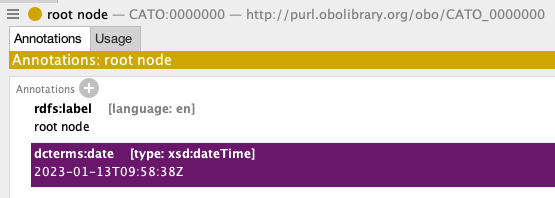

# Tutorial: How to add custom quality checks with ODK

This tutorial explains adding quality checks not included in the [ROBOT Report](http://robot.obolibrary.org/report_queries/).

## Prerequisites

You have completed the tutorials:

1. [Getting started with your repo](setting-up-project-odk.md)
1. [20 minute complete ODK walk-through](odk-tutorial-2.md)


## Custom Quality Checks

1. Identify a quality issue in your ontology. For the sake of this tutorial, we've added the annotation `oboInOwl:creation_date` to the `root_node` in the CAT Ontology.


2. Write the SPARQL query to detect the error you want to check. For example, check the value type for the annotation `oboInOwl:creation_date`. It will return the class with the annotation if it's not of type `xsd:dateTime`.

```sparql
PREFIX oboInOwl: <http://www.geneontology.org/formats/oboInOwl#>
PREFIX xsd: <http://www.w3.org/2001/XMLSchema#>

SELECT ?cls WHERE
{
	?cls oboInOwl:creation_date ?date .
  FILTER(DATATYPE(?date) != xsd:dateTime)
}
```

2. Save the SPARQL query in the `src/sparql` folder and name it `[violation name]-violation.sparql`. In the case of the tutorial, `date-as-string-violation.sparql`

3. Add the check to the ODK config file. In the [previous tutorial](setting-up-project-odk.md), this is located at `~/cato/src/ontology/cato-odk.yaml`. Inside `robot_report`, add `custom_sparql_checks`

```yaml
robot_report:
  use_labels: TRUE
  fail_on: ERROR
  report_on:
    - edit
  custom_sparql_checks:
    - date-as-string
```

4. Update the repository. After adding the custom SPARQL check, you need to update your pipeline to take this check when testing the ontology.

```bash
sh run.sh make update_repo
```

5. Test the check. You can run the checks and verify the expected result.

```bash
sh run.sh make sparql_test
FAIL Rule ../sparql/date-as-string-violation.sparql: 1 violation(s)
cls
http://purl.obolibrary.org/obo/CATO_0000000
```
To fix this issue, we need to change the annotation value to `xsd:dateTime`, and run the test again to certify everything is good this time.



```bash
sh run.sh make sparql_test
PASS Rule ../sparql/date-as-string-violation.sparql: 0 violation(s)
```

Push the changes to your repository, and the custom checks will run whenever creating a new Pull Request, as detailed [here](odk-tutorial-2.md#integration-testing).

## Custom checks available in ODK

There are several checks already available in the ODK. If you'd like to add them, add the validation name in your ODK config file.

1. `owldef-self-reference`: verify if the term uses its term as equivalent
1. `redundant-subClassOf`: verify if there are redundant subclasses between three classes
1. `taxon-range`: verify if the annotations `present_in_taxon` or `never_in_taxon` always use classes from [NCBITaxon](https://www.ebi.ac.uk/ols/ontologies/ncbitaxon)
1. `iri-range`: verify if the value for the annotations `never_in_taxon`, `present_in_taxon`, `foaf:depicted_by`, `oboInOwl:inSubset` and `dcterms:contributor` are not an IRI
1. `iri-range-advanced`: same as `iri-range` plus check for `rdfs:seeAlso` annotation
1. `label-with-iri`: verify if there is IRI in the label
1. `multiple-replaced_by`: verify if an obsolete term has multiple `replaced_by` terms
1. `term-tracker-uri`: verify if the value for the annotation [term_tracker_item](http://purl.obolibrary.org/obo/IAO_0000233) is not URI
1. `illegal-date`: verify if the value for the annotations `dcterms:date`, `dcterms:issued` and `dcterms:created` are of type `xds:date` and use the pattern `YYYY-MM-DD`

## Custom ROBOT Report in ODK

ROBOT report can also have custom quality checks. 

1. First, you need to add `custom_profile: TRUE`, in the ODK config file. 

```yaml
robot_report:
  use_labels: TRUE
  fail_on: ERROR
  custom_profile: TRUE
  report_on:
    - edit
  custom_sparql_checks:
    - date-as-string
```
2. Create a SPARQL query with your quality check and save it at `src/sparql`. There isn't a restriction on the file name. However, it should return the variables `?entity ?property ?value`.

```sparql
SELECT DISTINCT ?entity ?property ?value 
WHERE {
  ...
}
```

3. Add the path to the SPARQL query in the `src/ontology/profile.txt` file.

```
ERROR	file:../sparql/<file name>.sparql
```
For more detail on the profile file, see [here](http://robot.obolibrary.org/report#profiles).

4. Test your check. You'll find the failed cases on the same report for the ROBOT report at `src/ontology/reports/cato-edit.owl-obo-report.tsv`. The Rule Name will be the SPARQL file name.

```bash
sh run.sh make test
```

## How to choose between Custom SPARQL or Custom ROBOT report

