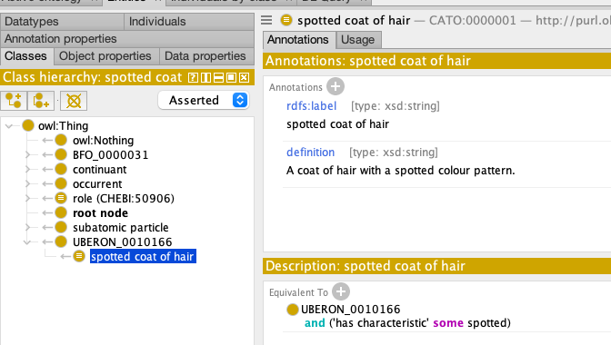

# Using DOSDP templates in ODK Workflows

## Preparation

- You are [set up for executing ODK workflows](../howto/odk-setup.md)
- We assume you have a modern ODK-based repository (ODK version >= 1.2.32) set up. For a tutorial on creating a new ontology repo from scratch see [here](setting-up-project-odk.md).
- We assume you have completed at least one of the general [DOSDP tutorials](dosdp-overview.md).

## Tutorial

- [Activate DOSDP in ODK](#activate)
- [Adding a first DOSDP template](#first-pattern)

## Video

This is a very unprofessional video below recorded as part of one of our trainings. It walks you through this tutorial here, with some additional examples being given and a bit of Q&A.

<iframe width="560" height="315" src="https://www.youtube.com/embed/8rAgSN9wwxk" title="YouTube video player" frameborder="0" allow="accelerometer; autoplay; clipboard-write; encrypted-media; gyroscope; picture-in-picture" allowfullscreen></iframe>

## Glossary

* _Template_: A document with _template strings_ that include variables which can be instantiated my a tool. For example, a ROBOT template may contain the template string `SC 'part of' some %` which can be instantiated by `ROBOT` to be transformed into an OWL axiom: `SubClassOf(CATO:001 ObjectSomeValuesFrom(BFO:0000051 UBERON:123))`. Similarly, DOSDP YAML files are often referred to as "templates" (which is appropriate). Unfortunately, we often refer to them as "patterns" which is not strictly the right way to name them: they are templates that _encode_ patterns (and that only to a limited extend). We recommend to refer to the DOSDP YAML files as "templates".
* _Template string_: See above: a single string with one or more slots for variables that can be instantiated and transformed into something else. The most important template string in DOSDP is the `equivalentTo` or `subClassOf` [field](http://incatools.github.io/dead_simple_owl_design_patterns/dosdp_schema/#logical-convenience-fields): It tells [DOSDP tools](../reference/semantic-engineering-toolbox.md) how to generate an OWL axiom, with which variable slots (`vars`).
* _Pattern_: See above, often misused to mean _Template_. In fact, a pattern provides a _general modelling solution_ to a problem. Patterns can often be encoded in templates, but this is often incomplete. For example, a template typically does not care about the semantics of the properties it refers to, while this is critical for a pattern. (Avoid using this when talking about DOSDP YAML files).
* _DOSDP template table_: The spreadsheet (typically TSV or CSV) that contains the DOSDP variable data. The DOSDP template table is applied to the _template string_ in the _template_ to generate a set of OWL axioms and annotation assertions.

### Preparation

This tutorial assumes you have set up an ODK repo with this config:

```
id: cato
title: "Cat Anatomy Ontology"
github_org: obophenotype
git_main_branch: main
repo: cat_anatomy_ontology
release_artefacts: 
  - base
  - full
  - simple
primary_release: full
export_formats:
  - owl
  - obo
  - json
import_group:
  products: 
    - id: ro
    - id: pato
    - id: omo
robot_java_args: '-Xmx8G'
```

<a name="activate"></a> 
### Activate DOSDP in ODK

In your `src/ontology/{yourontology}-odk.yaml` file, simply add the following:

```yaml
use_dosdps: true
```

This flag activates DOSDP in ODK - without it, none of the DOSDP workflows in ODK can be used. Technically, this flag tells ODK the following things:

1. The `src/ontology/Makefile` is extended as follows:
   1. A set of `pipelines`, or workflows, for processing patterns, e.g. `pattern_schema_checks` for validating all DOSDP templates,`patterns` to regenerate all patterns.
1. A new directory, `src/patterns`, is created with the following files:
   - `src/patterns/pattern.owl`: This is an ontology of your own patterns. This can be used to browse the your pattern in the form of a class hierarchy, which can help greatly to understand how they relate logically. There are some flaws in this system, like occasional unintended equivalencies between patterns, but for most uses, it is doing ok.
   - `src/patterns/definitions.owl`: This is the merged ontology of all your DOSDP generated classes. Basically, if you manage your classes across multiple DOSDP patterns and tables, their generated OWL axioms will all be added to this file.
   - `src/patterns/external.txt`: This file can be used to import external patterns. Just add the (p)URL to a pattern to the file, and the DOSDP pipeline will import it when you run it. We use this a lot when sharing DOSDP templates across ontologies.
   - Two README files: one in the directory of the default DOSDP data pipeline (`src/patterns/data/default/`) and one in the `src/patterns` directory. The former points you to the place where you should put, by default, any DOSDP data tables. More about that in the next sections.

To fully activate DOSDP in your ontology, please run:

```
sh run.sh make update_repo
```

This will:

1. Update your ontology repository to whatever ODK you have installed in docker (`v1.3`, for example)
2. Apply any changes to your configuration file. For example, the fact that you have activated the DOSDP pipeline in your config file will lead to the ODK extending your `Makefile` in certain ways

<a name="first-pattern"></a> 
### Adding a first, simple template

(1) Create a new file `src/patterns/dosdp-patterns/haircoat_colour_pattern.yaml` and paste the following content:

```yaml
pattern_name: haircoat_colour_pattern
pattern_iri: http://purl.obolibrary.org/obo/obo-academy/patterns/haircoat_colour_pattern.yaml

description: '
  Captures the multicoloured characteristic of the fur, i.e. spotted, dotted, motley etc.'

classes:
  colour_pattern: PATO:0001533
  coat_of_hair: UBERON:0010166

relations:
  has_characteristic: RO:0000053

vars: 
  colour_pattern: "'colour_pattern'"

name:
  text: "%s coat of hair"
  vars:
    - colour_pattern

def: 
  text: "A coat of hair with a %s colour pattern."
  vars:
    - colour_pattern

equivalentTo: 
  text: "'coat_of_hair' and 'has_characteristic' some %s"
  vars:
    - colour_pattern
```

(2) Let's also create a simple template table to capture traits for our ontology.

_Note_: the filename of the DOSDP template file (`haircoat_colour_pattern.yaml`) _excluding the extension_ must be _identical_
to the filename of the template table (`haircoat_colour_pattern.tsv`) _excluding the extension_.

Let's create the new file at `src/patterns/data/default/haircoat_colour_pattern.tsv`.

```
defined_class	colour_pattern
CATO:0000001	PATO:0000333
```

We are creating a minimal table here with just two columns:

* `defined_class` refers to the ID for the term that is being modelled by the template (mandatory for all DOSDP templates)
* `colour_pattern` refers to the variable of the same name specified in the `vars:` section of the DOSDP template YAML file.

### DOSDP generate: Turning the template tables into OWL axioms

Next, we will get a bit used to various commands that help us with DOSDP-based ontology development.

Lets first try to transform the simple table above to OWL using the ODK pipeline (we always use `IMP=false` to skip refreshing imports, which can be a lengthy process):

```
sh run.sh make ../patterns/definitions.owl -B IMP=false
```

This process will will create the `../patterns/definitions.owl` file, which is the file that contains _all axioms_ generated by _all templates_ you have configured. In our simple scenario, this means a simple single pattern. Let us look at definitions.owl in your favourite text editor first. 

```
Tip: Remember, the `-B` tells `make` to run the make command no matter what - one of the advantages of `make` is that it only runs a command again if something changed, for example, you have added something to a DOSDP template table.
```

```
Tip: Looking at ontologies in text editors can be very useful, both to reviewing files and making changes! Do not be afraid, the ODK will ensure you wont break anything.
```

Let us look in particular at the following section of the definitions.owl file:

```
# Class: <http://purl.obolibrary.org/obo/CATO_0000001> (http://purl.obolibrary.org/obo/PATO_0000333 coat of hair)

AnnotationAssertion(<http://purl.obolibrary.org/obo/IAO_0000115> <http://purl.obolibrary.org/obo/CATO_0000001> "A coat of hair with a http://purl.obolibrary.org/obo/PATO_0000333 colour pattern."^^xsd:string)
AnnotationAssertion(rdfs:label <http://purl.obolibrary.org/obo/CATO_0000001> "http://purl.obolibrary.org/obo/PATO_0000333 coat of hair"^^xsd:string)
EquivalentClasses(<http://purl.obolibrary.org/obo/CATO_0000001> ObjectIntersectionOf(<http://purl.obolibrary.org/obo/UBERON_0010166> ObjectSomeValuesFrom(<http://purl.obolibrary.org/obo/RO_0000053> <http://purl.obolibrary.org/obo/PATO_0000333>)))
```

These are the three axioms / annotation assertions that were created by the DOSDP pipeline. The first annotation is a simple automatically generated definition. What is odd at first glance, is that the definition reads `"A coat of hair with a http://purl.obolibrary.org/obo/PATO_0000333 colour pattern."` - what does the `PATO:0000333` IRI do in the middle of our definition? Understanding this is _fundamental_ to the DODSP pattern workflow, because it is likely that you will have to fix cases like this from time to time.

The DOSDP workflow is about generating axioms automatically from existing terms. For example, in this tutorial we are trying to generate terms for different kinds of hair coats for our cats, using the `colour pattern` (PATO:0001533) hierarchy in the PATO ontology as a basis. The only one term we have added so far is `spotted` (PATO:0000333). The problem is though, that `dosdp-tools`, the tool which is part of the ODK and responsible for the DOSDP workflows, does not know anything about PATO:0000333 unless it is already imported into the ontology. In order to remedy this situation, lets import the term:

```
sh run.sh make refresh-pato
```

ODK will automatically see that you have used PATO:0000333 in your ontology, and import it for you. Next, let us make sure that the our edit file has the correct import configured. Open your ontology in a text editor, and make sure you can find the following import statement:

```
Import(<http://purl.obolibrary.org/obo/cato/patterns/definitions.owl>)
```

Replace `cato` in the PURL with whatever is the ID of your own ontology. Also, do not forget to update `src/ontology/catalog-v001.xml`, by adding this line:

```
<group id="Folder Repository, directory=, recursive=false, Auto-Update=false, version=2" prefer="public" xml:base="">
...
<uri name="http://purl.obolibrary.org/obo/cato/patterns/definitions.owl" uri="../patterns/definitions.owl"/>
...
</group>
```

Important: Remember that we have not yet told dosdp-tools about the freshly imported PATO:0000333 term. To do that, lets run the DOSDP pipeline again:

```
sh run.sh make ../patterns/definitions.owl -B IMP=false
```

A quick look at `src/patterns/definitions.owl` would now reveal your correctly formatted definitions:

```
AnnotationAssertion(<http://purl.obolibrary.org/obo/IAO_0000115> <http://purl.obolibrary.org/obo/CATO_0000001> "A coat of hair with a spotted colour pattern."^^xsd:string)
```

Now, we are ready to view our ontology (the edit file, i.e. `src/ontology/cato-edit.owl`) in Protege:



Still a few things to iron out - there is an UBERON term that we still need to import, and our class is not a subclass of the CATO `root node`, but we had a good start.

### Re-using externally defined patterns

Re-using terms is at the heart of the OBO philosophy, but when it comes to re-using axiom patterns, such as the ones we can define as part of a ROBOT template, we are (as of 2022) still in the early stages. One thing we can do to facilitate re-use is to share DOSDP templates between different projects. We do that by simply adding the URL at which the pattern is located to `src/patterns/dosdp-patterns/external.txt`. Note: if you are copying a URL from GitHub, make sure it is the `raw` url, i.e.:

* src/patterns/dosdp-patterns/external.txt

```
https://raw.githubusercontent.com/obophenotype/bio-attribute-ontology/master/src/patterns/dosdp-patterns/entity_attribute.yaml
```

Here, we randomly decided to import a pattern defined by the [Ontology of Biological Attributes](https://github.com/obophenotype/bio-attribute-ontology) (an ontology of traits such as `tail length` or `head size`), for example to represent cat traits in our Cat Ontology. After adding the above URL to our the `external.txt` file, we can add it to our pipeline:

```
sh run.sh make update_patterns
```

You will now see the `entity_attribute.yaml` template in `src/patterns/dosdp-patterns`. We will not do anything with this template as part of this tutorial, so you can remove it again if you wish (by removing the URL from the `external.txt` file and physically deleting the `src/patterns/dosdp-patterns/entity_attribute.yaml` file).

### DOSDP pipelines in ODK

Sometimes, we want to manage more than one DOSDP pipeline at once. For example, in more than one of our projects, we have some patterns that are automatically generated by software tools, and others that are manually curated by ontology developers. In other use cases, we sometimes want to restrict the pattern pipelines to _generating only logical axioms_. In either case, we can add new pipelines by adding the following to the `src/ontology/youront-odk.yaml` file:

```
pattern_pipelines_group:
  products:
    - id: manual
      dosdp_tools_options: "--obo-prefixes=true --restrict-axioms-to=logical"
    - id: auto
      dosdp_tools_options: "--obo-prefixes=true"
```

This does the following: It tells the ODK that you want

## Reference

### A full example ODK configuration

```
id: cato
title: "Cat Anatomy Ontology"
github_org: obophenotype
git_main_branch: main
use_dosdps: TRUE
repo: cat_anatomy_ontology
release_artefacts: 
  - base
  - full
  - simple
primary_release: full
export_formats:
  - owl
  - obo
  - json
import_group:
  products: 
    - id: ro
    - id: pato
    - id: omo
robot_java_args: '-Xmx8G'
pattern_pipelines_group:
  products:
    - id: manual
      dosdp_tools_options: "--obo-prefixes=true --restrict-axioms-to=logical"
    - id: auto
      dosdp_tools_options: "--obo-prefixes=true"
```

### ODK configuration reference for DOSDP

| Flag | Explanation |
| ---- | ----------- |
| use_dosdps: TRUE | Activates DOSDP in your ODK repository setup |
| pattern_pipelines_group:<br>products:<br>  - id: manual<br>    dosdp_tools_options: "--obo-prefixes=true --restrict-axioms-to=logical" | Adding a `manual` pipeline to your DOSDP setup in which only _logical_ axioms are generated. |

