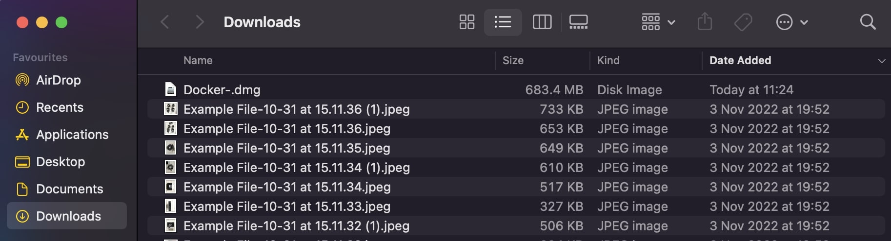
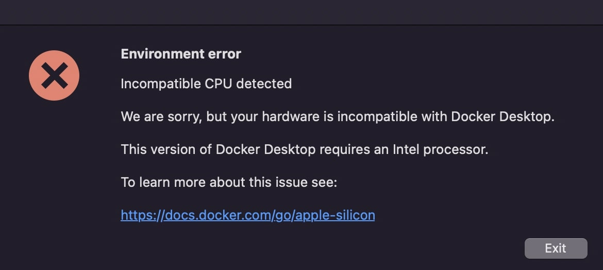
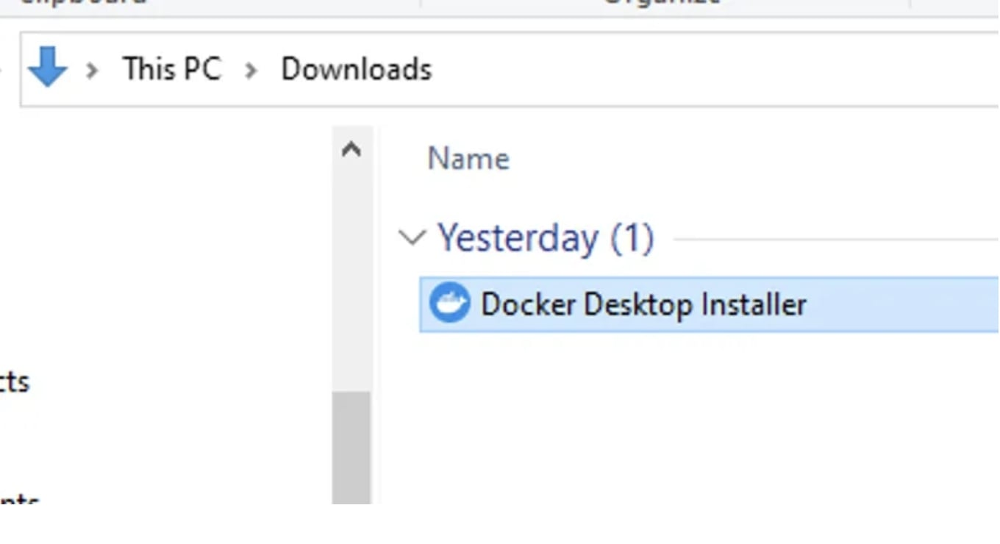
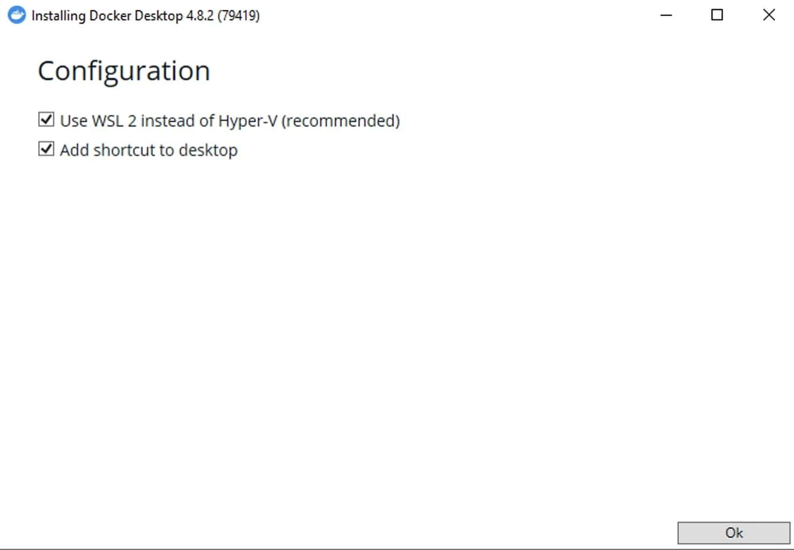
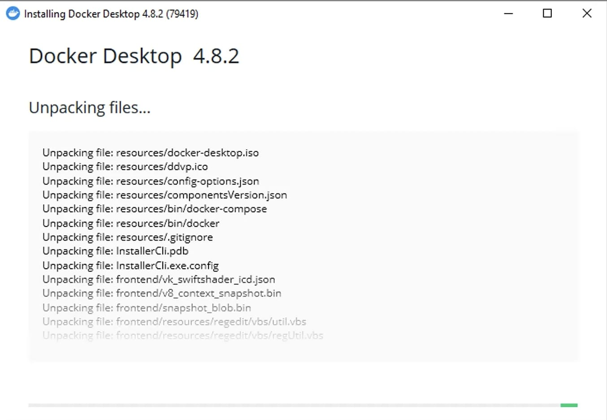
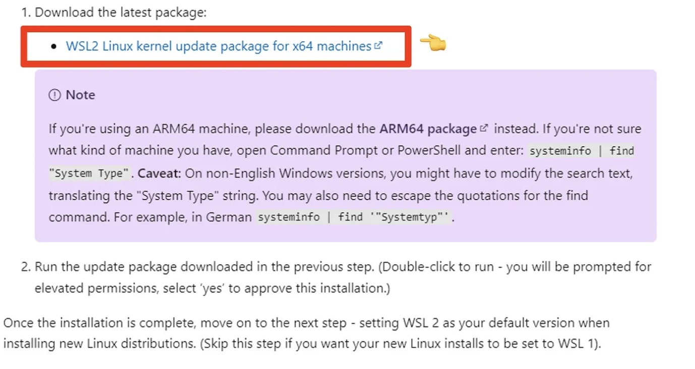
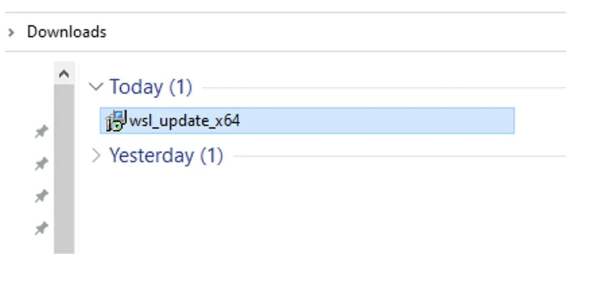
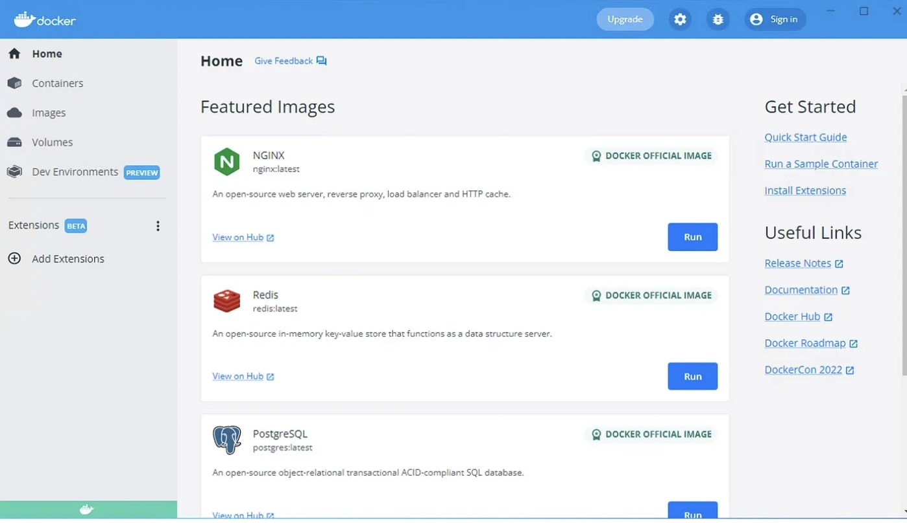

## Tutorial: an introduction to Exomiser

Exomiser is a Java program that ranks potential rare Mendelian disease-causing variants from whole-exome or whole-genome sequencing data. Starting from a patient's VCF file and a set of phenotypes encoded using the [Human Phenotype Ontology](https://hpo.jax.org/app/) (HPO), it will annotate, filter and prioritise likely causative variants. The program does this based on user-defined criteria such as a variant's predicted pathogenicity, frequency of occurrence in a population and also how closely the given patient's phenotype matches any known phenotype of genes from human disease and model organism data.

In this tutorial, we will learn how to install and run Exomiser with Docker, and how to interpret the results in various output formats detailing the predicted causative genes and variants. If you prefer to work locally, instructions are also provided below for Windows and Linux/Mac users.

The complete Exomiser documentation can be found [here](https://exomiser.readthedocs.io/en/latest/) and the GitHub repository [here](https://github.com/exomiser/Exomiser).

Please note that this tutorial is up-to-date with the current latest release 13.2.0 and data version up to 2302 (Feb 2023).

## PREREQUISITES

You know:

- how to use a command line interface.

You have:

- Docker installed and running on your machine. Check out this simple guide to set up [Docker for Windows](#docker-windows) or [Docker for Mac](#docker-mac).

- We recommend to have Exomiser installed via Docker prior to the tutorial. Open a terminal and run the command below:

```shell
docker pull exomiser/exomiser-cli:13.2.0
```

- [Exomiser-Tutorial files](https://drive.google.com/drive/u/2/folders/1DynxpvOTecvAXv3uYtJ0d2-A4NjQyyfN) downloaded
  from our GoogleDrive. Alternatively:

```shell
# download the data via
wget https://github.com/iQuxLE/Exomiser-Tutorial/raw/main/Exomiser-Tutorial.zip
# OR clone the repository
git clone https://github.com/iQuxLE/Exomiser-Tutorial.git

# unzip
unzip Exomiser-Tutorial.zip
```


Since the VCF files for parts of the example data are a bit larger, you need to download the following separately and put it into the `Exomiser-Tutorial` folder.

```shell
# download
wget https://github.com/iQuxLE/Exomiser-Tutorial/raw/main/pfeiffer-family-vcf.zip
# unzip
unzip pfeiffer-family-vcf.zip -d Exomiser-Tutorial/exomiser-config/
```

The `Exomiser-Tutorial` folder contains a directory called `exomiser-config` (with all the analysis files)
and `exomiser-overview` (with some introductory slides).

- Importantly, we ***highly*** recommend downloading the Exomiser data prior to the tutorial in order to follow along.
  The data required to run Exomiser is ~80GB and will take a while to download and unpack. For this tutorial, you only
  need to download the Exomiser phenotype data and the variant data for the hg19 assembly. If you have your own samples
  to run with Exomiser and the VCF files are built on the hg38 build, then you will need to download the hg38 variant
  data as well. The current data version that will use in this tutorial is 2302 (Feb 2023). This will change in the
  future. Always make sure that you use the latest data version available. To download the Exomiser data from the
  terminal:

```shell
# create an empty directory for exomiser-data within the Exomiser-Tutorial folder:
cd /path/to/Exomiser-Tutorial/
mkdir exomiser-data
cd exomiser-data
# download the data
wget https://data.monarchinitiative.org/exomiser/latest/2302_phenotype.zip # for the phenotype database
wget https://data.monarchinitiative.org/exomiser/latest/2302_hg19.zip # for the hg19 variant database
# unzip the data
unzip "2302_*.zip"
```

Otherwise, visit the links, download the data in your own `exomiser-data` directory and unzip them:

[2302 phenotype database](https://data.monarchinitiative.org/exomiser/latest/2302_phenotype.zip)

[2302 hg19 variant database](https://data.monarchinitiative.org/exomiser/latest/2302_hg19.zip)

Your `Exomiser-Tutorial` directory should now be structured as follows:

```
Exomiser-Tutorial
    ├── exomiser-config
    ├── exomiser-data
    │ ├── 2302_hg19
    │ └── 2302_phenotype
    └── exomiser-overview
      └── exomiser-tutorial-slides
```

## Outline of the tutorial

- [Exomiser overview](#exomiser-overview)
- [Exomiser installation](#exomiser-installation)
    - [via Docker](#via-docker)
    - [via Windows](#via-windows)
    - [via Linux/Mac](#via-linuxmac)
    - [Configuring the application.properties](#configuring-the-applicationproperties)
- [Running Exomiser](#running-exomiser)
    - [Using phenopackets](#using-phenopackets)
    - [Analysis settings](#analysis-settings)
    - [Running via Docker](#running-via-docker)
    - [Running locally](#running-locally)
    - [Analysing multi-sample VCF files](#analysing-multi-sample-vcf-files)
    - [Running large jobs (batch)](#running-large-jobs-batch)
- [Results](#results)
    - [HTML](#html)
    - [JSON](#json)
    - [TSV VARIANTS](#tsv-variants)
    - [TSV GENES](#tsv-genes)

## Exomiser overview

For a quick overview of Exomiser take a look at the slides located in
the [Google Drive](https://drive.google.com/drive/u/2/folders/1DynxpvOTecvAXv3uYtJ0d2-A4NjQyyfN)
or [GitHub repo](https://github.com/iQuxLE/Exomiser-Tutorial).

## Exomiser installation

### via Docker

(recommended to be installed prior to the tutorial)

```shell
docker pull exomiser/exomiser-cli:13.2.0
```

### via Windows

1. Install [7-Zip](http://www.7-zip.org/) for unzipping the archive files. The built-in archiving software has issues extracting the zip files.
2. Download the `exomiser-cli-13.2.0-distribution.zip` distribution from [Monarch](https://data.monarchinitiative.org/exomiser/latest/exomiser-cli-13.2.0-distribution.zip).
3. Download the variant `2302_hg19.zip` and phenotype `2302_phenotype.zip` data files from [Monarch](https://data.monarchinitiative.org/exomiser/latest).
4. Extract the distribution files by right-clicking `exomiser-cli-13.2.0-distribution.zip` and selecting 7-Zip > Extract Here
5. Extract the data files (e.g. `2302_phenotype.zip`, `2302_hg19.zip`) by right-clicking the archive and selecting 7-Zip > Extract files… into the exomiser data directory. By default, Exomiser expects this to be ‘exomiser-cli-13.2.0/data’, but this can be changed in the application.properties.

### via Linux/Mac

The following shell script should work:

```shell
# download the distribution (won't take long)
wget https://data.monarchinitiative.org/exomiser/latest/exomiser-cli-13.2.0-distribution.zip
# download the data (this is ~80GB and will take a while). If you only require a single assembly, only download the relevant files.
wget https://data.monarchinitiative.org/exomiser/latest/2302_hg19.zip
wget https://data.monarchinitiative.org/exomiser/latest/2302_phenotype.zip
# unzip the distribution and data files - this will create a directory called 'exomiser-cli-13.2.0' in the current working directory (with examples and application.properties)
unzip exomiser-cli-13.2.0-distribution.zip
unzip '2302_*.zip' -d exomiser-cli-13.2.0/data

```

### Configuring the application.properties

The application.properties file needs to be updated to point to the correct location of the Exomiser data. For the purpose of this tutorial, this is already sorted, pointing to the mounted directory inside the Docker container `exomiser.data-directory=/exomiser-data`.

Also, you want to make sure to edit the file to use the correct data version (currently 2302):

```shell
 exomiser.hg19.data-version=2302
 exomiser.phenotype.data-version=2302
```

## Running Exomiser

For this tutorial, we will focus on running Exomiser on a single-sample (whole-exome) VCF file. Additional instructions for running Exomiser on multi-sample VCF data and large jobs are also provided below.

### Using phenopackets

It is recommended to provide Exomiser with the input sample as a Phenopacket. Exomiser will accept this in either JSON
or YAML format. We will use the example `pfeiffer-phenopacket.yml` below:

```yaml
id: manuel
subject:
  id: manuel
  sex: MALE
phenotypicFeatures:
  - type:
      id: HP:0001159
      label: Syndactyly
  - type:
      id: HP:0000486
      label: Strabismus
  - type:
      id: HP:0000327
      label: Hypoplasia of the maxilla
  - type:
      id: HP:0000520
      label: Proptosis
  - type:
      id: HP:0000316
      label: Hypertelorism
  - type:
      id: HP:0000244
      label: Brachyturricephaly
htsFiles:
  - uri: exomiser/Pfeiffer.vcf.gz
    htsFormat: VCF
    genomeAssembly: hg19
metaData:
  created: '2019-11-12T13:47:51.948Z'
  createdBy: julesj
  resources:
    - id: hp
      name: human phenotype ontology
      url: http://purl.obolibrary.org/obo/hp.owl
      version: hp/releases/2019-11-08
      namespacePrefix: HP
      iriPrefix: 'http://purl.obolibrary.org/obo/HP_'
  phenopacketSchemaVersion: 1.0
```

> **_NOTE:_** This is an example of a v1.0 phenopacket, there is a more recent release of v2.0. Exomiser can run
> phenopackets built with either v1.0 or v2.0 schema. You can find out more about the v2.0 phenopacket schema and how to
> build one with Python or Java [here](https://phenopacket-schema.readthedocs.io/en/latest/). To convert a phenopacket
> v1.0 to v2.0, you can use [phenopacket-tools](https://github.com/phenopackets/phenopacket-tools).

### Analysis settings

Below are the default analysis settings from `pfeiffer-analysis.yml` that we will use in our tutorial:

```yaml
---
analysis:
  #FULL or PASS_ONLY
  analysisMode: PASS_ONLY
  # In cases where you do not want any cut-offs applied an empty map should be used e.g. inheritanceModes: {}
  # These are the default settings, with values representing the maximum minor allele frequency in percent (%) permitted for an
  # allele to be considered as a causative candidate under that mode of inheritance.
  # If you just want to analyse a sample under a single inheritance mode, delete/comment-out the others. For AUTOSOMAL_RECESSIVE
  # or X_RECESSIVE ensure *both* relevant HOM_ALT and COMP_HET modes are present.
  inheritanceModes: {
    AUTOSOMAL_DOMINANT: 0.1,
    AUTOSOMAL_RECESSIVE_COMP_HET: 2.0,
    AUTOSOMAL_RECESSIVE_HOM_ALT: 0.1,
    X_DOMINANT: 0.1,
    X_RECESSIVE_COMP_HET: 2.0,
    X_RECESSIVE_HOM_ALT: 0.1,
    MITOCHONDRIAL: 0.2
  }
  #Possible frequencySources:
  #Thousand Genomes project http://www.1000genomes.org/
  #   THOUSAND_GENOMES,
  #ESP project http://evs.gs.washington.edu/EVS/
  #   ESP_AFRICAN_AMERICAN, ESP_EUROPEAN_AMERICAN, ESP_ALL,
  #ExAC project http://exac.broadinstitute.org/about
  #   EXAC_AFRICAN_INC_AFRICAN_AMERICAN, EXAC_AMERICAN,
  #   EXAC_SOUTH_ASIAN, EXAC_EAST_ASIAN,
  #   EXAC_FINNISH, EXAC_NON_FINNISH_EUROPEAN,
  #   EXAC_OTHER
  #Possible frequencySources:
  #Thousand Genomes project - http://www.1000genomes.org/ (THOUSAND_GENOMES)
  #TOPMed - https://www.nhlbi.nih.gov/science/precision-medicine-activities (TOPMED)
  #UK10K - http://www.uk10k.org/ (UK10K)
  #ESP project - http://evs.gs.washington.edu/EVS/ (ESP_)
  #   ESP_AFRICAN_AMERICAN, ESP_EUROPEAN_AMERICAN, ESP_ALL,
  #ExAC project http://exac.broadinstitute.org/about (EXAC_)
  #   EXAC_AFRICAN_INC_AFRICAN_AMERICAN, EXAC_AMERICAN,
  #   EXAC_SOUTH_ASIAN, EXAC_EAST_ASIAN,
  #   EXAC_FINNISH, EXAC_NON_FINNISH_EUROPEAN,
  #   EXAC_OTHER
  #gnomAD - http://gnomad.broadinstitute.org/ (GNOMAD_E, GNOMAD_G)
  frequencySources: [
    THOUSAND_GENOMES,
    TOPMED,
    UK10K,

    ESP_AFRICAN_AMERICAN, ESP_EUROPEAN_AMERICAN, ESP_ALL,

    EXAC_AFRICAN_INC_AFRICAN_AMERICAN, EXAC_AMERICAN,
    EXAC_SOUTH_ASIAN, EXAC_EAST_ASIAN,
    EXAC_FINNISH, EXAC_NON_FINNISH_EUROPEAN,
    EXAC_OTHER,

    GNOMAD_E_AFR,
    GNOMAD_E_AMR,
    #        GNOMAD_E_ASJ,
    GNOMAD_E_EAS,
    GNOMAD_E_FIN,
    GNOMAD_E_NFE,
    GNOMAD_E_OTH,
    GNOMAD_E_SAS,

    GNOMAD_G_AFR,
    GNOMAD_G_AMR,
    #        GNOMAD_G_ASJ,
    GNOMAD_G_EAS,
    GNOMAD_G_FIN,
    GNOMAD_G_NFE,
    GNOMAD_G_OTH,
    GNOMAD_G_SAS
  ]
  # Possible pathogenicitySources: (POLYPHEN, MUTATION_TASTER, SIFT), (REVEL, MVP), CADD, REMM
  # REMM is trained on non-coding regulatory regions
  # *WARNING* if you enable CADD or REMM ensure that you have downloaded and installed the CADD/REMM tabix files
  # and updated their location in the application.properties. Exomiser will not run without this.
  pathogenicitySources: [ REVEL, MVP ]
  #this is the standard exomiser order.
  #all steps are optional
  steps: [
    #hiPhivePrioritiser: {},
    #priorityScoreFilter: {priorityType: HIPHIVE_PRIORITY, minPriorityScore: 0.500},
    #intervalFilter: {interval: 'chr10:123256200-123256300'},
    # or for multiple intervals:
    #intervalFilter: {intervals: ['chr10:123256200-123256300', 'chr10:123256290-123256350']},
    # or using a BED file - NOTE this should be 0-based, Exomiser otherwise uses 1-based coordinates in line with VCF
    #intervalFilter: {bed: /full/path/to/bed_file.bed},
    #genePanelFilter: {geneSymbols: ['FGFR1','FGFR2']},
      failedVariantFilter: { },
    #qualityFilter: {minQuality: 50.0},
      variantEffectFilter: {
        remove: [
            FIVE_PRIME_UTR_EXON_VARIANT,
            FIVE_PRIME_UTR_INTRON_VARIANT,
            THREE_PRIME_UTR_EXON_VARIANT,
            THREE_PRIME_UTR_INTRON_VARIANT,
            NON_CODING_TRANSCRIPT_EXON_VARIANT,
            UPSTREAM_GENE_VARIANT,
            INTERGENIC_VARIANT,
        REGULATORY_REGION_VARIANT,
        CODING_TRANSCRIPT_INTRON_VARIANT,
        NON_CODING_TRANSCRIPT_INTRON_VARIANT,
        DOWNSTREAM_GENE_VARIANT
      ]
    },
    # removes variants represented in the database
    #knownVariantFilter: {},
    frequencyFilter: {maxFrequency: 2.0},
    pathogenicityFilter: {keepNonPathogenic: true},
    # inheritanceFilter and omimPrioritiser should always run AFTER all other filters have completed
    inheritanceFilter: {},
    # omimPrioritiser isn't mandatory.
    omimPrioritiser: {},
    #priorityScoreFilter: {minPriorityScore: 0.4},
    # Other prioritisers: Only combine omimPrioritiser with one of these.
    # Don't include any if you only want to filter the variants.
    hiPhivePrioritiser: {},
    # or run hiPhive in benchmarking mode:
    #hiPhivePrioritiser: {runParams: 'mouse'},
    #phivePrioritiser: {}
    #phenixPrioritiser: {}
    #exomeWalkerPrioritiser: {seedGeneIds: [11111, 22222, 33333]}
  ]
outputOptions:
    outputContributingVariantsOnly: false
    #numGenes options: 0 = all or specify a limit e.g. 500 for the first 500 results
    numGenes: 0
    #minExomiserGeneScore: 0.7
    # Path to the desired output directory. Will default to the 'results' subdirectory of the exomiser install directory
    outputDirectory: results
    # Filename for the output files. Will default to {input-vcf-filename}-exomiser
    outputFileName: Pfeiffer-HIPHIVE-exome
    #out-format options: HTML, JSON, TSV_GENE, TSV_VARIANT, VCF (default: HTML)
    outputFormats: [HTML, JSON, TSV_GENE, TSV_VARIANT]
```

### Running via Docker

```shell
docker run -it -v "/path/to/Exomiser-Tutorial/exomiser-data:/exomiser-data" \
-v "/path/to/Exomiser-Tutorial/exomiser-config/:/exomiser" \
-v "/path/to/Exomiser-Tutorial/exomiser-results:/results" \
exomiser/exomiser-cli:13.2.0 \
--sample /exomiser/pfeiffer-phenopacket.yml \
--analysis /exomiser/pfeiffer-analysis.yml \
--spring.config.location=/exomiser/application.properties
```

### Running locally

Assuming that you are within the `exomiser-cli-13.2.0` distribution folder:

```shell
java -jar exomiser-cli-13.2.0.jar --sample examples/pfeiffer-phenopacket.yml \
--analysis examples/exome-analysis.yml --output examples/output-options.yml  
```

### Analysing multi-sample VCF files

When analysing a multi-sample VCF file, you must detail the pedigree information in a phenopacket describing a Family
object:

e.g. `Exomiser-Tutorial/exomiser-config/pfeiffer-family.yml`

```yaml
id: ISDBM322017-family
proband:
  subject:
    id: ISDBM322017
    sex: FEMALE
  phenotypicFeatures:
    - type:
        id: HP:0001159
        label: Syndactyly
    - type:
        id: HP:0000486
        label: Strabismus
    - type:
        id: HP:0000327
        label: Hypoplasia of the maxilla
    - type:
        id: HP:0000520
        label: Proptosis
    - type:
        id: HP:0000316
        label: Hypertelorism
    - type:
        id: HP:0000244
        label: Brachyturricephaly
pedigree:
  persons:
    - individualId: ISDBM322017
      paternalId: ISDBM322016
      maternalId: ISDBM322018
      sex: FEMALE
      affectedStatus: AFFECTED
    - individualId: ISDBM322015
      paternalId: ISDBM322016
      maternalId: ISDBM322018
      sex: MALE
      affectedStatus: UNAFFECTED
    - individualId: ISDBM322016
      sex: MALE
      affectedStatus: UNAFFECTED
    - individualId: ISDBM322018
      sex: FEMALE
      affectedStatus: UNAFFECTED
htsFiles:
  - uri: exomiser/Pfeiffer-quartet.vcf.gz
    htsFormat: VCF
    genomeAssembly: GRCh37
metaData:
  created: '2019-11-12T13:47:51.948Z'
  createdBy: julesj
  resources:
    - id: hp
      name: human phenotype ontology
      url: http://purl.obolibrary.org/obo/hp.owl
      version: hp/releases/2019-11-08
      namespacePrefix: HP
      iriPrefix: 'http://purl.obolibrary.org/obo/HP_'
  phenopacketSchemaVersion: 1.0
```

Running via Docker:

```shell
docker run -it -v '/path/to/Exomiser-Tutorial/exomiser-data:/exomiser-data' \
-v '/path/to/Exomiser-Tutorial/exomiser-config/:/exomiser' \
-v '/path/to/Exomiser-Tutorial/exomiser-results:/results' \
exomiser/exomiser-cli:13.2.0 \
--sample /exomiser/pfeiffer-family.yml \
--analysis /exomiser/pfeiffer-analysis.yml \
--spring.config.location=/exomiser/application.properties
```

Running locally:

Assuming that you are within the `exomiser-cli-13.2.0` distribution folder

```shell
java -jar exomiser-cli-13.2.0.jar --sample examples/pfeiffer-family.yml --analysis examples/exome-analysis.yml --output examples/output-options.yml
```

### Running large jobs (batch)

The above commands can be added to a batch file for example in the
file `Exomiser-Tutorial/exomiser-config/test-analysis-batch-commands.txt`. Using it with Docker we recommend creating a
new directory for the batch files and mounting that to the Docker container.

Running via Docker:

```shell
docker run -it -v '/path/to/Exomiser-Tutorial/exomiser-data:/exomiser-data' \
-v '/path/to/Exomiser-Tutorial/exomiser-config/:/exomiser' \
-v '/path/to/Exomiser-Tutorial/exomiser-results:/results' \
-v '/path/to/Exomiser-Tutorial/exomiser-batch-files:/batch-files' \
exomiser/exomiser-cli:13.2.0 \
--batch /batch-files/test-analysis-batch-commands.txt
--spring.config.location=/exomiser/application.properties
```

Running locally:

Assuming that you are within the `exomiser-cli-13.2.0` distribution folder

```shell
java -jar exomiser-cli-13.2.0.jar --batch examples/test-analysis-batch-commands.txt
```

The advantage of this is that a single command will be able to analyse many samples in far less time than starting a new
JVM for each as there will be no start-up penalty after the initial start and the Java JIT compiler will be able to take
advantage of a longer-running process to optimise the runtime code. For maximum throughput on a cluster consider
splitting your batch jobs over multiple nodes.

## Results

Depending on the output options provided, Exomiser will write out at least an HTML and JSON output file in the `results` subdirectory of the Exomiser installation (by default) or a user-defined results directory as indicated in the output options.

As a general rule, all output files contain a ranked list of genes and variants with the top-ranked gene/variant displayed first. The exception being the VCF output (if requested in the output options) which, since version 13.1.0, is sorted according to VCF convention and tabix indexed.

In our tutorial, we requested HTML, JSON, TSV_VARIANT and TSV_GENE output formats which are briefly outlined below.

### HTML


### JSON

The JSON file represents the most accurate representation of the results, as it is referenced internally by Exomiser. As
such, we don’t provide a schema for this, but it has been pretty stable and breaking changes will only occur with major
version changes to the software. Minor additions are to be expected for minor releases, as per the SemVer specification.

We recommend using Python or JQ to extract data from this file. To give you an idea of how you can extract some data with Python, we have provided examples of how you can iterate over the results below. However, there is a lot more information content that you can pull out from the JSON results file, this only provides a snippet of what you can do.

```python
# import json library
import json

# to load in the exomiser json result
with open("path/to/Exomiser-Tutorial/Pfeiffer-HIPHIVE-exome.json") as exomiser_json_result:
    exomiser_result = json.load(exomiser_json_result)
exomiser_json_result.close()

# to retrieve all predicted genes and corresponding identifier (ENSEMBL)
gene_results = []
for result in exomiser_result:
    gene_results.append({result["geneSymbol"]: result["geneIdentifier"]["geneId"]})

# to retrieve all predicted variants
variant_results = []
for result in exomiser_result:
  for moi in result["geneScores"]:  # iterating over all modes of inheritance
    if "contributingVariants" in moi:  #  checking if there is evidence of contributing variants
        for cv in moi["contributingVariants"]:  # iterating over all contributing variants
          variant_results.append({"chromosome": cv["contigName"],
                                  "start_pos": cv["start"],
                                  "end_pos": cv["end"],
                                  "ref_allele": cv["ref"],
                                  "alt_allele": cv["alt"]})

```

### TSV VARIANTS

In the `Pfeiffer-hiphive-exome-PASS_ONLY.variants.tsv` file it is possible for a variant, like a gene, to appear multiple times, depending on the MOI it is
compatible with. For example, in the excerpt of the file below, MUC6 has two variants ranked 7th under the AD model and two ranked 8th
under an AR (compound heterozygous) model. In the AD case the CONTRIBUTING_VARIANT column indicates whether the variant
was (1) or wasn't (0) used for calculating the EXOMISER_GENE_COMBINED_SCORE and EXOMISER_GENE_VARIANT_SCORE.

```
#RANK   ID      GENE_SYMBOL     ENTREZ_GENE_ID  MOI     P-VALUE EXOMISER_GENE_COMBINED_SCORE    EXOMISER_GENE_PHENO_SCORE       EXOMISER_GENE_VARIANT_SCORE     EXOMISER_VARIANT_SCORE  CONTRIBUTING_VARIANT    WHITELIST_VARIANT       VCF_ID  RS_ID   CONTIG  START   END     REF     ALT     CHANGE_LENGTH   QUAL    FILTER  GENOTYPE        FUNCTIONAL_CLASS        HGVS    EXOMISER_ACMG_CLASSIFICATION    EXOMISER_ACMG_EVIDENCE  EXOMISER_ACMG_DISEASE_ID        EXOMISER_ACMG_DISEASE_NAME      CLINVAR_ALLELE_ID       CLINVAR_PRIMARY_INTERPRETATION  CLINVAR_STAR_RATING     GENE_CONSTRAINT_LOEUF   GENE_CONSTRAINT_LOEUF_LOWER     GENE_CONSTRAINT_LOEUF_UPPER     MAX_FREQ_SOURCE MAX_FREQ        ALL_FREQ        MAX_PATH_SOURCE MAX_PATH        ALL_PATH
1       10-123256215-T-G_AD     FGFR2   2263    AD      0.0000  0.9957  0.9187  1.0000  1.0000  1       1               rs121918506     10      123256215       123256215       T       G       0       900.0000        PASS    0/1     missense_variant        FGFR2:ENST00000346997.2:c.1688A>C:p.(Glu563Ala) PATHOGENIC      PM2,PP3_Strong,PP4,PP5_Strong   ORPHA:87        Apert syndrome  28333   PATHOGENIC_OR_LIKELY_PATHOGENIC 2       0.13692 0.074   0.27                            REVEL   0.965   REVEL=0.965,MVP=0.9517972
2       5-71755984-C-G_AD       ZNF366  167465  AD      0.0018  0.9237  0.8195  0.7910  0.7910  1       0               rs375204168     5       71755984        71755984        C       G       0       380.8900        PASS    0/1     splice_region_variant   ZNF366:ENST00000318442.5:c.1332+8G>C:p.?        UNCERTAIN_SIGNIFICANCE                                  NOT_PROVIDED    0       0.27437 0.155   0.515   EXAC_AMERICAN   0.07975895      THOUSAND_GENOMES=0.01997,TOPMED=0.01096,ESP_EUROPEAN_AMERICAN=0.0116,ESP_ALL=0.0077,EXAC_AMERICAN=0.07975895,EXAC_NON_FINNISH_EUROPEAN=0.010914307,GNOMAD_E_AMR=0.07153929,GNOMAD_E_NFE=0.010890082,GNOMAD_E_OTH=0.018328445
3       16-2150254-G-A_AD       PKD1    5310    AD      0.0050  0.8272  0.6597  0.8707  0.8707  1       0               rs147967021     16      2150254 2150254 G       A       0       406.0800        PASS    0/1     missense_variant        PKD1:ENST00000262304.4:c.9625C>T:p.(Arg3209Cys) UNCERTAIN_SIGNIFICANCE                          1319391 UNCERTAIN_SIGNIFICANCE  1       0.12051 0.082   0.179   EXAC_AMERICAN   0.06979585      THOUSAND_GENOMES=0.01997,TOPMED=0.007934,EXAC_AMERICAN=0.06979585,EXAC_NON_FINNISH_EUROPEAN=0.0015655332,EXAC_SOUTH_ASIAN=0.012149192,GNOMAD_E_AFR=0.006708708,GNOMAD_E_AMR=0.05070389,GNOMAD_E_NFE=0.002718672,GNOMAD_E_SAS=0.013009822,GNOMAD_G_AFR=0.011462632       MVP     0.8792868       REVEL=0.346,MVP=0.8792868
4       3-56653839-CTG-C_AD     CCDC66  285331  AD      0.0051  0.8262  0.5463  0.9984  0.9984  1       0               rs751329549     3       56653839        56653841        CTG     C       -2      1872.9400       PASS    0/1     frameshift_truncation   CCDC66:ENST00000326595.7:c.2572_2573del:p.(Val858Glnfs*6)       UNCERTAIN_SIGNIFICANCE                                  NOT_PROVIDED    0       0.9703  0.78    1.215   GNOMAD_E_AMR    0.011914691     TOPMED=7.556E-4,EXAC_EAST_ASIAN=0.01155535,EXAC_NON_FINNISH_EUROPEAN=0.0015023135,GNOMAD_E_AMR=0.011914691,GNOMAD_E_EAS=0.0057977736,GNOMAD_E_NFE=8.988441E-4
5       13-110855918-C-G_AD     COL4A1  1282    AD      0.0075  0.7762  0.5288  0.9838  0.9838  1       0               rs150182714     13      110855918       110855918       C       G       0       1363.8700       PASS    0/1     missense_variant        COL4A1:ENST00000375820.4:c.994G>C:p.(Gly332Arg) UNCERTAIN_SIGNIFICANCE  PP3_Moderate    OMIM:175780     Brain small vessel disease with or without ocular anomalies     333515  CONFLICTING_PATHOGENICITY_INTERPRETATIONS       1       0.065014        0.035   0.128   ESP_EUROPEAN_AMERICAN   0.0233  THOUSAND_GENOMES=0.01997,TOPMED=0.0068,ESP_EUROPEAN_AMERICAN=0.0233,ESP_ALL=0.0154,EXAC_AFRICAN_INC_AFRICAN_AMERICAN=0.009609841,EXAC_NON_FINNISH_EUROPEAN=0.007491759,GNOMAD_E_AFR=0.013068479,GNOMAD_E_NFE=0.0071611437,GNOMAD_G_NFE=0.013324451      MVP     0.9869305       REVEL=0.886,MVP=0.9869305
6       6-132203615-G-A_AD      ENPP1   5167    AD      0.0079  0.7695  0.5112  0.9996  0.9996  1       0               rs770775549     6       132203615       132203615       G       A       0       922.9800        PASS    0/1     splice_donor_variant    ENPP1:ENST00000360971.2:c.2230+1G>A:p.? UNCERTAIN_SIGNIFICANCE  PVS1_Strong                             NOT_PROVIDED    0       0.41042 0.292   0.586   GNOMAD_E_SAS    0.0032486517    TOPMED=7.556E-4,EXAC_NON_FINNISH_EUROPEAN=0.0014985314,GNOMAD_E_NFE=0.0017907989,GNOMAD_E_SAS=0.0032486517
7       11-1018088-TG-T_AD      MUC6    4588    AD      0.0089  0.7563  0.5046  0.9990  0.9990  1       0               rs765231061     11      1018088 1018089 TG      T       -1      441.8100        PASS    0/1     frameshift_variant      MUC6:ENST00000421673.2:c.4712del:p.(Pro1571Hisfs*21)    UNCERTAIN_SIGNIFICANCE                                  NOT_PROVIDED    0       0.79622 0.656   0.971   GNOMAD_G_NFE    0.0070363074    GNOMAD_E_AMR=0.0030803352,GNOMAD_G_NFE=0.0070363074
7       11-1018093-G-GT_AD      MUC6    4588    AD      0.0089  0.7563  0.5046  0.9990  0.9989  0       0               rs376177791     11      1018093 1018093 G       GT      1       592.4500        PASS    0/1     frameshift_elongation   MUC6:ENST00000421673.2:c.4707dup:p.(Pro1570Thrfs*136)   NOT_AVAILABLE                                   NOT_PROVIDED    0       0.79622 0.656   0.971   GNOMAD_G_NFE    0.007835763     GNOMAD_G_NFE=0.007835763
8       11-1018088-TG-T_AR      MUC6    4588    AR      0.0089  0.7562  0.5046  0.9990  0.9990  1       0               rs765231061     11      1018088 1018089 TG      T       -1      441.8100        PASS    0/1     frameshift_variant      MUC6:ENST00000421673.2:c.4712del:p.(Pro1571Hisfs*21)    UNCERTAIN_SIGNIFICANCE                                  NOT_PROVIDED    0       0.79622 0.656   0.971   GNOMAD_G_NFE    0.0070363074    GNOMAD_E_AMR=0.0030803352,GNOMAD_G_NFE=0.0070363074
8       11-1018093-G-GT_AR      MUC6    4588    AR      0.0089  0.7562  0.5046  0.9990  0.9989  1       0               rs376177791     11      1018093 1018093 G       GT      1       592.4500        PASS    0/1     frameshift_elongation   MUC6:ENST00000421673.2:c.4707dup:p.(Pro1570Thrfs*136)   UNCERTAIN_SIGNIFICANCE                                  NOT_PROVIDED    0       0.79622 0.656   0.971   GNOMAD_G_NFE    0.007835763     GNOMAD_G_NFE=0.007835763
9       7-44610376-G-A_AD       DDX56   54606   AD      0.0091  0.7545  0.5036  0.9992  0.9992  1       0               rs774566321     7       44610376        44610376        G       A       0       586.6600        PASS    0/1     stop_gained     DDX56:ENST00000258772.5:c.991C>T:p.(Arg331*)    UNCERTAIN_SIGNIFICANCE                                  NOT_PROVIDED    0       0.56071 0.379   0.852   EXAC_SOUTH_ASIAN        0.006114712     EXAC_SOUTH_ASIAN=0.006114712,GNOMAD_E_SAS=0.0032509754
10      14-96730313-G-A_AD      BDKRB1  623     AD      0.0093  0.7525  0.5018  1.0000  1.0000  1       0                       14      96730313        96730313        G       A       0       378.2200        PASS    0/1     stop_gained     BDKRB1:ENST00000216629.6:c.294G>A:p.(Trp98*)    UNCERTAIN_SIGNIFICANCE                                  NOT_PROVIDED    0       0.52212 0.272   1.097                                        
```


### TSV GENES

In the `Pfeiffer-hiphive-exome-PASS_ONLY.genes.tsv` file it is possible for a gene to appear multiple times, depending on the MOI it is compatible with,
given the filtered variants. For example in the example below MUC6 is ranked 7th under the AD model and 8th under an AR
model.

```
#RANK   ID      GENE_SYMBOL     ENTREZ_GENE_ID  MOI     P-VALUE EXOMISER_GENE_COMBINED_SCORE    EXOMISER_GENE_PHENO_SCORE       EXOMISER_GENE_VARIANT_SCORE     HUMAN_PHENO_SCORE       MOUSE_PHENO_SCORE       FISH_PHENO_SCORE        WALKER_SCORE    PHIVE_ALL_SPECIES_SCORE OMIM_SCORE      MATCHES_CANDIDATE_GENE  HUMAN_PHENO_EVIDENCE    MOUSE_PHENO_EVIDENCE    FISH_PHENO_EVIDENCE     HUMAN_PPI_EVIDENCE      MOUSE_PPI_EVIDENCE      FISH_PPI_EVIDENCE
1       FGFR2_AD        FGFR2   2263    AD      0.0000  0.9957  0.9187  1.0000  0.8671  0.9187  0.0000  0.5057  0.9187  1.0000  0       Apert syndrome (ORPHA:87): Syndactyly (HP:0001159)-Toe syndactyly (HP:0001770), Strabismus (HP:0000486)-Strabismus (HP:0000486), Hypoplasia of the maxilla (HP:0000327)-Hypoplasia of the maxilla (HP:0000327), Proptosis (HP:0000520)-Proptosis (HP:0000520), Hypertelorism (HP:0000316)-Hypertelorism (HP:0000316), Brachyturricephaly (HP:0000244)-Brachyturricephaly (HP:0000244),  Strabismus (HP:0000486)-ocular hypertelorism (MP:0001300), Hypoplasia of the maxilla (HP:0000327)-short maxilla (MP:0000097), Proptosis (HP:0000520)-exophthalmos (MP:0002750), Hypertelorism (HP:0000316)-ocular hypertelorism (MP:0001300), Brachyturricephaly (HP:0000244)-abnormal frontal bone morphology (MP:0000107),                    Proximity to FGF18 Syndactyly (HP:0001159)-abnormal metatarsal bone morphology (MP:0003072), Strabismus (HP:0000486)-abnormal neurocranium morphology (MP:0000074), Hypoplasia of the maxilla (HP:0000327)-maxilla hypoplasia (MP:0000457), Proptosis (HP:0000520)-abnormal neurocranium morphology (MP:0000074), Hypertelorism (HP:0000316)-abnormal neurocranium morphology (MP:0000074), Brachyturricephaly (HP:0000244)-abnormal neurocranium morphology (MP:0000074),
2       ZNF366_AD       ZNF366  167465  AD      0.0018  0.9237  0.8195  0.7910  0.0000  0.8195  0.0000  0.5015  0.8195  1.0000  0               Syndactyly (HP:0001159)-syndactyly (MP:0000564), Strabismus (HP:0000486)-microphthalmia (MP:0001297), Hypoplasia of the maxilla (HP:0000327)-micrognathia (MP:0002639), Proptosis (HP:0000520)-microphthalmia (MP:0001297), Hypertelorism (HP:0000316)-microphthalmia (MP:0001297), Brachyturricephaly (HP:0000244)-microphthalmia (MP:0001297),                Proximity to CTBP1 associated with Wolf-Hirschhorn syndrome (ORPHA:280): Syndactyly (HP:0001159)-Arachnodactyly (HP:0001166), Strabismus (HP:0000486)-Strabismus (HP:0000486), Hypoplasia of the maxilla (HP:0000327)-Micrognathia (HP:0000347), Proptosis (HP:0000520)-Proptosis (HP:0000520), Hypertelorism (HP:0000316)-Hypertelorism (HP:0000316), Brachyturricephaly (HP:0000244)-Calvarial skull defect (HP:0001362),
3       PKD1_AD PKD1    5310    AD      0.0050  0.8272  0.6597  0.8707  0.0000  0.6597  0.2697  0.5069  0.6597  1.0000  0               Strabismus (HP:0000486)-micrognathia (MP:0002639), Hypoplasia of the maxilla (HP:0000327)-micrognathia (MP:0002639), Proptosis (HP:0000520)-micrognathia (MP:0002639), Hypertelorism (HP:0000316)-micrognathia (MP:0002639), Brachyturricephaly (HP:0000244)-micrognathia (MP:0002639),         Hypoplasia of the maxilla (HP:0000327)-mandibular arch skeleton malformed, abnormal (ZP:0001708),       Proximity to IFT88 associated with Retinitis pigmentosa (ORPHA:791): Strabismus (HP:0000486)-Ophthalmoplegia (HP:0000602), Hypoplasia of the maxilla (HP:0000327)-Wide nasal bridge (HP:0000431),       Proximity to IFT88 Syndactyly (HP:0001159)-polydactyly (MP:0000562), Strabismus (HP:0000486)-supernumerary molars (MP:0010773), Hypoplasia of the maxilla (HP:0000327)-supernumerary molars (MP:0010773), Proptosis (HP:0000520)-supernumerary molars (MP:0010773), Hypertelorism (HP:0000316)-supernumerary molars (MP:0010773), Brachyturricephaly (HP:0000244)-abnormal coronal suture morphology (MP:0003840),
4       CCDC66_AD       CCDC66  285331  AD      0.0051  0.8262  0.5463  0.9984  0.0000  0.5463  0.0000  0.0000  0.5463  1.0000  0               Strabismus (HP:0000486)-abnormal cone electrophysiology (MP:0004022), Hypoplasia of the maxilla (HP:0000327)-abnormal rod electrophysiology (MP:0004021), Proptosis (HP:0000520)-abnormal rod electrophysiology (MP:0004021), Hypertelorism (HP:0000316)-abnormal rod electrophysiology (MP:0004021), Brachyturricephaly (HP:0000244)-abnormal retina photoreceptor layer morphology (MP:0003728),
5       COL4A1_AD       COL4A1  1282    AD      0.0075  0.7762  0.5288  0.9838  0.3882  0.5288  0.0000  0.5047  0.5288  1.0000  0       Brain small vessel disease with or without ocular anomalies (OMIM:175780): Strabismus (HP:0000486)-Exotropia (HP:0000577),      Strabismus (HP:0000486)-buphthalmos (MP:0009274), Hypoplasia of the maxilla (HP:0000327)-abnormal cornea morphology (MP:0001312), Proptosis (HP:0000520)-abnormal cornea morphology (MP:0001312), Hypertelorism (HP:0000316)-abnormal cornea morphology (MP:0001312), Brachyturricephaly (HP:0000244)-abnormal retina morphology (MP:0001325),          Proximity to COL7A1 associated with Localized dystrophic epidermolysis bullosa, pretibial form (ORPHA:79410): Syndactyly (HP:0001159)-Nail dystrophy (HP:0008404), Hypoplasia of the maxilla (HP:0000327)-Carious teeth (HP:0000670),   Proximity to COL7A1 Syndactyly (HP:0001159)-abnormal digit morphology (MP:0002110), Strabismus (HP:0000486)-abnormal tongue morphology (MP:0000762), Hypoplasia of the maxilla (HP:0000327)-abnormal tongue morphology (MP:0000762), Proptosis (HP:0000520)-abnormal tongue morphology (MP:0000762), Hypertelorism (HP:0000316)-abnormal tongue morphology (MP:0000762),
6       ENPP1_AD        ENPP1   5167    AD      0.0079  0.7695  0.5112  0.9996  0.3738  0.5112  0.0000  0.5044  0.5112  1.0000  0       Autosomal recessive hypophosphatemic rickets (ORPHA:289176): Hypoplasia of the maxilla (HP:0000327)-Tooth abscess (HP:0030757), Brachyturricephaly (HP:0000244)-Craniosynostosis (HP:0001363),  Syndactyly (HP:0001159)-abnormal elbow joint morphology (MP:0013945), Strabismus (HP:0000486)-abnormal retina morphology (MP:0001325), Hypoplasia of the maxilla (HP:0000327)-abnormal snout skin morphology (MP:0030533), Proptosis (HP:0000520)-abnormal retina morphology (MP:0001325), Hypertelorism (HP:0000316)-abnormal retina morphology (MP:0001325), Brachyturricephaly (HP:0000244)-abnormal retina morphology (MP:0001325),                 Proximity to DMP1 associated with Autosomal recessive hypophosphatemic rickets (ORPHA:289176): Hypoplasia of the maxilla (HP:0000327)-Tooth abscess (HP:0030757), Brachyturricephaly (HP:0000244)-Craniosynostosis (HP:0001363),        Proximity to DMP1 Syndactyly (HP:0001159)-abnormal long bone hypertrophic chondrocyte zone (MP:0000165), Strabismus (HP:0000486)-abnormal dental pulp cavity morphology (MP:0002819), Hypoplasia of the maxilla (HP:0000327)-abnormal dental pulp cavity morphology (MP:0002819), Proptosis (HP:0000520)-abnormal dental pulp cavity morphology (MP:0002819), Hypertelorism (HP:0000316)-abnormal dental pulp cavity morphology (MP:0002819), Brachyturricephaly (HP:0000244)-abnormal dental pulp cavity morphology (MP:0002819),
7       MUC6_AD MUC6    4588    AD      0.0089  0.7563  0.5046  0.9990  0.0000  0.0000  0.0000  0.5046  0.5046  1.0000  0                               Proximity to GALNT2 associated with Congenital disorder of glycosylation, type IIt (OMIM:618885): Syndactyly (HP:0001159)-Sandal gap (HP:0001852), Strabismus (HP:0000486)-Alternating exotropia (HP:0031717), Hypoplasia of the maxilla (HP:0000327)-Tented upper lip vermilion (HP:0010804), Proptosis (HP:0000520)-Hypertelorism (HP:0000316), Hypertelorism (HP:0000316)-Hypertelorism (HP:0000316), Brachyturricephaly (HP:0000244)-Brachycephaly (HP:0000248),
8       MUC6_AR MUC6    4588    AR      0.0089  0.7562  0.5046  0.9990  0.0000  0.0000  0.0000  0.5046  0.5046  1.0000  0                               Proximity to GALNT2 associated with Congenital disorder of glycosylation, type IIt (OMIM:618885): Syndactyly (HP:0001159)-Sandal gap (HP:0001852), Strabismus (HP:0000486)-Alternating exotropia (HP:0031717), Hypoplasia of the maxilla (HP:0000327)-Tented upper lip vermilion (HP:0010804), Proptosis (HP:0000520)-Hypertelorism (HP:0000316), Hypertelorism (HP:0000316)-Hypertelorism (HP:0000316), Brachyturricephaly (HP:0000244)-Brachycephaly (HP:0000248),
9       DDX56_AD        DDX56   54606   AD      0.0091  0.7545  0.5036  0.9992  0.0000  0.0000  0.3788  0.5036  0.5036  1.0000  0                       Brachyturricephaly (HP:0000244)-head decreased width, abnormal (ZP:0000407),            Proximity to PAK1IP1 Strabismus (HP:0000486)-abnormal maxilla morphology (MP:0000455), Hypoplasia of the maxilla (HP:0000327)-abnormal maxilla morphology (MP:0000455), Proptosis (HP:0000520)-abnormal maxilla morphology (MP:0000455), Hypertelorism (HP:0000316)-abnormal maxilla morphology (MP:0000455), Brachyturricephaly (HP:0000244)-decreased forebrain size (MP:0012138),
10      BDKRB1_AD       BDKRB1  623     AD      0.0093  0.7525  0.5018  1.0000  0.0000  0.0000  0.0000  0.5018  0.5018  1.0000  0                                       Proximity to OPN4 Strabismus (HP:0000486)-abnormal visual pursuit (MP:0006156), Hypoplasia of the maxilla (HP:0000327)-abnormal visual pursuit (MP:0006156), Proptosis (HP:0000520)-abnormal visual pursuit (MP:0006156), Hypertelorism (HP:0000316)-abnormal visual pursuit (MP:0006156), Brachyturricephaly (HP:0000244)-abnormal retina ganglion cell morphology (MP:0008056),

```

## <a id="docker-mac"></a>Docker for Mac

Follow this [link](https://docs.docker.com/desktop/install/mac-install/) and download the Docker.dmg for your operating
system.


The Docker.dmg will be found in your `/Downloads` directory.



After double-clicking on the Docker.dmg a new window will come up:


Drag and drop the Docker app into your `/Applications` folder.
Double-click on the Docker symbol.
Docker Desktop will start in the background, after you allow it to be opened.


Additionally, this window will come up to agree the Docker subscription service agreement.


After running the installation **restart** your terminal and check the Docker installation again from inside your
terminal with:

```shell
docker --version
```

If the output gives you a version and no error you are ready to go. If you have not already restarted your terminal do
this now,
and the error should be fixed.

In case you get an error message like this, please ensure you have downloaded the correct `docker.dmg`.



Now, whenever you want to pull images make sure that Docker is running in the background. Otherwise, you may get an
error stating it's not able to connect to the Docker deamon.

## <a id="docker-windows"></a>Docker for Windows

Follow this [link](https://docs.docker.com/desktop/install/windows-install/) and download the Docker installer for
Windows.

Inside your `/Downloads` directory, search for the Installer and double-click.


To run on Windows Docker requires a virtual machine. Docker recommends using WSL2.
[More information on this can be found here](https://docs.docker.com/desktop/install/windows-install/).



Click “Ok” and wait a bit.



Now you will have to restart your computer.



After restarting, Docker should start automatically and the Service Agreement will come up, which you will have to agree
to use Docker:


If the Docker desktop app is showing this warning upon start, do not click “Restart”, yet. Instead, follow the link and
install the kernel update.


The link should point you to an address with a separate download link.



Start and finish the installation for WSL.



If you still have the Docker Desktop dialog window open in the background, click on Restart. Otherwise, just restart
your computer as you normally do.


If Docker Desktop did not start on its own, simply open it from the shortcut on your Desktop. You can do the initial
orientation by clicking "Start".


After this, your Docker Desktop screen should look like this:



Now, whenever you want to pull images make sure that Docker is running in the background.
