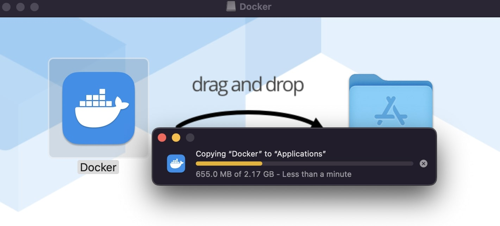
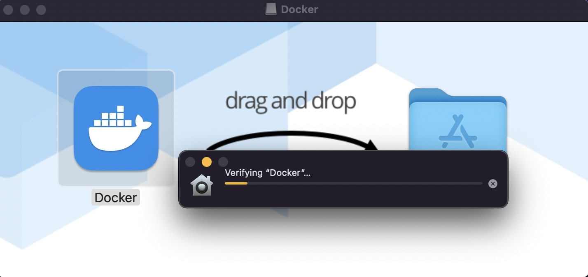
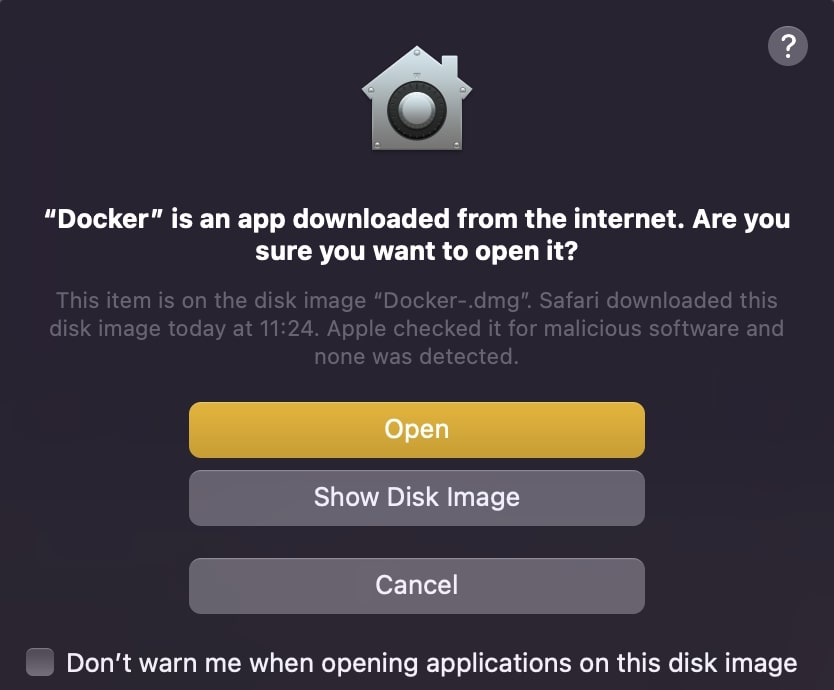
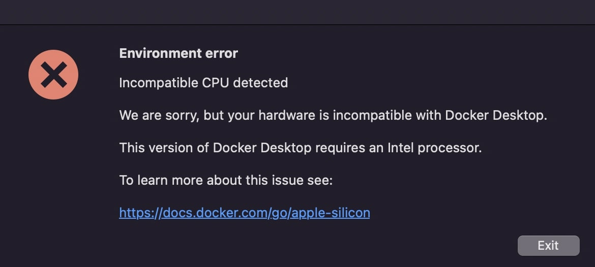
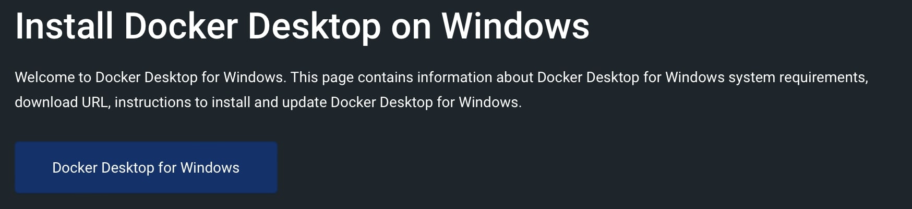

## Tutorial: An introduction to Exomiser
The Exomiser is a Java program that finds potential disease-causing variants from whole-exome or whole-genome sequencing data. Starting from a VCF file and a set of phenotypes encoded using the Human Phenotype Ontology (HPO) it will annotate, filter and prioritise likely causative variants. The program does this based on user-defined criteria such as a variant's predicted pathogenicity, frequency of occurrence in a population and also how closely the given phenotype matches the known phenotype of diseased genes from human and model organism data.

In this tutorial we will learn how to install and run Exomiser with Docker, and how to examine the results in various output formats detailing the predicted causative genes and variants.

The complete Exomiser documentation can be found here: https://exomiser.readthedocs.io/en/latest/

Check out the GitHub repo here: https://github.com/exomiser/Exomiser
## Prerequisites
You have:

- Docker installed and running on your machine. Therefore we prepared a simple guide to setup [Docker for Windows](#docker-windows)
  or [Docker for Mac](#docker-mac)

- [Exomiser-Tutorial files](https://drive.google.com/drive/u/2/folders/1DynxpvOTecvAXv3uYtJ0d2-A4NjQyyfN) downloaded from our GoogleDrive.
  The `Exomiser-Tutorial`  contains `exomiser-config` (anlysis files) and an empty `exomiser-results` directory.

You know:

- how to use a command line interface.


In preparation for this tutorial we ***highly*** recommend downloading the Exomiser data files prior to the tutorial in order to follow along. The data required to run Exomiser is ~80GB and will take a while to download and unpack.

For this tutorial, you only need to download the Exomiser phenotype data and the data for the hg19 assembly. If you have your own samples to run with Exomiser and the VCF files are built on the hg38 build then you will need to download these data files as well.

To download from the terminal:

```shell
# create an empty directory for exomiser-data
mkdir exomiser-data
cd exomiser-data
wget https://data.monarchinitiative.org/exomiser/latest/2302_phenotype.zip # for the phenotype database
wget https://data.monarchinitiative.org/exomiser/latest/2302_hg19.zip # for the hg19 variant database
```
```shell
# unzip the distribution and data files - this will create a directory called 'exomiser-cli-13.1.0' in the current working directory
unzip "2302_*.zip" 
```

Otherwise visit the links and put the data in your own `exomiser-data` directory:

[2302 phenotype database](https://data.monarchinitiative.org/exomiser/latest/2302_phenotype.zip)

[2302 hg19 variant database](https://data.monarchinitiative.org/exomiser/latest/2302_hg19.zip)

Your `Exomiser-Tutorial` directory should now be structured like this:

```
Exomiser-Tutorial
├── exomiser-config
├── exomiser-data
├── exomiser-results
```

## Start of the Tutorial

- [Exomiser Overview](#exomiser-overview)
- [Exomiser Installation](#exomiser-installation)
  - [via Docker](#via-docker)
  - [via Windows](#via-windows)
  - [via Linux](#via-linux)

- [Running Exomiser](#running-exomiser)
- [Results](#results)

## Exomiser Overview

For a quick overview of Exomiser take a look at the slides [here](#link to google drive address).

## Exomiser Installation

### via Docker

```shell
docker pull exomiser/exomiser-cli:13.2.0 # NEEDS TO CHANGE
```

### via Windows

1. Install [7-Zip](http://www.7-zip.org/) for unzipping the archive files. The built-in archiving software has issues extracting the zip files.
2. Download the data and distribution files from https://data.monarchinitiative.org/exomiser/latest
3. Extract the distribution files by right-clicking exomiser-cli-13.2.0-distribution.zip and selecting 7-Zip > Extract Here
4. Extract the data files (e.g. 2302_phenotype.zip, 2302_hg19.zip) by right-clicking the archive and selecting 7-Zip > Extract files… into the exomiser data directory. By default exomiser expects this to be ‘exomiser-cli-13.2.0/data’, but this can be changed in the application.properties

### via Linux

The following shell script should work:

```sh
# download the distribution (won't take long)
wget https://data.monarchinitiative.org/exomiser/latest/exomiser-cli-13.2.0-distribution.zip
# download the data (this is ~80GB and will take a while). If you only require a single assembly, only download the relevant file.
wget https://data.monarchinitiative.org/exomiser/latest/2302_hg19.zip
wget https://data.monarchinitiative.org/exomiser/latest/2302_phenotype.zip
# unzip the distribution and data files - this will create a directory called 'exomiser-cli-13.2.0' in the current working directory
unzip exomiser-cli-13.2.0-distribution.zip
unzip '2302_*.zip' -d exomiser-cli-13.2.0/data
# Check the application.properties are pointing to the correct versions
# exomiser.hg19.data-version=2302
# exomiser.hg38.data-version=2302
# exomiser.phenotype.data-version=2302
```
 
### Configuring the application.properties

## Running Exomiser

### Phenopackets

It is recommended to provide Exomiser with the input sample as a Phenopacket. Exomiser will accept this in either JSON or YAML format.

e.g.

```yaml
id: manuel
subject:
  id: manuel
  sex: MALE
phenotypicFeatures:
  - type:
      id: HP:0001159
      label: Syndactyly
  - type:
      id: HP:0000486
      label: Strabismus
  - type:
      id: HP:0000327
      label: Hypoplasia of the maxilla
  - type:
      id: HP:0000520
      label: Proptosis
  - type:
      id: HP:0000316
      label: Hypertelorism
  - type:
      id: HP:0000244
      label: Brachyturricephaly
htsFiles:
  - uri: examples/Pfeiffer.vcf
    htsFormat: VCF
    genomeAssembly: hg19
metaData:
  created: '2019-11-12T13:47:51.948Z'
  createdBy: julesj
  resources:
    - id: hp
      name: human phenotype ontology
      url: http://purl.obolibrary.org/obo/hp.owl
      version: hp/releases/2019-11-08
      namespacePrefix: HP
      iriPrefix: 'http://purl.obolibrary.org/obo/HP_'
  phenopacketSchemaVersion: 1.0
```

> **_NOTE:_** This is an example of a v1.0 phenopacket, there is a more recent release of v2.0. Exomiser can run phenopackets built with either v1.0 or v2.0 schema. You can find out more about the v2.0 phenopacket schema and how to build one with Python or Java [here](https://phenopacket-schema.readthedocs.io/en/latest/). To convert a phenopacket v1.0 to v2.0 you can use [phenopacket-tools](https://github.com/phenopackets/phenopacket-tools).

#### Docker command
```shell
$ docker
```

#### CLI command

```shell
$ java -jar exomiser-cli-13.2.0.jar --sample examples/pfeiffer-phenopacket.yml --vcf examples/Pfeiffer.vcf.gz --assembly hg19
```

### YAML job files 

Exomiser can also accept the input of YAML job files, where the filtering and all possible options for running Exomiser is included:

e.g. 

```yaml
## Exomiser Analysis Template.
# These are all the possible options for running exomiser. Use this as a template for
# your own set-up.
---
analysis:
    # hg19 or hg38 - ensure that the application has been configured to run the specified assembly otherwise it will halt.
    genomeAssembly: hg19
    vcf: examples/Pfeiffer.vcf
    ped:
    proband:
    hpoIds: ['HP:0001156', 'HP:0001363', 'HP:0011304', 'HP:0010055']
    # These are the default settings, with values representing the maximum minor allele frequency in percent (%) permitted for an
    # allele to be considered as a causative candidate under that mode of inheritance.
    # If you just want to analyse a sample under a single inheritance mode, delete/comment-out the others. For AUTOSOMAL_RECESSIVE
    # or X_RECESSIVE ensure *both* relevant HOM_ALT and COMP_HET modes are present.
    # In cases where you do not want any cut-offs applied an empty map should be used e.g. inheritanceModes: {}
    inheritanceModes: {
      AUTOSOMAL_DOMINANT: 0.1,
      AUTOSOMAL_RECESSIVE_HOM_ALT: 0.1,
      AUTOSOMAL_RECESSIVE_COMP_HET: 2.0,
      X_DOMINANT: 0.1,
      X_RECESSIVE_HOM_ALT: 0.1,
      X_RECESSIVE_COMP_HET: 2.0,
      MITOCHONDRIAL: 0.2
    }
  #FULL or PASS_ONLY
    analysisMode: PASS_ONLY
  # Possible frequencySources:
  # Thousand Genomes project http://www.1000genomes.org/
  #   THOUSAND_GENOMES,
  # ESP project http://evs.gs.washington.edu/EVS/
  #   ESP_AFRICAN_AMERICAN, ESP_EUROPEAN_AMERICAN, ESP_ALL,
  # ExAC project http://exac.broadinstitute.org/about
  #   EXAC_AFRICAN_INC_AFRICAN_AMERICAN, EXAC_AMERICAN,
  #   EXAC_SOUTH_ASIAN, EXAC_EAST_ASIAN,
  #   EXAC_FINNISH, EXAC_NON_FINNISH_EUROPEAN,
  #   EXAC_OTHER
  # Possible frequencySources:
  # Thousand Genomes project - http://www.1000genomes.org/ (THOUSAND_GENOMES)
  # TOPMed - https://www.nhlbi.nih.gov/science/precision-medicine-activities (TOPMED)
  # UK10K - http://www.uk10k.org/ (UK10K)
  # ESP project - http://evs.gs.washington.edu/EVS/ (ESP_)
  #   ESP_AFRICAN_AMERICAN, ESP_EUROPEAN_AMERICAN, ESP_ALL,
  # ExAC project http://exac.broadinstitute.org/about (EXAC_)
  #   EXAC_AFRICAN_INC_AFRICAN_AMERICAN, EXAC_AMERICAN,
  #   EXAC_SOUTH_ASIAN, EXAC_EAST_ASIAN,
  #   EXAC_FINNISH, EXAC_NON_FINNISH_EUROPEAN,
  #   EXAC_OTHER
  # gnomAD - http://gnomad.broadinstitute.org/ (GNOMAD_E, GNOMAD_G)
    frequencySources: [
        THOUSAND_GENOMES,
        TOPMED,
        UK10K,

        ESP_AFRICAN_AMERICAN, ESP_EUROPEAN_AMERICAN, ESP_ALL,

        EXAC_AFRICAN_INC_AFRICAN_AMERICAN, EXAC_AMERICAN,
        EXAC_SOUTH_ASIAN, EXAC_EAST_ASIAN,
        EXAC_FINNISH, EXAC_NON_FINNISH_EUROPEAN,
        EXAC_OTHER,

        GNOMAD_E_AFR,
        GNOMAD_E_AMR,
#        GNOMAD_E_ASJ,
        GNOMAD_E_EAS,
        GNOMAD_E_FIN,
        GNOMAD_E_NFE,
        GNOMAD_E_OTH,
        GNOMAD_E_SAS,

        GNOMAD_G_AFR,
        GNOMAD_G_AMR,
      #        GNOMAD_G_ASJ,
        GNOMAD_G_EAS,
        GNOMAD_G_FIN,
        GNOMAD_G_NFE,
        GNOMAD_G_OTH,
        GNOMAD_G_SAS
    ]
  # Possible pathogenicitySources: (POLYPHEN, MUTATION_TASTER, SIFT), (REVEL, MVP), CADD, REMM
  # REMM is trained on non-coding regulatory regions
  # *WARNING* if you enable CADD or REMM ensure that you have downloaded and installed the CADD/REMM tabix files
  # and updated their location in the application.properties. Exomiser will not run without this.
    pathogenicitySources: [ REVEL, MVP ]
  # this is the standard exomiser order.
  # all steps are optional
    steps: [
      #intervalFilter: {interval: 'chr10:123256200-123256300'},
      # or for multiple intervals:
      #intervalFilter: {intervals: ['chr10:123256200-123256300', 'chr10:123256290-123256350']},
      # or using a BED file - NOTE this should be 0-based, Exomiser otherwise uses 1-based coordinates in line with VCF
      #intervalFilter: {bed: /full/path/to/bed_file.bed},
      #genePanelFilter: {geneSymbols: ['FGFR1','FGFR2']},
        failedVariantFilter: { },
      #qualityFilter: {minQuality: 50.0},
        variantEffectFilter: {
          remove: [
              FIVE_PRIME_UTR_EXON_VARIANT,
              FIVE_PRIME_UTR_INTRON_VARIANT,
              THREE_PRIME_UTR_EXON_VARIANT,
              THREE_PRIME_UTR_INTRON_VARIANT,
              NON_CODING_TRANSCRIPT_EXON_VARIANT,
              NON_CODING_TRANSCRIPT_INTRON_VARIANT,
              CODING_TRANSCRIPT_INTRON_VARIANT,
                UPSTREAM_GENE_VARIANT,
                DOWNSTREAM_GENE_VARIANT,
                INTERGENIC_VARIANT,
                REGULATORY_REGION_VARIANT
            ]
        },
        #knownVariantFilter: {}, #removes variants represented in the database
        frequencyFilter: {maxFrequency: 2.0},
        pathogenicityFilter: {keepNonPathogenic: true},
        #inheritanceFilter and omimPrioritiser should always run AFTER all other filters have completed
        #they will analyse genes according to the specified modeOfInheritance above- UNDEFINED will not be analysed.
        inheritanceFilter: {},
        #omimPrioritiser isn't mandatory.
        omimPrioritiser: {},
        #priorityScoreFilter: {minPriorityScore: 0.4},
        #Other prioritisers: Only combine omimPrioritiser with one of these.
        #Don't include any if you only want to filter the variants.
        hiPhivePrioritiser: {},
        # or run hiPhive in benchmarking mode: 
        #hiPhivePrioritiser: {runParams: 'mouse'},
        #phivePrioritiser: {}
        #phenixPrioritiser: {}
        #exomeWalkerPrioritiser: {seedGeneIds: [11111, 22222, 33333]}
    ]
outputOptions:
    outputContributingVariantsOnly: false
    #numGenes options: 0 = all or specify a limit e.g. 500 for the first 500 results  
    numGenes: 0
    # Path to the desired output directory. Will default to the 'results' subdirectory of the exomiser install directory
    #outputDirectory: results
    # Filename for the output files. Will default to {input-vcf-filename}-exomiser
    outputFileName: Pfeiffer-hiphive-exome-PASS_ONLY
    #out-format options: HTML, JSON, TSV_GENE, TSV_VARIANT, VCF (default: HTML)
    outputFormats: [HTML, JSON, TSV_GENE, TSV_VARIANT, VCF]
```

#### Docker command
```shell
docker
```
#### CLI command
```shell
$ java -jar exomiser-cli-13.2.0.jar --analysis examples/test-analysis-exome.yml
```

### Multi-sample VCFs

When analysing a multi-sample VCF, a PED file is required. Alternatively, you can detail the PED file contents in a phenopacket describing a Family object:

e.g.

```yaml
id: ISDBM322017-family
proband:
  subject:
    id: ISDBM322017
    sex: FEMALE
  phenotypicFeatures:
    - type:
        id: HP:0001159
        label: Syndactyly
    - type:
        id: HP:0000486
        label: Strabismus
    - type:
        id: HP:0000327
        label: Hypoplasia of the maxilla
    - type:
        id: HP:0000520
        label: Proptosis
    - type:
        id: HP:0000316
        label: Hypertelorism
    - type:
        id: HP:0000244
        label: Brachyturricephaly
pedigree:
  persons:
    - individualId: ISDBM322017
      paternalId: ISDBM322016
      maternalId: ISDBM322018
      sex: FEMALE
      affectedStatus: AFFECTED
    - individualId: ISDBM322015
      paternalId: ISDBM322016
      maternalId: ISDBM322018
      sex: MALE
      affectedStatus: UNAFFECTED
    - individualId: ISDBM322016
      sex: MALE
      affectedStatus: UNAFFECTED
    - individualId: ISDBM322018
      sex: FEMALE
      affectedStatus: UNAFFECTED
htsFiles:
  - uri: examples/Pfeiffer-quartet.vcf.gz
    htsFormat: VCF
    genomeAssembly: GRCh37
metaData:
  created: '2019-11-12T13:47:51.948Z'
  createdBy: julesj
  resources:
    - id: hp
      name: human phenotype ontology
      url: http://purl.obolibrary.org/obo/hp.owl
      version: hp/releases/2019-11-08
      namespacePrefix: HP
      iriPrefix: 'http://purl.obolibrary.org/obo/HP_'
  phenopacketSchemaVersion: 1.0
```

#### Docker command

#### CLI Command

With a phenopacket containing PED data:

```shell
$ java -jar exomiser-cli-13.2.0.jar --sample examples/pfeiffer-family.yml --vcf examples/Pfeiffer-quartet.vcf.gz --assembly hg19
```

With a PED file:
```shell
$ java -jar exomiser-cli-13.2.0.jar --sample examples/pfeiffer-family.yml --ped examples/Pfeiffer-quartet.ped --vcf examples/Pfeiffer-quartet.vcf.gz --assembly hg19
```


### Running large jobs
#### Batch Jobs

The above commands can be added to a batch file for example in the file exomiser-cli-13.2.0/examples/test-analysis-batch-commands.txt

then run using the --batch command:

```shell
$ java -jar exomiser-cli-13.2.0.jar --batch path/to/exomiser-cli-13.1.0/examples/test-analysis-batch-commands.txt
```
The advantage of this is that a single command will be able to analyse many samples in far less time than starting a new JVM for each as there will be no start-up penalty after the initial start and the Java JIT compiler will be able to take advantage of a longer-running process to optimise the runtime code. For maximum throughput on a cluster consider splitting your batch jobs over multiple nodes.

#### Running as an array

## Results

Depending on the output options provided, Exomiser will write out at least an HTML and JSON results file in the results subdirectory of the Exomiser installation.

As a general rule all output files contain a ranked list of genes and/or variants with the top-ranked gene/variant displayed first. The exception being the VCF output which, since version 13.1.0, is sorted according to VCF convention and tabix indexed.

### HTML


### JSON
The JSON file represents the most accurate representation of the data, as it is referenced internally by Exomiser. As such, we don’t provide a schema for this, but it has been pretty stable and breaking changes will only occur with major version changes to the software. Minor additions are to be expected for minor releases, as per the SemVer specification.

We recommend using Python or JQ to extract data from this file.
### TSV GENES
In the genes.tsv file it is possible for a gene to appear multiple times, depending on the MOI it is compatible with, given the filtered variants. For example in the example below MUC6 is ranked 7th under the AD model and 8th under an AR model.

```
#RANK       ID      GENE_SYMBOL     ENTREZ_GENE_ID  MOI     P-VALUE EXOMISER_GENE_COMBINED_SCORE    EXOMISER_GENE_PHENO_SCORE       EXOMISER_GENE_VARIANT_SCORE     HUMAN_PHENO_SCORE       MOUSE_PHENO_SCORE       FISH_PHENO_SCORE        WALKER_SCORE    PHIVE_ALL_SPECIES_SCORE OMIM_SCORE      MATCHES_CANDIDATE_GENE  HUMAN_PHENO_EVIDENCE    MOUSE_PHENO_EVIDENCE    FISH_PHENO_EVIDENCE     HUMAN_PPI_EVIDENCE      MOUSE_PPI_EVIDENCE      FISH_PPI_EVIDENCE
1   FGFR2_AD        FGFR2   2263    AD      0.0000  0.9981  1.0000  1.0000  0.8808  1.0000  0.0000  0.5095  1.0000  1.0000  0       Jackson-Weiss syndrome (OMIM:123150): Brachydactyly (HP:0001156)-Broad hallux (HP:0010055), Craniosynostosis (HP:0001363)-Craniosynostosis (HP:0001363), Broad thumb (HP:0011304)-Broad metatarsal (HP:0001783), Broad hallux (HP:0010055)-Broad hallux (HP:0010055),   Brachydactyly (HP:0001156)-abnormal sternum morphology (MP:0000157), Craniosynostosis (HP:0001363)-premature cranial suture closure (MP:0000081), Broad thumb (HP:0011304)-abnormal sternum morphology (MP:0000157), Broad hallux (HP:0010055)-abnormal sternum morphology (MP:0000157),                Proximity to FGF14 associated with Spinocerebellar ataxia 27 (OMIM:609307): Broad hallux (HP:0010055)-Pes cavus (HP:0001761),   Proximity to FGF14 Brachydactyly (HP:0001156)-abnormal digit morphology (MP:0002110), Broad thumb (HP:0011304)-abnormal digit morphology (MP:0002110), Broad hallux (HP:0010055)-abnormal digit morphology (MP:0002110),
2   ENPP1_AD        ENPP1   5167    AD      0.0049  0.8690  0.5773  0.9996  0.6972  0.5773  0.5237  0.5066  0.6972  1.0000  0       Autosomal recessive hypophosphatemic rickets (ORPHA:289176): Brachydactyly (HP:0001156)-Genu varum (HP:0002970), Craniosynostosis (HP:0001363)-Craniosynostosis (HP:0001363), Broad thumb (HP:0011304)-Tibial bowing (HP:0002982), Broad hallux (HP:0010055)-Genu varum (HP:0002970),   Brachydactyly (HP:0001156)-fused carpal bones (MP:0008915), Craniosynostosis (HP:0001363)-abnormal nucleus pulposus morphology (MP:0006392), Broad thumb (HP:0011304)-fused carpal bones (MP:0008915), Broad hallux (HP:0010055)-fused carpal bones (MP:0008915),       Craniosynostosis (HP:0001363)-ceratohyal cartilage premature perichondral ossification, abnormal (ZP:0012007), Broad thumb (HP:0011304)-cleithrum nodular, abnormal (ZP:0006782),       Proximity to PAPSS2 associated with Brachyolmia 4 with mild epiphyseal and metaphyseal changes (OMIM:612847): Brachydactyly (HP:0001156)-Brachydactyly (HP:0001156), Broad thumb (HP:0011304)-Brachydactyly (HP:0001156), Broad hallux (HP:0010055)-Brachydactyly (HP:0001156),         Proximity to PAPSS2 Brachydactyly (HP:0001156)-abnormal long bone epiphyseal plate morphology (MP:0003055), Craniosynostosis (HP:0001363)-domed cranium (MP:0000440), Broad thumb (HP:0011304)-abnormal long bone epiphyseal plate morphology (MP:0003055), Broad hallux (HP:0010055)-abnormal long bone epiphyseal plate morphology (MP:0003055),
//
7   MUC6_AD MUC6    4588    AD      0.0096  0.7532  0.5030  0.9990  0.0000  0.0000  0.0000  0.5030  0.5030  1.0000  0                                       Proximity to GKN2 Brachydactyly (HP:0001156)-brachydactyly (MP:0002544), Broad thumb (HP:0011304)-brachydactyly (MP:0002544), Broad hallux (HP:0010055)-brachydactyly (MP:0002544),
8   MUC6_AR MUC6    4588    AR      0.0096  0.7531  0.5030  0.9990  0.0000  0.0000  0.0000  0.5030  0.5030  1.0000  0                                       Proximity to GKN2 Brachydactyly (HP:0001156)-brachydactyly (MP:0002544), Broad thumb (HP:0011304)-brachydactyly (MP:0002544), Broad hallux (HP:0010055)-brachydactyly (MP:0002544),```
```
### TSV VARIANTS

In the variants.tsv file it is possible for a variant, like a gene, to appear multiple times, depending on the MOI it is compatible with. For example in the example below MUC6 has two variants ranked 7th under the AD model and two ranked 8th under an AR (compound heterozygous) model. In the AD case the CONTRIBUTING_VARIANT column indicates whether the variant was (1) or wasn’t (0) used for calculating the EXOMISER_GENE_COMBINED_SCORE and EXOMISER_GENE_VARIANT_SCORE.

```
#RANK       ID      GENE_SYMBOL     ENTREZ_GENE_ID  MOI     P-VALUE EXOMISER_GENE_COMBINED_SCORE    EXOMISER_GENE_PHENO_SCORE       EXOMISER_GENE_VARIANT_SCORE     EXOMISER_VARIANT_SCORE  CONTRIBUTING_VARIANT    WHITELIST_VARIANT       VCF_ID  RS_ID   CONTIG  START   END     REF     ALT     CHANGE_LENGTH   QUAL    FILTER  GENOTYPE        FUNCTIONAL_CLASS        HGVS    EXOMISER_ACMG_CLASSIFICATION    EXOMISER_ACMG_EVIDENCE  EXOMISER_ACMG_DISEASE_ID        EXOMISER_ACMG_DISEASE_NAME      CLINVAR_ALLELE_ID       CLINVAR_PRIMARY_INTERPRETATION  CLINVAR_STAR_RATING     GENE_CONSTRAINT_LOEUF   GENE_CONSTRAINT_LOEUF_LOWER     GENE_CONSTRAINT_LOEUF_UPPER     MAX_FREQ_SOURCE MAX_FREQ        ALL_FREQ        MAX_PATH_SOURCE MAX_PATH        ALL_PATH
1   10-123256215-T-G_AD     FGFR2   2263    AD      0.0000  0.9981  1.0000  1.0000  1.0000  1       1               rs121918506     10      123256215       123256215       T       G       0       100.0000        PASS    1|0     missense_variant        FGFR2:ENST00000346997.2:c.1688A>C:p.(Glu563Ala) LIKELY_PATHOGENIC       PM2,PP3_Strong,PP4,PP5  OMIM:123150     Jackson-Weiss syndrome  28333   LIKELY_PATHOGENIC       1       0.13692 0.074   0.27                            REVEL   0.965   REVEL=0.965,MVP=0.9517972
2   6-132203615-G-A_AD      ENPP1   5167    AD      0.0049  0.8690  0.5773  0.9996  0.9996  1       0               rs770775549     6       132203615       132203615       G       A       0       922.9800        PASS    0/1     splice_donor_variant    ENPP1:ENST00000360971.2:c.2230+1G>A:p.? UNCERTAIN_SIGNIFICANCE  PVS1_Strong     OMIM:615522     Cole disease            NOT_PROVIDED    0       0.41042 0.292   0.586   GNOMAD_E_SAS    0.0032486517    TOPMED=7.556E-4,EXAC_NON_FINNISH_EUROPEAN=0.0014985314,GNOMAD_E_NFE=0.0017907989,GNOMAD_E_SAS=0.0032486517
//
7   11-1018088-TG-T_AD      MUC6    4588    AD      0.0096  0.7532  0.5030  0.9990  0.9990  1       0               rs765231061     11      1018088 1018089 TG      T       -1      441.8100        PASS    0/1     frameshift_variant      MUC6:ENST00000421673.2:c.4712del:p.(Pro1571Hisfs*21)    UNCERTAIN_SIGNIFICANCE                                  NOT_PROVIDED    0       0.79622 0.656   0.971   GNOMAD_G_NFE    0.0070363074    GNOMAD_E_AMR=0.0030803352,GNOMAD_G_NFE=0.0070363074
7   11-1018093-G-GT_AD      MUC6    4588    AD      0.0096  0.7532  0.5030  0.9990  0.9989  0       0               rs376177791     11      1018093 1018093 G       GT      1       592.4500        PASS    0/1     frameshift_elongation   MUC6:ENST00000421673.2:c.4707dup:p.(Pro1570Thrfs*136)   NOT_AVAILABLE                                   NOT_PROVIDED    0       0.79622 0.656   0.971   GNOMAD_G_NFE    0.007835763     GNOMAD_G_NFE=0.007835763
8   11-1018088-TG-T_AR      MUC6    4588    AR      0.0096  0.7531  0.5030  0.9990  0.9990  1       0               rs765231061     11      1018088 1018089 TG      T       -1      441.8100        PASS    0/1     frameshift_variant      MUC6:ENST00000421673.2:c.4712del:p.(Pro1571Hisfs*21)    UNCERTAIN_SIGNIFICANCE                                  NOT_PROVIDED    0       0.79622 0.656   0.971   GNOMAD_G_NFE    0.0070363074    GNOMAD_E_AMR=0.0030803352,GNOMAD_G_NFE=0.0070363074
8   11-1018093-G-GT_AR      MUC6    4588    AR      0.0096  0.7531  0.5030  0.9990  0.9989  1       0               rs376177791     11      1018093 1018093 G       GT      1       592.4500        PASS    0/1     frameshift_elongation   MUC6:ENST00000421673.2:c.4707dup:p.(Pro1570Thrfs*136)   UNCERTAIN_SIGNIFICANCE                                  NOT_PROVIDED    0       0.79622 0.656   0.971   GNOMAD_G_NFE    0.007835763     GNOMAD_G_NFE=0.007835763
```
### VCF

In the VCF file it is possible for a variant, like a gene, to appear multiple times, depending on the MOI it is compatible with. 

For example in the example below MUC6 has two variants ranked 7th under the AD model and two ranked 8th under an AR (compound heterozygous) model. In the AD case the CONTRIBUTING_VARIANT column indicates whether the variant was (1) or wasn’t (0) used for calculating the EXOMISER_GENE_COMBINED_SCORE and EXOMISER_GENE_VARIANT_SCORE. 

The `INFO` field with the ID=Exomiser describes the internal format of this subfield. Be aware that for multi-allelic sites, Exomiser will decompose and trim them for the proband sample and this is what will be displayed in the Exomiser ID sub-field e.g. `11-1018088-TG-T_AD`.

```
##INFO=<ID=Exomiser,Number=.,Type=String,Description="A pipe-separated set of values for the proband allele(s) from the record with one per compatible MOI following the format: {RANK|ID|GENE_SYMBOL|ENTREZ_GENE_ID|MOI|P-VALUE|EXOMISER_GENE_COMBINED_SCORE|EXOMISER_GENE_PHENO_SCORE|EXOMISER_GENE_VARIANT_SCORE|EXOMISER_VARIANT_SCORE|CONTRIBUTING_VARIANT|WHITELIST_VARIANT|FUNCTIONAL_CLASS|HGVS|EXOMISER_ACMG_CLASSIFICATION|EXOMISER_ACMG_EVIDENCE|EXOMISER_ACMG_DISEASE_ID|EXOMISER_ACMG_DISEASE_NAME}">
#CHROM      POS     ID      REF     ALT     QUAL    FILTER  INFO    sample
10  123256215       .       T       G       100     PASS    Exomiser={1|10-123256215-T-G_AD|FGFR2|2263|AD|0.0000|0.9981|1.0000|1.0000|1.0000|1|1|missense_variant|FGFR2:ENST00000346997.2:c.1688A>C:p.(Glu563Ala)|LIKELY_PATHOGENIC|PM2,PP3_Strong,PP4,PP5|OMIM:123150|"Jackson-Weiss syndrome"};GENE=FGFR2;INHERITANCE=AD;MIM=101600       GT:DS:PL        1|0:2.000:50,11,0
11  1018088 .       TG      T       441.81  PASS    AC=1;AF=0.50;AN=2;BaseQRankSum=7.677;DP=162;DS;Exomiser={7|11-1018088-TG-T_AD|MUC6|4588|AD|0.0096|0.7532|0.5030|0.9990|0.9990|1|0|frameshift_variant|MUC6:ENST00000421673.2:c.4712del:p.(Pro1571Hisfs*21)|UNCERTAIN_SIGNIFICANCE|||""},{8|11-1018088-TG-T_AR|MUC6|4588|AR|0.0096|0.7531|0.5030|0.9990|0.9990|1|0|frameshift_variant|MUC6:ENST00000421673.2:c.4712del:p.(Pro1571Hisfs*21)|UNCERTAIN_SIGNIFICANCE|||""};FS=25.935;HRun=3;HaplotypeScore=1327.2952;MQ=43.58;MQ0=6;MQRankSum=-5.112;QD=2.31;ReadPosRankSum=2.472;set=variant        GT:AD:DP:GQ:PL  0/1:146,45:162:99:481,0,5488
11  1018093 .       G       GT      592.45  PASS    AC=1;AF=0.50;AN=2;BaseQRankSum=8.019;DP=157;Exomiser={7|11-1018093-G-GT_AD|MUC6|4588|AD|0.0096|0.7532|0.5030|0.9990|0.9989|0|0|frameshift_elongation|MUC6:ENST00000421673.2:c.4707dup:p.(Pro1570Thrfs*136)|NOT_AVAILABLE|||""},{8|11-1018093-G-GT_AR|MUC6|4588|AR|0.0096|0.7531|0.5030|0.9990|0.9989|1|0|frameshift_elongation|MUC6:ENST00000421673.2:c.4707dup:p.(Pro1570Thrfs*136)|UNCERTAIN_SIGNIFICANCE|||""};FS=28.574;HRun=1;HaplotypeScore=1267.6968;MQ=44.06;MQ0=4;MQRankSum=-5.166;QD=3.26;ReadPosRankSum=1.328;set=variant    GT:AD:DP:GQ:PL  0/1:140,42:157:99:631,0,4411
6   132203615       .       G       A       922.98  PASS    AC=1;AF=0.50;AN=2;BaseQRankSum=-0.671;DP=94;Dels=0.00;Exomiser={2|6-132203615-G-A_AD|ENPP1|5167|AD|0.0049|0.8690|0.5773|0.9996|0.9996|1|0|splice_donor_variant|ENPP1:ENST00000360971.2:c.2230+1G>A:p.?|UNCERTAIN_SIGNIFICANCE|PVS1_Strong|OMIM:615522|"Cole disease"};FS=0.805;HRun=0;HaplotypeScore=3.5646;MQ=56.63;MQ0=0;MQRankSum=1.807;QD=9.82;ReadPosRankSum=-0.900;set=variant2   GT:AD:DP:GQ:PL  0/1:53,41:94:99:953,0,1075
```

## <a id="docker-mac"></a>Docker for Mac

Follow this [link](https://docs.docker.com/desktop/install/mac-install/) and download the Docker.dmg for your operating system.


The Docker.dmg will be found in your `/Downloads` directory.


After double clicking on the Docker.dmg a new window will come up:


Drag and drop the Docker app into you `/Applications` folder.



Double click on the Docker symbol.



Docker Desktop will start in the background, after you allow it to be opened.



Additionaly, this window will come up to agree the Docker subscription service agreement.


After running the installation **restart** your terminal and check the Docker installation again from insisde your terminal with:
```shell
docker --version
```
If the output gives you a version and no error you are ready to go. If you have not already restarted your terminal do this now,
and the error should be fixed.

In case you get an error message like this, please ensure you have downloaded the correct `docker.dmg`.



Now, whenever you want to pull images make sure that Docker is running in the background. Otherwise you may get an
error stating its not able to connect to the Docker deamon.

## <a id="docker-windows"></a>Docker for Windows

Follow this [link](https://docs.docker.com/desktop/install/windows-install/) and download the Docker installer for Windows.

Inside your `/Downloads` directory, search for the Installer and double-click.



To run on Windows Docker requires a virtual machine. Docker recommends using WSL2.
[More information on this can be found here](https://docs.docker.com/desktop/install/windows-install/).


Click “Ok” and wait a bit.


Now you will have to restart your computer.


After restarting, Docker should start automatically and the Service Agreement will come up, which you will have to agree to use Docker:


If the Docker desktop app is showing this warning upon start, do not click “Restart”, yet. Instead, follow the link and install the kernel update.


The link should point you to an address with a seperate download link.


Start and finish the installation for WSL.


If you still have the Docker Desktop dialog window open in the background, click on Restart. Otherwise, just restart your computer as you normally do.


If Docker Desktop did not start on its own, simply open it from the shortcut on your Desktop. You can do the initial orientation by clicking "Start".


After this, your Docker Desktop screen should look like this.


Now, whenever you want to pull images make sure that Docker is running in the background.
