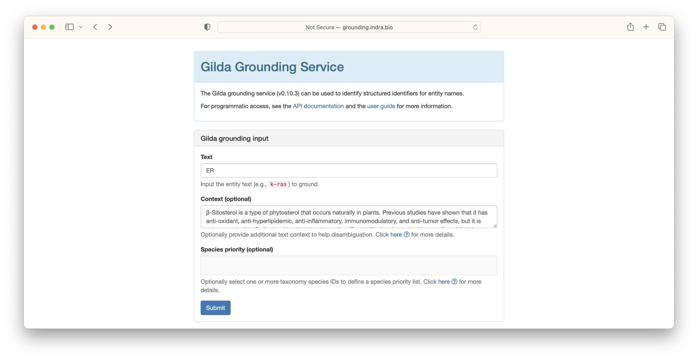

# Named Entity Normalization

Named Entity Normalization (NEN), also called _grounding_ or _entity resolution_, is the process of identifying the
appropriate ontology term for a given text string. For example, _apoptotic process_ grounds to
[GO:0006915](http://purl.obolibrary.org/obo/GO_0006915) and _k-ras_ grounds
to [HGNC:6407](https://bioregistry.io/hgnc:6407). In this tutorial, we show how to
use [Gilda](https://github.com/gyorilab/gilda) to apply named entity normalization both in an interactive and
a programmatic setting.

1. Background
1. Show web interface
2. Show API usage
3. Show programmatic usage
4. Show application to pandas dataframe
5. Show custom terms w/ Bioontologies, PyOBO, etc.

## Interactive Grounding

In order to introduce grounding, we refer to the web-based deployment of Gilda at
[http://grounding.indra.bio](http://grounding.indra.bio). First, type the text string you
want to ground into the "Text" field. In the following example, we use _k-ras_.


The results are returned showing the ontology identifier, the name,
and a score. Multiple groundings may be retrieved for a given text string for one
of several reasons:

1. The concept is duplicated across ontologies (e.g., common between DOID, MONDO, and HP)
2. There are multiple different concepts that share the same name or synonyms

> **Warning**
> Gilda's pre-build index is primarly targeted towards supporting biomedical relation extraction.
> This means it does not index all ontologies, so don't be alarmed if you get no results when
> trying to ground a potentially common entity label. Later, we describe how to build a custom Gilda index.


In some situations where multiple concepts share the same name or synonym, Gilda is able
to use a machine learned disambiguation model. For example, the acronym _ER_ can refer to the
endoplasmic reticulum, the emergency room, or potentially be used for a chemical. In these situations,
context can be given to leverage Gilda's machine learned disambiguation models.



Because the context most closely resembled the text associated with endoplasmic reticulum,
this result was scored the highest.


## Programmatic Grounding

Gilda can be installed with `pip install gilda` and used similarly to the 

[Gilda](https://github.com/gyorilab/gilda).

```python
import gilda

scored_matches = gilda.ground("kras")
```

Below is an example request using curl:

```shell
curl -X POST -H "Content-Type: application/json" -d '{"text": "kras"}' http://grounding.indra.bio/ground
```

The same request using Python's request package would be as follows:

```python
import requests

requests.post('http://grounding.indra.bio/ground', json={'text': 'kras'})
```

## Disambiguation

```python
import gilda

scored_matches = gilda.ground('ER', context='Calcium is released from the ER.')
```

