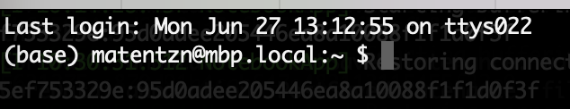

# Tutorial: Very (!) short introduction to the command line for ontology curators and semantic engineers: Part 1

As a modern ontology curator, you are an engineer - you are curating computable knowledge, testing the integrity of your curation using quality control testing, and are responsible for critical components of modern knowledge systems that directly affect user experience - the ontologies.

Scientific computing is a big, scary world comprising many different tools, methodologies, training resources and philosophies, but nearly all modern workflows share one key aspect: the ability to execute commands that help you find and manipulate data with the command line. Some examples of that include:

1. Running and Ontology Development Kit (ODK) commands like `sh run.sh make prepare_release`
1. Creating a new branch in `git` and committing changes
1. Downloading a file with `curl` or `wget`
1. Finding which file in my ontology repository mentions HP:0000118 to figure out where that "weird axiom is coming from"
1. Searching for strange symbols in the ontology
1. Filtering and sorting text files

Here we are doing a basic hands on tutorial which will walk you through the must-know commands. For a more comprehensives introduction into thinking about automation please see our lesson on [Automating Ontology Development Workflows: Make, Shell and Automation Thinking](../lesson/automating-ontology-workflows.md)

The tutorial uses example tailored for users of UNIX systems, like Mac and Linux.
Users of Windows generally have analogous steps - wherever we talk about an `sh` file in the following
there exists a corresponding `bat` file that can be run in the windows powershell, or CMD.

## Prerequisites

You have:

- a Mac or Linux Operating system
- alternatively, you have the [Ontology Development Kit installed](../howto/odk-setup.md) and learned how to ["get inside a running container"](../howto/odk-setup.md).

## Tutorial

1. [Baby steps: whoami, ls and cd](#baby)
1. [Working with files and directories](#files)
1. [Downloading and searching files](#download)
1. [The Dark Art of Piping and Redirects](#pipe)
1. [Tutorial videos](#videos)
1. [Further reading](#further)

<a id="baby"></a>

# Baby steps: whoami, pwd and ls

We are not going to discuss here in any detail what the command line is. We will focus on what you can do with it: for more information skip to the [further reading section](#further).

The basic idea behind the command line is that you run a command to achieve a goal. Among the most common goals relevant to you as a semantic engineer will be:

1. Navigating the file system (changing directories, logging into remote servers and more)
2. Reading and writing files 
3. Searching stuff

Most commands result in some kind of printed statement. Lets try one. Open your terminal (a terminal is the program you use to enter commands. For a nice overview of how shell, terminal, command line and console relate, see [here](https://www.geeksforgeeks.org/difference-between-terminal-console-shell-and-command-line)). On Mac, you can type CMD+Space to search for programs and then type "terminal". For this tutorial we use the default Terminal.app, but there are many others, including [iterm2](https://iterm2.com/). For this introduction, it does not matter which terminal you use. When first opening the terminal you will see something like this:


or



Note that your terminal window may look slightly different, depending on your configuration. More on that later.

Let's type our first command and hit enter:

```console
whoami
```

On my machine I get

```console
(base) matentzn@mbp.local:~ $ whoami
matentzn
```

This does not seem like a useful command, but sometimes, we forget who we are, and it is good to be reminded. So, what happened here? We ran a command, named `whoami` and our command line executed that command which is implemented somewhere on our machine as a program. That program simply determined who I am in some way, and then printed the result again.

Ok so, lets lets look a bit closer at the command prompt itself:

```
matentzn@mbp.local:~ $
```

Two interesting things to not here for today:

1. The `~`. This universally (on all Unix systems) refers to your user directory on your computer. In this case here, it tells you that in your terminal, you are "in your user directory".
2. The `$` sign. It simply denotes where your command line starts (everything before the $ is information provided to you, everything will be about your commands). Make sure that you do not accidentally copy based the `$` sign from the examples on the web into your command prompt:

```console
(base) matentzn@mbp.local:~ $ $ whoami
-bash: $: command not found
(base) matentzn@mbp.local:~ $
```

`whoami` did not do anything.

Ok, based on the `~` we know that we are "in the user home directory". Let as become a bit more confident about that and ask the command prompt _where_ we are:

```console
matentzn@mbp.local:~ $ pwd
/Users/matentzn
```

The `pwd` command prints out the full path of our current location in the terminal. As you can see, the default location when opening the command prompt is, indeed, the home director, located in `/Users/matentzn`. We will use it later again.

A word about paths. `/Users/matentzn` is what we call a path. On UNIX systems, `/` separates one directory from another. So `matentzn` is a directory inside of the `Users` directory.

Let us now take a look what our current directory contains (type `ls` and hit enter):

```console
matentzn@mbp.local:~ $ ls
Applications	Library	...
```

This command will simply list all of the files in your directory as a big list. We can do this a bit nicer:

```console
matentzn@mbp.local:~ $ ls -l
total 80000
drwx------@   4 matentzn  staff       128 31 Jul  2020 Applications
drwx------@  26 matentzn  staff       832 12 Sep  2021 Desktop
```

`-l` is a _short_ command line option which allows you specify that you would like print the results in a different format (a long list). We will not go into any detail here what this means but a few things to not in the output: You can see some pieces of information that are interesting, like when the file or directory was last modified (i.e. 31. July 2020), who modified it (me) and, of course, the name e.g. `Applications`.

Before we move on to the next section, let us `clear` the current terminal from all the command outputs we ran:

```console
clear
```

Your command prompt should now be empty again.

<a id="files"></a>

## Working with files and directories

In the previous section we learned how to figure out who we are (`whoami`), where we are (`pwd`) and how to see what is inside the current directory (`ls -l`) and how to clear all the output (`clear`).

Let us know look at how we can programmatically create a new directory and change the location in our terminal.

First let us create a new directory:

```console
mkdir tutorial-my
```

Now if we list the contents of our current directory again (`ls -l`), we will see our newly created directory listed! Unfortunately, we just realised that we chose the wrong name for our directory! It should have been `my-tutorial` instead of `tutorial-my`! So, let us rename it. In the command prompt, rather than "renaming" files and directories, we "move" them (`mv`).

```console
mv tutorial-my my-tutorial
```

Now, lets enter our newly created directory using the _c_hange _d_irectory command (`cd`), and create another sub-directory in `my-tutorial`, called "data" (`mkdir data`):

```console
cd my-tutorial
mkdir data
```

You can check again with `ls -l`. If you see the data directory listed, we are all set! Feel free to run `clear` again to get rid of all the current output on the command prompt.

Let us also enter this directory now: `cd data`.

If we want to leave the directory again, feel free to do that like this:

```console
cd ..
```

The two dots (`..`) mean: "parent directory." This is very important to remember during your command line adventures: `..` stands for "parent directory", and `.` stands for "current/this directory" (see more on that below).

Now, let's get into something more advanced: downloading files.

<a id="download"></a>

## Downloading and searching files

Our first task is to download the famous Human Phenotype Ontology Gene to Phenotype Annotations (aka HPOA). As you should already now, whenever we download ontologies, or ontology related files, we should always use a persistent URL, if available! This is the one for HPOA: `http://purl.obolibrary.org/obo/hp/hpoa/genes_to_phenotype.txt`. 

There are two very popular commands for downloading content: `curl` and `wget`. I think most of my colleagues prefer `curl`, but I like `wget` because it simpler for beginners. So I will use it here. Lets us try downloading the file!

```console
wget http://purl.obolibrary.org/obo/hp/hpoa/genes_to_phenotype.txt -O genes_to_phenotype.txt
```
```console
curl -L http://purl.obolibrary.org/obo/hp/hpoa/genes_to_phenotype.txt --output genes_to_phenotype.txt 
```

The `-O` parameter is optional and specifies a filename. If you do not add the parameter, `wget` will try to guess the filename from the URL. This does not always go so well with complex URLs, so I personally recommend basically always specifying the `-O` parameter.

Try before reading on: Exercises!

1. Move the downloaded file `genes_to_phenotype.txt` to the data directory you previously created.
2. Change into the `data` directory.
3. Download the OBO format version of the Human Phenotype Ontology from its PURL.

Do not move on to the next step unless your data directory looks similar to this:

```console
matentzn@mbp.local:~/my-tutorial/data $ pwd
/Users/matentzn/my-tutorial/data
matentzn@mbp.local:~/my-tutorial/data $ ls -l
total 53968
-rw-r--r--  1 matentzn  staff  19788987 11 Jun 19:09 genes_to_phenotype.txt
-rw-r--r--  1 matentzn  staff   7836327 27 Jun 22:50 hp.obo
```

Ok, let us look at the first 10 lines of genes_to_phenotype.txt using the `head` command:

```console
head genes_to_phenotype.txt
```

`head` is a great command to familiarise yourself with a file. You can use a parameter to print more or less lines:

```console
head -3 genes_to_phenotype.txt
```

This will print the first 3 lines of the genes_to_phenotype.txt file. There is another analogous command that allows us to look at the last lines off a file:

```console
tail genes_to_phenotype.txt
```

`head`, `tail`. Easy to remember.

Next, we will learn the most important of all standard commands on the command line: `grep`. `grep` stands for "Global regular expression print" and allows us to search files, and print the search results to the command line. Let us try some simple commands first.

```console
grep diabetes genes_to_phenotype.txt
```

You will see a list of hundreds of lines out output. Each line corresponds to a line in the `genes_to_phenotype.txt` file which contains the word "diabetes".

```
grep is case sensitive. It wont find matches like Diabetes, with capital D!

Use the `-i` parameter in the grep command to instruct grep to 
perform case insensitive matches.
```

There is a lot more to grep than we can cover here today, but one super cool thing is searching across an entire directory.


```console
grep -r "Elevated circulating follicle" .
```

Assuming you are in the `data` directory, you should see something like this:

```
./genes_to_phenotype.txt:190	NR0B1	HP:0008232	Elevated circulating follicle stimulating hormone level	-	HP:0040281		orphadata	ORPHA:251510
./genes_to_phenotype.txt:57647	DHX37	HP:0008232	Elevated circulating follicle stimulating hormone level	-		-	mim2gene	OMIM:273250
...... # Removed other results
./hp.obo:name: Elevated circulating follicle stimulating hormone level
```

There are two new aspects to the command here: 

1. The `-r` option ("recursive") allows is to search a directory **and all directories within in**.
2. The `.` in the beginning. Remember, in the previous use of the `grep` command we had the name of a file in the place where now the `.` is. The `.` means "this directory" - i.e. the directory you are in right now (if lost, remember `pwd`).

As you can see, `grep` does not only list the line of the file in which the match was found, it also tells us which filename it was found in!
We can make this somewhat more easy to read as well by _only_ showing filenames using the `-l` parameter:

```console
matentzn@mbp.local:~/my-tutorial/data $ grep -r -l "Elevated circulating follicle" .
./genes_to_phenotype.txt
./hp.obo
```

<a id="pipe"></a>

## The Dark Art of Piping and Redirects

The final lesson for today is about one of the most powerful features of the command line: the ability to _chain commands together_. Let us start with a simple example (make sure you are **inside** the data directory):

```console
grep -r "Elevated circulating follicle" . | head -3
```

This results in:

```
./genes_to_phenotype.txt:190	NR0B1	HP:0008232	Elevated circulating follicle stimulating hormone level	-	HP:0040281		orphadata	ORPHA:251510
./genes_to_phenotype.txt:57647	DHX37	HP:0008232	Elevated circulating follicle stimulating hormone level	-		-	mim2gene	OMIM:273250
./genes_to_phenotype.txt:57647	DHX37	HP:0008232	Elevated circulating follicle stimulating hormone level	-	HP:0040281		orphadata	ORPHA:251510
```

So, what is happening here? First, we use the `grep` command to find "Elevated circulating follicle" in our data directory. As you may remember, there are more than 10 results for this command. So the grep command now wants to print these 10 results for you, but the `|` pipe symbol intercepts the result from `grep` and passes it on to the next command, which is `head`. Remember `head` and `tail` from above? Its exactly the same thing, only that, rather than printing the first lines of a file, we print the first lines of the **output of the previous command**. You can do incredible things with pipes. Here a taster which is beyond this first tutorial, but should give you a sense:

```console
grep "Elevated circulating follicle" genes_to_phenotype.txt | cut -f2 | sort | uniq | head -3
```

Output:

```
AR
BNC1
C14ORF39
```

What is happening here? 

1. `grep` is looking for "Elevated circulating follicle" in all files in the directory, then "|" is passing the output on to
2. `cut`, which extracts the second column of the table (how cool?), then "|" is passing the output on to
3. `sort`, which sorts the output, then "|" is passing the output on to
4. `uniq`, which removes all duplicate values from the output, then "|" is passing the output on to
5. `head`, which is printing only the first 3 rows of the result.

Another super cool use of piping is searching your command history. Try running:

```console
history
```

This will show you all the commands you have recently run. Now if you want to simply look for some very specific commands that you have run in the past you can combine `history` with `grep`:

```console
history | grep follicle
```

This will print every command you ran in the last hour that contains the word "follicle". Super useful if you, like me, keep forgetting your commands!

The last critical feature of the command line we cover today is the "file redirect". Instead of printing the output to file, we may chose to redirect the results to a file instead:

```console
matentzn@mbp.local:~/my-tutorial/data $ grep "Elevated circulating follicle" genes_to_phenotype.txt | cut -f2 | sort | uniq | head -3 > gene.txt
matentzn@mbp.local:~/my-tutorial/data $ head gene.txt 
AR
BNC1
C14ORF39
```

`> gene.txt` basically tells the command line: instead of printing the results to the command line, "print" them into a file which is called `gene.txt`.

<a id="videos"></a>

## Videos

### Sam Bail: Intro to Terminal

Sam also did here PhD in and around ontologies but has moved entirely to data engineering since. I really liked her 1 hour introduction into the terminal, this should fill some of the yawning gaps in this introduction here.

<iframe width="560" height="315" src="https://www.youtube.com/embed/sqN0bFWrS6Q" title="YouTube video player" frameborder="0" allow="accelerometer; autoplay; clipboard-write; encrypted-media; gyroscope; picture-in-picture" allowfullscreen></iframe>

<a id="further"></a>

## Further reading

- [Automating Ontology Development Workflows: Make, Shell and Automation Thinking](../lesson/automating-ontology-workflows.md)
- [Data Science at the Command Line](https://datascienceatthecommandline.com/2e/index.html): Free online book that covers everything you need to know to be a command line magician
- [A whirlwind introduction to the command line by James Overton](https://github.com/jamesaoverton/command-line)
