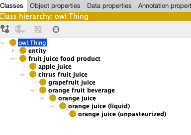

# Practical introduction to OAK Lexmatch

<a href="../reference/obook-maturity-indicator"></a>

In this tutorial, we will learn to use a very basic lexical matching tool (OAK Lexmatch). The goal is not only to enable the learner to design their own matching pipelines, but also to to think about how they fit into their mapping efforts. Note that this tutorial is _not_ about how to do _proper_ matching: the goal here is simply to introduce you to the general workflow. _Proper_ ontology matching is a major discipline with many tools, preprocessing and tuning approaches and often intricate interplay between matching tools and human curators. Today, you will just get a sense of the _general_ method.

## Pre-requisites

- [Introduction to mapping curation with SSSOM](../explanation/semantic-matching.md)
- [ROBOT tutorial (extract)](../tutorial/robot-tutorial-1/#extract)
- [ROBOT tutorial (merge)](../tutorial/robot-tutorial-2/#merge)


## Tutorial

In this tutorial, you will learn how to match fruit juices in Wikidata with FOODON using a simple lexical matching tool (OAK). The idea is simple: We obtain the ontologies we like to match, ask OAK to generate the matches and then curate the results.

1. [Setting up OAK, preparing the ontology](#prepare): You will learn how to install OAK into a new Python environment, and create a simple `Makefile` to prepare your input ontology with ROBOT.
1. [Download Ontologies and extract subsets](#dl): Prepare the data/ontologies you want to match.
1. [Generate the matches with OAK](#generate): Generate the matches using a simple tool.
1. [Curating matching results](#curate): Manually review the results of the mars  

<a id="prepare"></a>

### Setting up OAK, preparing the ontology

Setting up `oak` is described in its [documentation](https://incatools.github.io/ontology-access-kit/intro/tutorial01.html). Note that, aside from `oak` itself, you also need `relation-graph`, `rdftab` and `riot` installed, see https://incatools.github.io/ontology-access-kit/intro/tutorial07.html#without-docker. 
This tutorial requires OAK version 0.1.59 or higher.

Note that if you are using the [ODK docker image](../howto/odk-setup.md), `oaklib` is already installed. In the following, we will use the ODK wrapper to ensure that everyone has a consistent experience. If you want to use the local (non-docker) setup, you have to follow the instructions above before continuing _and ignore the `sh odk.sh` part of the commands_.

<hr>

### IMPORTANT for users of ODK < 1.3.2:

ODK 1.3.1, the version still active on the 8th December 2022, does not have the latest dependencies of OAK installed. 
To follow the tutorial you have to use the ODK development snapshot.

Install the ODK Development snapshot:

```
docker pull obolibrary/odkfull:dev
```

After downloading https://raw.githubusercontent.com/OBOAcademy/obook/master/docs/resources/odk.sh into your local working directory, open it with a text editor and change: 

```
docker ... obolibrary/odkfull ...
```

to

```
docker ... obolibrary/odkfull:dev ...
```

<hr>

<a id="dl"></a>

### Download Ontologies and extract subsets

First, we download `FOODON` ontology. You can do this in whatever way you want, for example with `wget`:

```
sh odk.sh wget http://purl.obolibrary.org/obo/foodon.owl -O foodon.owl
```

Next, we extract the subset of FOODON that is relevant to our task at hand: relevant terms about fruit juices. The right method of subset extraction will differ from task to task. For this tutorial, we are using ROBOT extract to obtain a `MIREOT` module containing all the fruit juices. We do this by selecting everything between `fruit juice food product` as the `upper-term` and fruit juices (`apple juice`, `orange juice` and `grapefruit juice`) as the `lower-term` of the `FOODON` subset.

```
sh odk.sh robot extract --method MIREOT --input foodon.owl --upper-term "FOODON:00001140" --lower-term "FOODON:00001277" --lower-term "FOODON:00001059" --lower-term "FOODON:03306174 " --output fruit_juice_food_foodon.owl
```

If you open `fruit_juice_food_foodon.owl` in Protege, you will see something similar to:



Next, we use OAK to extract juices and their labels from wikidata by selecting the descendants of `juice` from `wikidata`, store the result as a `ttl` file and then convert it to `OWL` using `ROBOT`.

```
sh odk.sh runoak -i wikidata: descendants wikidata:Q8492 -p i,p -o juice_wd.ttl -O rdf
sh odk.sh robot convert -i juice_wd.ttl  -o juice_wd.owl
```

Note that you wont be able to see anything when opening `juice_wd.owl` in wikidata, because it does not have any OWL types (class, individual assertions) attached to it. However, you can convince yourself all is well by opening `juice_wd.owl` in a text editor, and see expressions such as:

```
<rdf:Description rdf:about="http://www.wikidata.org/entity/Q10374646">
    <rdfs:label>cashew apple juice</rdfs:label>
</rdf:Description>
```

The last preparation step is merging the two subsets (from FOODON and wikidata) into a single file using `ROBOT`:

```
sh odk.sh robot merge -i fruit_juice_food_foodon.owl -i juice_wd.owl -o foodon_wd.owl
```

<a id="generate"></a>

#### Generate the matches with OAK


Now we are ready to create our first set of matches. First, let's run `oak`'s `lexmatch` command to generate lexical matches between the contents of the merged file:

```
sh odk.sh runoak -i sqlite:foodon_wd.owl lexmatch -o foodon_wd_lexmatch.tsv
```

This will generate an SSSOM tsv file with the mapped contents as shown below:

```
# curie_map:
#   FOODON: http://purl.obolibrary.org/obo/FOODON_
#   owl: http://www.w3.org/2002/07/owl#
#   rdf: http://www.w3.org/1999/02/22-rdf-syntax-ns#
#   rdfs: http://www.w3.org/2000/01/rdf-schema#
#   semapv: https://w3id.org/semapv/
#   skos: http://www.w3.org/2004/02/skos/core#
#   sssom: https://w3id.org/sssom/
#   wikidata: http://www.wikidata.org/entity/
# license: https://w3id.org/sssom/license/unspecified
# mapping_set_id: https://w3id.org/sssom/mappings/091390a2-6f64-436d-b2d1-309045ff150c
```

| subject_id         | subject_label    | predicate_id    | object_id          | object_label     | mapping_justification  | mapping_tool | confidence | subject_match_field | object_match_field | match_string     |
|--------------------|------------------|-----------------|--------------------|------------------|------------------------|--------------|------------|---------------------|--------------------|------------------|
| FOODON:00001059    | apple juice      | skos:closeMatch | wikidata:Q618355   | apple juice      | semapv:LexicalMatching | oaklib       | 0.5        | rdfs:label          | rdfs:label         | apple juice      |
| FOODON:00001059    | apple juice      | skos:closeMatch | wikidata:Q618355   | apple juice      | semapv:LexicalMatching | oaklib       | 0.5        | oio:hasExactSynonym | rdfs:label         | apple juice      |
| FOODON:03301103    | orange juice     | skos:closeMatch | wikidata:Q219059   | orange juice     | semapv:LexicalMatching | oaklib       | 0.5        | rdfs:label          | rdfs:label         | orange juice     |
| FOODON:03306174    | grapefruit juice | skos:closeMatch | wikidata:Q1138468  | grapefruit juice | semapv:LexicalMatching | oaklib       | 0.5        | rdfs:label          | rdfs:label         | grapefruit juice |
| wikidata:Q15823640 | cherry juice     | skos:closeMatch | wikidata:Q62030277 | cherry juice     | semapv:LexicalMatching | oaklib       | 0.5        | rdfs:label          | rdfs:label         | cherry juice     |
| wikidata:Q18201657 | must             | skos:closeMatch | wikidata:Q278818   | must             | semapv:LexicalMatching | oaklib       | 0.5        | rdfs:label          | rdfs:label         | must             |


This is great - we get a few mappings without much work. If you need some help interpreting this table, please refer to the [SSSOM tutorials](../tutorials/sssom-tutorial.md) for details.

Just eyeballing the labels in our ontology with OAK:

```
sh odk.sh runoak -i sqlite:foodon_wd.owl terms | grep juice
```

We notice rows like:

```
...
FOODON:00001001 ! orange juice (liquid)
...
```

It may be beneficial for us to pre-process the labels a bit before performing the matches, for example, by excluding comments in the labels provided in brackets (essentially removing `(liquid)`).

To do this, we will define a few simple mapping rules in a file called `matcher_rules.yaml`. OAK provides a [standard for representing the matching rules](https://incatools.github.io/ontology-access-kit/datamodels/mapping-rules/index.html). You can see an example [here](https://github.com/monarch-initiative/mondo-ingest/blob/main/src/ontology/config/mondo-match-rules.yaml).

Here is an example file:

```yaml
rules:
  - description: default
    postconditions:
      predicate_id: skos:closeMatch
      weight: 0.0

  - description: exact to exact
    preconditions:
      subject_match_field_one_of:
        - oio:hasExactSynonym
        - rdfs:label
        - skos:prefLabel
      object_match_field_one_of:
        - oio:hasExactSynonym
        - rdfs:label
        - skos:prefLabel
    postconditions:
      predicate_id: skos:exactMatch
      weight: 2.0

  - preconditions:
      subject_match_field_one_of:
        - oio:hasExactSynonym
        - rdfs:label
      object_match_field_one_of:
        - oio:hasBroadSynonym
    postconditions:
      predicate_id: skos:broadMatch
      weight: 2.0

  - synonymizer:
      the_rule: Remove parentheses bound info from the label.
      match: r'\([^)]*\)'
      match_scope: "*"
      replacement: ""
  
  - synonymizer:
      the_rule: Replace "'s" by "s" in the label.
      match: r'\'s'
      match_scope: "*"
      replacement: "s"
```

As you can see, there are basically two kinds of rules: normal ones, and `synonimizer` ones. The normal rules provide preconditions and postconditions. For example, the second rule says:  if an exact synonym, preferred label or label of the subject matches an exact synonym, preferred label or label of the object, then assert a `skos:exactMatch`. The `synonimizer` rules are preprocessing rules which are applied to the labels and synonyms prior to matching. Let's now run the matcher again:

```
sh odk.sh runoak -i sqlite:foodon_wd.owl lexmatch -R matcher_rules.yaml -o foodon_wd_lexmatch_with_rules.tsv 
```

This will generate an SSSOM tsv file with a few more matches than the previous output (the exact matches may differ from version to version):

```
# curie_map:
#   FOODON: http://purl.obolibrary.org/obo/FOODON_
#   IAO: http://purl.obolibrary.org/obo/IAO_
#   owl: http://www.w3.org/2002/07/owl#
#   rdf: http://www.w3.org/1999/02/22-rdf-syntax-ns#
#   rdfs: http://www.w3.org/2000/01/rdf-schema#
#   semapv: https://w3id.org/semapv/
#   skos: http://www.w3.org/2004/02/skos/core#
#   sssom: https://w3id.org/sssom/
#   wikidata: http://www.wikidata.org/entity/
# license: https://w3id.org/sssom/license/unspecified
# mapping_set_id: https://w3id.org/sssom/mappings/6b9c727f-9fdc-4a78-bbda-a107b403e3a9
```

| subject_id         | subject_label                | predicate_id    | object_id          | object_label                 | mapping_justification  | mapping_tool | confidence         | subject_match_field | object_match_field | match_string         | subject_preprocessing               | object_preprocessing                |
|--------------------|------------------------------|-----------------|--------------------|------------------------------|------------------------|--------------|--------------------|---------------------|--------------------|----------------------|-------------------------------------|-------------------------------------|
| FOODON:00001001    | orange juice (liquid)        | skos:exactMatch | FOODON:00001277    | orange juice (unpasteurized) | semapv:LexicalMatching | oaklib       | 0.8497788951776651 | rdfs:label          | rdfs:label         | orange juice         | semapv:RegularExpressionReplacement | semapv:RegularExpressionReplacement |
| FOODON:00001001    | orange juice (liquid)        | skos:exactMatch | FOODON:03301103    | orange juice                 | semapv:LexicalMatching | oaklib       | 0.8497788951776651 | rdfs:label          | rdfs:label         | orange juice         | semapv:RegularExpressionReplacement |                                     |
| FOODON:00001001    | orange juice (liquid)        | skos:exactMatch | wikidata:Q219059   | orange juice                 | semapv:LexicalMatching | oaklib       | 0.8497788951776651 | rdfs:label          | rdfs:label         | orange juice         | semapv:RegularExpressionReplacement |                                     |
| FOODON:00001059    | apple juice                  | skos:exactMatch | wikidata:Q618355   | apple juice                  | semapv:LexicalMatching | oaklib       | 0.8497788951776651 | rdfs:label          | rdfs:label         | apple juice          |                                     |                                     |
| FOODON:00001059    | apple juice                  | skos:exactMatch | wikidata:Q618355   | apple juice                  | semapv:LexicalMatching | oaklib       | 0.8                | oio:hasExactSynonym | rdfs:label         | apple juice          |                                     |                                     |
| FOODON:00001277    | orange juice (unpasteurized) | skos:exactMatch | FOODON:03301103    | orange juice                 | semapv:LexicalMatching | oaklib       | 0.8497788951776651 | rdfs:label          | rdfs:label         | orange juice         | semapv:RegularExpressionReplacement |                                     |
| FOODON:00001277    | orange juice (unpasteurized) | skos:exactMatch | wikidata:Q219059   | orange juice                 | semapv:LexicalMatching | oaklib       | 0.8497788951776651 | rdfs:label          | rdfs:label         | orange juice         | semapv:RegularExpressionReplacement |                                     |
| FOODON:00002403    | food material                | skos:exactMatch | FOODON:03430109    | food (liquid, low viscosity) | semapv:LexicalMatching | oaklib       | 0.8                | oio:hasExactSynonym | rdfs:label         | food                 | semapv:RegularExpressionReplacement |                                     |
| FOODON:00002403    | food material                | skos:exactMatch | FOODON:03430130    | food (liquid)                | semapv:LexicalMatching | oaklib       | 0.8                | oio:hasExactSynonym | rdfs:label         | food                 | semapv:RegularExpressionReplacement |                                     |
| FOODON:03301103    | orange juice                 | skos:exactMatch | wikidata:Q219059   | orange juice                 | semapv:LexicalMatching | oaklib       | 0.8497788951776651 | rdfs:label          | rdfs:label         | orange juice         |                                     |                                     |
| FOODON:03306174    | grapefruit juice             | skos:exactMatch | wikidata:Q1138468  | grapefruit juice             | semapv:LexicalMatching | oaklib       | 0.8497788951776651 | rdfs:label          | rdfs:label         | grapefruit juice     |                                     |                                     |
| FOODON:03430109    | food (liquid, low viscosity) | skos:exactMatch | FOODON:03430130    | food (liquid)                | semapv:LexicalMatching | oaklib       | 0.8497788951776651 | rdfs:label          | rdfs:label         | food                 | semapv:RegularExpressionReplacement | semapv:RegularExpressionReplacement |
| wikidata:Q15823640 | cherry juice                 | skos:exactMatch | wikidata:Q62030277 | cherry juice                 | semapv:LexicalMatching | oaklib       | 0.8497788951776651 | rdfs:label          | rdfs:label         | cherry juice         |                                     |                                     |
| wikidata:Q18201657 | must                         | skos:exactMatch | wikidata:Q278818   | must                         | semapv:LexicalMatching | oaklib       | 0.8497788951776651 | rdfs:label          | rdfs:label         | must                 |                                     |                                     |

<a id="prepare"></a>

#### Curating the matches

It is important to remember that matching in its raw form should **not** be understood to _result in semantic mappings_. The process of _matching_, in particular lexical or fuzzy semantic matching is error prone and usually better treated as resulting in _candidates for mappings_. This means that when we calculate the effort of a mapping project, we should always factor in the often considerable effort required by a human to _verify the correctness of a candidate mapping_. There are many tools that can help with this process, for example by filtering out conflicting lower-confidence mappings, but in the end the reality is this: due to the fact that source and target do not share the same semantics, mappings will always be a bit wobbly. There are two important kinds of review which are very different:

1. False positive review (wrong mappings). The goal here is to identify mappings that do not work for our use case, or do not use the correct semantic mapping relation. If you look carefully through the matched files, you'll notice that manual intervention is definitely required for the matches to be accurate. For e.g. `orange juice [wikidata:Q219059]` and `orange juice (unpasteurized) [FOODON:00001277]` may not be considered as the same thing in the sense of `skos:exactMatch`. 
1. False negative review (missing mappings). The goal here is to understand if we can do anything to improve the matching process by tuning it. For very simple matchers like `oak lexmatch` this usually involves hacking labels and synonyms by removing or replacing words. More sophisticated matchers like [Agreement Maker Light (AML)](https://github.com/AgreementMakerLight/AML-Project) have many more tuning options, and it requires patience and expertise to find the right ones. 

```
Tip: always keep a clear visible list of unmapped classes around to sanity check how good your mapping has been so far.
```

For a more detailed introduction into manual mapping curation with SSSOM we recommend following this tutorial: https://mapping-commons.github.io/sssom/tutorial/.

