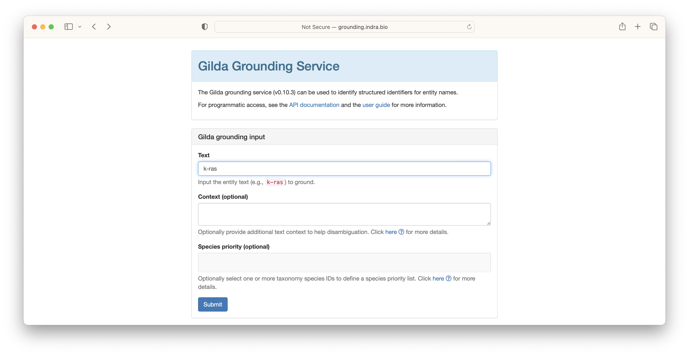
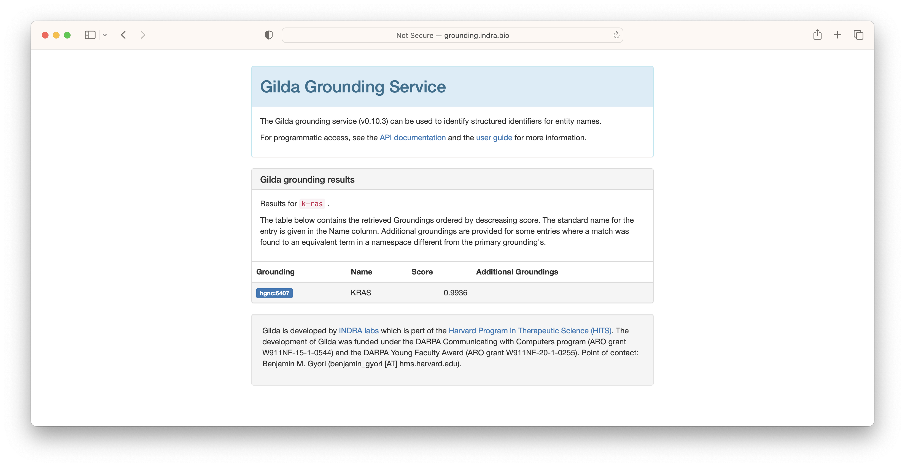
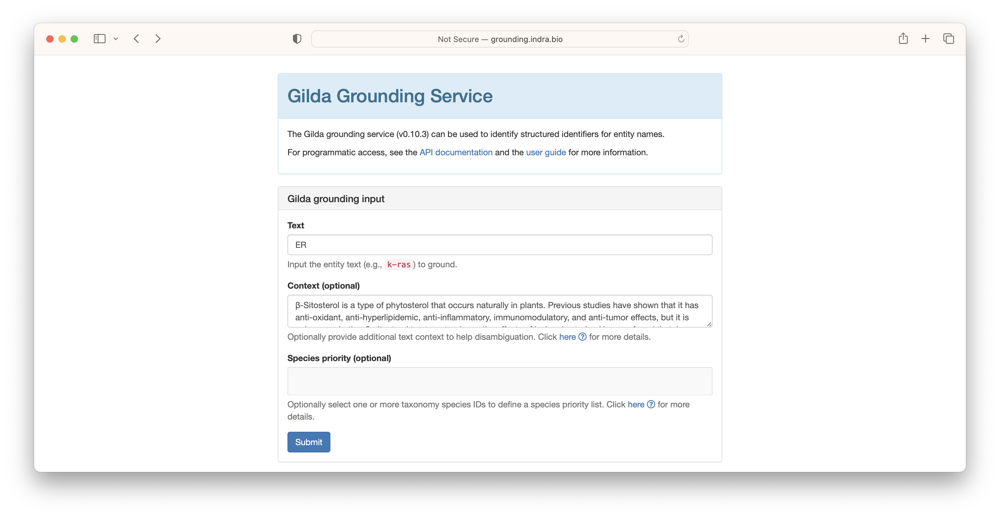
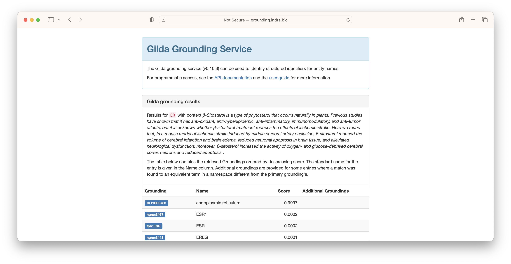

# Named Entity Normalization

Named Entity Normalization (NEN), also called _grounding_ or _entity resolution_, is the process of identifying the
appropriate ontology term for a given text string. For example, _apoptotic process_ grounds to
[GO:0006915](http://purl.obolibrary.org/obo/GO_0006915) and _k-ras_ grounds
to [HGNC:6407](https://bioregistry.io/hgnc:6407). In this tutorial, we show how to
use [Gilda](https://github.com/gyorilab/gilda) to apply named entity normalization both in an interactive and
a programmatic setting.

## Interactive Grounding

In order to introduce grounding, we refer to the web-based deployment of Gilda at
[http://grounding.indra.bio](http://grounding.indra.bio). First, type the text string you
want to ground into the "Text" field. In the following example, we use _k-ras_.



The results are returned showing the ontology identifier, the name,
and a score. Multiple groundings may be retrieved for a given text string for one
of several reasons:

1. The concept is duplicated across ontologies (e.g., common between DOID, MONDO, and HP)
2. There are multiple different concepts that share the same name or synonyms

> **Warning**
> Gilda's pre-build index is primarily targeted towards supporting biomedical relation extraction.
> This means it does not index all ontologies, so don't be alarmed if you get no results when
> trying to ground a potentially common entity label. Later, we describe how
> to [build a custom Gilda index](#Custom-Index).



In some situations where multiple concepts share the same name or synonym, Gilda is able
to use a machine learned disambiguation model. For example, the acronym _ER_ can refer to the
endoplasmic reticulum, the emergency room, or potentially be used for a chemical. In these situations,
context can be given to leverage Gilda's machine learned disambiguation models.



Because the context most closely resembled the text associated with endoplasmic reticulum,
this result was scored the highest.



## Programmatic Grounding

Gilda can be installed with `pip install gilda` and exposes a high-level interface similar to the web interface.
_k-ras_ can be grounded in the same way as before:

```python
import gilda

scored_matches = gilda.ground("k-ras")

rows = [
    (
        scored_match.term.db + ":" + scored_match.term.id,
        scored_match.term.entry_name,
        scored_match.score,
    )
    for scored_match in scored_matches
]
```

| CURIE                                         | Name |  Score |
|-----------------------------------------------|------|-------:|
| [HGNC:6407](https://bioregistry.io/hgnc:6407) | KRAS | 0.9936 |

Disambiguation can be run by adding the `context` argument.

```python
import gilda

scored_matches = gilda.ground("ER", context="Calcium is released from the ER.")
```

### Remote Grounding

The following two examples show how to run grounding by invoking the web service. Below is an example request using
curl:

```shell
curl -X POST -H "Content-Type: application/json" -d '{"text": "kras"}' http://grounding.indra.bio/ground
```

This results in the following JSON, which includes lots of detail we skipped before.

```json
[
  {
    "match": {
      "cap_combos": [
        [
          "all_lower",
          "all_caps"
        ]
      ],
      "dash_mismatches": [],
      "exact": false,
      "query": "kras",
      "ref": "KRAS",
      "space_mismatch": false
    },
    "score": 0.984539270253556,
    "subsumed_terms": [
      {
        "db": "HGNC",
        "entry_name": "KRAS",
        "id": "6407",
        "norm_text": "kras",
        "organism": "9606",
        "source": "famplex",
        "status": "curated",
        "text": "Kras"
      },
      {
        "db": "HGNC",
        "entry_name": "KRAS",
        "id": "6407",
        "norm_text": "kras",
        "organism": "9606",
        "source": "famplex",
        "status": "curated",
        "text": "K-Ras"
      }
    ],
    "term": {
      "db": "HGNC",
      "entry_name": "KRAS",
      "id": "6407",
      "norm_text": "kras",
      "organism": "9606",
      "source": "famplex",
      "status": "curated",
      "text": "KRAS"
    },
    "url": "https://identifiers.org/hgnc:6407"
  }
]
```

The same request using Python's request package would be as follows:

```python
import requests

res = requests.post("http://grounding.indra.bio/ground", json={"text": "kras"})
```

In both examples, `"context"` can be used as an additional key to invoke disambiguation.

## Data Science Application

In the tutorial [From Tables to Linked Data](linking-data.md), a table is presented that has
several columns with free text, and in the course of the tutorial, the groundings are given. This table (truncated)
begins as the following:

| species | organ          | disease        |
|:--------|:---------------|:---------------|
| RAT     | LUNG           | ADENOCARCINOMA |
| MOUSE   | NOSE           | INFLAMMATION   |
| RAT     | ADRENAL CORTEX | NECROSIS       |

Here, we show how to use Gilda to accomplish this in practice.

```python
import pandas as pd
import gilda

url = "https://raw.githubusercontent.com/OBOAcademy/obook/master/docs/tutorial/linking_data/data.csv"
df = pd.read_csv(url)
for column in ["species", "organ", "disease"]:
    gilda.ground_df(df, source_column=column, target_column=f"{column}_curie")
print(df.to_markdown(index=False))
```

This results in the following (truncated):

| species | organ          | disease        | species_curie                                       | organ_curie                                         | disease_curie                                       |
|:--------|:---------------|:---------------|:----------------------------------------------------|:----------------------------------------------------|:----------------------------------------------------|
| RAT     | LUNG           | ADENOCARCINOMA | [mesh:D051381](https://bioregistry.io/mesh:D051381) | [mesh:D008168](https://bioregistry.io/mesh:D008168) | [mesh:D000230](https://bioregistry.io/mesh:D000230) |
| MOUSE   | NOSE           | INFLAMMATION   | [mesh:D051379](https://bioregistry.io/mesh:D051379) | [mesh:D009666](https://bioregistry.io/mesh:D009666) | [GO:0006954](https://bioregistry.io/go:0006954)     |
| RAT     | ADRENAL CORTEX | NECROSIS       | [mesh:D051381](https://bioregistry.io/mesh:D051381) | [mesh:D000302](https://bioregistry.io/mesh:D000302) | [GO:0070265](https://bioregistry.io/go:0070265)     |

Note that MeSH terms may appear instead of OBO ontology terms because the highest scored is given. This can be changed
by a `namespaces` argument to `gilda.ground_df`. Typically, the results from named entity normalization are used
in conjunction with [named entity standardization](named-entity-standardization.md).

## Custom Index

A custom index "grounder" object, which exposes all the previously demonstrated functionality, can be created using
PyOBO with:

```python
from pyobo.gilda_utils import get_grounder

grounder = get_grounder(["mesh", "cvx"])
grounder.ground("inflammation")
```

A custom index can be created by instantiating `gilda.Term` objects and instantiating
a [`gilda.Grounder`](https://gilda.readthedocs.io/en/latest/modules/index.html#gilda.grounder.Grounder) object.
