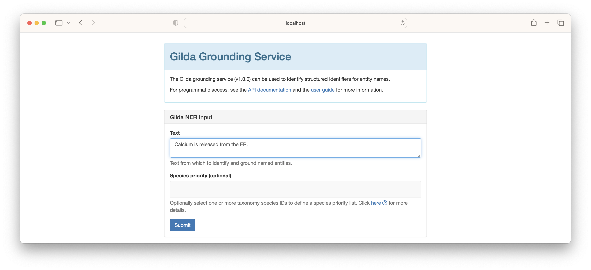
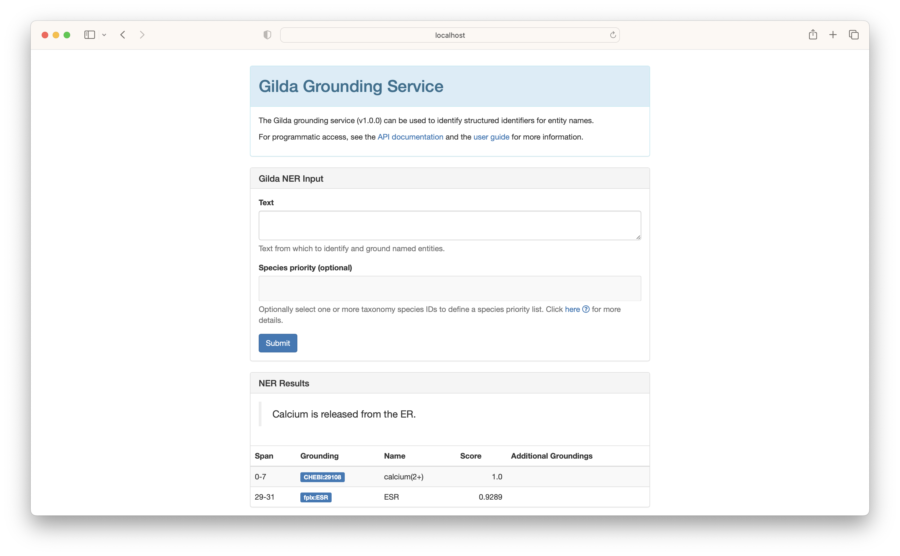

# Named Entity Recognition with Gilda

Named entity recognition (NER) is the process of identifying spans of text that correspond to concepts.
Often, named entity recognition is paired with [named entity normalization (NEN)](named-entity-normalization.md) to
identify ontology terms for the spans of text. In this tutorial, we show how to
use [Gilda](https://github.com/gyorilab/gilda) to do named entity recognition.

## Interactive NER

In order to introduce grounding, we refer to the web-based deployment of Gilda at http://grounding.indra.bio/ner. First,
type the sentence or paragraph you want to ground into the "Text" field. In the following example, we use the sentence
_Calcium is released from the ER_.



The results show two entities were identified - calcium and ER. [Gilda](https://github.com/gyorilab/gilda) implements
a simple dictionary-based named entity algorithm that is incredibly fast, has the benefit that it does
[named entity normalization](named-entity-normalization.md), and also can do disambiguation based on the whole
given text.



## Programmatic NER

Gilda can be installed with `pip install gilda` and exposes a high-level interface similar to the web interface.
_Calcium is released from the ER_ can be annotated in the same way as before:

```python
from gilda.ner import annotate
text = "Calcium is released from the ER"
results = annotate(text)

rows = [
    (
        start,
        end,
        text,
        scored_match.term.db + ":" + scored_match.term.id,
        scored_match.term.entry_name
    )
    for text, scored_match, start, end in results
]
```

|   start |   end | text    | curie          | name                  |
|--------:|------:|:--------|:---------------|:----------------------|
|       0 |     7 | Calcium | CHEBI:29108    | calcium(2+)           |
|      29 |    31 | ER      | GO:0005783     | endoplasmic reticulum |

## Custom Index

A custom index "grounder" object, which exposes all the previously demonstrated functionality, can be created using
PyOBO with:

```python
from gilda.ner import annotate
from pyobo.gilda_utils import get_grounder

grounder = get_grounder(["mesh", "cvx"])
text = "Calcium is released from the ER"
results = annotate(text, grounder=grounder)
```

A custom index can be created by instantiating `gilda.Term` objects and instantiating
a [`gilda.Grounder`](https://gilda.readthedocs.io/en/latest/modules/index.html#gilda.grounder.Grounder) object.
