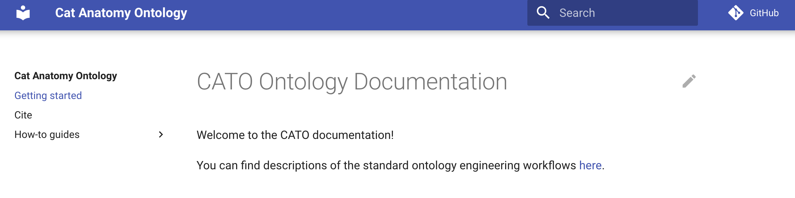

# ODK in 20 minutes: a complete walk through the core workflows

The goal of this tutorial is to **quickly showcase key ODK workflows**.
It is not geared at explaining individual steps in detail. For a much more detailed tutorial for creating a fresh ODK repo, see [here for a tutorial for setting up your first workflow](setting-up-project-odk.md). We recommend to complete this tutorial before attempting this one.

## Tutorial

1. [Seeding a new ontology repo](#seeding)
1. [Import workflow](#import)
1. [Integration Testing](#testing)
1. [Release workflow](#release)
1. [Customisable documentation](#documentation)

<a id="seeding"></a>

### Seeding

1. Create a new folder.
1. Download an [example ODK config](https://raw.githubusercontent.com/OBOAcademy/obook/master/docs/tutorial/odk_tutorial_2/cato-odk.yaml) or create one yourself. Save it in the directory created above.
1. **Important**: in the `cato-odk.yaml` change `github_org` to your GitHub username. If you dont do this, some ODK features wont work perfectly, like documentation.
    ```
    github_org: matentzn
    repo: cat-ontology
    ```
1. Run the ODK seeding script.
    ```
    curl https://raw.githubusercontent.com/INCATools/ontology-development-kit/v1.3.1/seed-via-docker.sh | bash -s --  --clean -C cato-odk.yaml
    ```
1. Push the newly created repo to GitHub (for example with GitHub Desktop).

<a id="import"></a>

### The import workflow


Let us now import planned process:

1. Open the term file `src/ontology/imports/cob_terms.txt` in your favourite text editor
2. Add `COB:0000082` to the term file (this is the `planned process` class in COB).
3. From within the `src/ontology` directory, run `sh run.sh make refresh-cob`.
4. Inspect the diff. Rather than importing just one term, it seems that we have important a whole bunch. This is because by default, ODK is using the SLME module extraction technique, which ensures that not only the terms we explicitly request are imported - [but all the logically dependent ones as well](project-ontology-development.md#extracting-modules).
5. In `src/ontology/cato-odk.yaml`, locate the entry for importing `cob` and switch it to a different module type: `filter`.
    ```
    import_group:
      products: 
        - id: ro
        - id: cob
          module_type: filter
    ```
6. Run `sh run.sh make update_repo` to apply the changes. Check out the git diff to the `Makefile` to convince yourself that the new extraction method has been applied.
7. Let us refresh the COB import again: From within the `src/ontology` directory, run `sh run.sh make refresh-cob`. Convince yourself that now only the `planned process` term is imported.

<a id="testing"></a>

### Integration Testing


1. Switch to a new git branch and commit your changes to `Makefile`, `cato-odk.yaml`, `imports/cob_terms.txt` and `imports/cob_import.owl`.
2. Push the branch and create a Pull Request.
3. After a few seconds, the automated testing should start:
   
   Feel free to click on details to see what is happening!
4. Once the test passes (turns green) the PR is ready to be reviewed. 
    Since this tutorial is for illustration purposes only, we just merge.

<a id="release"></a>

### The release workflow


Great, we have done our change, now we are ready to make a release!

1. Switch to the `main` branch in `git`.
2. Make sure you you pull all changes (`git pull`).
3. In `src/ontology` execute the release workflow: `sh run.sh make prepare_release_fast` (we are using `fast` release here which skips refreshing imports again - we just did that).
4. Inspect the changes. You should see that the `planned process` class has been added to all ontology release artefacts.
5. Create a branch and commit the changes. Push. Create pull request. Request review (skipped in this tutorial). Wait for QC to pass. Merge.
6. On GitHub (repository front page), click on "Create a new release".
7. In the next Window in the "Choose a tag" field select `v2022-09-01`. Note the leading `v`. Select the correct date (the date you made the release, `YYYY-MM-dd`). Fill in all the other form elements as you see fit. Click `Publish release`.

<a id="documentation"></a>

### Customisable documentation

With our ODK setup, we also have a completely customisable documentation system installed. We just need to do a tiny change to the GitHub pages settings:

1. On your GitHub repo page, click on "Settings".
2. In the menu on the left, click on "Pages".
3. On the right, under `Build and deployment` select `Deploy from branch`.
4. Underneath, select `gg-pages` as the branch (this is where ODK deploys to), and `/(root)` as the directory.
    
5. Hit `Save`.
6. Wait for about 4 minutes for the site to be deployed (you can click on `Actions` in the main menu to follow the build process).
7. Go back to the `Pages` section in `Settings`. You should see a button `Visit site`. Click on it. If everything went correctly, you should see your new page:
    
8. Let's make a quick change: On the main page, click on the pen in the top right corner (this only works if you have correctly configured your `github_org`, see [seeding](#Seeding)). If you have not configured your repo, go to the GitHub front page of your repo, go into the `docs` directory, click on 
`index.md` and edit it from here. Make a small random edit.
9. Commit the change straight to `main` or do it properly, create a branch, PR, ask for reviews, merge.
10. After the ODK updates your site, you should be able to see your changes reflected on the life site!

### Summary

That's it! In about 20 minutes, we

1. [Seeded a new ontology repo.](#seeding)
1. [Imported a term.](#import)
1. [Made a pull request and watched the ODK Testing framework at work.](#testing)
1. [Ran a release.](#release)
1. [Deployed customisable documentation pages to help our users and curators documenting processes and use instructions.](#documentation)

