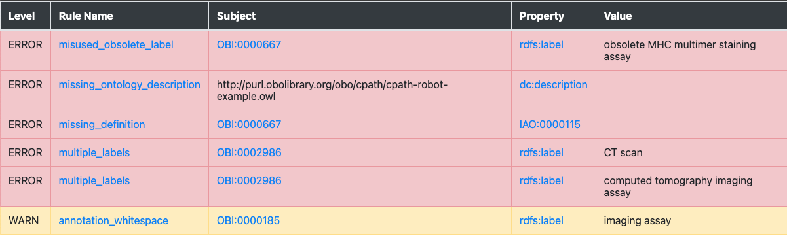

# ROBOT Tutorial: Quality Control with ROBOT

In this tutorial you will learn how to set up your QC pipeline with ROBOT `report`, `verify`, `validate-profile` and `reason`.

## Preparation

- You should know how to run ROBOT commands on your machine
- You should have a basic understanding of OWL and reasoning

## Overview

Quality control is a very large concern in ontologies. For example, we want to make sure that our editors use the right annotation properties to attach metadata to terms (such as a date, or a label), or to make sure that our last edit did not accidentally introduce a logical error. In ROBOT, we have four commands that help us in particular to ensure the quality of our ontologies:

- [ROBOT validate-profile](http://robot.obolibrary.org/validate-profile): Ensures that your ontology is a _syntactically valid_ OWL ontology.
- [ROBOT verify](http://robot.obolibrary.org/verify): Define "bad examples", i.e. situations you want to avoid as SPARQL queries and use `verify` to ensure they do not appear in your ontology.
- [ROBOT report](http://robot.obolibrary.org/report): Use [dozens of time tested best practice checks](http://robot.obolibrary.org/report_queries/) curated by the OBO Technical Working Group to check your ontology for typical errors, like missing labels or wrong license declarations.
- [ROBOT reason](http://robot.obolibrary.org/reason): Use `reason` to ensure that your ontology is consistent and coherent and test the "[unique name assumption](https://en.wikipedia.org/wiki/Unique_name_assumption)".

In the following, we will learn about all of these and how they fit in the wider concerns of ontology quality control.

## Download test ontology

Download [`example.owl`](robot_tutorial_qc/example.owl), or get it via the command line:

```
curl https://raw.githubusercontent.com/OBOAcademy/obook/master/docs/tutorial/robot_tutorial_qc/example.owl > example.owl
```

Let us ensure we are using the same ROBOT version:

```
robot --version
```

We see:

```
ROBOT version 1.8.3
```

## ROBOT validate-profile

[ROBOT validate-profile](http://robot.obolibrary.org/validate-profile): Ensures that your ontology is a _syntactically valid_ OWL ontology. This is the absolute minimum check - some "violations" to OWL 2 DL validity cause the reasoner to behave in unexpected and wrong ways!

```
robot validate-profile --profile DL -i example.owl
```

Thankfully, our test ontology is in valid OWL DL:

```
OWL 2 DL Profile Report: [Ontology and imports closure in profile]
```

This check is overlooked by a lot of OWL Ontology developers despite its importance to ensure both a predictable behaviour of the reasoner and of parsing tools. See here for an example where an ontology was _not_ in OWL DL profile, causing various problems for parsing and computation: https://github.com/Orphanet/ORDO/issues/32.

## ROBOT report

Let us generate a simple report:

```
robot report -i example.owl -o report.html
```

ROBOT report will do two things:

- It will print out the number of errors (violations) and an indication that the report _failed_:

```
Violations: 11
-----------------
ERROR:      5
WARN:       4
INFO:       2
ERROR Report failed!
```

- And it will provide you with a report file, report.html

Let us look at the file in a browser (simply double-click on the html file the way you would open a PDF). Your report should look similar to this:


While there are [other formats you can export your report to](http://robot.obolibrary.org/report), HTML is a great format which not only offers useful colour coding, but also allows us to click on the related classes and properties and, more importantly, the checks to find our what they mean (for an overview of all ROBOT report checks see [here](http://robot.obolibrary.org/report_queries/)).

### Exercise

We will leave it to the reader as an exercise to try and fix all the errors indicated by the report!

### Advanced usage of ROBOT report

#### Customisation

While by far the most widely spread usage of ROBOT report is to check for OBO best practices, it is possible to [customise the report](http://robot.obolibrary.org/report#profiles) by removing certain OBO ontology checks and adding custom ones.

Lets first create a simple `profile.txt` in our directory and add the following lines:

```
WARN	annotation_whitespace
ERROR	missing_ontology_description
ERROR	missing_definition
ERROR	missing_ontology_license
ERROR	missing_ontology_title
ERROR	misused_obsolete_label
ERROR	multiple_labels
```

Now we tell ROBOT to run the command using our custom profile rather than the default ROBOT profile:

```
robot report -i example.owl --profile profile.txt -o report.html
```

The resulting report looks different:



In particular, some checks like `missing_superclass` which we did not care about for our use case are not shown at all anymore, and others, such as `missing_definition` are now considered `ERROR` (red) rather than `WARN` (warning, yellow) because for our use case, we have decided that definitions on terms are mandatory.

## ROBOT verify

ROBOT verify allows us to define QC checks for undesirable situation (we sometimes call this "anti-pattern") using the SPARQL query language. The idea is simple: we write a SPARQL query for the thing we _do not want_. For example, we can use SPARQL to look for classes with more than one label. Then, we feed this query to ROBOT verify. ROBOT verify than ensures that the query _has no answers_, i.e the thing we do not want actually does not happen:

```
PREFIX owl: <http://www.w3.org/2002/07/owl#>
PREFIX rdfs: <http://www.w3.org/2000/01/rdf-schema#>

SELECT DISTINCT ?entity ?property ?value WHERE {
  VALUES ?property { rdfs:label }
  ?entity ?property ?value .
  ?entity ?property ?value2 .
  FILTER (?value != ?value2) .
  FILTER NOT EXISTS { ?entity owl:deprecated true }
  FILTER (!isBlank(?entity))
}
ORDER BY ?entity
```

Let us safe this query now in our working directory as `bad_labels.sparql` and run the following:

```
robot verify -i example.owl --queries bad_labels.sparql
```

ROBOT will output this to tell us which terms have violations:

```
FAIL Rule bad_labels.sparql: 2 violation(s)
entity,property,value
http://purl.obolibrary.org/obo/OBI_0002986,http://www.w3.org/2000/01/rdf-schema#label,CT scan
http://purl.obolibrary.org/obo/OBI_0002986,http://www.w3.org/2000/01/rdf-schema#label,computed tomography imaging assay
```

Now the cool thing with `verify` is that we can basically feed SPARQL SELECT queries in whatever shape or form we want. To make error messages more readable for curators, you can even encode a proper error message:

```
PREFIX owl: <http://www.w3.org/2002/07/owl#>
PREFIX rdfs: <http://www.w3.org/2000/01/rdf-schema#>

SELECT DISTINCT ?error WHERE {
  VALUES ?property { rdfs:label }
  ?entity ?property ?value .
  ?entity ?property ?value2 .
  FILTER (?value != ?value2) .
  FILTER NOT EXISTS { ?entity owl:deprecated true }
  FILTER (!isBlank(?entity))
  BIND(CONCAT("Entity ",STR(?entity)," uses two different labels: (1) ",STR(?value)," and (2) ",STR(?value2)) as ?error)
}
ORDER BY ?entity
```

This time, when running the query, we get:

```
FAIL Rule bad_labels.sparql: 2 violation(s)
error
Entity http://purl.obolibrary.org/obo/OBI_0002986 uses two different labels: (1) CT scan and (2) computed tomography imaging assay
Entity http://purl.obolibrary.org/obo/OBI_0002986 uses two different labels: (1) computed tomography imaging assay and (2) CT scan
```

Which appears much more readable! You can tweak the output in whatever way you think is best. Two things about this:

- You cannot do this very well with `ROBOT report`: despite the ability to include custom queries, all queries _must_ start with:

```
SELECT DISTINCT ?entity ?property ?value WHERE
```

This is one of the reasons we still like using ROBOT verify, despite the fact that ROBOT report can also be extended with custom checks.
- Another cool thing about `verify` is that you can add the `--output-dir results/` parameter to your query to get ROBOT to export the query results as TSV files. This can be useful if you have many QC queries and need to work with them independently of the checks.
- Note that ROBOT notices two errors despite there being only 1, technically speaking. This is because the WHERE clause in SPARQL which twice (one where label 1 is first, one where label 2 is first). You can be smart about it and get around it by sorting your results before binding them, but for most use cases this hack is hardly worth the effort.

## ROBOT reason

This is not an exhaustive tutorial for ROBOT reason (for more, see [here](robot-tutorial-2.md)). We only want to get across two checks that we feel absolutely every ontology developer should know about.

### The "distinct scope" assumption

In most cases, we do not want to define the exact same concept twice. There are some exceptions, for example when we align ontologies such as CHEBI and GO which may have overlapping scope, but in 99.9% of the cases, having the reasoner infer that two classes are the same points to a mistake in the axiomatisation. Let us check that we do not have any such unintended equivalencies in our ontology:

```
robot reason -i example.owl --equivalent-classes-allowed none
```

ROBOT will note that:

```
ERROR No equivalent class axioms are allowed
ERROR Equivalence: <http://purl.obolibrary.org/obo/TEST_0600047> == <http://purl.obolibrary.org/obo/OBI_0600047>
```

Further investigation in Protege will reveal that TEST_0600047 and OBI_0600047 are subclasses of each other, which causes the reasoner to infer that they are equivalent.