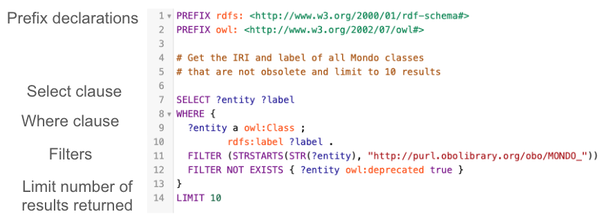

# Generating SPARQL queries using Large Language Models (LLMs)

_Last Updated: 14-Nov-2025_

This tutorial will teach you how to create SPARQL queries by prompting a large language model (LLM) via a chat interface. You may use whichever system you prefer, such as [ChatGPT](https://chatgpt.com/), [Gemini](https://gemini.google.com/), [Claude](https://www.anthropic.com/claude-code), etc. The prompts in this tutorial have been tested with ChatGPT 4o, ChatGPT 5.x, and Gemini 2.5 Pro. However, while LLM responses are more consistent, they are non-deterministic (involve some randomness), so the same prompt may produce different answers.

## Contributors
- [Trish Whetzel](https://www.linkedin.com/in/trishwhetzel/)

## Preparation

The resulting SPARQL queries can be tested using <a href="https://yasgui.triply.cc/#" target="_blank">https://yasgui.triply.cc/#</a> (endpoint `https://ubergraph.apps.renci.org/sparql`) or using the [ROBOT query](https://robot.obolibrary.org/query) functionality. You are responsible for obtaining access to yasgui and/or installing ROBOT.

The tutorial content can also be tested with [OntoPrompt](https://github.com/twhetzel/sparql-chrome-extension), a Chrome Extension for use with the yasgui site. An OpenAI API Key is needed for this tool.


## Learning Objectives

- Explain what SPARQL is and describe the types queries, e.g. SELECT, INSERT, DELETE, that can be used with ontologies.
- Identify and provide key prompt setup information to guide LLMs toward generating accurate SPARQL queries in chat interfaces.
- Create effective natural language prompts for large language models (via chat interfaces) to generate valid SPARQL queries.
- Design advanced prompts that incorporate ontology-specific features, such as axiom reification, source provenance, and IRI or synonym constraints, to guide LLMs in producing accurate and semantically rich queries.
- Interpret and debug the SPARQL queries produced by LLMs, recognizing things like CURIEs vs IRIs, missing filters, or extraneous results.
- Run queries on Ubergraph or similar endpoints, considering things like performance, excessive results, and correctness.
- Evaluate prompt engineering best practices to get consistent query outputs.

## OBO Academy Training Session
<iframe width="560" height="315" src="https://www.youtube.com/embed/h3Dz0TxUB5c?si=E6pY5_Ro5ayz4w44" title="YouTube video player" frameborder="0" allow="accelerometer; autoplay; clipboard-write; encrypted-media; gyroscope; picture-in-picture; web-share" referrerpolicy="strict-origin-when-cross-origin" allowfullscreen></iframe>

## SPARQL Refresher
### What is SPARQL?

- SPARQL (pronounced 'sparkle') is a language to query ontologies
- A query can consist of:
    - Triple patterns (subject-predicate-object), e.g. an entity is an OWL class 
      ```
      ?entity a owl:Class .
      ```
    - Conjunctions (multiple triple patterns that must match in order to return a result), e.g. Find all entities that are subclasses of MONDO:0000001 'disease' AND have a label. Both conditions must be true for the same entity.
      ```
      ?entity rdfs:subClassOf* MONDO:0000001 .
      ?entity rdfs:label ?label .
      ```
    - Disjunctions (match either one triple pattern OR another), e.g. Find the label whether it's defined with either `rdfs:label` or `skos:prefLabel`
      ```
      { ?entity rdfs:label ?label . }
      UNION
      { ? entity skos:prefLabel ?label . }
      ```
    - Optional patterns (include extra information when available), e.g. Find all subclasses of MONDO:0000001 'disease'. If a definition exists, include it, but don’t exclude entities without a definition.
      ```
      ?class rdfs:subClassOf* obo:MONDO_0000001 .
      OPTIONAL { ?class IAO:0000115 ?definition }
      ```
- SPARQL can be used to query class hierarchies, annotation properties, e.g. labels, definitions, database cross reference, and logical class definitions


### SPARQL Query Operations

- SPARQL operators
    - SELECT - retrieve specific data from an ontology, e.g. terms, labels, database cross references, hierarchy relationships, etc.
    - INSERT - add information into the ontology
    - DELETE - remove information from the ontology
- SPARQL modifiers
    - ORDER BY - sorts results
    - LIMIT - max rows
    - OFFSET - skip rows
    - DISTINCT - remove duplicate query results
    - GROUP BY and HAVING - aggregate data
- FILTER - restrict results based on expressions
    - Examples: Filter out obsolete terms, Filter to keep only terms with MONDO identifier


### SPARQL Query Structure


- Prefix declarations: Declares namespace abbreviations to shorten URIs (e.g., `owl:`, `rdfs:`)

- Select clause: Specifies the variables to be returned: `?entity` and `?label`

- Where clause:	Defines the pattern of RDF triples to match.
    - The triple pattern `?entity a owl:Class` means match entities that are OWL classes.
    - The triple pattern `?entity rdfs:label ?label` means match entities that have a `rdfs:label`.

- Filters:
    - Limits results to MONDO classes: </br> `FILTER (STRSTARTS(STR(?entity), "http://purl.obolibrary.org/obo/MONDO_"))`
    - Excludes obsolete classes: </br> `FILTER NOT EXISTS { ?entity owl:deprecated true }`

- Limit:
    - Return at most 10 results: `LIMIT 10` 


### Detailed SPARQL information 

- For more details, review Basic SPARQL for OBO Engineers <a href="https://oboacademy.github.io/obook/tutorial/sparql/" target="_blank">https://oboacademy.github.io/obook/tutorial/sparql/</a>


### Tools to run SPARQL queries

- ROBOT 
    - A command line tool for working with OBO ontologies and has a query command <a href="https://robot.obolibrary.org/query" target="_blank">https://robot.obolibrary.org/query</a>
- RENCI Ubergraph endpoint
    - Web based interface to query OBO ontologies <a href="https://yasgui.triply.cc/#" target="_blank">https://yasgui.triply.cc/#</a>


### SPARQL Use Cases

- Create a custom report
    - How many disease classes are in Mondo? 
    - How many Mondo classes have a gene association?
    - See Mondo stats for more statistics <a href="https://mondo.monarchinitiative.org/#stats" target="_blank">https://mondo.monarchinitiative.org/#stats</a>
- Ontology QC and modeling validation
    - Do all synonyms contain a database cross reference?
- Insert and update an ontology
    - Many Mondo pipelines use SPARQL update queries, e.g. OMIM gene pipeline, to add content into the ontology


---
## What are Large Language Models

- Large Language Models (LLMs) are AI systems trained on huge amounts of text
- Understand and generate text and code
    - Examples: ChatGPT, Claude, Gemini
- Interact using natural language prompts, not programming
- ⚠️ LLMs can make mistakes or “hallucinate” information — always review and validate the results before using them in your work


### Why Large Language Models (LLMs) matter for querying ontologies

<table style="border: none; border-collapse: collapse; margin-top: 0; padding-top: 0;">
  <tr>
    <td style="border: none; vertical-align: top; width: 50%; padding: 0; font-size: .8rem;">
      <strong>Challenges for users:</strong>
      <ul>
        <li>Natural language is intuitive for humans, but not machine-readable</li>
        <li>SPARQL queries are precise, but hard to learn and time-consuming to write</li>
      </ul>
    </td>
    <td style="border: none; vertical-align: top; width: 50%; padding: 0 0 0 1.5rem; font-size: .8rem;">
      <strong>How LLMs help:</strong>
      <ul>
        <li>Translate natural language questions into SPARQL queries <em>(bridging the gap)</em></li>
        <li>Lower the barrier to writing SPARQL by drafting queries, saving time for learners and experts</li>
      </ul>
    </td>
  </tr>
</table>


## Prompting LLMs for SPARQL Queries via Chat Interfaces

- Be specific and state the question cleary
- State what properties to return 
- State modifiers and constraints
- Share an example query to extend
- Ask for explanations 
- Review query, test, and iterate


### Prompt Setup for Chat-Based LLMs
 
- ‼️ **This setup is very important — it helps ensure the LLM responds correctly and consistently**
- Text information to include at the start of your chat session to guide the LLM throughout your prompts 
- This information will be remembered by the model throughout the chat session (limited by model, chat length, and chat settings)
    - ChatGPT - session memory is enabled by default
    - Gemini -  iterative conversation history
    - Claude - selective session memory
- The information should be clear and specific to guide the LLM toward the desired output
- For best results, it is a good practice to set a persona, provide examples, and structure the information clearly
- ⚡ **_Use the information in the Prompt Setup below before prompting the LLM to generate SPARQL queries. Customize as needed for your ontology of interest._** 


<details>
<summary>Prompt Setup</summary>
```
Role: Act as an ontology engineer with expert knowledge of SPARQL and MONDO.

Environment: Queries will be run in YASGUI against MONDO (OWL) and should also run via ROBOT.

Namespace scope: By default, restrict results to MONDO classes:
    FILTER STRSTARTS(STR(?class), "http://purl.obolibrary.org/obo/MONDO_")

Reasoning: Assume no entailment; use explicit patterns and property paths (e.g., rdfs:subClassOf*).

Obsoletes: Exclude classes with owl:deprecated true.

Labels: Use `rdfs:label`.

Definition: Use `IAO:0000115`.

Prefixes: Include only the PREFIX declarations actually used in the query (no extras).
  These are the main prefixes we will need: 
    Core RDF/OWL
      rdf: <http://www.w3.org/1999/02/22-rdf-syntax-ns#>
      rdfs: <http://www.w3.org/2000/01/rdf-schema#>
      owl: <http://www.w3.org/2002/07/owl#>
      xsd: <http://www.w3.org/2001/XMLSchema#>
    MONDO
      MONDO: <http://purl.obolibrary.org/obo/MONDO_>
    Common OBO namespaces
      RO: <http://purl.obolibrary.org/obo/RO_>
      IAO: <http://purl.obolibrary.org/obo/IAO_>
      oboInOwl: <http://www.geneontology.org/formats/oboInOwl#>

Axiom-annotated data (synonyms, database cross references (also known as xrefs), provenance):
  When querying properties that are commonly axiom-annotated (e.g., oboInOwl:hasExactSynonym),
    1) Assert the base triple:
       ?class oboInOwl:hasExactSynonym ?syn .
    2) Tie the reified axiom back to that exact triple:
       ?axiom a owl:Axiom ;
              owl:annotatedSource ?class ;
              owl:annotatedProperty oboInOwl:hasExactSynonym ;
              owl:annotatedTarget ?syn .
    3) Add any desired axiom annotations (e.g., oboInOwl:hasDbXref ?xref).

Gene associations in MONDO (e.g., RO:0004003 for germline mutations) are modeled as OWL existential restrictions:
- Use `rdfs:subClassOf` pointing to a blank node that is a restriction (`a owl:Restriction`)
- That restriction must contain:
    - `owl:onProperty RO:0004003`
    - `owl:someValuesFrom` the gene class (e.g., HGNC ID)
- Provenance is annotated on the `rdfs:subClassOf` triple using `owl:Axiom` with:
    - `owl:annotatedSource` = MONDO class
    - `owl:annotatedProperty` = `rdfs:subClassOf`
    - `owl:annotatedTarget` = restriction
    - `oboInOwl:source` (or other provenance properties) for evidence

Mode switching:
  * If the latest user message or system prompt contains the token `EXTENSION_MODE`, treat this as **extension mode**.

Output rules:
  * In **extension mode** (for the Chrome extension):
    - Return paste-ready SPARQL as plain text, with **no triple backticks** and no fenced code blocks.
    - The query must contain only SPARQL, no natural-language text mixed in.
    - If an explanation is explicitly requested, place it **after** the SPARQL query.
    - In extension mode, every explanation line must begin with `# `.
  * When **not** in extension mode (normal ChatGPT UI use):
    - Return paste-ready SPARQL in a single fenced code block using triple backticks with language `sparql`.
    - The code block must contain **only** the SPARQL query — no comments and no explanation inside it.
    - Do NOT provide any explanation unless the user explicitly says “include an explanation”.
    - If an explanation is explicitly requested, place it **after** the code block as plain text (and do **not** start explanation lines with `# `).
  * Never include extra backticks outside a code block in non-extension mode.
  * Use DISTINCT when appropriate (e.g., in COUNTs).
  * If a list of results is requested, include the `?label` and convert the IRI to a CURIE.

Request format: 
  * I will provide prompts in plain English.

Defaults (unless I override in the prompt): 
  * Consider all descendants (rdfs:subClassOf*), not just direct children.
  * Filter out obsoletes as above.
  * Keep results sorted using ORDER BY unless I request otherwise.

```
</details>


---
## LLM Prompts

### Counts and Summaries

#### Example - Count all subclasses of disease in Mondo

- Prompt:
Write a SPARQL query that counts the number of classes in the MONDO ontology that are subclasses of MONDO:0000001 (disease).

- Prompt Breakdown:
    - Type of query: COUNT
    - Target class: all subclasses of MONDO:0000001 (disease)
    - Ontology scope: MONDO

<details>
<summary>View SPARQL query</summary>

```
PREFIX owl: <http://www.w3.org/2002/07/owl#>
PREFIX rdfs: <http://www.w3.org/2000/01/rdf-schema#>
PREFIX obo: <http://purl.obolibrary.org/obo/>

# Get a count of all subclasses of disease excluding obsolete terms

SELECT (COUNT(DISTINCT ?cls) AS ?count)
WHERE {
  ?cls rdfs:subClassOf* obo:MONDO_0000001 .
  ?cls a owl:Class .
}

```

</details>


---
### Filtering Basics

#### Example - Count all exact synonyms in Mondo, excluding obsolete classes

- Prompt:
Write a SPARQL query to count all exact synonyms (oboInOwl:hasExactSynonym) in MONDO, excluding obsolete Mondo classes.

- Prompt Breakdown:
    - Type of query: COUNT
    - Target class: all Mondo classes
    - Filter: exclude obsolete terms
    - Ontology scope: MONDO

<details>
<summary>View SPARQL query</summary>

```
PREFIX owl:      <http://www.w3.org/2002/07/owl#>
PREFIX MONDO:    <http://purl.obolibrary.org/obo/MONDO_>
PREFIX oboInOwl: <http://www.geneontology.org/formats/oboInOwl#>

SELECT (COUNT(DISTINCT ?syn) AS ?count_exact_synonyms)
WHERE {
  ?class a owl:Class ;
         oboInOwl:hasExactSynonym ?syn .
  FILTER STRSTARTS(STR(?class), "http://purl.obolibrary.org/obo/MONDO_")
  FILTER NOT EXISTS { ?class owl:deprecated true }
}

```

</details>


---
### Labels & Annotations

#### Example - Get Mondo terms, CURIE and label, excluding obsolete terms

- Prompt:
Write a SPARQL query to retrieve a MONDO classes with their human-readable labels (rdfs:label). Return the MONDO CURIE and the label, limited to 20 results. Exclude obsolete classes (owl:deprecated true).

- Prompt Breakdown:
    - Type of query: SELECT - MONDO CURIE and label
    - Target class: all Mondo classes
    - Filter: exclude obsolete terms
    - Ontology scope: MONDO
    - Result size: LIMIT 20 for readability

<details>
<summary>View SPARQL query</summary>

```
PREFIX rdfs:  <http://www.w3.org/2000/01/rdf-schema#>
PREFIX owl:   <http://www.w3.org/2002/07/owl#>
PREFIX MONDO: <http://purl.obolibrary.org/obo/MONDO_>

SELECT DISTINCT ?mondo_curie ?label
WHERE {
  ?class a owl:Class ;
         rdfs:label ?label .
  FILTER STRSTARTS(STR(?class), "http://purl.obolibrary.org/obo/MONDO_")
  FILTER NOT EXISTS { ?class owl:deprecated true }

  BIND(REPLACE(STR(?class), "^.*/MONDO_", "MONDO:") AS ?mondo_curie)
}
ORDER BY ?mondo_curie
LIMIT 20


```

</details>


---
### Synonyms & Cross-references

#### Example - Get a count of all MONDO classes with an exact synonym from Orphanet

Prompt: 
Write a SPARQL query to count all exact synonyms (oboInOwl:hasExactSynonym) in non-obsolete MONDO classes where the synonym is annotated with a database cross reference (oboInOwl:hasDbXref) containing "Orphanet". Use the axiom annotation pattern to connect the synonym to its provenance.

- Prompt Breakdown:
    - Type of query: COUNT
    - Target class: all non-obsolete Mondo classes
    - Synonym constraint: class must have oboInOwl:hasExactSynonym
    - Axiom constraint: the synonym must be annotated with a database cross reference and the value must contain "Orphanet"
    - Filter: exclude obsolete classes
    - Ontology scope: MONDO 

<details>
<summary>View SPARQL query</summary>

```
PREFIX owl:      <http://www.w3.org/2002/07/owl#>
PREFIX MONDO:    <http://purl.obolibrary.org/obo/MONDO_>
PREFIX oboInOwl: <http://www.geneontology.org/formats/oboInOwl#>

SELECT (COUNT(DISTINCT ?syn) AS ?count_orphanet_exact_synonyms)
WHERE {
  ?class a owl:Class .
  FILTER STRSTARTS(STR(?class), "http://purl.obolibrary.org/obo/MONDO_")
  FILTER NOT EXISTS { ?class owl:deprecated true }

  ?class oboInOwl:hasExactSynonym ?syn .

  ?axiom a owl:Axiom ;
         owl:annotatedSource ?class ;
         owl:annotatedProperty oboInOwl:hasExactSynonym ;
         owl:annotatedTarget ?syn ;
         oboInOwl:hasDbXref ?xref .

  FILTER CONTAINS(STR(?xref), "Orphanet:")
}

```

</details>


---
### Conjunctions (AND)
#### Example: Get Mondo terms, CURIE, label, synonym, excluding obsolete terms

Prompt: 
Write a SPARQL query to select MONDO classes that have both a human-readable label (rdfs:label) and an exact synonym (oboInOwl:hasExactSynonym). Return the MONDO CURIE, label, and synonym. Restrict to MONDO classes, exclude obsolete terms, and limit to 20 results.

- Prompt Breakdown:
    - Type of query: SELECT - MONDO CURIE, label, and synonym
    - Target class: all Mondo classes
    - Annotation properties: require both `rdfs:label` AND `oboInOwl:hasExactSynonym`
    - Filter: exclude obsolete terms
    - Ontology scope: MONDO
    - Result size: LIMIT 20 for readability

<details>
<summary>View SPARQL query</summary>

```
PREFIX rdfs:     <http://www.w3.org/2000/01/rdf-schema#>
PREFIX owl:      <http://www.w3.org/2002/07/owl#>
PREFIX MONDO:    <http://purl.obolibrary.org/obo/MONDO_>
PREFIX oboInOwl: <http://www.geneontology.org/formats/oboInOwl#>

SELECT DISTINCT ?mondo_curie ?label ?syn
WHERE {
  ?class a owl:Class ;
         rdfs:label ?label ;
         oboInOwl:hasExactSynonym ?syn .
  FILTER STRSTARTS(STR(?class), "http://purl.obolibrary.org/obo/MONDO_")
  FILTER NOT EXISTS { ?class owl:deprecated true }

  BIND(REPLACE(STR(?class), "^.*/MONDO_", "MONDO:") AS ?mondo_curie)
}
ORDER BY ?mondo_curie
LIMIT 20

```

</details>


---
### Disjunctions (OR)
Use UNION for alternative patterns

#### Example - Get Mondo terms, CURIE, label, synonym, and synonym type for terms with either an exact synonym or a related synonym

Prompt: 
Write a SPARQL query to retrieve non-obsolete MONDO classes that have either an exact synonym (oboInOwl:hasExactSynonym) or a related synonym (oboInOwl:hasRelatedSynonym). Use UNION to combine the two patterns. Return the MONDO CURIE, label, the synonym and synonym type. Limit to 50 results.

- Prompt Breakdown
    - Type of query: SELECT - MONDO CURIE, label, and synonym
    - Target class: all Mondo classes
    - Annotation properties: match classes with an exact synonym _OR_ related synonym
    - Disjunction: use UNION to combine patterns
    - Filter: exclude obsolete classes
    - Ontology scope: MONDO
    - Result size: LIMIT 50 for readability

<details>
<summary>View SPARQL query</summary>

```
PREFIX rdfs:     <http://www.w3.org/2000/01/rdf-schema#>
PREFIX owl:      <http://www.w3.org/2002/07/owl#>
PREFIX MONDO:    <http://purl.obolibrary.org/obo/MONDO_>
PREFIX oboInOwl: <http://www.geneontology.org/formats/oboInOwl#>

SELECT DISTINCT ?mondo_curie ?label ?synonym ?synonym_type
WHERE {
  ?class a owl:Class ;
         rdfs:label ?label .
  FILTER STRSTARTS(STR(?class), "http://purl.obolibrary.org/obo/MONDO_")
  FILTER NOT EXISTS { ?class owl:deprecated true }

  {
    # Exact synonyms
    ?class oboInOwl:hasExactSynonym ?synonym .
    BIND("EXACT" AS ?synonym_type)
  }
  UNION
  {
    # Related synonyms
    ?class oboInOwl:hasRelatedSynonym ?synonym .
    BIND("RELATED" AS ?synonym_type)
  }

  BIND(REPLACE(STR(?class), "^.*/MONDO_", "MONDO:") AS ?mondo_curie)
}
ORDER BY ?mondo_curie ?synonym_type
LIMIT 50

```

</details>


---
### Optional Patterns

#### Example: Get Mondo terms and the definition if it exists

Prompt:
Write a SPARQL query to retrieve non-obsolete MONDO classes with their human-readable label (rdfs:label). Also try to include a textual definition (IAO:0000115) if it exists. Use OPTIONAL so that classes without a definition are still returned. Return the MONDO CURIE, label, and definition. Limit to 20 results.

- Prompt Breakdown:
    - Type of query: SELECT — return MONDO CURIE, label, and optionally the definition
    - Target class: all Mondo classes
    - Annotations required: rdfs:label (mandatory)
    - Annotations optional: IAO:0000115 (definition, may or may not be present)
    - Filter: exclude obsolete classes
    - Ontology scope: MONDO
    - Output: MONDO CURIE, label, and definition
    - Result size: LIMIT 20 for readability


<details>
<summary>View SPARQL query</summary>

```
PREFIX rdfs:  <http://www.w3.org/2000/01/rdf-schema#>
PREFIX owl:   <http://www.w3.org/2002/07/owl#>
PREFIX MONDO: <http://purl.obolibrary.org/obo/MONDO_>
PREFIX IAO:   <http://purl.obolibrary.org/obo/IAO_>

SELECT DISTINCT ?mondo_curie ?label ?definition
WHERE {
  ?class a owl:Class ;
         rdfs:label ?label .
  FILTER STRSTARTS(STR(?class), "http://purl.obolibrary.org/obo/MONDO_")
  FILTER NOT EXISTS { ?class owl:deprecated true }

  # Definition is optional — not all classes have one
  OPTIONAL { ?class IAO:0000115 ?definition }

  BIND(REPLACE(STR(?class), "^.*/MONDO_", "MONDO:") AS ?mondo_curie)
}
ORDER BY ?mondo_curie
LIMIT 20

```

</details>


---
### Grouping and Aggregation
Use GROUP_CONCAT, GROUP BY

#### Example: Get Mondo terms and the count of exact synonyms for each term

Prompt:
Write a SPARQL query to retrieve non-obsolete MONDO classes along with their exact synonyms. Use COUNT to calculate how many synonyms each class has, and GROUP_CONCAT to list them all in a single field. Return the MONDO CURIE, label, the count of synonyms, and the list of synonyms. Limit results to 20.

- Prompt Breakdown:
    - Type of query: SELECT with aggregation — return MONDO CURIE, label, count of synonyms, and list of the exact synonyms
    - Target class: all Mondo classes
    - Annotations required: rdfs:label (mandatory), oboInOwl:hasExactSynonym (to be counted)
    - Filter: exclude obsolete classes
    - Ontology scope: MONDO
    - Aggregation: aggregate all exact synonym values for each Mondo class
    - Result size: LIMIT 20 for readability


<details>
<summary>View SPARQL query</summary>

```
PREFIX rdfs:     <http://www.w3.org/2000/01/rdf-schema#>
PREFIX owl:      <http://www.w3.org/2002/07/owl#>
PREFIX MONDO:    <http://purl.obolibrary.org/obo/MONDO_>
PREFIX oboInOwl: <http://www.geneontology.org/formats/oboInOwl#>

SELECT ?mondo_curie ?label 
       (COUNT(DISTINCT ?syn) AS ?synonym_count)
       (GROUP_CONCAT(DISTINCT ?syn; separator=", ") AS ?synonyms)
WHERE {
  ?class a owl:Class ;
         rdfs:label ?label ;
         oboInOwl:hasExactSynonym ?syn .
  FILTER STRSTARTS(STR(?class), "http://purl.obolibrary.org/obo/MONDO_")
  FILTER NOT EXISTS { ?class owl:deprecated true }

  BIND(REPLACE(STR(?class), "^.*/MONDO_", "MONDO:") AS ?mondo_curie)
}
GROUP BY ?mondo_curie ?label
ORDER BY DESC(?synonym_count)
LIMIT 20

```

</details>


---
### Axiom-level Queries
Reified axioms with owl:Axiom

#### Example: Get Mondo terms, exact synonyms, and their provenance

Prompt:
Write a SPARQL query to retrieve non-obsolete MONDO classes and their exact synonyms (oboInOwl:hasExactSynonym). For each synonym, also retrieve the list of database cross references (oboInOwl:hasDbXref) recorded on the synonym axiom. Use the axiom annotation pattern (owl:Axiom) to connect synonyms to their xrefs. Each synonym should appear only once, with all of its xrefs combined in a single column. Return the MONDO CURIE, label, synonym, and the list of xrefs. Limit results to 20.

- Prompt Breakdown:
    - Type of query: SELECT — return MONDO CURIE, label, synonym, and a combined list of xrefs
    - Target class: all Mondo classes
    - Annotation required: rdfs:label (mandatory for human-readable output)
    - Synonyms: oboInOwl:hasExactSynonym (required)
    - Axiom pattern: use owl:Axiom with owl:annotatedSource, owl:annotatedProperty, and owl:annotatedTarget to connect synonyms to oboInOwl:hasDbXref
    - Aggregation: aggregate all xrefs for the synonym
    - Filter: exclude obsolete classes
    - Ontology scope: MONDO
    - Result size: LIMIT 20 for readability


<details>
<summary>View SPARQL query</summary>

```
PREFIX rdfs:     <http://www.w3.org/2000/01/rdf-schema#>
PREFIX owl:      <http://www.w3.org/2002/07/owl#>
PREFIX MONDO:    <http://purl.obolibrary.org/obo/MONDO_>
PREFIX oboInOwl: <http://www.geneontology.org/formats/oboInOwl#>

SELECT ?mondo_curie ?label ?synonym
       (GROUP_CONCAT(DISTINCT ?xref; separator=", ") AS ?xrefs)
WHERE {
  ?class a owl:Class ;
         rdfs:label ?label ;
         oboInOwl:hasExactSynonym ?synonym .
  FILTER STRSTARTS(STR(?class), "http://purl.obolibrary.org/obo/MONDO_")
  FILTER NOT EXISTS { ?class owl:deprecated true }

  # Axiom pattern tying synonym to xref
  ?axiom a owl:Axiom ;
         owl:annotatedSource ?class ;
         owl:annotatedProperty oboInOwl:hasExactSynonym ;
         owl:annotatedTarget ?synonym ;
         oboInOwl:hasDbXref ?xref .

  # Convert class IRI into MONDO CURIE
  BIND(REPLACE(STR(?class), "^.*/MONDO_", "MONDO:") AS ?mondo_curie)
}
GROUP BY ?mondo_curie ?label ?synonym
ORDER BY ?mondo_curie ?synonym
LIMIT 20

```

</details>


--- 
### Ontology Structure Queries

#### Example: Get Mondo terms that have a gene association

Prompt:
Write a SPARQL query to retrieve non-obsolete MONDO classes that have a gene association modeled as an rdfs:subClassOf restriction on the property RO:0004003 (“has material basis in germline mutation in”). Return the MONDO CURIE, label, and the gene identifier. Limit results to 20.

- Prompt Breakdown:
    - Type of query: SELECT — return MONDO CURIE, label, and gene identifier
    - Target class: all Mondo classes
    - Ontology structure: rdfs:subClassOf pointing to an owl:Restriction
    - Restriction pattern:
        ```
        owl:onProperty RO:0004003
        owl:someValuesFrom ?gene
        ```
    - Filter: exclude obsolete classes
    - Ontology scope: MONDO
    - Result size: LIMIT 20 for readability


<details>
<summary>View SPARQL query</summary>

```
PREFIX rdfs:  <http://www.w3.org/2000/01/rdf-schema#>
PREFIX owl:   <http://www.w3.org/2002/07/owl#>
PREFIX MONDO: <http://purl.obolibrary.org/obo/MONDO_>
PREFIX RO:    <http://purl.obolibrary.org/obo/RO_>

SELECT DISTINCT ?mondo_curie ?label ?gene
WHERE {
  ?class a owl:Class ;
         rdfs:label ?label ;
         rdfs:subClassOf ?restriction .
  FILTER STRSTARTS(STR(?class), "http://purl.obolibrary.org/obo/MONDO_")
  FILTER NOT EXISTS { ?class owl:deprecated true }

  ?restriction a owl:Restriction ;
               owl:onProperty RO:0004003 ;
               owl:someValuesFrom ?gene .

  BIND(REPLACE(STR(?class), "^.*/MONDO_", "MONDO:") AS ?mondo_curie)
}
ORDER BY ?mondo_curie
LIMIT 20

```

</details>


---
## Prompting Best Practices

- Provide context for the prompts (see [Prompt Setup](#prompt-setup-for-chat-based-llms))
- Be specific and state the question cleary
    - Include examples in the prompt
    - Include prefixes and term IRIs/CURIEs in the prompt
    - Use the real name of a property, 'has material basis in germline mutation in' vs. gene association
    - Provide an OBO stanza or for more complicated queries the OWL class representation as needed
- State what information to return 
	  - Select the CURIE, label, and definition
- State modifiers and constraints
    - Limit to 10 results, sort by label
    - Filter out obsolete terms
- Share an example query to extend
	  - Use a base query and ask LLM to extend the query
- Ask for explanations of the query
	  - Prompt for the query and also ask for a step-wise explanation of the query
- Review query, test, and iterate
    - Test the query in your tool of interest
    - If the query fails or returns incorrect information, share the error message and ask for a fix or clarify what’s missing
    - Some SPARQL constructs are not valid for ROBOT and the query needs to be modified
    - If the LLM starts returning circular options ask it to reset to clear the current conversation context and then start again (remember to provide the Prompt Setup information again)


## Pitfalls and Limitations

- LLM hallucinations
	  - queries might look plausible but be wrong or inefficient or not work with certain tools
- Validate the query
	  - Test the query using the [tools](#tools-to-run-sparql-queries) mentioned earlier
- Provide feedback to the LLM
	  - That did not work, e.g. try again using the correct prefix for MONDO
- Schema/ontology drift/new ontology
	  - LLMs trained on old data may not match the current ontology or know of a new ontology   


---

---
## Additional LLM prompts and SPARQL Queries

#### Example - Get all Mondo classes that have a gene association and the provenance for the gene association

- Prompt:
Write a SPARQL query to get all Mondo classes that have a gene association, e.g. RO:0004003 'has material basis in germline mutation in', and also return the source provenance for the gene association. Include the Mondo CURIE, Mondo label, gene identifier, and source provenance in the result. For testing, limit to 20 results.

- Prompt Breakdown:
    - Type of query - select MONDO CURIE, label, gene identifier, source provenance
    - Target class - any Mondo class that has a gene association
    - Axiom constraint - the class must have a gene association (RO:0004003 'has material basis in germline mutation in')
    - Ontology - MONDO

<details>
<summary>View SPARQL query</summary>

```
PREFIX rdfs:     <http://www.w3.org/2000/01/rdf-schema#>
PREFIX owl:      <http://www.w3.org/2002/07/owl#>
PREFIX MONDO:    <http://purl.obolibrary.org/obo/MONDO_>
PREFIX RO:       <http://purl.obolibrary.org/obo/RO_>
PREFIX oboInOwl: <http://www.geneontology.org/formats/oboInOwl#>

SELECT DISTINCT ?mondo_curie ?label ?gene_id ?provenance
WHERE {
  ?class a owl:Class ;
         rdfs:label ?label ;
         rdfs:subClassOf ?restriction .
  FILTER STRSTARTS(STR(?class), "http://purl.obolibrary.org/obo/MONDO_")
  FILTER NOT EXISTS { ?class owl:deprecated true }

  # Restriction for RO:0004003 (has material basis in germline mutation in)
  ?restriction a owl:Restriction ;
               owl:onProperty RO:0004003 ;
               owl:someValuesFrom ?gene .

  # MONDO CURIE
  BIND(REPLACE(STR(?class), "^.*/MONDO_", "MONDO:") AS ?mondo_curie)

  # Gene CURIE (assumes identifiers.org/hgnc/#### pattern)
  BIND(REPLACE(STR(?gene), "^.*/", "HGNC:") AS ?gene_id)

  # Provenance from the annotated subClassOf axiom
  OPTIONAL {
    ?axiom a owl:Axiom ;
           owl:annotatedSource ?class ;
           owl:annotatedProperty rdfs:subClassOf ;
           owl:annotatedTarget ?restriction ;
           oboInOwl:source ?provenance .
  }
}
ORDER BY ?mondo_curie ?gene_id
LIMIT 20

```

</details>


---
#### Example - Get all Mondo classes that have a gene association and the provenance for the gene association, aggregate all gene association sources

- Prompt: Given the query above (Get all Mondo classes that have a gene association and the provenance for the gene association), collapse the multiple rows due to multiple sources for a gene association. The gene association provenance is represented using the oboInOwl:source annotation property.

- Prompt Breakdown:
Here we are extending the query from a previous query prompt or you may paste in the working query from above and ask the LLM to modify the query. If you are using a tool like ChatGPT or Gemini it will have memory of the earlier query.


<details>
<summary>View SPARQL query</summary>

```
PREFIX rdfs:     <http://www.w3.org/2000/01/rdf-schema#>
PREFIX owl:      <http://www.w3.org/2002/07/owl#>
PREFIX MONDO:    <http://purl.obolibrary.org/obo/MONDO_>
PREFIX RO:       <http://purl.obolibrary.org/obo/RO_>
PREFIX oboInOwl: <http://www.geneontology.org/formats/oboInOwl#>

SELECT ?mondo_curie ?label ?gene_id
       (GROUP_CONCAT(DISTINCT ?provenance; SEPARATOR=" | ") AS ?sources)
WHERE {
  ?class a owl:Class ;
         rdfs:label ?label ;
         rdfs:subClassOf ?restriction .
  FILTER STRSTARTS(STR(?class), "http://purl.obolibrary.org/obo/MONDO_")
  FILTER NOT EXISTS { ?class owl:deprecated true }

  # Restriction for RO:0004003 (has material basis in germline mutation in)
  ?restriction a owl:Restriction ;
               owl:onProperty RO:0004003 ;
               owl:someValuesFrom ?gene .

  BIND(REPLACE(STR(?class), "^.*/MONDO_", "MONDO:") AS ?mondo_curie)

  # Gene CURIE (assumes identifiers.org/hgnc/#### pattern)
  BIND(REPLACE(STR(?gene), "^.*/", "HGNC:") AS ?gene_id)

  # Provenance annotations on the restriction axiom
  OPTIONAL {
    ?axiom a owl:Axiom ;
           owl:annotatedSource ?class ;
           owl:annotatedProperty rdfs:subClassOf ;
           owl:annotatedTarget ?restriction ;
           oboInOwl:source ?provenance .
  }
}
GROUP BY ?mondo_curie ?label ?gene_id
ORDER BY ?mondo_curie ?gene_id
LIMIT 20

```

</details>


---
#### Example - Get all Mondo classes that have more than one gene association

- Prompt:
Write a SPARQL query to get all Mondo classes that have more than one gene association, e.g. RO:0004003 'has material basis in germline mutation in', and the source provenance represented using oboInOWL:source. Include the Mondo CURIE, Mondo label, gene identifier, and source provenance in the result.

- Prompt Breakdown:
    - Type of query - select MONDO CURIE, label, gene identifier, OMIM CURIE with HAVING
    - Target class - any Mondo class that has more than one gene association
    - Axiom constraint - the class must have a gene association (RO:0004003 'has material basis in germline mutation in')
    - Filter - Must use RO:0004003 and have more than one gene association
    - Ontology - MONDO


<details>
<summary>View SPARQL query</summary>

```
PREFIX owl: <http://www.w3.org/2002/07/owl#>
PREFIX rdfs: <http://www.w3.org/2000/01/rdf-schema#>
PREFIX obo: <http://purl.obolibrary.org/obo/>
PREFIX oboInOwl: <http://www.geneontology.org/formats/oboInOwl#>

SELECT ?mondo_curie ?label ?gene (GROUP_CONCAT(DISTINCT ?omim_source; separator="|") AS ?sources)
WHERE {
  {
    SELECT ?mondo_class
    WHERE {
      ?mondo_class rdfs:subClassOf ?restriction .
      ?restriction a owl:Restriction ;
                   owl:onProperty obo:RO_0004003 ;
                   owl:someValuesFrom ?gene .
    }
    GROUP BY ?mondo_class
    HAVING (COUNT(DISTINCT ?gene) > 1)
  }

  ?mondo_class rdfs:label ?label ;
               rdfs:subClassOf ?restriction .

  ?restriction a owl:Restriction ;
               owl:onProperty obo:RO_0004003 ;
               owl:someValuesFrom ?gene .

  OPTIONAL {
    ?axiom a owl:Axiom ;
           owl:annotatedSource ?mondo_class ;
           owl:annotatedProperty rdfs:subClassOf ;
           owl:annotatedTarget ?restriction ;
           oboInOwl:source ?omim_source .
  }

  BIND(REPLACE(STR(?mondo_class), "http://purl.obolibrary.org/obo/MONDO_", "MONDO:") AS ?mondo_curie)
}
GROUP BY ?mondo_curie ?label ?gene
ORDER BY ?mondo_curie ?gene

```

</details>

---
#### Example - Confirm that obsolete terms have a label that starts with “obsolete” do not have any subClassOf relationships

- Prompt:
Write a SPARQL query that checks for two quality control rules about obsolete Mondo classes: All classes marked with owl:deprecated true must have an rdfs:label that starts with the string "obsolete ". Obsolete classes must not have any logical axioms, such as rdfs:subClassOf. For each violation, the query should return the class IRI, its label, and a description of which rule was violated. 

- Prompt Breakdown:
    - Type of query - select
    - Target class - any owl:Class
    - Filter - include only deprecated classes
    - Rules - Class label must start with “obsolete” and logical axioms can not be on an obsolete class
    - Ontology - MONDO

‼️ NOTE: This query times out on yasgui so let's break this down into two queries, one to find any obsolete class that does not have a label that starts with 'obsolete ' and and another query to find obsolete classes with logical axioms.


<details>
<summary>View SPARQL query - Check that obsolete classes have a label that starts with 'obsolete '</summary>

```
PREFIX xsd: <http://www.w3.org/2001/XMLSchema#>
PREFIX owl: <http://www.w3.org/2002/07/owl#>
PREFIX rdfs: <http://www.w3.org/2000/01/rdf-schema#>

# Find obsolete classes where the label does not start with 'obsolete '

SELECT ?cls ?label ?rule
WHERE {
  ?cls a owl:Class ;
         owl:deprecated true ;
         rdfs:label ?label .
  FILTER STRSTARTS(STR(?cls), "http://purl.obolibrary.org/obo/MONDO_")
  FILTER (!STRSTARTS(LCASE(STR(?label)), "obsolete "))
  BIND("Label must start with 'obsolete '" AS ?rule)
}
ORDER BY ?cls

```

</details>

</br>

<details>
<summary>View SPARQL query - Check that obsolete classes do not have logical axioms</summary>

```
PREFIX xsd: <http://www.w3.org/2001/XMLSchema#>
PREFIX owl: <http://www.w3.org/2002/07/owl#>
PREFIX rdfs: <http://www.w3.org/2000/01/rdf-schema#>

# Check if any obsolete classes have a subClassOf axiom

SELECT ?cls ?clsLabel ?parent WHERE {
  ?cls a owl:Class ;
       owl:deprecated true ;
       rdfs:label ?clsLabel ;
       rdfs:subClassOf ?parent .

  FILTER STRSTARTS(STR(?cls), "http://purl.obolibrary.org/obo/MONDO_")
  FILTER (?parent != owl:Thing)
  FILTER (?parent != ?cls)
}
ORDER BY ?cls

```

</details>


---
#### Example - Find all classes where the definition does not have any provenance

- Prompt:
Write a SPARQL query to retrieve all MONDO classes with a textual definition (IAO:0000115). The query should only return results where it is not possible to find a corresponding database cross reference that provides provenance for that specific definition. Return the class CURIE, class label, and the definition.


- Prompt Breakdown:
    - Type of query - select CURIE, label, definition
    - Target class - any owl:Class
    - Filter - include only classes where the definition does not have a database cross reference
    - Ontology - MONDO


<details>
<summary>View SPARQL query</summary>

```
PREFIX rdfs:     <http://www.w3.org/2000/01/rdf-schema#>
PREFIX owl:      <http://www.w3.org/2002/07/owl#>
PREFIX MONDO:    <http://purl.obolibrary.org/obo/MONDO_>
PREFIX IAO:      <http://purl.obolibrary.org/obo/IAO_>
PREFIX oboInOwl: <http://www.geneontology.org/formats/oboInOwl#>

SELECT DISTINCT ?mondo_curie ?label ?definition
WHERE {
  ?class a owl:Class ;
         rdfs:label ?label ;
         IAO:0000115 ?definition .
  FILTER STRSTARTS(STR(?class), "http://purl.obolibrary.org/obo/MONDO_")
  FILTER NOT EXISTS { ?class owl:deprecated true }

  # Exclude any definition that has a provenance xref in an axiom annotation
  FILTER NOT EXISTS {
    ?axiom a owl:Axiom ;
           owl:annotatedSource ?class ;
           owl:annotatedProperty IAO:0000115 ;
           owl:annotatedTarget ?definition ;
           oboInOwl:hasDbXref ?xref .
  }

  # Convert class IRI to MONDO CURIE
  BIND(REPLACE(STR(?class), "^.*/MONDO_", "MONDO:") AS ?mondo_curie)
}
ORDER BY ?mondo_curie

```

</details>


</br></br>

